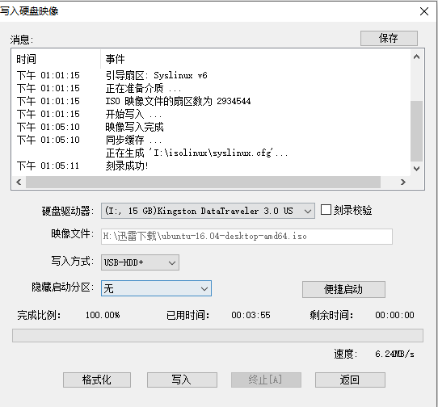

第一步下载Ubuntu Desktop 

http://mirrors.zju.edu.cn/ubuntu-releases/16.04/ubuntu-16.04-desktop-amd64.iso

第二步：

安装并且使用 UltraISO，制作U盘安装盘。（软件无限制，使用的）

1. 文件  ->  打开 ISO文件

2. 启动 ->写入硬盘映像

3. 选中U盘，然后写入

   

