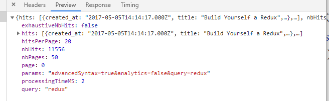

## ES6更加简洁的语法

## 定义常量

```js
const name = 'Robin';
const user = {
	name: name,
};
```

## ES6 =>箭头表达式

```js
// function expression
function () { ... }

// arrow function expression
() => { ... }
```

```javascript
// allowed
item => { ... }  //只有一个参数可以省略括号。
// allowed
(item) => { ... }
// not allowed
item, key => { ... }
// allowed
(item, key) => { ... }
```

```js
// es5
list.map(function(item){
   return (); 
});

//  es6 jsx 块状函数体
list.map((item)=>{
    return (<div></div>)
});

//函数声明表达式，块状函数体，返回声明全部被省略了。  特别简洁。
list.map((item)=>
   <div></div> 
);
```

## ES6 类的概念

```js
//创建类
class Developer {
    constructor(firstname, lastname) {
        this.firstname = firstname;
        this.lastname = lastname;
    }
    getName() {
    	return this.firstname + ' ' + this.lastname;
    }
}
//使用
const robin = new Developer('Robin', 'Wieruch');
console.log(robin.getName());
// output: Robin Wieruch
```

```js
import React, { Component } from 'react';
...
class App extends Component {
    render() {
   	 ...
    }
}
```

## ES6 对象初始化：

ES5以前：

```js
const name = 'Robin';
    const user = {
    name: name,
};
```

ES6中，当初始化对象中  属性 名称和 原变量名称相同时，可以这么运行。

```js
const name = 'Robin';
const user = {
name,
};
```

```js
// ES5
this.state = {
	list: list,
};
// ES6
this.state = {
	list,
};
```

## 更加简洁初始化对象内置函数

```js
// ES5
var userService = {
	getUserName: function (user) {
		return user.firstname + ' ' + user.lastname;
	},
};
// ES6
const userService = {
	getUserName(user) {
		return user.firstname + ' ' + user.lastname;
	},
};
```

## 计算属性名称

```js
// ES5
var user = {
	name: 'Robin',
};
// ES6
const key = 'name';
const user = {
	[key]: 'Robin',
};
```

## 解构

```js
const user = {
    firstname: 'Robin',
    lastname: 'Wieruch',
};

// ES5
var firstname = user.firstname;
var lastname = user.lastname;
console.log(firstname + ' ' + lastname);
// output: Robin Wieruch

// ES6
const { firstname, lastname } = user;
console.log(firstname + ' ' + lastname);
// output: Robin Wieruch
```

```js
const {
	firstname,
	lastname	
} = user;
```


```js
const users = ['Robin', 'Andrew', 'Dan'];
const [
	userOne,
	userTwo,
	userThree
] = users;
console.log(userOne, userTwo, userThree);
// output: Robin Andrew Dan
```

```js
// ES5
var searchTerm = this.state.searchTerm;
var list = this.state.list;
// ES6
const { searchTerm, list } = this.state;
```

也可以理解为抽取！

## 高阶函数

```js
// ES5
function isSearched(searchTerm) {
    return function(item) {
   	 	return item.title.toLowerCase().includes(searchTerm.toLowerCase());
    }
}
// ES6
const isSearched = searchTerm => item =>
item.title.toLowerCase().includes(searchTerm.toLowerCase());
```

## 是否包含indexOf& include

```js
// ES5
string.indexOf(pattern) !== -1
// ES6
string.includes(pattern)
```

## export & export default

```js
//api.js  导出
var age= 13
var name = '小红'
export {age,name}// 使用export导出
export default age// 使用export default导出
```

```js
import { add } from "/.api.js" //使用export
import  add from "/.api.js" // export default
```

```js
// b.js
本质上，a.js文件的export default输出一个叫做default的变量，然后系统允许你为它取任意名字。所以可以为import的模块起任何变量名，且不需要用大括号包含
import any from "./a.js"
import any12 from "./a.js" 
console.log(any,any12)   // boy,boy
```

1、export default 向外暴露的成员，可以使用任意变量来接收

2、在一个模块中，export default 只允许向外暴露一次

3、在一个模块中，可以同时使用export default 和export 向外暴露成员

4、使用export向外暴露的成员，只能使用{  }的形式来接收，这种形式，叫做【按需导出】

5、export可以向外暴露多个成员，同时，如果某些成员，在import导入时，不需要，可以不在{ }中定义

6、使用export导出的成员，必须严格按照导出时候的名称，来使用{ }按需接收

7、使用export导出的成员，如果想换个变量名称接收，可以使用as来起别名

## 字符串模板：连接字符串

```js
// ES6
const url = `${PATH_BASE}${PATH_SEARCH}?${PARAM_SEARCH}${DEFAULT_QUERY}`;
// ES5
var url = PATH_BASE + PATH_SEARCH + '?' + PARAM_SEARCH + DEFAULT_QUERY;
console.log(url);
// output: https://hn.algolia.com/api/v1/search?query=redux
```

## Fetch



## Promise

## Object.assign() 函数

​      它把接收的第一个参数作为目标对象，后面的所有参数作为源对象。然后把所有的源对象合并到目标对
象中。只要把目标对象设置成一个空对象，我们就得到了一个新的对象。

```js
       const updatedHits = { hits: updateHits };
       const updatedResult = Object.assign({}, this.state.result, updatedHits);
```

当遇到相同的属性时，排在后面的对象会覆写先前对象的该属性。

## 数组扩展操作符`...`

```js
const userList = ['Robin', 'Andrew', 'Dan'];
const additionalUser = 'Jordan';
const allUsers = [ ...userList, additionalUser ];
console.log(allUsers);
// output: ['Robin', 'Andrew', 'Dan', 'Jordan']
```

```js
const oldUsers = ['Robin', 'Andrew'];
const newUsers = ['Dan', 'Jordan'];
const allUsers = [ ...oldUsers, ...newUsers ];
console.log(allUsers);
// output: ['Robin', 'Andrew', 'Dan', 'Jordan']
```

## 对象的拓展操作符

是针对下一代JavaScript版本提出来的，但是在React中已经有很多开始使用了。

```js
const userNames = { firstname: 'Robin', lastname: 'Wieruch' };
const age = 28;
const user = { ...userNames, age };
console.log(user);
// output: { firstname: 'Robin', lastname: 'Wieruch', age: 28 }
```

```js
const userNames = { firstname: 'Robin', lastname: 'Wieruch' };
const userAge = { age: 28 };
const user = { ...userNames, ...userAge };
console.log(user);
// output: { firstname: 'Robin', lastname: 'Wieruch', age: 28 }
```

与前面Object.assign()函数实现的功能一样。

```js
this.setState({result:{...this.state.result,hits:updateHits}});
```

