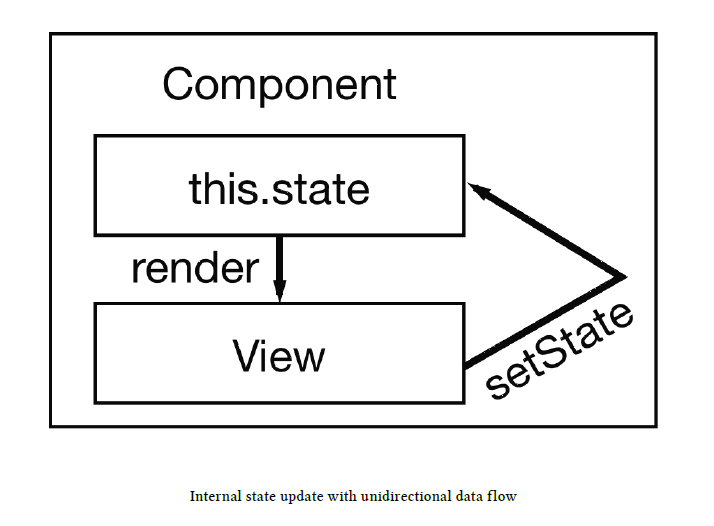
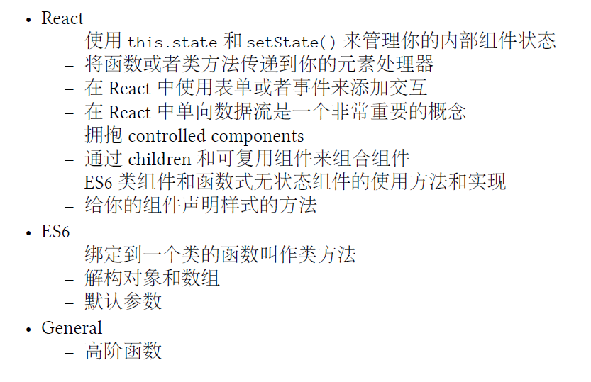

## 函数组件

```react
function App() {
  var helloword='Hello World!';
  var James={firstName:'LeBron',second:'James'};
  let Helloword1=122342431211;
  return (
    <div className="App">
      <header className="App-header">
        
        <p>
          Edit <code>src/App.js</code> and save to reload.
        </p>
        <a
          className="App-link"
          href="https://reactjs.org"
          target="_blank"
          rel="noopener noreferrer"
        >
          Learn React
        </a>
        {helloword}
        {formatUserName(James)}
        <br/>
        {Helloword1}
      </header>
      {list.map(function(item){
          return (
            <div>
              <span>
                <a href={item.url}>{item.title}</a>
              </span>
              <span>{item.author}</span>
              <span>{item.num_comments}</span>
              <span>{item.points}</span>
            </div>
          );
      })}
    </div>
     
  );
}
```


## 类组件


## 单向数据流 Unidirectional 单向的

在界面上触发一个动作，再通过函数或者类方法修改组件的state，最后组件的render（）方法再次运行并且更新界面。

```react
import React ,{Component} from 'react';
//import logo from './logo.svg';
import './App.css';
const list = [
  {
    title: 'React',
    url: 'https://facebook.github.io/react/',
    author: 'Jordan Walke',
    num_comments: 3,
    points: 4,
    objectID: 0,
  },
  {
    title: 'Redux',
    url: 'https://github.com/reactjs/redux',
    author: 'Dan Abramov, Andrew Clark',
    num_comments: 2,
    points: 5,
    objectID: 1,
  },
];

class App extends Component{
  constructor(props){
    super(props);
    this.state ={
      list:list,
    };
    this.onDismiss = this.onDismiss.bind(this);
  }
  render(){
    return (
      <div className="App">
        {this.state.list.map(item =>
           <div key={item.objectID}>
          <span>
            <a href={item.url}>{item.title}</a>
          </span>
          <span>{item.author}</span>
          <span>{item.num_comments}</span>
          <span>{item.points}</span>
          <span>
          <button 
            onClick={() => this.onDismiss(item.objectID)}
            type="button"
          >
           Dismiss
          </button>
          </span>
          </div>
        )}
      </div>
      );
  }
  onDismiss(id){
    console.log(id);
    //alert(id);
    const isNotId=(item) => item.objectID !== id;
    const updateState =  this.state.list.filter(isNotId);
    this.setState({list:updateState});
  }

}
```





## 绑定

JavaScript类的绑定会非常重要。前面在构造函数中绑定了onDissmiss()方法。

```js
class App extends Component {
	constructor(props) {
		super(props);
	this.state = {
		list,
	};
	this.onDismiss = this.onDismiss.bind(this);
	}
	...
}
```

> 为什么一开始就需要这么做呢？绑定的步骤是非常重要的，因为类方法不会自动绑定this
> 到实例上。

如果你现在类方法render中访问 this.state时，由于`this`是`undefinded`所以不能被检索到，为了确保`this`在类方法中可见，你需要将`this`绑定到类方法上。

```react
import React, {Component} from 'react'

class ExplainBindingsComponent extends Component {
    render() {
        return (
            <button
                onClick={this.onClickMe}
                type="button"
            >
                Click Me
    </button>
        );
    }

    onClickMe() {
        console.log(this);
    }
}

export default ExplainBindingsComponent;
```

onClick方法没有绑定 this，所以结果是能进入函数，但是无法函数中无法使用this关键字。:+1:

> 原因分析：可能js这个类是伪类的原因吧，具体原因问问大佬。

## this绑定到类方法的比较

this绑定到类方法上，一般不放在`render`函数中,避免在每次渲染的中都重复执行绑定操作。:-1:

还有人提议在构造函数中，使用业务逻辑类，也不是很好，使得构造函数变得复杂臃肿。业务逻辑，应该卸载构造函数之外。

构造函数执行绑定，每次组件实例化的时候绑定一次。这样最好。:+1:

```react
class ExplainBindingsComponent extends Component {
	constructor() {
		super();
		this.doSomething = this.doSomething.bind(this);
		this.doSomethingElse = this.doSomethingElse.bind(this);
	}
	doSomething() {
	// do something
	}
	doSomethingElse() {
	// do something else
	}
	...
}
```

使用箭头函数可以为类函数做到自动绑定this​ ​ :+1:   绑定了this之后，就可以访问`this.state & this.props`

## 事件处理

```react
<button 
    onClick={() => this.onDismiss(item.objectID)}
    type="button"
 >
 //需要传递参数
```

因为你必须传递一个参数到类的方法，因此你需要将它封装到另一个（箭头）函数中。
基本上，由于要传递给事件处理器使用，因此它必须是一个函数。

### 时间处理函数困惑

下面的代码不会工作，因为类方法会在浏览器中打开程序时立即执行。

```react
<button
onClick={console.log(item.objectID)}
type="button"
>
Dismiss
</button>
```

监听表达式是函数执行的返回值而不再是函数

使用onClick={this.onDismiss} 并不够，因为这个类方法需要接收item.objectID 属性来识别那个将要被忽略的项，这就是为什么它需要被封装到另一个函数中来传递这个属性。

这个概念在JavaScript 中被称为高阶函数。

使用箭头函数，这里可能存在性能优化的问题：每次render的时候，需要去实例化一个事件处理函数。

## setState函数

```js
onSearchChange(event){
    this.setState({searchTerm:event.target.value});  //
}
```

我们在想：在使用this.setState() 更新searchTerm时应该把这个列表也传递进去来保留它才是公平的，

 但事实并非如此，React 的this.setState() 是一个浅合并，在更新一个唯一的属性时，他会保留状态对象中的其
他属性，因此即使你已经在列表状态中排除了一个项，在更新searchTerm 属性时也会保持不变。

## 高阶函数

```js
//高阶函数
function isSearched(searchTerm){
    return function(item){
        return item.title.toLowerCase().includes(searchTerm.toLowerCase());
    } 
}
//ES 6箭头函数
// const isSearched = searchTerm => item=>item.title.toLowerCase().includes(searchTerm.toLowerCase());
```


## 文本输入框实现搜索功能

主要功能：

1. 文本输入框实现时间监听，将输入框的值改变，将改变state.searchTerm状态。

2. state状态改变之后，自动调用render函数。

   初始的时候为了显示全部，将searchTerm设置为空字符串。

```react
//高阶函数
function isSearched(searchTerm){
    return function(item){
        return item.title.toLowerCase().includes(searchTerm.toLowerCase());
    } 
}
//ES 6箭头函数
// const isSearched = searchTerm => item=>item.title.toLowerCase().includes(searchTerm.toLowerCase());
class FormApp extends Component{
    constructor(props){
        super(props);
        this.state={ 
            list,
            searchTerm:''  //定义初始状态
        }
        this.onSearchChange=this.onSearchChange.bind(this);
    }
    render(){
        return (
            <div>
                <form>
                    <input type='text'
                    onChange={this.onSearchChange}
                    />
                </form>
                {this.state.list.filter(
                    isSearched(this.state.searchTerm)
                ).map( item => 
                    <div key={item.objectID}>
                    <span>
                      <a href={item.url}>{item.title}</a>
                    </span>
                    <span>{item.author}</span>
                    <span>{item.num_comments}</span>
                    <span>{item.points}</span>
                    <span>
                    <button 
                      onClick={() =>{console.log(item.objectID)}}
                      type="button"
                    >
                     Dismiss
                    </button>
                    </span>
                    </div>
                )}
            </div>

        );
    }
    onSearchChange(event){
        this.setState({searchTerm:event.target.value});  //
    }
}
```

注意：`include`函数来自ES6,ES5需要使用`indexOf`函数

## 受控组件

在HTML中 `input & textarea &  select` 这种组件是不受控制组件， 

```js
class App extends Component {
    ...
    render() {
        const { searchTerm, list } = this.state;
        return (
            <div className="App">
                <form>
                    <input
                        type="text"
                        value={searchTerm}
                        onChange={this.onSearchChange}
                    />
                </form>
                ...
    </div>
        );
    }
}
```

## 拆分组件


## 函数式无状态组件 & ES6组件

**函数式无状态**：组件就是函数，它们接收一个输入并返回一个输出。输入是 props，输出就是一个普通的JSX 组件实例。

然而，函数式无状态组件是函数（函数式的），并且它们没有本地状态（无状态的）。

你不能通过this.state 或者this.setState() 来访问或者更新状态，因为这里没有this 对象。此外，它也没有生命周期方法。

虽然你还没有学过生命周期方法，但是你已经用到了其中两个：constructor() and render()。constructor 在一个组件的生命周期中只执行一次，而render() 方法会在最开始执行一次，并且每次组件更新时都会执 行。

**ES6 类组件**: 在你的四个组件中，你已经使用过这类组件了。在类的定义中，它们继
承自React 组件。extend 会注册所有的生命周期方法，只要在React component API 中，
都可以在你的组件中使用。通过这种方式你可以使用render() 类方法。此外，通过
使用this.state 和this.setState()，你可以在ES6 类组件中储存和操控state。

```react
function Search({ value, onChange, children }) {
	return (
		<form>
			{children} <input
						type="text"
						value={value}
						onChange={onChange}
					/>
		</form>
	);
}
```

使用箭头函数

```react
const Search = ({ value, onChange, children }) =>
	<form>
		{children} <input
		type="text"
		value={value}
		onChange={onChange}
	/>
</form>
const Search2= ()=>{
    // do something you like.
    return ();
}
```

## 组件样式：纯CSS&内联样式

但是如果你刚开始使用React，目前我会推荐你坚持纯CSS 和内联样式。

1.使用jsx的className属性  使用纯CSS方法。

2.JSX 混合了HTML 和JavaScript。现在有人呼吁将CSS 也加入进去，这就叫作内联样式
(inline style)。你可以定义JavaScript 对象，并传给一个元素的style 属性。

```react
class Table extends Component{
    constructor(props){
        super(props);
    }
    render(){
        const {list,pattern,onDissmiss}=this.props;
        return (
            <div className="table">{
                list.filter(isSearched(pattern)).map(item =>
                    <div 
                    key={item.objectID} 
                    className="table-row"
                    >
                        <span style={{ width: '40%' }}>
                            <a href={item.url}>{item.title}</a>
                        </span>
                        <span style={{ width: '30%' }}>
                            {item.author}
                        </span>
                        <span style={{ width: '10%' }}>
                            {item.num_comments}
                        </span >
                        <span style={{ width: '10%' }}>
                            {item.points}
                        </span>
                        <span style={{width:'10%'}}>
                            <button
                                onClick={() => { onDissmiss(item.objectID) }}
                                type="button"
                                className="button-inline"
                            >
                                Dismiss
                            </button>
                        </span>
                    </div>
            )}
            </div>
        );
    }
}
```

可以使用外置的对象，使其变得更加整洁。

```react
const largeColumn = {
	width: '40%',
};
const midColumn = {
	width: '30%',
};
const smallColumn = {
	width: '10%',
};
```

## 知识点Summary




## 条件渲染

### 方式1 三元组

```react
{ result
? <Table
	list={result.hits}
	pattern={searchTerm}
	onDismiss={this.onDismiss}
	/>
	: null
}
```

### 方式2 使用逻辑表达式 &&

```js
const result = true && 'Hello World';
console.log(result);
// output: Hello World
const result = false && 'Hello World';
console.log(result);
// output: false
```

```react
{ result &&
	<Table
	list={result.hits}
	pattern={searchTerm}
	onDismiss={this.onDismiss}
	/>
}
```

