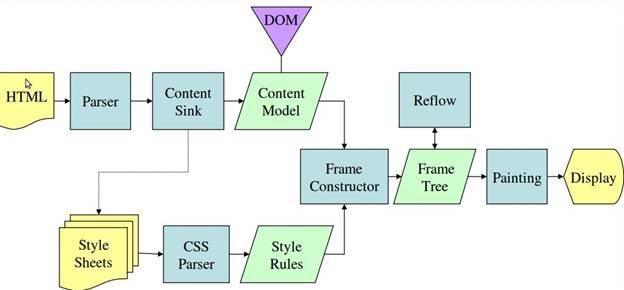

[TOC]


# 虚拟DOM

一直都听说DOM很慢，要尽量少的去操作DOM，于是就想进一步去探究下为什么大家都会这样说，在网上学习了一些资料，这边整理出来。

　　首先，DOM对象本身也是一个js对象，所以严格来说，并不是操作这个对象慢，而是说操作了这个对象后，会触发一些浏览器行为，比如布局（layout）和绘制（paint）。下面主要先介绍下这些浏览器行为，阐述一个页面是怎么最终被呈现出来的，另外还会从代码的角度，来说明一些不好的实践以及一些优化方案。

## 　　浏览器是如何呈现一张页面的

　　一个浏览器有许多模块，其中负责呈现页面的是渲染引擎模块，比较熟悉的有WebKit和Gecko等，这里也只会涉及这个模块的内容。

　　先用文字大致阐述下这个过程：

- 解析HTML，并生成一棵DOM tree
- 解析各种样式并结合DOM tree生成一棵Render tree
- 对Render tree的各个节点计算布局信息，比如box的位置与尺寸
- 根据Render tree并利用浏览器的UI层进行绘制

　　其中DOM tree和Render tree上的节点并非一一对应，比如一个"`display:none"`的节点就只会存在于DOM tree上，而不会出现在Render tree上，因为这个节点不需要被绘制。



------


　　上图是Webkit的基本流程，在术语上和Gecko可能会有不同，这里贴上Gecko的流程图，不过文章下面的内容都会统一使用Webkit的术语。


　　影响页面呈现的因素有许多，比如link的位置会影响首屏呈现等。但这里主要集中讨论与layout相关的内容。

　　paint是一个耗时的过程，然而layout是一个更耗时的过程，我们无法确定layout一定是自上而下或是自下而上进行的，甚至一次layout会牵涉到整个文档布局的重新计算。

　　但是layout是肯定无法避免的，所以我们主要是要最小化layout的次数。

## 　　什么情况下浏览器会进行layout

　　在考虑如何最小化layout次数之前，要先了解什么时候浏览器会进行layout。

　　layout（reflow）一般被称为布局，这个操作是用来计算文档中元素的位置和大小，是渲染前重要的一步。在HTML第一次被加载的时候，会有一次layout之外，js脚本的执行和样式的改变同样会导致浏览器执行layout，这也是本文的主要要讨论的内容。

　　一般情况下，浏览器的layout是lazy的，也就是说：在js脚本执行时，是不会去更新DOM的，任何对DOM的修改都会被暂存在一个队列中，在当前js的执行上下文完成执行后，会根据这个队列中的修改，进行一次layout。

　　然而有时希望在js代码中立刻获取最新的DOM节点信息，浏览器就不得不提前执行layout，这是导致DOM性能问题的主因。

　　如下的操作会打破常规，并触发浏览器执行layout：

- 通过js获取需要计算的DOM属性
- 添加或删除DOM元素
- resize浏览器窗口大小
- 改变字体
- css伪类的激活，比如:hover
- 通过js修改DOM元素样式且该样式涉及到尺寸的改变

　　我们来通过一个例子直观的感受下：

```
// Read
var h1 = element1.clientHeight;

// Write (invalidates layout)
element1.style.height = (h1 * 2) + 'px';

// Read (triggers layout)
var h2 = element2.clientHeight;

// Write (invalidates layout)
element2.style.height = (h2 * 2) + 'px';

// Read (triggers layout)
var h3 = element3.clientHeight;

// Write (invalidates layout)
element3.style.height = (h3 * 2) + 'px';  
```

　　clientHeight，这个属性是需要计算得到的，于是就会触发浏览器的一次layout。我们来利用chrome（v47.0）的开发者工具看下（截图中的timeline record已经经过筛选，仅显示layout）：


上面的例子中，代码首先修改了一个元素的样式，接下来读取另一个元素的`clientHeight`属性，由于之前的修改导致当前DOM被标记为脏，为了保证能准确的获取这个属性，浏览器会进行一次layout（我们发现chrome的开发者工具良心的提示了我们这个性能问题）。

　　优化这段代码很简单，预先读取所需要的属性，在一起修改即可。