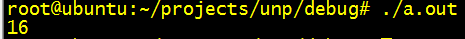
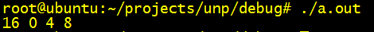
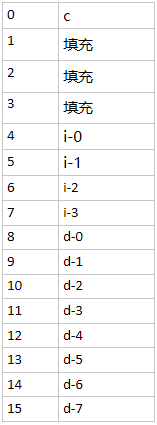
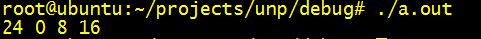
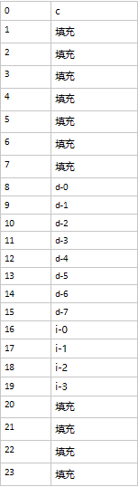

# C++&C结构体对齐的规则

## 1 C++&C结构体对齐的规则

主要规则如下：

规则一：结构体中元素按照定义顺序依次置于内存中，但并不是紧密排列。从结构体首地址开始依次将元素放入内存时，元素会被放置在其自身对齐大小的整数倍地址上。

规则二：如果结构体大小不是所有元素中最大对齐大小的整数倍，则结构体对齐到最大元素对齐大小的整数倍，填充空间放置到结构体末尾。

规则三：基本数据类型的对齐大小为其自身的大小，结构体数据类型的对齐大小为其元素中最大对齐大小元素的对齐大小。

注意数组的对齐大小，可以看成连续相同类型数据的对齐。

## 2 案例说明：

结构体的大小绝大部分情况下不会直接等于各个成员大小的总和，编译器为了优化对结构体成员的访问总会在结构体中插入一些空白字节，有如下结构体：

```C++
struct align_basic{
    char c;
    int i;
    double d;
};
```

那么此时sizeof(align_basic)的值会是sizeof(char)+sizeof(int)+sizeof(double)的值么？



如上图经过测试我们发现其大小为16个字节并不等于1+4+8=13个字节，可知编译器给align_basic结构体插入了另外3个字节，接下来我们将分析编译器对齐字节的规则以及结构体在内存中的结构，首先感谢[结构体在内存中的对齐规则 - 咕唧咕唧shubo.lk的专栏 - 博客频道 - CSDN.NET](https://link.zhihu.com/?target=http%3A//blog.csdn.net/liukun321/article/details/6974282)这篇文章的作者，在此之前我对内存对齐也是一知半解，很多时候也解释不明白。

***规则一：结构体中元素按照定义顺序依次置于内存中，但并不是紧密排列。从结构体首地址开始依次将元素放入内存时，元素会被放置在其自身对齐大小的整数倍地址上。\***这里说的地址是元素在结构体中的偏移量，结构体首地址偏移量为0。

在align_basic中元素c是第一个元素，那么它的地址为0，第二个元素i不会被放在地址1处，int的对齐大小为4个字节，此时虽然元素c只占据一个字节，但是由于i的地址必须在4字节的整数倍上，所以地址必须再向后在移动三个字节，故而需要放在地址4上，此时前两个元素已经占据了8个字节的空间，第三个元素d会被直接放在地址8上，因为double的对齐大小为8个字节，而前面两个元素已经占据了8个字节，正好是double对齐大小的整数倍，所以元素d不需要再往后移动。说了这么多也不如让机器给我们验证下有说服力：

printf("%d %d %d %d\n", sizeof(align_basic), &align_basic::c, &align_basic::i, &align_basic::d);





那么这样就够了吗，会不会太简单？我们把元素i和d的位置交换下，此时结构体的大小会是20吗，我们仍然先让机器说话，(⊙o⊙)…毕竟后面打脸有证据：

```C++
struct align_basic
{
	char c;
	double d;
	int i;
};
printf("%d\n", sizeof(align_basic));
```


我们发现此时结构体的大小并不是20而是24，那么多出来的这4个字节如何解释？我们引出第二条规则。

***规则二：如果结构体大小不是所有元素中最大对齐大小的整数倍，则结构体对齐到最大元素对齐大小的整数倍，填充空间放置到结构体末尾。\***

运用规则一，此时c仍然是第一个元素，其地址为0，第二个元素地址为8， 第三个元素地址为16，然后运用规则二，c，d，i中d的对齐大小为8最大所以整个结构必须对齐到8的整数倍，前面是三个元素已经占据了20个字节的空间，只需要在结构体的尾部填充4个字节的空间就是8的倍数了，所以此时整个结构体的大小为24个字节。

```c++
printf("%d %d %d %d\n", sizeof(align_basic), &align_basic::c, &align_basic::d, &align_basic::i);
```





**规则三：基本数据类型的对齐大小为其自身的大小，结构体数据类型的对齐大小为其元素中最大对齐大小元素的对齐大小。**

char类型的对齐大小为1字节，short类型的对齐大小为2字节，int类型的大小为4字节，double的对齐大小为8字节，align_basic结构体中最大对齐大小元素为d是double类型，所以align_basic的对齐大小是8。有人会问如果结构体中有数组呢？很简单将数组看做是连续数个相同类型的元素即可。


