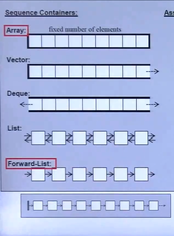
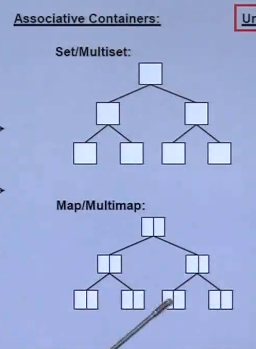
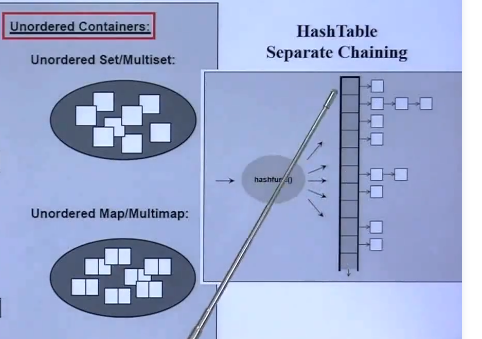
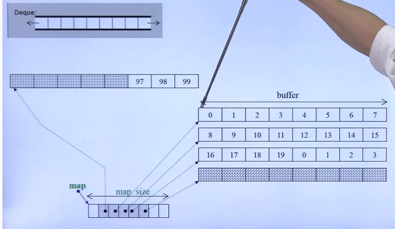
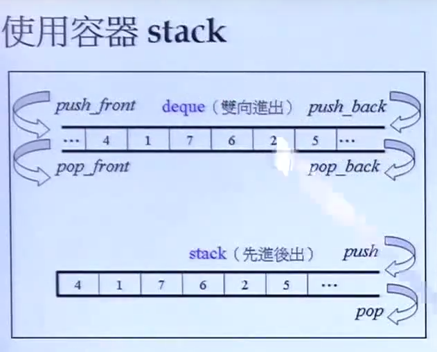
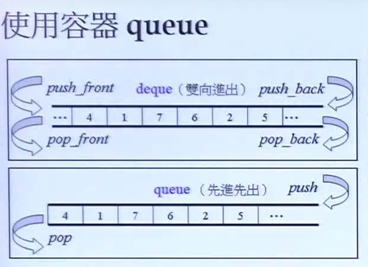

容器主要类别

## 序列容器：Sequence Container

- Array
- Vector
- Deque
- List



## Array特点：

数组本来是C++和C的一部分，现在将其C++11将其封装成一个Class

前后都是无法扩充的。

### vector 

向量

自动扩充，由分配器

### Deque

读：d-queue 双向队列  西方人念 [dek]

Problem: 实际上是怎么做的？为什么一个内容前后都可以扩充呢？

### List 链表

标准库是一个双向链表

实际实现是一个双向环状链表。

### Forward-List

单向链表

一个指针占用多少字节，

## 关联式容器：Associative Container

- Set / MultiSet
- Map/MultiMap
- 

### Set

### MultiSet

### Map

### MultiMap

## C++11新出现的容器

- Unordered Set / Unordered Map
- Unordered Map / Mutlimap
- 

hashtable有很多不同的做法。常见的做法是 *separate chaining*  或者叫open hsahing 开散列方法。

hash 冲突 / 碰撞 : 结局方法。

如果一个篮子中的元素太多。遍历链表会很慢，太长会将链表重新打散。

## 辅助程序说明

```
//C程序的快速排序函数
qsort()
```

### array 使用

```c++
array<long,ASIZE> c;
long a[ASIZE]; //必须要是一个定数，不能是变数。
//操作函数
c.size();
c.front();
c.back();
c.data();//返回内存中起始地址
qsort(c.data(),ASIZE,sizeof(long),compareLongs);
bsearch(&target,(c.data(),ASIZE,sizeof(long))
```

### vector使用

```C++
vec.push_back();
vec.cpacity();是容量
vec.size();元素个数。
vec.front();
vec.back();
auto pItem = find(c.begin(),c.end(),target); //模板函数::

```

不存在push_front();如果在前面放，需要将所有的元素元素后移。

```C++
try{
	vec.push_back(xxx);
}
catch (excption& p){
	//
	abort();
}
```

### list使用

```
l.push_back();
l.size();
l.front();
l.back();
auto it = find(l.begin(),l.end(),target);

```

### forward_list 使用

```C++
c.push_front();
c.max_size();
forward_list.front();
// 没有的函数
//forward_list.back();
//forward_list.size();
```

### dequeue 使用

分段连续。让使用者感觉是连续——连续的。



两端开头：扩充的容量是仔细曾琢考虑。

每次扩充是一个buffer。

```C++
dequeue<string> c;
c.size();
c.front();
c.back();
c.max_size();
```

### stack 堆 ( Container Adapter)

技术上称为： 容器适配器。 Container Adapter。



```
s.size()
s.top();
s.back();
c.pop();
```

### queue 栈    ( Container Adapter)

技术上称为： 容器适配器。 Container Adapter。




### queue和stack特点

queue 和stack没有去实现什么数据结构，它们只是使用了dequeue的部分结构。

没有迭代器Iterator

### multiset
内部实现是一个红黑树RB-tree

```c++
multiset<string> ms;
ms.insert("asa");
//标准库
auto item = find(ms.begin(),ms.end(),key);
//容器自带的
auto it = ms.find(key); 
```

### multimap

```c++
multimap<long,string> mm;
//multimap不能使用[]作为插入。
ms.insert(pair<long,string>(i,buf)); 
auto it  = c.find(key);
cout << it->first<<","<<it->second;
```

> 有严谨的数学结构在里面。

multimap multiset

### unordered_multiset]

底层数据结构：散列表 就是 链地址法

```C++
c.size();
c.max_size();
c.bucket_count(); //篮子个数
c.load_factor(); //负载因子
c.max_load_factor(); //最大负载因子
c.max_bucket_count();
//
auto it = find(c.begin(),c.end(),target);
//
auto it = c.find(key);
cout << it->first << it->second ;
```

### set

内部实现是一个红黑树RB-tree

key 就是value ,value就是key

```c++
set<string> s;
s.insert("asa");
s['asa'] = 
//标准库
auto item = find(s.begin(),s.end(),key);
//容器自带的
auto it = s.find(key); 
```

### multimap

类似。


### 老版本的无序容器

- hash_set
- hash_map
- hash_multiset
- hash_multimap

### priority_queue优先队列