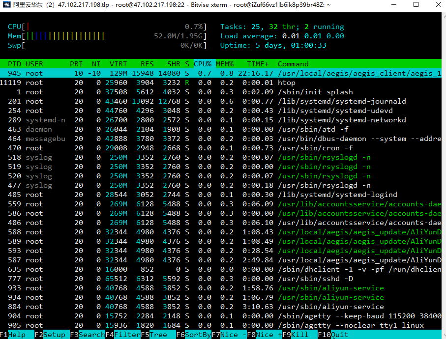

# htop 

> 说明 ：htop 是Linux系统中的一个互动的进程查看器它可让用户交互式操作，支持颜色主题，可横向或纵向滚动浏览进程列表，并支持鼠标操作。
>
> htop是一个开源代码：作者Hisham Muhammad在github上的项目：[htop GitHub地址](https://github.com/hishamhm/htop)

```shell
apt-get update
apt-get install htop
htop # 启动
```



功能十分强大