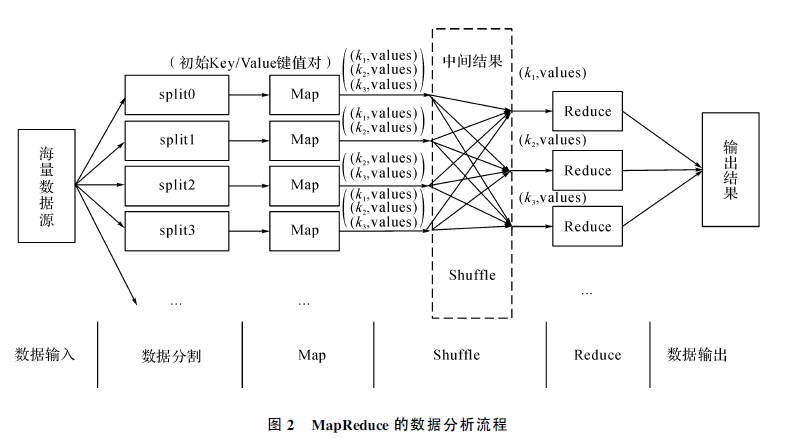
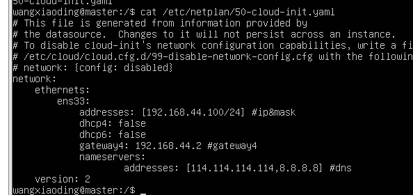
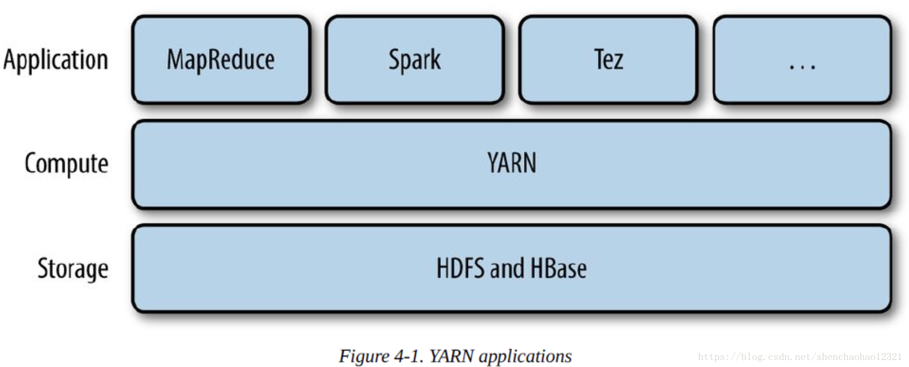

# Hadoop

在 Hadoop 2.0 中，Mapreduce 程序的日志包含两部分，**作业运行日志** 和 **任务运行日志(Container 日志)**

## Hadoop分布式文件系统

命令行接口：hadoop fs -ls /

hadoop fs -copyFromLocal  input/a.txt  \  hdfs://master/user/aaa.txt

 1 设置分布式系统的时候：fs.defaultFS = hdfs://localhost/用来设置Hadoop默认文件系统

HDFS的守护程序，通过配置文件来的这个属性来确定HDFS namenode的主机和端口号

一般默认的情况下:我们会在Master节点的8020端口号开启运行namenode进程。

2  dfs.replication  默认的复本个数是三个，如果只有一个datanode节点，我们需要设置复本个数为1，否则会警告。

 

| 文件系统 | URI  | JAVA实现：org.apache.hadoop包中的 |      |
| -------- | ---- | --------------------------------- | ---- |
| local    | file | fs.LocalFileSystem                |      |
| HDFS     | hdfs | dhfs.DistributedFileSystem        |      |
| …等      |      |                                   |      |

##  Apache YARN

yet anthor resource negotiator 

 

是Hadoop集群资源管理系统，为了改善MapReduce，YARN有足够的通用性，能够运行，可以支其它分布式计算机框架（Spark,MapReduce,Tez等）。

 

YARN提供请求和使用集群资源的Api,但是这些aAPI很少用于用户代码，用户使用的最多的是由分布式计算框架提供的更高层的API,这个api是建立在aYARN之上却向用户隐藏了资源管理细节。一些 分布式计算框架作为yarn应用，而运行在集群计算层（YARN）和存储层（HDFS和HBase）之上。

 

还有一层应用是建立在上图框架之上，比如pig,hive,Crunch等，都是运行MapReduce,Spark或者Tez之上的。它们都不直接和底层的YARN打交道。

JobTracker

Hadoop的最新版YARN提供了强大的资源管理功能，JobTracker分解为两个独立的服务:  

 全局资源管理器：ResourceManager和应用程序特有的 ：ApplicationMaster 

 

全局资源管理器：ResourceManager，负责系统整体资源的管理和分配，

而应用程序特有的 ：ApplicationMaster 负责单个应用程序的管理

 

Yarn采用了Master/slave架构，在整个资源管理框架中，resourceManager为Master，NodeManager为Slave，ResourceManager负责对NodeManager上的资源进行统一管理和调度。

当用户提交一个应用程序的时候，需要提供一个用以跟踪和管理该程序的ApplicationMaster，它负责向ResourceManager申请资源，并且通知NodeManager启动任务和占用资源，由于不同的ApplicationMaster分不到不同的节点上，因此它们之间不会互相影响。因为资源管理器ResourceManager和应用程序之间的去耦合，所以YARN具有更好的可拓展性，更加高效，大量不同组件能够有效共享一个框架。