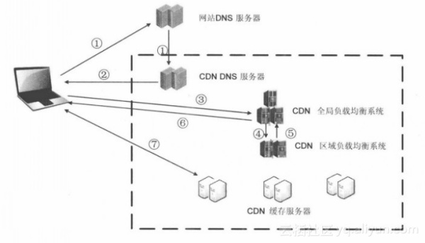

作者：阿里云云栖社区

## **一、CDN的基本原理和基础架构**

CDN是将源站内容分发至最接近用户的节点，使用户可就近取得所需内容，提高用户访问的响应速度和成功率。解决因分布、带宽、服务器性能带来的访问延迟问题，适用于站点加速、点播、直播等场景。

（本章节部分内容摘引自：[1.2 CDN的基本工作过程 - 51CTO.COM](https://link.zhihu.com/?target=http%3A//book.51cto.com/art/201205/338756.htm)）

最简单的CDN网络由一个DNS服务器和几台缓存服务器组成：

1. 当用户点击网站页面上的内容URL，经过本地DNS系统解析，DNS系统会最终将域名的解析权交给CNAME指向的CDN专用DNS服务器。
2. CDN的DNS服务器将CDN的全局负载均衡设备IP地址返回用户。
3. 用户向CDN的全局负载均衡设备发起内容URL访问请求。
4. CDN全局负载均衡设备根据用户IP地址，以及用户请求的内容URL，选择一台用户所属区域的区域负载均衡设备，告诉用户向这台设备发起请求。
5. 区域负载均衡设备会为用户选择一台合适的缓存服务器提供服务，选择的依据包括：根据用户IP地址，判断哪一台服务器距用户最近；根据用户所请求的URL中携带的内容名称，判断哪一台服务器上有用户所需内容；查询各个服务器当前的负载情况，判断哪一台服务器尚有服务能力。基于以上这些条件的综合分析之后，区域负载均衡设备会向全局负载均衡设备返回一台缓存服务器的IP地址。
6. 全局负载均衡设备把服务器的IP地址返回给用户。
7. 用户向缓存服务器发起请求，缓存服务器响应用户请求，将用户所需内容传送到用户终端。如果这台缓存服务器上并没有用户想要的内容，而区域均衡设备依然将它分配给了用户，那么这台服务器就要向它的上一级缓存服务器请求内容，直至追溯到网站的源服务器将内容拉到本地。

![img](内容分发网络CDN.ass

## CDN关键组件

