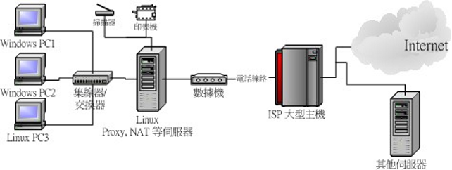
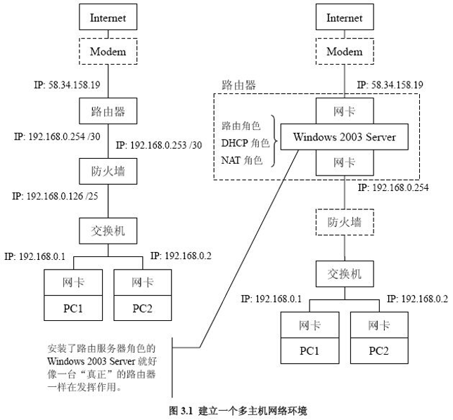
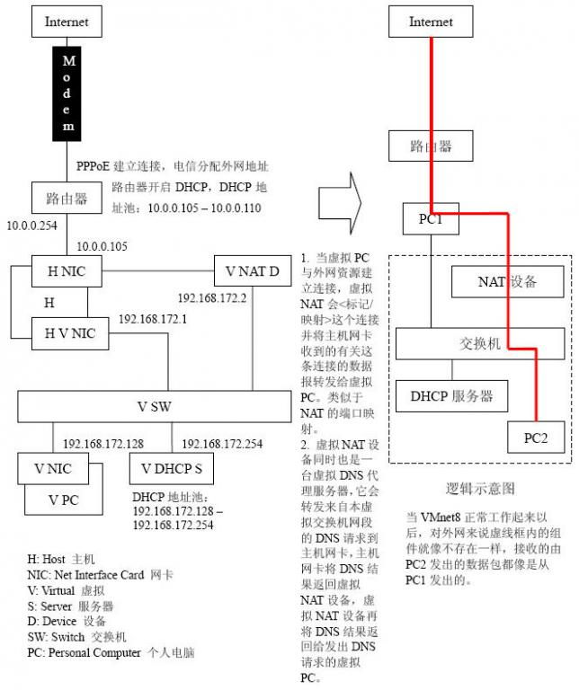
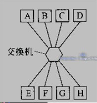
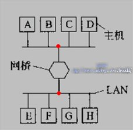
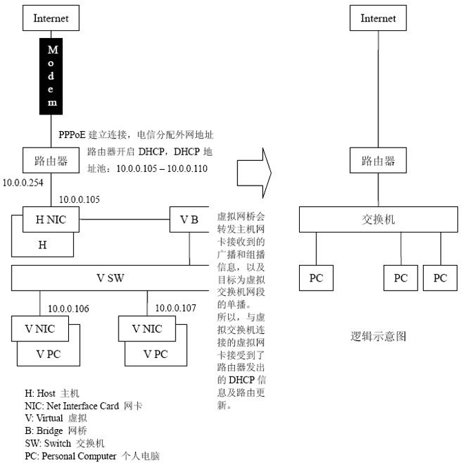
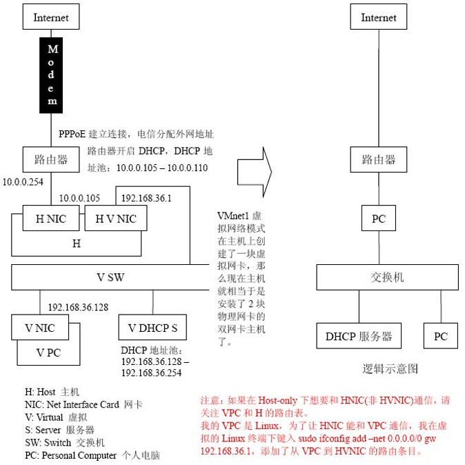

# 虚拟设备，设备知识

| 路由器：   | 提供路由，提供DHCP，NAT等服务                                |
| ---------- | ------------------------------------------------------------ |
| 网关：     |                                                              |
| 默认网关： |                                                              |
| 网桥：     | 交换机Switch，数据链路层设备，作用是转发数据包。和网桥一样它也是通过识别帧中的MAC地址，然后对特定的端口进行转发的。 |
| 交换机：   |                                                              |
| DHCP服务器 | 1.   给内部网络或网络服务供应商自动分配IP地址；   2.   给用户或者内部网络管理员作为对所有计算机作中央管理的手段。 |

4.1. 虚拟网络组件

​           **虚拟<网卡/网络适配器>：**见图4.1。安装一个虚拟PC时自动安装一块虚拟<网卡/网络适配器>，可添加多块虚拟网卡。

​           **虚拟交换机**：见图4.1。安装VM时就自动安装了10台虚拟交换机。

​           **虚拟网桥：**只在虚拟网卡连接到VMnet0 (default Bridged)虚拟交换机上才应用虚拟网桥。

​           **虚拟DHCP服务器：**见图4.2。在虚拟网卡连接到VMnet1或VMnet8虚拟交换机时，自动安装运行虚拟DHCP服务器并连接至这台虚拟交换机。

​           **虚拟NAT服务器：**见图4.3。只在虚拟网卡连接到VMnet8 (NAT)虚拟交换机时才自动安装运行虚拟NAT服务器，并连接至这台虚拟交换机。

​           **主机虚拟<网卡/网络适配器>：**见图4.4。相当于一块确实存在的网卡，是连接主机和虚拟交换机用的网卡。

# VMnet8(NAT模式)

设备、术语

# VMnet0(default Bridged)

​        4.2.1. 用到的虚拟网络组件

​                  虚拟<网卡/网络适配器>

​                  虚拟交换机

​                  虚拟网桥

​        4.2.2 桥接网络

​        在桥接模式下，VMware虚拟出来的操作系统就像是局域网中的一独立的主机，它可以访问网内任何一台机器。不过你需要多于一个的IP地址，并且需要手工为虚拟系统配置IP地址、子网掩码，而且还要和宿主机器处于同一网段，这样虚拟系统才能和宿主机器进行通信。如果你想利用VMware在局域网内新建一个虚拟服务器，为局域网用户提供网络服务，就应该选择桥接模式。

# VMnet1(Host-only)

在Host-only模式中，所有的虚拟系统是可以相互通信的，但虚拟系统和真实的网络是被隔离开的。

  在Host-Only网络中，Host-Only网络被用来设计成一个与外界隔绝的网络，其实Host-Only网络和NAT网络非常相似，唯一不同的地方就是在Host-Only网络中，没有用到NAT服务，没有服务器为VMnet1虚拟交换机做路由

虚拟网络拓扑图

# 自己搭配的虚拟机集权

