作者：Rick.yh

相对于国内CDN来说，国外的CDN更走在前列，对个人站长来说相当的不错，即使对于刚起步做SOHO的外贸人来说，用上这个国外免费CDN也是很不错的选择，今天要介绍的是cloudflare这个国外的免费CDN，去年的时候我曾经在[使用国外免费CDN服务加速您的WordPress网站](https://link.zhihu.com/?target=https%3A//jhrs.com/2018/13799.html)一文中有过介绍，感兴趣的朋友可以点击链接去看看，今天重点是介绍如何使用它。

要使用这个国外免费CDN，先去官网[注册cloudflare账号](https://link.zhihu.com/?target=https%3A//www.cloudflare.com/)，下面的教程都是基于注册免费账号来介绍的，免费和付费的区别就是付费提供更强大的功能，更多的缓存页面，更好的路由体验，总之一句话，使用付费版，有利于访问用户更快的打开你的网站。

## 注册cloudflare账号

注册cloudflare的免费账号非常的方便，注册时只需要输入email地址和密码（登录cloudflare的密码，非email密码）即可，不会像国内网站那样要你填写各种个人信息的，基本上不用担心隐私问题。注册界面如下：

注册地址直达：[https://dash.cloudflare.com/sign-up](https://link.zhihu.com/?target=https%3A//dash.cloudflare.com/sign-up)

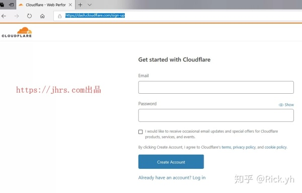

## 向cloudflare添加你要加速的网站

首次注册成功后，会跳转到让你添加网站的界面，如下图所示：

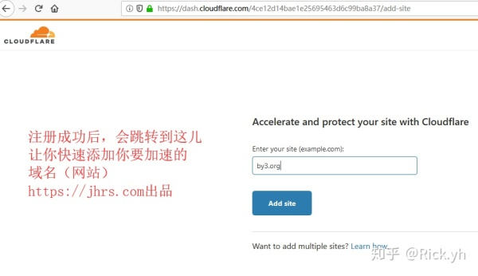

新用户首次注册成功后会跳转到上图那儿，在这儿直接输入你要加速的域名即可，接下来按照提示操作就OK了。输入你的域名后，点Add site按钮即可，例如当前的例子中，我输入的域名就是我要加速的网站[by3.org](https://link.zhihu.com/?target=https%3A//by3.org/)。**套上了CDN，还有一用处就是隐藏了你真实服务器的IP地址，隐藏了网站服务器IP地址，增加了攻击难度**。

点击添加Add site后就进入选择计划操作

## 选择cloudflare免费计划

完成上面的操作后，会跳转到下图让你选择计划（套餐）的界面，如下图所示：

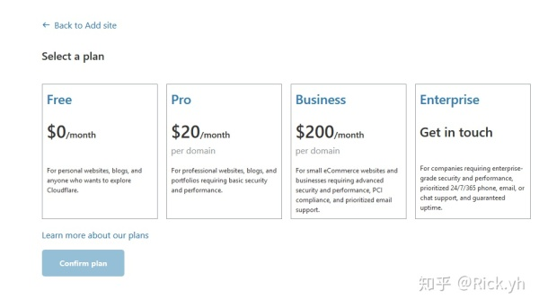

我们选择免费（Free）的就可以了，收费的功能更强大，可以等你网站流量大了，赚钱了再考虑也不迟。选择后，直接点击Confirm plan按钮即可。

## 修改DNS解析记录

点击Confirm plan按钮后，会跳转到下图这个界面，大概意思是提醒你cloudflare自动检测到的你原来的解析记录，如果解析记录不对，可以在下图修改，一般来说，原来的解析记录在我们使用了CDN后，可以全部删除了，没有用了。当然你也可以直接在cloudflare这儿修改DNS记录，玩过国内CDN的朋友应该对回源host有理解，这儿干的事情其实就是告诉cloudflare找到你的真实服务器IP地址。

在cloudflare修改或者添加的DNS解析记录，对于网站来说，只需要添加两条A记录，分别是www, @的解析即可。**添加@记录后，保存后显示的是你的域名**，如下图所示：

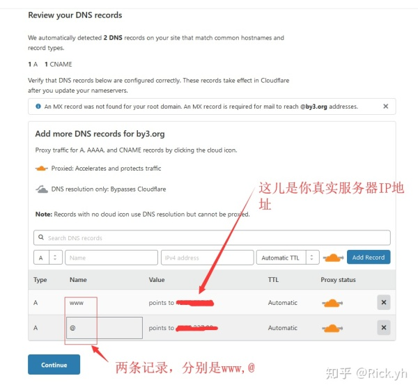

需要说明的是，如果你是一个老站，可能有邮件MX解析记录，邮件解析记录参考[如何搭建邮件服务器](https://link.zhihu.com/?target=https%3A//jhrs.com/2019/28342.html)这篇文章修改处理即可。

## 更改nameservers

上个步骤完成后，点击Continue按钮会进入到下图所示的一个提示界面，这个界面提示你需要到域名注册商那儿修改nameservers。

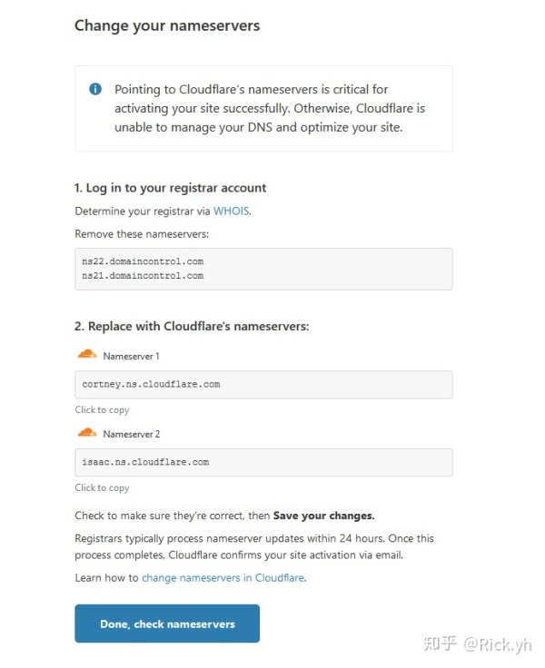

很多人卡在这个步骤不知道如何处理，其实这儿很简单的，这儿的意思是需要你到域名注册商那儿修改nameservers，如果你是在namesilo注册的域名，就到namesilo后台修改，如果你是在godaddy注册的域名就到godaddy后台修改，同理，阿里云注册的域名，就去阿里云修改。

下面我分别用godaddy和namesilo来举例说明如何修改nameservers。

本文中添加的要加速的域名[by3.org](https://link.zhihu.com/?target=https%3A//by3.org/)是在godaddy注册的，登录godaddy后台，按如下步骤修改即可。

### godaddy后台怎样修改nameservers

**1、登录后台后，你会第一眼看到你的所有域名列表，当然我这里只有一个，直接点击右侧列表的DNS按钮即可，如下图所示：**

**2、点击DNS按钮后，进入下图所示的godaddy的DNS管理界面，删除所有解析记录（可选的操作），修改域名服务器即可。如下图所示：**

在上图中，可以把原来的解析记录全部删除，然后再修改域名服务器(nameservers)即可。修改域名服务器时，你需要从cloudflare的change your nameservers界面复制相应的值过来即可，如下图所示：

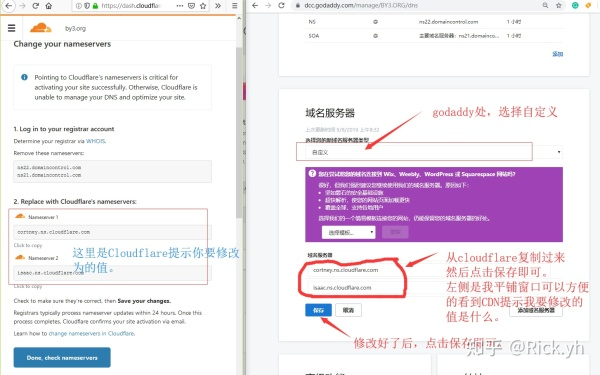

保存后，就是下图所示的样子了，看到这样的效果，表示修改成功。

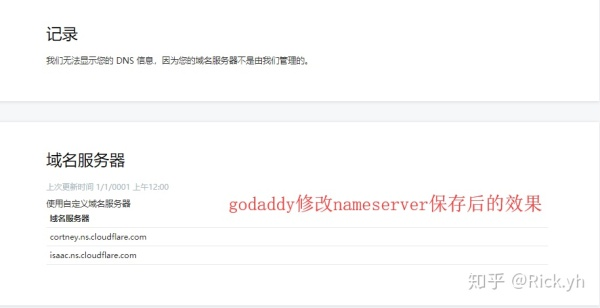

**重要提示：原来的域名解析记录可以等到修改nameservers生效后再来删除，不然你是一个老站的话，直接删除了可能导致你在切换到CDN时网站访问不了。**

### namesilo后台怎样修改nameservers

1、namesilo修改nameservers非常的方便，也可以批量的修改，这假如你有很多站，不需要一个一个的去修改。先登录namesilo后台，然后按下图提示操作即可。

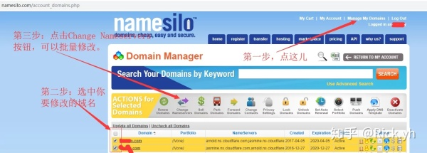

2、上图中选中你要修改nameservers的域名，你可以单个修改，也可以批量修改，点击Change Nameservers后，进入下图所示的界面，然后填写上Cloudflare提示你修改的nameservers值即可。如下图所示：

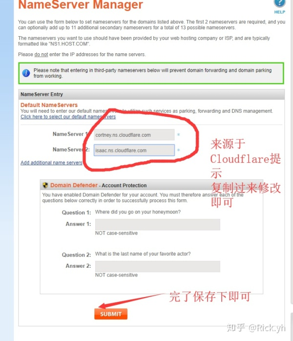

上图中保存后就不用管了。

## 返回到Cloudflare继续操作

当你修改好了nameservers后， 保存后，过几分钟后，再返回到Cloudflare界面继续点击更改nameservers图中的【Done, check nameservers】按钮，如果修改成功你会看到如下图所示界面：

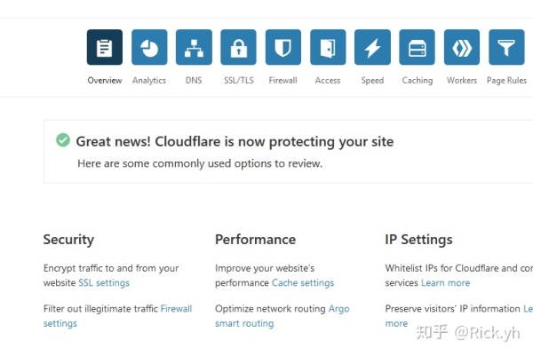

看到这个提示表示你的网站加速成功。这时候你ping你的网站，IP地址已经是CDN的IP地址了，

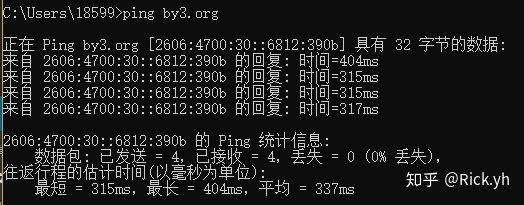

## CloudFlare免费用户可以使用的重要功能介绍

### 网站启用SSL功能

使用Cloudflare加速你的网站，它还提供免费的SSL证书给你使用，你只需要后台启用即可，保证你网站的安全访问，避免被劫持。

在cloudflare后台，点击SSL/TLS按钮，将Always Use HTTPS开启即可。

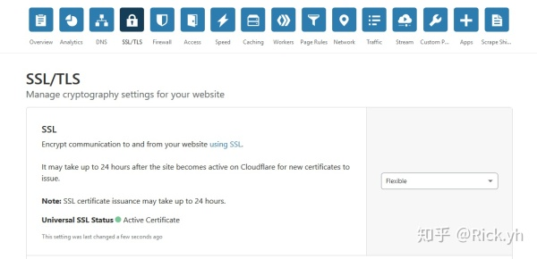

上图中，SSL是默认开启的，如果你的源站（真实服务器）上没有配置SSL，这里需要选择Flexible，其它选择项会出错的，因为下面你选了Always Use HTTPS时，CDN在回源时你的源站并没有使用SSL。只有你的源站使用了SSL时，才可以选择第3项和第4项。

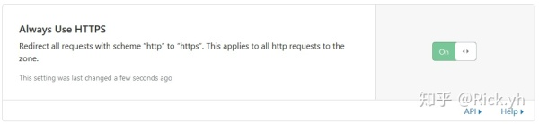

### 防火墙屏蔽特定国家用户访问

如果你要实现这个功能，cloudflare可以实现你的要求，只需要添加防火墙规则即可，如下图所示：

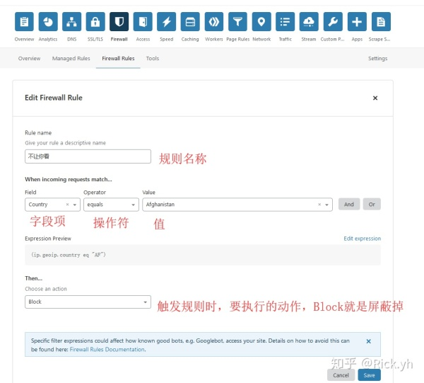

添加之后的会呈现在你的防墙规则列表里面。免费用户只有5条规则可以添加，超出后需要付费。

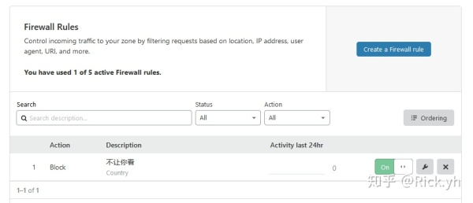

### 开启压缩功能，加快响应速度

对于免费用户来说，cloudflare提供了基本的压缩功能，默认是没有开启的，你可以在其后台开启这些功能即可，点击顶部【Speed】按钮，然后切换Optimization选项卡，如下图所示：

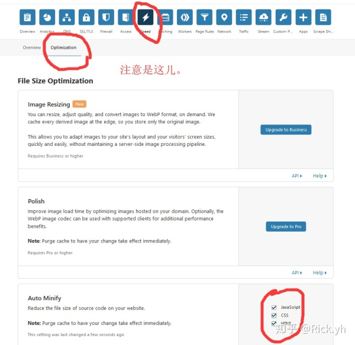

这里还有其它的选项可以设置，你可以自己研究一下。

### 页面规则（Page Rules），更精细的缓存控制

cloudflare为免费用户提供了3条责面规则，对于免费的用户来说基本上够了，如果你的网站没有动态交互，是静态的，只需要使用一条规则就可以实现全站缓存，那样几乎不会消耗你网站什么流量，当然动态站我们可以利用3条规则把 js,css,图片文件全部缓存起来。下面是全站缓存的设置，具体规则可以看看帮助文档。

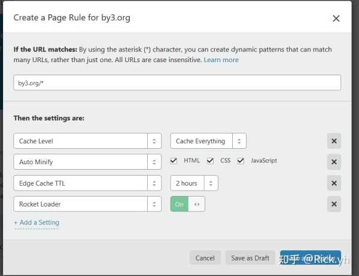

以上4点就是我认为cloudflare提供的比较重要的功能，我们可以使用的，建立都配置上，更多使用细节，或者你要解锁更多使用姿势，可以使用付费计划，一个月20刀基本上够用。

另外cloudflare付费版提供了将图片转成为webp功能，对于缩小图片，加速用户看到你网站的图片非常有用。

总之，有钱真TM的好，可以享受更多的服务。作者：Rick.yh

相对于国内CDN来说，国外的CDN更走在前列，对个人站长来说相当的不错，即使对于刚起步做SOHO的外贸人来说，用上这个国外免费CDN也是很不错的选择，今天要介绍的是cloudflare这个国外的免费CDN，去年的时候我曾经在[使用国外免费CDN服务加速您的WordPress网站](https://link.zhihu.com/?target=https%3A//jhrs.com/2018/13799.html)一文中有过介绍，感兴趣的朋友可以点击链接去看看，今天重点是介绍如何使用它。

要使用这个国外免费CDN，先去官网[注册cloudflare账号](https://link.zhihu.com/?target=https%3A//www.cloudflare.com/)，下面的教程都是基于注册免费账号来介绍的，免费和付费的区别就是付费提供更强大的功能，更多的缓存页面，更好的路由体验，总之一句话，使用付费版，有利于访问用户更快的打开你的网站。

## 注册cloudflare账号

注册cloudflare的免费账号非常的方便，注册时只需要输入email地址和密码（登录cloudflare的密码，非email密码）即可，不会像国内网站那样要你填写各种个人信息的，基本上不用担心隐私问题。注册界面如下：

注册地址直达：[https://dash.cloudflare.com/sign-up](https://link.zhihu.com/?target=https%3A//dash.cloudflare.com/sign-up)

## 向cloudflare添加你要加速的网站

首次注册成功后，会跳转到让你添加网站的界面，如下图所示：

新用户首次注册成功后会跳转到上图那儿，在这儿直接输入你要加速的域名即可，接下来按照提示操作就OK了。输入你的域名后，点Add site按钮即可，例如当前的例子中，我输入的域名就是我要加速的网站[by3.org](https://link.zhihu.com/?target=https%3A//by3.org/)。**套上了CDN，还有一用处就是隐藏了你真实服务器的IP地址，隐藏了网站服务器IP地址，增加了攻击难度**。

点击添加Add site后就进入选择计划操作

## 选择cloudflare免费计划

完成上面的操作后，会跳转到下图让你选择计划（套餐）的界面，如下图所示：

我们选择免费（Free）的就可以了，收费的功能更强大，可以等你网站流量大了，赚钱了再考虑也不迟。选择后，直接点击Confirm plan按钮即可。

## 修改DNS解析记录

点击Confirm plan按钮后，会跳转到下图这个界面，大概意思是提醒你cloudflare自动检测到的你原来的解析记录，如果解析记录不对，可以在下图修改，一般来说，原来的解析记录在我们使用了CDN后，可以全部删除了，没有用了。当然你也可以直接在cloudflare这儿修改DNS记录，玩过国内CDN的朋友应该对回源host有理解，这儿干的事情其实就是告诉cloudflare找到你的真实服务器IP地址。

在cloudflare修改或者添加的DNS解析记录，对于网站来说，只需要添加两条A记录，分别是www, @的解析即可。**添加@记录后，保存后显示的是你的域名**，如下图所示：

需要说明的是，如果你是一个老站，可能有邮件MX解析记录，邮件解析记录参考[如何搭建邮件服务器](https://link.zhihu.com/?target=https%3A//jhrs.com/2019/28342.html)这篇文章修改处理即可。

## 更改nameservers

上个步骤完成后，点击Continue按钮会进入到下图所示的一个提示界面，这个界面提示你需要到域名注册商那儿修改nameservers。

很多人卡在这个步骤不知道如何处理，其实这儿很简单的，这儿的意思是需要你到域名注册商那儿修改nameservers，如果你是在namesilo注册的域名，就到namesilo后台修改，如果你是在godaddy注册的域名就到godaddy后台修改，同理，阿里云注册的域名，就去阿里云修改。

下面我分别用godaddy和namesilo来举例说明如何修改nameservers。

本文中添加的要加速的域名[by3.org](https://link.zhihu.com/?target=https%3A//by3.org/)是在godaddy注册的，登录godaddy后台，按如下步骤修改即可。

### godaddy后台怎样修改nameservers

**1、登录后台后，你会第一眼看到你的所有域名列表，当然我这里只有一个，直接点击右侧列表的DNS按钮即可，如下图所示：**

**2、点击DNS按钮后，进入下图所示的godaddy的DNS管理界面，删除所有解析记录（可选的操作），修改域名服务器即可。如下图所示：**

在上图中，可以把原来的解析记录全部删除，然后再修改域名服务器(nameservers)即可。修改域名服务器时，你需要从cloudflare的change your nameservers界面复制相应的值过来即可，如下图所示：

保存后，就是下图所示的样子了，看到这样的效果，表示修改成功。

**重要提示：原来的域名解析记录可以等到修改nameservers生效后再来删除，不然你是一个老站的话，直接删除了可能导致你在切换到CDN时网站访问不了。**

### namesilo后台怎样修改nameservers

1、namesilo修改nameservers非常的方便，也可以批量的修改，这假如你有很多站，不需要一个一个的去修改。先登录namesilo后台，然后按下图提示操作即可。

2、上图中选中你要修改nameservers的域名，你可以单个修改，也可以批量修改，点击Change Nameservers后，进入下图所示的界面，然后填写上Cloudflare提示你修改的nameservers值即可。如下图所示：

上图中保存后就不用管了。

## 返回到Cloudflare继续操作

当你修改好了nameservers后， 保存后，过几分钟后，再返回到Cloudflare界面继续点击更改nameservers图中的【Done, check nameservers】按钮，如果修改成功你会看到如下图所示界面：

看到这个提示表示你的网站加速成功。这时候你ping你的网站，IP地址已经是CDN的IP地址了，

## CloudFlare免费用户可以使用的重要功能介绍

### 网站启用SSL功能

使用Cloudflare加速你的网站，它还提供免费的SSL证书给你使用，你只需要后台启用即可，保证你网站的安全访问，避免被劫持。

在cloudflare后台，点击SSL/TLS按钮，将Always Use HTTPS开启即可。

上图中，SSL是默认开启的，如果你的源站（真实服务器）上没有配置SSL，这里需要选择Flexible，其它选择项会出错的，因为下面你选了Always Use HTTPS时，CDN在回源时你的源站并没有使用SSL。只有你的源站使用了SSL时，才可以选择第3项和第4项。

### 防火墙屏蔽特定国家用户访问

如果你要实现这个功能，cloudflare可以实现你的要求，只需要添加防火墙规则即可，如下图所示：

添加之后的会呈现在你的防墙规则列表里面。免费用户只有5条规则可以添加，超出后需要付费。

### 开启压缩功能，加快响应速度

对于免费用户来说，cloudflare提供了基本的压缩功能，默认是没有开启的，你可以在其后台开启这些功能即可，点击顶部【Speed】按钮，然后切换Optimization选项卡，如下图所示：

这里还有其它的选项可以设置，你可以自己研究一下。

### 页面规则（Page Rules），更精细的缓存控制

cloudflare为免费用户提供了3条责面规则，对于免费的用户来说基本上够了，如果你的网站没有动态交互，是静态的，只需要使用一条规则就可以实现全站缓存，那样几乎不会消耗你网站什么流量，当然动态站我们可以利用3条规则把 js,css,图片文件全部缓存起来。下面是全站缓存的设置，具体规则可以看看帮助文档。

以上4点就是我认为cloudflare提供的比较重要的功能，我们可以使用的，建立都配置上，更多使用细节，或者你要解锁更多使用姿势，可以使用付费计划，一个月20刀基本上够用。

另外cloudflare付费版提供了将图片转成为webp功能，对于缩小图片，加速用户看到你网站的图片非常有用。

总之，有钱真TM的好，可以享受更多的服务。