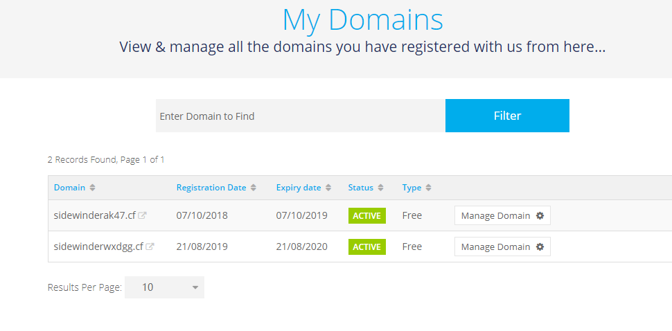
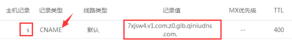
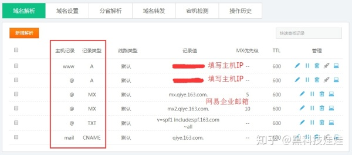

---
-- 非原创
---

[https://my.freenom.com](https://my.freenom.com/)

> 网站介绍：是一个可以申请免费域名的地方。

DDoS攻击？?

## 什么是 共享IP（shared IP）？

## 什么是 独立IP（dedicated IP）？

## 什么是域名（domain）？

在国内购买域名和虚拟主机需要备案域名网站，在国外买主机和域名不用备案。

域名分为根域名（主域名）和二级域名，两种域名都要解析。

由域名服务器（DNS）**在其缓存中** 查找该域名对应绑定的 IP 地址主机，并返回给访问者主机 IP地址，访问者主机访问该 IP地址，就可以顺利打开访问网站了。

## 域名服务器（DNS：domain name server）

记录域名和 IP地址的**对应记录**，并把 IP地址返回给访问者主机进行访问。

## 什么是 TTL？

在DNS解析记录里，TTL的全称是“生存时间（Time To Live）”，也就是域名记录的有效更新时间，简单的说它表示 DNS 记录在 DNS 服务器上缓存的时间。

TTL 大了，修改`解析`后等待生效的时间就会越长，TTL 小了，域名解析的稳定性和解析速度就会受到影响.

可以在解析域名的时候设置一个最短的TTL,代表想让域名快速生效的时间 这样域名可以快速生效，等生效后再把TTL改成最长的。

对于企业网站虚拟主机这种不会经常更换 IP，架构结构比较简单的主机，TTL 一般默认即可，不用去设置，在添加时系统会自动生成。对于 Bluehost 的解析，默认一般为 14400。对于一些第三方 DNS 智能解析，默认多为 3600（60分钟）。

## 什么是 A 记录？

A (Address) 记录是 IP 解析，用来记录一个域名（或主机名）对应的一条 IP 地址。简单说就是把你的网站域名放到空间商给你的IP上。A记录可以将多个域名解析到一个IP地址，但是**不能**将一个域名解析到多个IP地址。

A记录常见的有以下几种：

- www：解析 www 域名。  例：www.  abc  .com
-   @   ：根域名 解析。解析不带 www 的主域名，即 abc . com
-    \*    ： 泛解析  ***.  abc . com**，对所有未单独解析的二级域名解析到某一 IP地址上，不作用于主域，一般我们不用去设置泛解析。二级泛域名可以和主域名不在一个空间，对于其他的二级域名，我们也可以单独进行二级域名的 A记录解析。

一般只要创建两个 A 记录即可：**一条 @ (**主域名的解析)，一条是 www （二级域名www解析）

> 效果：可以多个域名解析到一个IP地址。

## 什么是 CNAME？

CNAME （Canonical Name record）是**别名解析**，把一个域名解析到另外一个域名,再由另一个域名提供 ip 地址**。**CNAME记录指定了此域名是另外一个正式域名（Canonical Name）的别名（alias）。可以让域名捆绑到多个服务器IP地址。

最常用到 cname 的场景包括做 cdn、做企业邮箱。CDN加速服务时候，很多都是把原本的 www的 A记录解析改成CNAME方式解析，CDN 加速网站针对你账户自动配置的某个二级域名。比如把 s . cooltechdoll . com ( 存放 CSS，JS等静态文件的二级域名）的主机名 s 用 CNAME 解析到七牛默认分配的二级域名.

> 效果： 可以让多个域名绑定到一个IP地址，比如我们修改自己github page的域名，让它更好看一些。

## 什么是MX 记录？

MX 记录是邮件交换记录，它指向一个邮件服务器，发邮件时它会根据收信人的地址后缀来定位邮件服务器。如果你需要用你的企业网站域名作为你的邮箱账号的话，就要添加 MX 域名解析记录。

MX 记录就是专门为电子邮件程序指路的，在 DNS 服务器中添加 MX 记录后，邮件系统通过 DNS（域名服务器）查找 XXX . com 这个域名的 MX 记录。电子邮件程序就能知道邮件服务器的具体位置（即IP地址）了。

注意不同的邮件服务商有不同的 MX 记录的对应地址。如果你不清楚怎么设置，一般查找你的企业邮箱服务商的网站或者问客服即可。

网易企业邮箱需要添加两条 MX 记录：邮件服务器名：mx .qiye 163 .com 和 mx2 . qiye163 . com
腾讯企业邮箱需要添加两条 MX 记录：邮件服务器名：mxbiz1 . qq .com 和 mx biz2. qq .com

在DNS所在的服务器里添加完 MX 记录后，还要去网易或者其他邮箱后台设置下。

## 什么是 SPF？

(Sender Policy Framework) 的缩写，一种以 IP地址 认证电子邮件发件人身份的技术，是非常高效的垃圾邮件解决方案。这个是为了防止被列入垃圾邮件，接收邮件方会首先检查域名的SPF记录，来确定发件人的IP地址是否被包含在 SPF 记录里面，如果在，就认为是一封正确的邮件，否则会认为是一封伪造的邮件进行退回。

SPF是通过域名的TXT记录来进行设置的。为了提升域名邮箱发送外域邮件的成功率，一般我们会给自己的域名设置一条 TXT 记录来避免这种情况。

## TXT 记录

TXT 记录一般是为某个主机名或域名设置的说明。一般情况下我们不用做 TXT 记录，只有当使用企业邮箱时为了提高发送邮件成功率设置SPF时，我们会添加 TXT 记录。

> 最后以网易企业邮箱为例，上图给大家看一个域名解析的配置图

了解完了以上概念之后，我们就可以正式开始进行域名解析了。

## 域名解析主要根据NS的位置来配置DNS.

### 第一种：如果你用的是虚拟主机 SiteGround 或 [Bluehost](https://link.zhihu.com/?target=https%3A//www.cooltechdoll.com/how-to-start-a-wordpress-website-on-bluehost/)，比如 Bluehost，一般建议NS都用虚拟主机商的，分两种情况区别配置。

1. 域名是在主机商那里购买的，或者是购买主机赠送的，那么你就不用设置域名解析了，域名已经自动配置好了DNS解析记录。你只要另外设置MX邮箱解析就可以了。
2. 如果你用的域名是namesilo或阿里云等其他域名商那里购买的，就需要做DNS解析来绑定域名和主机。强烈建议把域名解析权交给 bluehost。也就是说，把 namesilo 的NS地址改成 Bluehost 的 NS 地址，其它不做任何修改。然后在BLUEHOST主机里会自动生成各种解析。这样交接域名解析任务之后，空间和域名解析都在 Bluehost进行，可以省去很多麻烦。 NS 的修改一般最长在48小时内生效。通常隔天即可。到这一步代表已经把域名解析权交给了 Bluehost，工作交接完毕。

### 第二种：如果使用VPS主机建站，域名是[namesilo](https://link.zhihu.com/?target=https%3A//www.cooltechdoll.com/namesilo-coupon/)或阿里云等其他域名商那里购买的，可以分两种NS类型配置。

1. NS在namesilo上，所有的DNS记录配置包括两个A记录解析，MX解析都都在域名商后台配置。同时在VPS后台绑定域名。
2. NS在VPS上，所有的DNS包括两个A记录解析，MX解析都都在VPS后台设置。

## 其他

4、URL (Uniform Resource Locator )转发：网址转发**

功能：如果您没有一台独立的服务器（也就是没有一个独立的IP地址）或者您还有一个域名B，您想访问A域名时访问到B域名的内容，这时您就可以通过URL转发来实现。 
url转发可以转发到某一个目录下，甚至某一个文件上。而cname是不可以，这就是url转发和cname的主要区别所在。

**5、NS（Name Server）记录是域名服务器记录**
用来指定该域名由哪个DNS服务器来进行解析，可以把一个域名的不同二级域名分别指向到不同的DNS系统来解析。

**6、AAAA记录 IPV6解析记录**

该记录是将域名解析到一个指定的IPV6的IP上。