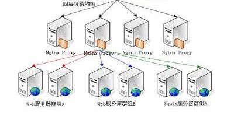
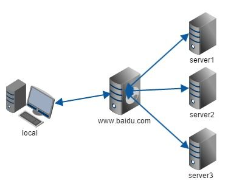

typora-root-url: 网速单位.assets

# 什么是**Mbps**、**Kbps**、**bps**、**kb**、**mb**及其换算和区别

Mbps 即 Milionbit pro second(百万位每秒)；

Kbps 即 Kilobit pro second（千位每秒）；

bps 即 bit pro second（位每秒）；

> 速度单位，bit即比特，
> 通常用b（小写）表示，指一位二进制位，Milionbit=1000Kilobit=1000 000bit；  所以1Mbps=1000 000bps； 
> 这是通常用来衡量带宽的单位，指每秒钟传输的二进制位数；
> 而通常软件上显示的速度则是指每秒种传输的字节数（Byte）通常用B（大写）表示；

MB即百万字节也称兆字节；

KB即千字节；

B即字节；

之间关系为1MB=1024KB=1024*1024B；

1B=8b；

所以1M带宽即指1Mbps=1000Kbps=1000/8KBps=125KBps；

因此1M的带宽下载的速度一般不会超过125KB每秒。

2M、3M带宽分别是250KBps、375KBps；

2M、3M带宽的下载速度分别不会超过250KB、375KB每秒。

 假设要对10kbps进行换算，则有 10kbps=10000bps=0.01Mpbs. 

数据传输速率的衡量单位K是十进制含义,但数据存储的K是2进制含义。

1kbit/s就是1000bit/s,而KB是1024个字节,注意KB和kbit的区别，另外，数据传输速率的单位是bit/s 记作：bps 。

在实际应用中,1kbps=1000bps，1Mbps=1000,000bps.

​                         1bps=0.000001bps

1Mbps与 1m/s 是有区别的，1m/s指的是是1024KB/S  

而1Mbps指的是1000/8KB/S也就是125KB/S，  

记住K和k是没区别的  ，区别在于bps属于位每秒的单位，而m/s ,KB/S这两个属于字节每秒的单位，一字节等于8位，即1k=8b

100M宽带实际上就是指的是100 Mbps = 100 *1000 000 bps 

显示的存储速度大小为= 100 * 1000 000 /( 1024*1024*8)  KB/S = 11.920929KB/S   

[Kbps、KB、Mbps单位换算 - a_dreaming_fish的博客](https://blog.csdn.net/a_dreaming_fish/article/details/50483822)

[许多人对 Kbps、KB、Mbps 等速度单位有所误解，以下简单解释一下所谓的 1.5M、3M、6M 如何计算。  所谓 1.5M 宽带，其实是指 1.5Mbps (bits per second)，...](https://blog.csdn.net/a_dreaming_fish/article/details/50483822)

## 字节序的大小端模式

在各种计算机体系结构中，对于字节、字等的存储机制有所不同，因而引发了计算机通信领
域中一个很重要的问题，即通信双方交流的信息单元（比特、字节、字、双字等等）应该以什么样的顺序进行传送。如果不达成一致的规则，通信双方将无法进行正
确的编/译码从而导致通信失败。目前在各种体系的计算机中通常采用的字节存储机制主要有两种：Big-Endian和Little-Endian，下面先
从字节序说起。

作者：车小胖

链接：https://www.zhihu.com/question/24723688/answer/160252724

来源：知乎

著作权归作者所有。商业转载请联系作者获得授权，非商业转载请注明出处。

很久以前，老王去饭店吃饭，需要先到饭店，七荤八素点好菜，坐等饭菜上桌，然后大快朵颐，不亦乐乎。

有了第三方订餐外卖平台（**代理**），老王懒得动身前往饭店，老王打个电话或用APP，先选好某个饭店，再点好菜，外卖小哥会送上门来。

由于某个品牌的饭店口碑特别好，食客络绎不绝涌入，第三方订餐电话也不绝于耳，但是限于饭店接待能力有限，无法提供及时服务，很多食客等得不耐烦了，纷纷铩羽而归，饭店老总看着煮熟的鸭子飞走了，心疼不已。

痛定思痛，老总又成立了几个连锁饭店，形成一个集群，对外提供统一标准的菜品服务，电话订餐电话400-xxx-7777，当食客涌入饭店总台，总台将食客用大巴运到各个连锁店，这样食客既不需要排队，各连锁店都能高速运转起来，一举两得，老总乐开了花，并为此种运作模式起名为**“反向代理”（Reverse Proxy)。**

**反向代理**

在计算机世界里，由于单个服务器的处理客户端（用户）请求能力有一个极限，当用户的接入请求蜂拥而入时，会造成服务器忙不过来的局面，可以使用多个服务器来共同分担成千上万的用户请求，这些服务器提供相同的服务，对于用户来说，根本感觉不到任何差别。

 

**反向代理的实现**

1）需要有一个负载均衡设备来分发用户请求，将用户请求分发到空闲的服务器上

2）服务器返回自己的服务到负载均衡设备

3）负载均衡将服务器的服务返回用户

以上的潜台词是：用户和负载均衡设备直接通信，**也意味着用户做服务器域名解析时，解析得到的IP其实是负载均衡的IP，而不是服务器的IP**，这样有一个好处是，当新加入/移走服务器时，仅仅需要修改负载均衡的服务器列表，而不会影响现有的服务。

谈完反向代理服务，再来谈谈终端用户常用的代理服务。

**代理**

1）用户希望代理服务器帮助自己，和要访问服务器通信，为了实现此目标，需要以下工作：

a) 用户IP报文的目的IP = 代理服务器IP

b) 用户报文端口号 = 代理服务器监听端口号

c) HTTP 消息里的URL要提供服务器的链接

2）代理服务器可以根据c)里的链接与服务器直接通信

3）服务器返回网页

4）代理服务器打包3）中的网页，返回用户。

**代理服务器应用场景**

**场景一**

如果不采用代理，用户的IP、端口号直接暴露在Internet（尽管地址转换NAT），外部主机依然可以根据IP、端口号来开采主机安全漏洞，所以在企业网，一般都是采用代理服务器访问互联网。

**那有同学会有疑问，那代理服务器就没有安全漏洞吗？**

相比千千万万的用户主机，代理服务器数量有限，修补安全漏洞更方便快捷。

**场景二**

在一个家庭局域网，家长觉得外部的世界是洪水猛兽，为了不让小盆友们学坏，决定不让小盆友们访问一些网站，可小盆友们有强烈的逆反心理，侬越是不让我看，我越是想看，于是小盆友们使用了代理服务器，这些代理服务器将禁止访问的网页打包好，然后再转交给小盆友，仅此而已。

当然关键的关键是**代理服务器不在禁止名单当中！**

 

 

欢迎关注微信公众号：**车小胖谈网**

**来自知乎刘志军的会回答**

已剪辑自: <https://www.zhihu.com/question/24723688>

 

 

**正向代理**

A同学在大众创业、万众创新的大时代背景下开启他的创业之路，目前他遇到的最大的一个问题就是启动资金，于是他决定去找马云爸爸借钱，可想而知，最后碰一鼻子灰回来了，情急之下，他想到一个办法，找关系开后门，经过一番消息打探，原来A同学的大学老师王老师是马云的同学，于是A同学找到王老师，托王老师帮忙去马云那借500万过来，当然最后事成了。不过马云并不知道这钱是A同学借的，马云是借给王老师的，最后由王老师转交给A同学。这里的王老师在这个过程中扮演了一个非常关键的角色，就是**代理**，也可以说是正向代理，王老师代替A同学办这件事，这个过程中，真正借钱的人是谁，马云是不知道的，这点非常关键。

我们常说的代理也就是只正向代理，正向代理的过程，它隐藏了真实的请求客户端，服务端不知道真实的客户端是谁，客户端请求的服务都被代理服务器代替来请求，某些科学上网工具扮演的就是典型的正向代理角色。用浏览器访问 [http://www.google.com](https://link.zhihu.com/?target=http%3A//www.google.com/) 时，被残忍的block，于是你可以在国外搭建一台代理服务器，让代理帮我去请求google.com，代理把请求返回的相应结构再返回给我。

**反向代理**

大家都有过这样的经历，拨打10086客服电话，可能一个地区的10086客服有几个或者几十个，你永远都不需要关心在电话那头的是哪一个，叫什么，男的，还是女的，漂亮的还是帅气的，你都不关心，你关心的是你的问题能不能得到专业的解答，你只需要拨通了10086的总机号码，电话那头总会有人会回答你，只是有时慢有时快而已。那么这里的10086总机号码就是我们说的**反向代理**。客户不知道真正提供服务人的是谁。

反向代理隐藏了真实的服务端，当我们请求 [w](https://link.zhihu.com/?target=http%3A//www.baidu.com/)ww.baidu.com 的时候，就像拨打10086一样，背后可能有成千上万台服务器为我们服务，但具体是哪一台，你不知道，也不需要知道，你只需要知道反向代理服务器是谁就好了，[w](https://link.zhihu.com/?target=http%3A//www.baidu.com/)ww.baidu.com 就是我们的反向代理服务器，反向代理服务器会帮我们把请求转发到真实的服务器那里去。Nginx就是性能非常好的反向代理服务器，用来做负载均衡。

两者的区别在于代理的对象不一样：**正向代理**代理的对象是客户端，**反向代理**代理的对象是服务端
