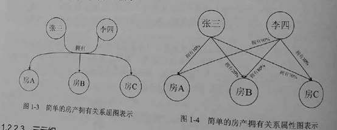
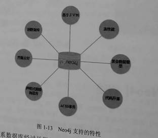
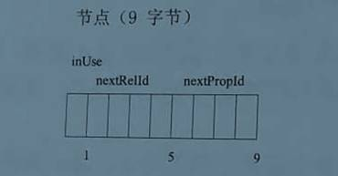
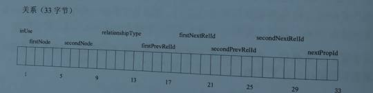
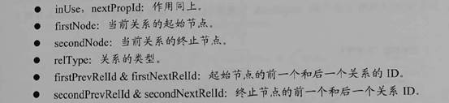
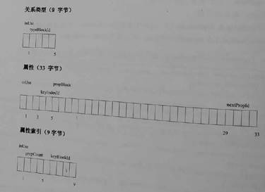
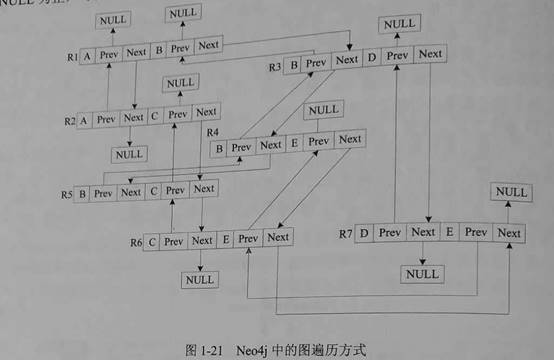
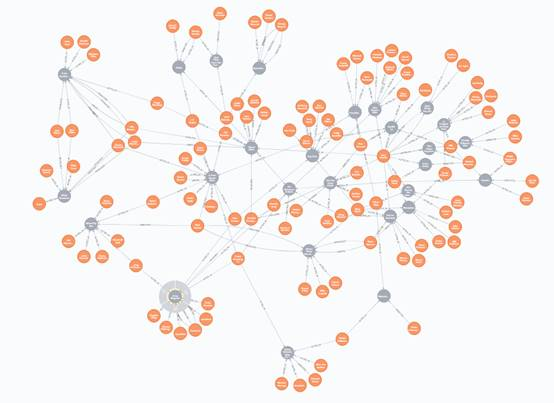

## 1.Neo4j底层结构

1 图数据库

图数据库（Graph Database）是基于图论的一种新型NoSQL数据库。它的数据存储结构和数据的查询方式都是以图论为基础的。图论中图中的基本元素为节点和边，在图数据库中对应的就是节点和边。

2 图数据库数据模型

数据模型：如何存，采用什么方式存图数据。

主要有三种方式：

- 属性图


Neo4j就是采用属性图这种方式，适合了绝大部分场景。

属性图的主要特征：


- 超图




- 三元组

按三元组模型来实现三元组的图数据库产品很少。

如何解决多对多关系。

 Neo4j的特性：



Neo4j是使用Java语言实现的开源NoSQL图数据库。 

图数据库对比关系型数据库，其它NoSQL优势是什么？

很多现实场景中，实体之间存在千丝万缕的联系。传统关系型数据库，更加注重刻画实体内部属性，实体与实体之间的关系主要通过外键进行实现。查询一个实体的关系时需要join操作，特别是深层次的关系查询需要进行大量的join操作，而join操作过实际上非常耗时。随着关系数据增加，会导致关系数据库已难以承受查询海量关系深层次关系所需要大量数据库表操作带俩的运算复杂性。

### Neo4j的底层存储结构：

从宏观角度只有两种存储结构：

- 节点Node：有点类似ER中的实体，每个实体可以有零个或者多个属性。每个属性由键值对key-value形式存在。每个节点应该有相应的标签，来区分不同节点。

- 关系Relationship：有点类似ER中的关系，包括起始和终止节点。关系也可包含自己的属性和标签 



节点存储文件neostore.nodestore.db:节点记录的长度是固定的，9个字节。

Node: inUse + nextRelId + nextPropId 


Node:[100, used = true, rel = 5, prop = 8 ]

Id = 100 固定长度，可以知道记录位置在900字节处。O(1)查询成本

 

关系存储文件neostore.relationshipstore.db: 关系记录也是固定长度的，33个字节。



 

Relationship:inUse + firstNode + secondNode + relType + firstPrevRelId + firstNextRelId + secondPrevRelId + secondNextRelId + nextPropId。



起始节点的前一个和后一个关系ID与终止节点的前一个和后一个关系ID。

 

Neo4j有一个.id文件用来保持对未使用记录的跟踪，用来回收是的记录占用的空间。

属性存储：物理存放在neostore.propertystore.db文件中。属性存储的记录也是固定长度的33字节。


4个属性块 propBlock ，一个属性链下一个属性ID：nextPropId

属性链是单向链表，关系链是双向链表。



 

Neo4j有两种动态类型的存储：动态字符串存储（neostore.propertystore.db.strings）和动态数组存储（neostore.propertystore.db.arrays）。动态记录是可以拓展的。


遍历方式。

要读取一个节点的属性，从指向第一个属性指针开始，遍历整个单链表结构。

找到节点的关系，从指向第一个关系开始，遍历整个双向链表。找到关系后，可以查找关系的属性。



 

## 2.Neo4j的安装使用

沙盒: [https://neo4j.com/sandbox-v2/?ref=hcard#](https://neo4j.com/sandbox-v2/?ref=hcard)

**安装**

Neo4j是java语言实现的，因此安装之前需要安装Java环境

开启服务：

``` powershell
D:

cd D:\neo4j-community-3.5.5\bin
neo4j <指令名>：start stop console restart status install-service uninstall-service

neo4j.bat console

http://localhost:7474/

最好先安装服务：

neo4j install-service

否则找不到neo4j服务

neo4j.bat  console
```


## 3.图数据库基本概念与操作

#### 创建节点：
``` cypher
create (Keanu:Person {name:'Keanu Reeves', born:1964} )
```
创建一个名为Keanu类型为Person，有两个属性name和born

#### 创建关系：
``` cypher
create (Keanu) - [:ACTED_IN {roles:['Neo'] }]-> (TheMaxtrix)
```
创建了 Keanu 与TheMaxtrix之间的关系为ACTED_IN 关系的属性包括了roles角色为Neo。

#### 查询人：
``` cypher
match(tom {name:'Tom Hanks'} ) return tom;
```
#### 查询电影
``` cypher
match(cloudAtlas {title:'Cloud Atlas'}) return cloudAtlas;
```


#### 随机查找多个人物姓名：
``` cypher
match(people:Person ) return people.name limit 10
```


#### 查询90年代的电影
``` cypher
match(nineties:Movie) where nineties.released > 1990 and nineties.released < 2000 return nineties.title
```
先匹配Movie节点，然后使用where进行筛选。

 

#### 查询某人演过的电影
``` cypher
match(tom:Person {name:'Tom Hanks'})-[ACTED_IN] ->(tomHanksMovies) return tom,tomHanksMovies
```
首先匹配属性name：Tom Hanks的节点，然后匹配acted_in关系。最后返回

#### 查询是谁导演了某电影
``` cypher
match(cloudAtlas {title: "Cloud Atlas"})<-[:DIRECTED] -(directors) return directors.name
```
#### 查询和Tom Hanks一起出演电影都有谁。
``` cypher
match(tom:Person {name:'Tom Hanks'}) - [:ACTED_IN] ->(m)<-[:ACTED_IN]-(coActors) return coActors.name
```
#### 与电影相关所有人：
``` cypher
match(people:Person)-[relatedTo]-(:Movie {title:'Cloud Atlas'}) return people.name ,Type(relatedTo),relatedTo
```
首先匹配人，然后匹配指定属性的电影，然后匹配两者之间存在某种联系。返回人名，关系类型，关系名称
``` cypher
match(people:Person)-[relatedTo]-(movie:Movie {title:'Cloud Atlas'}) return movie, people ,Type(relatedTo),relatedTo
```
#### 查询关系路径

六度空间的理论：世界上任何两个人，他们之间之多通过6条关系路径就可以相互到达彼此了。
``` cypher
match(bacon:Person {name:"Kevin Bacon"})-[*1..4]-(hollywood) return distinct Hollywood
```


#### 查询两个节点之间的最短路径：
``` cypher
match p=shortestPath((bacon:Person {name:'Kevin Bacon'})-[*]-(meg:Person {name:"Meg Ryan"}))  return p
```
先匹配两个人节点，  [*]表示两者存在任意任意深度的关系

 

#### 清空数据库：

``` cypher
Match(a:Person) ,(m:Movie)
Optional match (a)-[r1]-(), (m)-[r2]-()
Delete a,r1,m,r2
```

#### 查询所有节点和关系：

```cypher
match(n ) return n;
```

#### 清空所有数据命令2如下：

```cypher
MATCH (n)
OPTIONAL MATCH (n)-[r]-()
DELETE n,r
```


```cypher
Match (john {name:’John’})-[:friend] ->() – [:friend] ->(fof)
```

## 4.cypher

Cypher是一种申明式图数据库查询语言，有丰富的表现力，能够高效查询和更新图数据。关键词借鉴自SQL模式匹配表达式借鉴于SPARQL语言，聚合Collect语法来源于Haskell和Python语言。

Match 匹配模式：

查询约翰朋友的朋友
```cypher
match (john {name:'John'})-[:friend] -> () – [:friend] ->(fof) return john,fof
```


