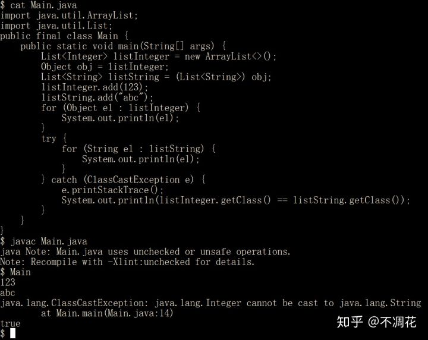

## java泛型学习笔记 generic programming


Java是运行时动态强制转换，C++是编译期静态代码生成。



[不凋花](https://www.zhihu.com/people/zai-sheng-cao-75)

程序猿·音乐剧爱好者


不存在伪泛型的说法，只能说两种不同的实现方式。

参考C#的CLR的实现方法，直接将泛型做进CLR当中，编译器roslyn编译出的IL带类型信息，因此运行时也知道T到底是什么类型。使用泛型容器时也不存在自动装箱拆箱的问题，性能会和不使用泛型的特定类型容器基本相同。

而Java则是考虑兼容性没有这么做，泛型只是编译阶段的check而已，实际上运行起来里面全都是Object。

使用上前者会更加清真，可以充分发挥泛型的作用，JIT甚至会给每个类型特化出一份实现，类似C++的template，而后者则只停留在编译层面，会使得设计依赖注入框架等等的时候代码非常不pure，你只能提供 getService<T>() 却不能提供 createClass<T>()，而需要将class当作参数传进去，十分不优雅。除此之外泛型数组也无法实现，如：Map<String, String>[] map = new HashSet<String, String>[10];

除了很多东西不能实现之外，Java中的泛型容器由于类型擦除会导致自动装箱和拆箱，性能也会有很大的损失。


作者：hez2010
链接：https://www.zhihu.com/question/267798532/answer/722460715
来源：知乎
著作权归作者所有。商业转载请联系作者获得授权，非商业转载请注明出处。


作者：Vesion
链接：https://www.zhihu.com/question/33304378/answer/91719189
来源：知乎
著作权归作者所有。商业转载请联系作者获得授权，非商业转载请注明出处。


泛型编程”这个概念最早就是来源于C++当初设计STL时所引入的模板（Template），而为什么要引入模板呢，因为STL要完成这样一个目标：设计一套通用的，不依赖类型的，高效的的算法（例如std::sort）和数据结构（例如std::list）。关于通用性，运行时多态（Polymorphism）可以做到（例如很多高级语言的继承（Inheritance）机制，接口（Interface）机制），但是C++作为一门相对底层的语言，对运行效率的要求是很严格的，而运行时多态会影响效率（例如成员函数只有在运行时才知道调用哪个），所以设计STL的人就创造了一种编译时多态技术，即模板。

那什么又是编译时多态呢，简单点说就是让编译器帮我确定类型，我写程序时只要标记下这里我要用“某种类型”的对象，至于具体是什么类型我不关心，你编译器帮我确定，编译完成后在运行时绝对是类型确定的，这样就大大提高了运行效率，反之对编译就增加了很多工作，而且生成的目标代码也会大大增加。所以对C++来说，所谓“泛型（Generics）”，并不是说编译器不知道类型，而是针对程序员来说的，这也正是通用性的体现。

C++的模板在刚出来的时候并没有想到会演化成今天这样，其他高级语言（如Java，C#）也是看到C++模板在使用的时候带给了程序员极大的便利，就考虑支持这样一种功能，但是也仅仅是借用了C++的模板理念，而没有完全照抄模板的实现方法，所以对于大部分程序员来说，只要使用起来差不多，并不关心实现。

所以最后总结下，泛型是只是一个概念，具体实现有C++的模板，Java的泛型等，但实现方法大不相同，只是提供给语言使用者相同的使用方法而已。


作者：wuxinliulei
链接：https://www.zhihu.com/question/278593769/answer/406085777
来源：知乎
著作权归作者所有。商业转载请联系作者获得授权，非商业转载请注明出处。


### 为什么Java 的jar包反编译后很多泛型参数都被擦除了？(很好的描述，有的代码)

其实这个问题的答案我之前也看到过，不过没有联想起来；

具体就是Java的泛型机制就是擦除机制；

下面的文章做了想起的解释

[帐号登录blog.csdn.net](https://link.zhihu.com/?target=https%3A//blog.csdn.net/kzq_qmi/article/details/48063973)


**C++泛型** 
　　C++泛型跟虚函数的运行时多态机制不同，泛型支持的静态多态，当类型信息可得的时候，利用编译期多态能够获得最大的效率和灵活性。当具体的类型信息不可得，就必须诉诸运行期多态了，即虚函数支持的动态多态。

　　对于C++泛型，每个实际类型都已被指明的泛型都会有独立的编码产生，也就是说`list<int>`和`list<string>`生成的是不同的代码，编译程序会在此时确保类型安全性。由于知道对象确切的类型，所以编译器进行代码生成的时候就不用运用RTTI，这使得泛型效率跟手动编码一样高。 
　　显然这样的做法增加了代码空间，相比运行时多态，是以空间换时间。

**Java泛型** 
　　当编译器对带有泛型的 Java 代码进行编译时，它会去执行**类型检查**和**类型推断**，然后**生成普通的不带泛型的字节码**，这种字节码可以被一般的 Java 虚拟机接收并执行，这种技术被称为擦除（erasure）。

　　可见，编译器可以在对源程序（带有泛型的 Java 代码）进行编译时使用泛型类型信息保证类型安全，同时在生成的字节码当中，将这些类型信息清除掉。 
　　如在代码中定义的`List<E>`和`List<List<E>>`等类型，在编译后都会编程List。JVM看到的只是List，而由泛型附加的类型信息对JVM来说是不可见的。Java编译器会在编译时尽可能的发现可能出错的地方，但是仍然无法避免在运行时刻出现类型转换异常的情况。

擦除的原则： 
　　1）所有参数化容器类都被擦除成非参数化的（raw type）；如`List<E> 、List<List<E>>`都被擦除成List； 
　　2）所有参数化数组都被擦除成非参数化的数组；如`List[]`，被擦除成`List[]`； 
　　3）Raw type的容器类，被擦除成其自身，如List 被擦除成List； 
　　4）原生类型（int,String还有wrapper类）都擦除成他们的自身； 
　　5）参数类型E，被擦除成Object； 
　　6）所有约束参数如`<? Extends E> <X extends E>`都被擦除成E； 
　　7）如果有多个约束，擦除成第一个，如`<T extends Object & E>`，则擦除成Object；

来看个例子：

```java
public class Pair<T> { 
    public Pair(T first,T second) { 
        this.first = first; 
        this.second = second; 
    } 
    public T getFirst() { return first; } 
    public T getSecond() { return second; } 
    public void setFirst(T first) { this.first = first; } 
    public void setSecond(T second) { this.second = second; } 
    private T first; 
    private T second; 
}
```

　　擦除后变为：

```java
public class Pair { 
    public Pair(Object first,Object second) { 
        this.first = first; 
        this.second = second; 
    } 
    public Object getFirst() { return first; } 
    public Object getSecond() { return second; } 
    public void setFirst(Object first) { this.first = first; } 
    public void setSecond(Object second) { this.second = second; } 
    private Object first; 
    private Object second; 
}
public class QMI<T extends List> { 
    public Interval(T value) { 
        this.value = value;
    } 
    private T value; 
}
```

　　擦除后：

```java
public class QMI { 
    public Interval(List value) { 
        this.value = value;
    } 
    Private List value; 
}
```

　　那么，进行类型擦除后，在调用时怎么知道其真实类型，放心吧，编译器帮我们做好了一切，以后上面的Pair为例： 
　　 原代码为：

```java
Pair<String> pair = new Pair<>("", "");
pair.setFirst("QMI");
pair.setSecond("Kang");
String first = pair.getFirst();
String second = pair.getSecond();
```

　　反编译后为：

```java
Pair pair = new Pair("", "");
pair.setFirst("QMI");
pair.setSecond("Kang");
String first = (String)pair.getFirst();
String second = (String)pair.getSecond();
```

　　可以看到，编译器帮我们做了自动类型转换。

　　对于泛型，我们可以利用Java单根继承特性实现类似效果，但是因为此时编译器并不做类型检查，这种检查是在运行时进行的，推迟了发现程序中错误的时间。

　　而利用泛型机制，编译器承担了全部的类型检查工作，确保类型的安全性。以`List<Object>`和`List<String>`为例来具体分析：

```java
public void test() {    
    List<String> list= new ArrayList<String>();    
    List.add(123); //编译错误 
}
```

　　这里，声明为List的集合中却被添加了一个Integer类型的对象。这显然是违反类型安全的原则的，在某个时候肯定会抛出ClassCastException。因此，编译器禁止这样的行为。编译器会尽可能的检查可能存在的类型安全问题。对于确定是违反相关原则的地方，会给出编译错误。当编译器无法判断类型的使用是否正确的时候，会给出警告信息。此种机制有利于尽早地发现并改正错误。

　　让我再来看一个问题：

```text
public class QmiV<T> {
    private T value;

    public T getValue() {
        return this.value;
    }

    public void setValue(T value) {
        this.value = value;
    }
}
```

　　擦除后：

```text
public class QmiV<Object> {
    private Object value;


    public Object getValue() {
        return this.value;
    }

    public void setValue(Object value) {
        this.value = value;
    }
}
```


```text
//子类
public class QmiVD extends QmiV<Person> {

    @Override
    public Person getValue() {
        return super.getValue();
    }

    @Override
    public void setValue(Person value) {
        super.setValue(value);
    }
}
```

擦除后：

```java
public class QmiVD extends QmiV<Person> {
    public QmiVD() {
    }

    public Person getValue() {
        return (Person)super.getValue();
    }

    public void setValue(Person value) {
        super.setValue(value);
    }
}
```

　　可以看到，对于setValue方法，父类的类型是Object，而子类的类型是Person，参数类型不一样，所以这里实现的不是重写，而是重载。 
实际中，是利用桥方法解决这个问题的。

　　桥方法就是生成一个中间层，其参数类型都是Object，也就是说，子类中真正覆盖父类两个方法的就是两个我们看不到的桥方法。桥方法的内部再去调用我们自己重写的那两个方法。

总结： 
　　C++泛型和Java泛型非常类似，但是有着本质不同。 
　　首先，Java 语言中的泛型不能接受基本类型作为类型参数――它只能接受引用类型。这意味着可以定义 `List<Integer>`，但是不可以定义 `List<int>`。 
　　其次，在 C++ 模板中，编译器使用提供的类型参数来生成不同代码。而 Java 中的泛型，编译器仅仅对这些类型参数进行擦除和替换。类型 `ArrayList<Inger>` 和 `ArrayList<String>` 的对象共享相同的类，并且只存在一个 ArrayList 类。


因此： java的泛型只在预编译期是有用的， 实现了编译器期检查（类型错误，尽量减少类型错误）；


java的只是语法糖，编译时候直接删除泛型。jvm源码里写的很清楚

有人称这种泛型是违泛型。

这也是一种泛型的实现思路；


优点:  兼容以前版本的代码；