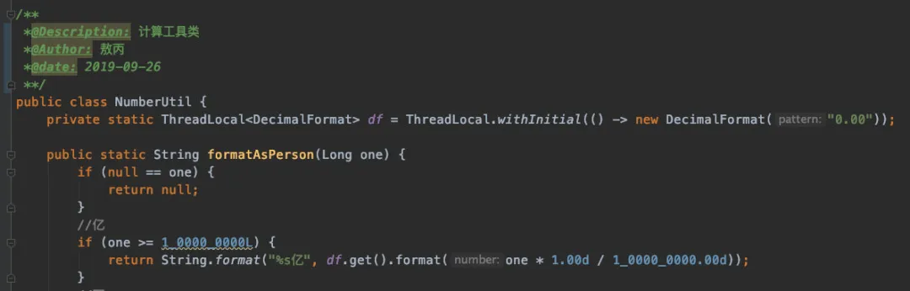
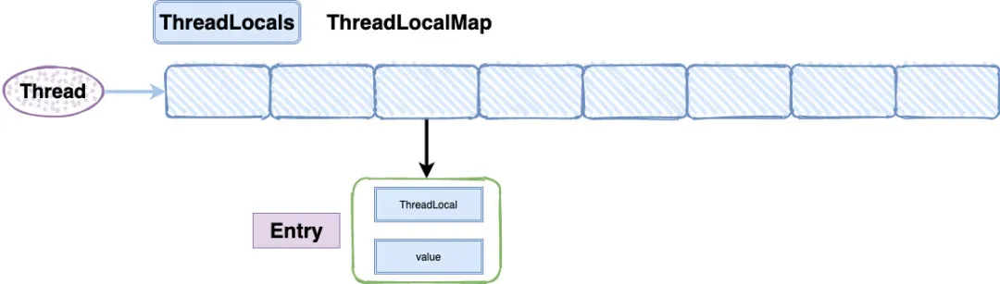
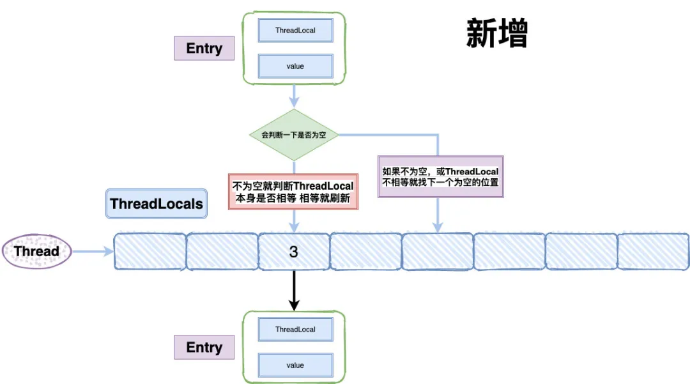
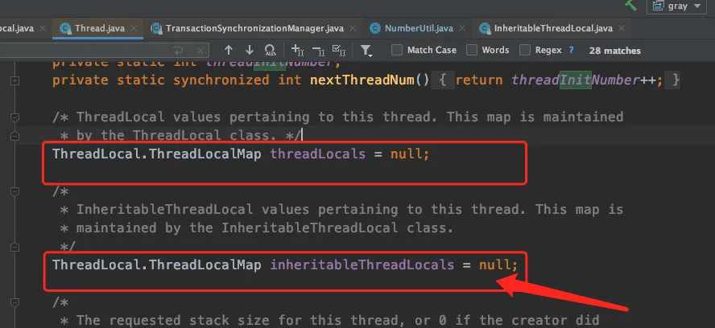
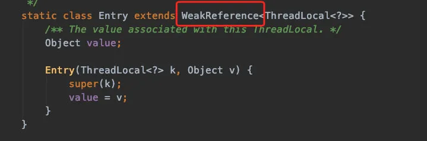
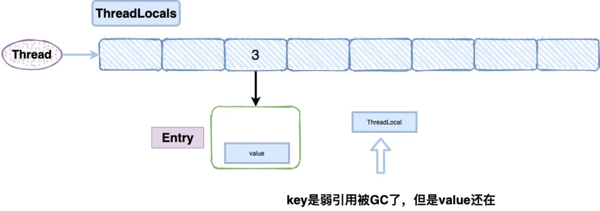

## Java面试必问：ThreadLocal终极篇 淦！

原创 三太子敖丙 [三太子敖丙](javascript:void(0);) *前天*

来自专辑

多线程


## 开场白

张三最近天气很热心情不是很好，所以他决定出去面试跟面试官聊聊天排解一下，结果刚投递简历就有人约了面试。

我丢，什么情况怎么刚投递出去就有人约我面试了？诶。。。真烦啊，哥已经不在江湖这么久了，江湖还是有哥的传说，我还是这么抢手的么？太烦恼了，帅无罪。


暗自窃喜的张三来到了某东现场面试的办公室，我丢，这面试官？不是吧，这满是划痕的Mac，这发量，难道就是传说中的架构师？


张三的心态一下子就崩了，出来第一场面试就遇到一个顶级面试官，这谁顶得住啊。

#### 你好，我是你的面试官Tony，看我的发型应该你能猜到我的身份了，我也话不说，我们直接开始好不好？看你简历写了多线程，来你跟我聊一下ThreadLocal吧，我很久没写代码不太熟悉了，你帮我回忆一下。

我丢？这TM是人话？这是什么逻辑啊，说是问多线程然后一上来就来个这么冷门的ThreadLocal？心态崩了呀，再说你TM自己忘了不知道下去看看书么，来我这里找答案是什么鬼啊...


尽管十分不情愿，但是张三还是高速运转他的小脑袋，回忆起了ThreadLocal的种种细节...

面试官说实话我在实际开发过程中用到ThreadLocal的地方不是很多，我在写这个文章的时候还刻意去把我电脑上几十个项目打开之后去全局搜索ThreadLocal发现除了系统源码的使用，很少在项目中用到，不过也还是有的。



ThreadLocal的作用主要是做数据隔离，填充的数据只属于当前线程，变量的数据对别的线程而言是相对隔离的，在多线程环境下，如何防止自己的变量被其它线程篡改。


### 你能跟我说说它隔离有什么用，会用在什么场景么？

这，我都说了我很少用了，还问我，难受了呀，哦哦哦，有了想起来了，事务隔离级别。

面试官你好，其实我第一时间想到的就是Spring实现事务隔离级别的源码，这还是当时我大学被女朋友甩了，一个人在图书馆哭泣的时候无意间发现的。


Spring采用Threadlocal的方式，来保证单个线程中的数据库操作使用的是同一个数据库连接，同时，采用这种方式可以使业务层使用事务时不需要感知并管理connection对象，通过传播级别，巧妙地管理多个事务配置之间的切换，挂起和恢复。

Spring框架里面就是用的ThreadLocal来实现这种隔离，主要是在`TransactionSynchronizationManager`这个类里面，代码如下所示:

```
private static final Log logger = LogFactory.getLog(TransactionSynchronizationManager.class);

 private static final ThreadLocal<Map<Object, Object>> resources =
   new NamedThreadLocal<>("Transactional resources");

 private static final ThreadLocal<Set<TransactionSynchronization>> synchronizations =
   new NamedThreadLocal<>("Transaction synchronizations");

 private static final ThreadLocal<String> currentTransactionName =
   new NamedThreadLocal<>("Current transaction name");

  ……
```

Spring的事务主要是ThreadLocal和AOP去做实现的，我这里提一下，大家知道每个线程自己的链接是靠ThreadLocal保存的就好了，继续的细节我会在Spring章节细说的，暖么？

#### 除了源码里面使用到ThreadLocal的场景，你自己有使用他的场景么？一般你会怎么用呢？

来了来了，加分项来了，这个我还真遇到过，装B的机会终于来了。


有的有的面试官，这个我会！！！

之前我们上线后发现部分用户的日期居然不对了，排查下来是`SimpleDataFormat`的锅，当时我们使用SimpleDataFormat的parse()方法，内部有一个Calendar对象，调用SimpleDataFormat的parse()方法会先调用Calendar.clear（），然后调用Calendar.add()，如果一个线程先调用了add()然后另一个线程又调用了clear()，这时候parse()方法解析的时间就不对了。

其实要解决这个问题很简单，让每个线程都new 一个自己的 `SimpleDataFormat`就好了，但是1000个线程难道new1000个`SimpleDataFormat`？

所以当时我们使用了线程池加上ThreadLocal包装`SimpleDataFormat`，再调用initialValue让每个线程有一个`SimpleDataFormat`的副本，从而解决了线程安全的问题，也提高了性能。


### 那……

还有还有，我还有，您别着急问下一个，让我再加点分，拖延一下面试时间。

我在项目中存在一个线程经常遇到横跨若干方法调用，需要传递的对象，也就是上下文（Context），它是一种状态，经常就是是用户身份、任务信息等，就会存在过渡传参的问题。

使用到类似责任链模式，给每个方法增加一个context参数非常麻烦，而且有些时候，如果调用链有无法修改源码的第三方库，对象参数就传不进去了，所以我使用到了ThreadLocal去做了一下改造，这样只需要在调用前在ThreadLocal中设置参数，其他地方get一下就好了。

```
before
  
void work(User user) {
    getInfo(user);
    checkInfo(user);
    setSomeThing(user);
    log(user);
}

then
  
void work(User user) {
try{
   threadLocalUser.set(user);
   // 他们内部  User u = threadLocalUser.get(); 就好了
    getInfo();
    checkInfo();
    setSomeThing();
    log();
    } finally {
     threadLocalUser.remove();
    }
}
```

我看了一下很多场景的cookie，session等数据隔离都是通过ThreadLocal去做实现的。

对了我面试官允许我再秀一下知识广度，在Android中，Looper类就是利用了ThreadLocal的特性，保证每个线程只存在一个Looper对象。

```
static final ThreadLocal<Looper> sThreadLocal = new ThreadLocal<Looper>();
private static void prepare(boolean quitAllowed) {
    if (sThreadLocal.get() != null) {
        throw new RuntimeException("Only one Looper may be created per thread");
    }
    sThreadLocal.set(new Looper(quitAllowed));
}
```

#### 面试官：我丢，这货怎么知道这么多场景？还把Android都扯了出来，不是吧阿sir，下面我要考考他原理了。

#### 嗯嗯，你回答得很好，那你能跟我说说他底层实现的原理么？

好的面试官，我先说一下他的使用：

```
ThreadLocal<String> localName = new ThreadLocal();
localName.set("张三");
String name = localName.get();
localName.remove();
```

其实使用真的很简单，线程进来之后初始化一个可以泛型的ThreadLocal对象，之后这个线程只要在remove之前去get，都能拿到之前set的值，注意这里我说的是remove之前。

他是能做到线程间数据隔离的，所以别的线程使用get（）方法是没办法拿到其他线程的值的，但是有办法可以做到，我后面会说。

我们先看看他set的源码：

```
public void set(T value) {
    Thread t = Thread.currentThread();// 获取当前线程
    ThreadLocalMap map = getMap(t);// 获取ThreadLocalMap对象
    if (map != null) // 校验对象是否为空
        map.set(this, value); // 不为空set
    else
        createMap(t, value); // 为空创建一个map对象
}
```

大家可以发现set的源码很简单，主要就是ThreadLocalMap我们需要关注一下，而ThreadLocalMap呢是当前线程Thread一个叫threadLocals的变量中获取的。

```
ThreadLocalMap getMap(Thread t) {
        return t.threadLocals;
    }
public class Thread implements Runnable {
      ……

    /* ThreadLocal values pertaining to this thread. This map is maintained
     * by the ThreadLocal class. */
    ThreadLocal.ThreadLocalMap threadLocals = null;

    /*
     * InheritableThreadLocal values pertaining to this thread. This map is
     * maintained by the InheritableThreadLocal class.
     */
    ThreadLocal.ThreadLocalMap inheritableThreadLocals = null;
  
     ……
```

这里我们基本上可以找到ThreadLocal数据隔离的真相了，每个线程Thread都维护了自己的threadLocals变量，所以在每个线程创建ThreadLocal的时候，实际上数据是存在自己线程Thread的threadLocals变量里面的，别人没办法拿到，从而实现了隔离。

### ThreadLocalMap底层结构是怎么样子的呢？

面试官这个问题问得好啊，内心暗骂，让我歇一会不行么？

张三笑着回答道，既然有个Map那他的数据结构其实是很像HashMap的，但是看源码可以发现，它并未实现Map接口，而且他的Entry是继承WeakReference（弱引用）的，也没有看到HashMap中的next，所以不存在链表了。

```
static class ThreadLocalMap {

        static class Entry extends WeakReference<ThreadLocal<?>> {
            /** The value associated with this ThreadLocal. */
            Object value;

            Entry(ThreadLocal<?> k, Object v) {
                super(k);
                value = v;
            }
        }
        ……
    }    
```

结构大概长这样：



### 稍等，我有两个疑问你可以解答一下么？

好呀，面试官你说。

### 为什么需要数组呢？没有了链表怎么解决Hash冲突呢？

用数组是因为，我们开发过程中可以一个线程可以有多个TreadLocal来存放不同类型的对象的，但是他们都将放到你当前线程的ThreadLocalMap里，所以肯定要数组来存。

至于Hash冲突，我们先看一下源码：

```
private void set(ThreadLocal<?> key, Object value) {
           Entry[] tab = table;
            int len = tab.length;
            int i = key.threadLocalHashCode & (len-1);
            for (Entry e = tab[i];
                 e != null;
                 e = tab[i = nextIndex(i, len)]) {
                ThreadLocal<?> k = e.get();

                if (k == key) {
                    e.value = value;
                    return;
                }
                if (k == null) {
                    replaceStaleEntry(key, value, i);
                    return;
                }
            }
            tab[i] = new Entry(key, value);
            int sz = ++size;
            if (!cleanSomeSlots(i, sz) && sz >= threshold)
                rehash();
        }
```

我从源码里面看到ThreadLocalMap在存储的时候会给每一个ThreadLocal对象一个threadLocalHashCode，在插入过程中，根据ThreadLocal对象的hash值，定位到table中的位置i，**int i = key.threadLocalHashCode & (len-1)**。

然后会判断一下：如果当前位置是空的，就初始化一个Entry对象放在位置i上；

```
if (k == null) {
    replaceStaleEntry(key, value, i);
    return;
}
```

如果位置i不为空，如果这个Entry对象的key正好是即将设置的key，那么就刷新Entry中的value；

```
if (k == key) {
    e.value = value;
    return;
}
```

如果位置i的不为空，而且key不等于entry，那就找下一个空位置，直到为空为止。



这样的话，在get的时候，也会根据ThreadLocal对象的hash值，定位到table中的位置，然后判断该位置Entry对象中的key是否和get的key一致，如果不一致，就判断下一个位置，set和get如果冲突严重的话，效率还是很低的。

以下是get的源码，是不是就感觉很好懂了：

```
 private Entry getEntry(ThreadLocal<?> key) {
            int i = key.threadLocalHashCode & (table.length - 1);
            Entry e = table[i];
            if (e != null && e.get() == key)
                return e;
            else
                return getEntryAfterMiss(key, i, e);
        }

 private Entry getEntryAfterMiss(ThreadLocal<?> key, int i, Entry e) {
            Entry[] tab = table;
            int len = tab.length;
// get的时候一样是根据ThreadLocal获取到table的i值，然后查找数据拿到后会对比key是否相等  if (e != null && e.get() == key)。
            while (e != null) {
                ThreadLocal<?> k = e.get();
              // 相等就直接返回，不相等就继续查找，找到相等位置。
                if (k == key)
                    return e;
                if (k == null)
                    expungeStaleEntry(i);
                else
                    i = nextIndex(i, len);
                e = tab[i];
            }
            return null;
        }
```

### 能跟我说一下对象存放在哪里么？

在Java中，栈内存归属于单个线程，每个线程都会有一个栈内存，其存储的变量只能在其所属线程中可见，即栈内存可以理解成线程的私有内存，而堆内存中的对象对所有线程可见，堆内存中的对象可以被所有线程访问。

### 那么是不是说ThreadLocal的实例以及其值存放在栈上呢？

其实不是的，因为ThreadLocal实例实际上也是被其创建的类持有（更顶端应该是被线程持有），而ThreadLocal的值其实也是被线程实例持有，它们都是位于堆上，只是通过一些技巧将可见性修改成了线程可见。

### 如果我想共享线程的ThreadLocal数据怎么办？

使用`InheritableThreadLocal`可以实现多个线程访问ThreadLocal的值，我们在主线程中创建一个`InheritableThreadLocal`的实例，然后在子线程中得到这个`InheritableThreadLocal`实例设置的值。

```
private void test() {    
final ThreadLocal threadLocal = new InheritableThreadLocal();       
threadLocal.set("帅得一匹");    
Thread t = new Thread() {        
    @Override        
    public void run() {            
      super.run();            
      Log.i( "张三帅么 =" + threadLocal.get());        
    }    
  };          
  t.start(); 
} 
```

在子线程中我是能够正常输出那一行日志的，这也是我之前面试视频提到过的父子线程数据传递的问题。

### 怎么传递的呀？

传递的逻辑很简单，我在开头Thread代码提到threadLocals的时候，你们再往下看看我刻意放了另外一个变量：



Thread源码中，我们看看Thread.init初始化创建的时候做了什么：

```
public class Thread implements Runnable {
  ……
   if (inheritThreadLocals && parent.inheritableThreadLocals != null)
      this.inheritableThreadLocals=ThreadLocal.createInheritedMap(parent.inheritableThreadLocals);
  ……
}
```

我就截取了部分代码，如果线程的`inheritThreadLocals`变量不为空，比如我们上面的例子，而且父线程的`inheritThreadLocals`也存在，那么我就把父线程的`inheritThreadLocals`给当前线程的`inheritThreadLocals`。

是不是很有意思？


#### 小伙子你懂的确实很多，那你算是一个深度的ThreadLocal用户了，你发现ThreadLocal的问题了么？

你是说内存泄露么？

#### 我丢，这小子为啥知道我要问什么？嗯嗯对的，你说一下。

这个问题确实会存在的，我跟大家说一下为什么，还记得我上面的代码么？



ThreadLocal在保存的时候会把自己当做Key存在ThreadLocalMap中，正常情况应该是key和value都应该被外界强引用才对，但是现在key被设计成WeakReference弱引用了。



我先给大家介绍一下弱引用：

> 只具有弱引用的对象拥有更短暂的生命周期，在垃圾回收器线程扫描它所管辖的内存区域的过程中，一旦发现了只具有弱引用的对象，不管当前内存空间足够与否，都会回收它的内存。
>
> 不过，由于垃圾回收器是一个优先级很低的线程，因此不一定会很快发现那些只具有弱引用的对象。

这就导致了一个问题，ThreadLocal在没有外部强引用时，发生GC时会被回收，如果创建ThreadLocal的线程一直持续运行，那么这个Entry对象中的value就有可能一直得不到回收，发生内存泄露。

就比如线程池里面的线程，线程都是复用的，那么之前的线程实例处理完之后，出于复用的目的线程依然存活，所以，ThreadLocal设定的value值被持有，导致内存泄露。

按照道理一个线程使用完，ThreadLocalMap是应该要被清空的，但是现在线程被复用了。

### 那怎么解决？

在代码的最后使用remove就好了，我们只要记得在使用的最后用remove把值清空就好了。

```
ThreadLocal<String> localName = new ThreadLocal();
try {
    localName.set("张三");
    ……
} finally {
    localName.remove();
}
```

remove的源码很简单，找到对应的值全部置空，这样在垃圾回收器回收的时候，会自动把他们回收掉。

### 那为什么ThreadLocalMap的key要设计成弱引用？

key不设置成弱引用的话就会造成和entry中value一样内存泄漏的场景。

补充一点：ThreadLocal的不足，我觉得可以通过看看netty的fastThreadLocal来弥补，大家有兴趣可以康康。

#### 好了，你不仅把我问的都回答了，我不知道的你甚至都说了，ThreadLocal你过关了，不过JUC的面试才刚刚开始，希望你以后越战越勇，最后拿个好offer哟。

什么鬼，突然这么煽情，不是很为难我的么?难道是为了锻炼我？难为大师这样为我着想，我还一直心里暗骂他，不说了回去好好学了。

## 总结

其实ThreadLocal用法很简单，里面的方法就那几个，算上注释源码都没多少行，我用了十多分钟就过了一遍了，但是在我深挖每一个方法背后逻辑的时候，也让我不得不感慨Josh Bloch 和 Doug Lea的厉害之处。

在细节设计的处理其实往往就是我们和大神的区别，我认为很多不合理的点，在Google和自己不断深入了解之后才发现这才是合理，真的不服不行。

ThreadLocal是多线程里面比较冷门的一个类，使用频率比不上别的方法和类，但是通过我这篇文章，不知道你是否有新的认知呢？


作者：执墨人
链接：https://zhuanlan.zhihu.com/p/158684233
来源：知乎
著作权归作者所有。商业转载请联系作者获得授权，非商业转载请注明出处。


前面讲过的东西，算啦再给你们复习一波。

`JDK`中存在四种类型引用，默认是强引用，也就是我们经常干的事情。疯狂`new,new,new`。这个时候创建的对象都是强引用。

- 强引用。直接`new`
- 软引用。通过`SoftReference`创建，在内存空间不足的时候直接销毁，即它可能最后的销毁地点是在老年区
- 弱引用。通过`WeakReference`创建，在`GC`的时候直接销毁。即其销毁地点必定为伊甸区
- 虚引用。通过`PhantomReference`创建，它和不存也一样，**「非常虚，只能通过引用队列在进行一些操作，主要用于堆外内存回收」**

好了，回到正题，上面的引用里最适合我们当前的场景的就是弱引用了，**「为什么这个样子说：」**

在以往我们使用完对象以后等着`GC`清理，但是对于`ThreadLocal`来说，即使我们使用结束，也会因为线程本身存在该对象的引用，处于对象可达状态，垃圾回收器无法回收。这个时候当`ThreadLocal`太多的时候就会出现内存泄漏的问题。

而我们将`ThreadLocal`对象的引用作为弱引用，那么就很好的解决了这个问题。当我们自己使用完`ThreadLocal`以后，**「当`GC`的时候就会将我们创建的强引用直接干掉，而这个时候我们完全可以将线程`Map`中的引用干掉，于是使用了弱引用，这个时候大家应该懂了为啥不使用软引用了吧」**

**「还有一个问题：为什么会引发内存泄漏呢？」**

了解`Map`结构的兄弟们应该清楚，内部实际就一个节点数组，对于`ThreadLocalMap`而言，内部是一个`Entity`，它将`Key`作为弱引用，`Value`还是强引用。如果我们在使用完`ThreadLocal`以后，没有对`Entity`进行移除，会引发内存泄漏问题。

`ThreadLocalMap`提供了一个方法`expungeStaleEntry`方法用来排除无效的`Entity`（`Key`为空的实体）

**「说到这里，有一个问题我思考了蛮久的，value为啥不搞成弱引用，用完直接扔了多好」**

最后思考出来得答案(按照源码推了一下)：

**「不设置为弱引用，是因为不清楚这个`Value`除了`map`的引用还是否还存在其他引用，如果不存在其他引用，当`GC`的时候就会直接将这个Value干掉了，而此时我们的`ThreadLocal`还处于使用期间，就会造成Value为null的错误，所以将其设置为强引用。」**

而为了解决这个强引用的问题，它提供了一种机制就是上面我们说的将`Key`为`Null`的`Entity`直接清除

**「到这里，这个类的设计已经很清楚了。接下来我们看一下源码吧！」**