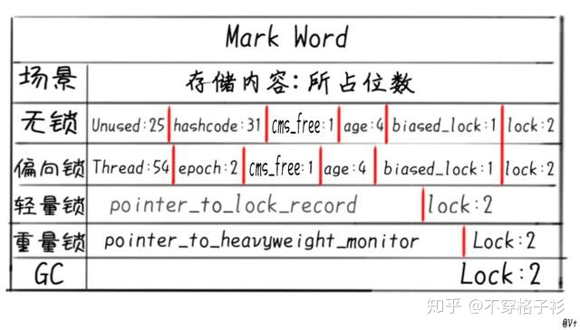

“**synchronized**的锁标志存哪了？”

“对象多大岁数呀对象的分代年龄在哪看”

## 对象头(Object header)

知乎大佬 称之为''对象名片"，主要包含了对象的基本信息，比如

- 布局
- GC状态
- 类型
- 同步状态
- （identity） hashCode 哈希码
- 数据长度（前提你是数组）

其中 identity hash code 是指不经重写由JVM计算的hashcode.


整个对象头由两部分组成

-  类型指针  **klass pionter** 
- Mark Word （存储自身的对象的运行时数据）

- 数据长度（前提你是数组）

**环境：jdk1.8 64位环境**


### **klass pointer**


klass pointer一般占32个bit即4个字节，如果你有足够的原因关闭默认的指针压缩，即启动参数加上了-XX:-UseCompressedOops那么它就占64个bit.


compress 	压缩

compact	   紧凑的


klass pointer的存储内容是一个指针，指向了其**类元数据**的信息，jvm使用该指针来确定此对象是**类的哪个实例.**


### **Mark Word**

关于mark word对于java程序员是比较重要的一块知识点，开局一张图：



表格中的“场景”，你也可以理解为“状态”，一个对象在一个时间点是处于一种状态的，但是状态之间**可能会切换**.

>  根据作者的意思是： 5种状态任选其一；

你使用的对象就存储在当前的表格之中，**其中“一行”的状态**。

Mark Word在64位虚拟机下，也就是占用64位大小即8个字节的空间.

内具体容包括：

- unused：未使用的
- hashcode：上文提到的**identity** hash code，本文出现的hashcode都是指identity hash code
- thread: 偏向锁记录的线程标识
- epoch: 验证偏向锁有效性的时间戳
- age：分代年龄
- biased_lock 偏向锁标志
- lock 锁标志
- pointer_to_lock_record 轻量锁lock record指针
- pointer_to_heavyweight_monitor 重量锁monitor指针


**“mark word对于java程序员是比较重要的一块知识点”，相信你也知道原因了. 这部分和程序关系很大，比如：**


为什么晋升到老年代的年龄设置(XX:MaxTenuringThreshold)不能超过**15** ？

因为就给了age**四个bit**空间，最大就是**1111**(二进制)也就是**15**，多了没地方存.

为什么你的**synchronized**锁住的对象，没有“传说中的”偏向锁优化？

因为hashcode并不是对象实例化完就计算好的，是调用计算出来放在mark word里的。

你调用过hashcode方法(或者隐式调用：存到hashset里，map的key，调用了默认未经重写的toString()方法等等)，把“坑位”占了，偏向锁想存的线程id没地方存了，自然就直接是**轻量级锁**了.

(或者你只是单纯的测试的时候忘了加-XX:BiasedLockingStartupDelay=0了)

**看起来设计的有点不合理但又透着合理，底层的设计就是这么朴实无华，且枯燥。**

本文重点是介绍“对象头”，所以不会重点介绍锁，就如刚才说的“调用过hashcode再同步发现是轻量锁”，其实还有很多种情况, 比如: 在**synchronized**块内调用的hashcode计算方法，就算有了偏向锁也会被撤销，膨胀为重量级锁。如果有缘，你可能在未来能看到笔者单独描述锁的文章.


## 实践

实践出真知，工欲善其事必先利其器，工具使用**jol**工具即可，openjdk提供的分析对象大小，布局等信息的工具.

本文使用最简单的maven引入工程的方式进行测试. 你也可以选择命令行的方式，两种使用方式都在上方jol的链接中有介绍.

引入jol之后，我们开始打印对象布局试试.

数组对象布局

```text
public static void main(String[] args) {
        // 声明一枚长度为3306的数组
        int[] intArr = new int[3306];
        // 使用jol的ClassLayout工具分析对象布局
        System.out.println(ClassLayout.parseInstance(intArr).toPrintable());
    }
    
print:
------------------------------------------------------
[I object internals:
 OFFSET  SIZE   TYPE DESCRIPTION                               VALUE
      0     4        (object header)                           01 00 00 00 (00000001 00000000 00000000 00000000) (1)
      4     4        (object header)                           00 00 00 00 (00000000 00000000 00000000 00000000) (0)
      8     4        (object header)                           6d 01 00 f8 (01101101 00000001 00000000 11111000) (-134217363)
     12     4        (object header)                           ea 0c 00 00 (11101010 00001100 00000000 00000000) (3306)
     16 13224    int [I.<elements>                             N/A
Instance size: 13240 bytes
Space losses: 0 bytes internal + 0 bytes external = 0 bytes total
```

如果你是第一次看jol打印的布局图，可以直接看笔者标注好的下图：


对象头的三个部分，分别印证了上文提到的klass pointer和Mark Word，以及数组独有的长度属性.

右侧分别用了三种进制展示了“每一行”的value, 呼应上文：

**没有调用过原始的hashcode方法(包括System.identityHashCode方法)， 那么hashcode位置都是0.**

由图可得出结论，对象在刚实例化好的时候，非常“干净”，乍眼看去两排**0**，但是只有一个**1**显得十分突兀.

其实它是**001**，为上文提到的**偏向锁标志+锁标志**，所有锁的状态如下：


这回就清晰了，虽然有一个**1**，但其实是无锁的状态.

回到布局图，因为是数组对象，所以在第四行保存了**数组长度**，非数组对象自然是没有的.

对象大小的计算，也是非常精准的, 即：**13224**(一个int为四个字节乘3306) + 16 = 13240个字节.

## 自己实践的提示

看到对象布局设计的如此朴实无华，你也可以动手实践一下.

笔者也附上几个小提醒：

- 上文提到的，hashcode对偏向锁和重量锁的影响
- 上文提到的-XX:BiasedLockingStartupDelay参数对偏向锁测试的影响
- 注意测试机器的**大小端**对结果顺序的影响，一般大家的机器都是小端，所以value的**打印顺序**是和上文Markword开局那张图描述的字段顺序相反.

不注意这几点，你可能打印完一脸茫然，不知道哪些bit对应哪些字段，甚至和自己的预想结果不一样.