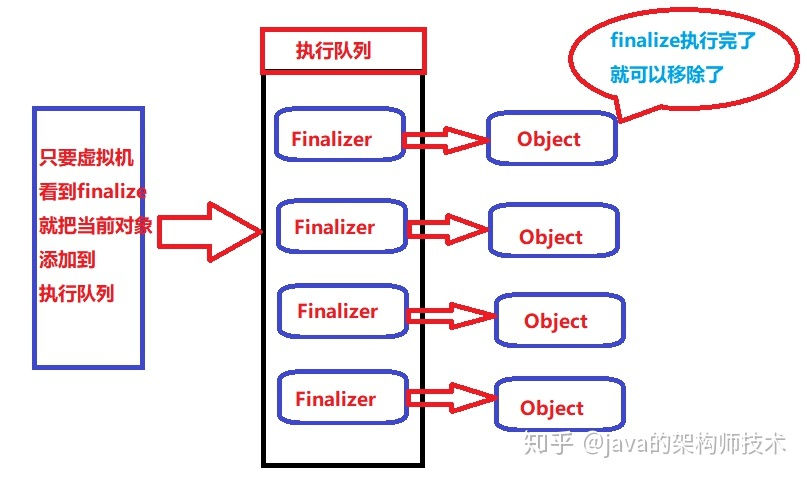

# Java中finalize()方法何时被使用？

资料整理自：知乎大佬  [java的架构师技术](https://www.zhihu.com/people/feng-dong-dong-10)    [lastwhisper](https://www.zhihu.com/people/pdsurjxy)  的回答；

## 1.finalize简介

###  调用时机：

对象在进行可达性分析后发现没有与GC Roots 相连接的引用链，同时子类覆盖了finalize方法，并且该finalize方法并没有被JVM调用过时，finalize方法才会被调用。 

 **子类覆盖finalize方法来处理系统资源、执行其他清理或者对象自救**。 

## 2.finalize运行机制

1.对象可以在被gc时候自救，但是自救的机会一个；

```java
package org.language;
public class Finalization2 {
    public static Finalization2 SAVE_HOOK = null;

    @Override
    protected void finalize() throws InterruptedException {
        Thread.sleep(500);
        System.out.println("第一个文件资源关闭。。。");
        Thread.sleep(500);
        System.out.println("第二个文件资源关闭。。。");
        Thread.sleep(500);
        System.out.println("第三个文件资源关闭。。。");
        Thread.sleep(500);
        System.out.println("第四个文件资源关闭。。。");
    }

    public static void main(String[] args) throws Exception {
        SAVE_HOOK = new Finalization2();
        System.out.println("SAVE_HOOK打开了四个文件,并且进行操作");
        SAVE_HOOK = null;
        System.out.println("利用finalize特性,将SAVE_HOOK=null,关闭四个文件资源");
        System.gc();
        Thread.sleep(2000);//处理别的业务
    }
}
```

执行结果：

```out
处理系统资源、执行其他清理或者对象自救
SAVE_HOOK对象还活着
SAVE_HOOK对象已经被回收
```

可以看到在第一次执行**System.\*gc\*()**时，SAVE_HOOK==null*，*触发了***SAVE_HOOK.\*finalize()**，第二次执行**System.\*gc\*()**时，finalize方法只能执行一次，SAVE_HOOK对象直接就被回收了。

所以理论上是可以使用**finalize方法来处理系统资源、执行其他清理或者对象自救**。

但是实际上由于finalize方法是用户自己编写的，所以JVM并不会承诺等待它运行结束。

比如下面这段代码，使用finalize方法处理文件资源的关闭。

```
public class Finalization2 {
    public static Finalization2 SAVE_HOOK = null;

    @Override
    protected void finalize() throws InterruptedException {
        Thread.sleep(500);
        System.out.println("第一个文件资源关闭。。。");
        Thread.sleep(500);
        System.out.println("第二个文件资源关闭。。。");
        Thread.sleep(500);
        System.out.println("第三个文件资源关闭。。。");
        Thread.sleep(500);
        System.out.println("第四个文件资源关闭。。。");
    }

    public static void main(String[] args) throws Exception {
        SAVE_HOOK = new Finalization2();
        System.out.println("SAVE_HOOK打开了四个文件,并且进行操作");
        SAVE_HOOK = null;
        System.out.println("利用finalize特性,将SAVE_HOOK=null,关闭四个文件资源");
        System.gc();
        Thread.sleep(2000);//处理别的业务
    }
}
```

执行结果

```text
SAVE_HOOK打开了四个文件,并且进行操作
利用finalize特性,将SAVE_HOOK=null,关闭四个文件资源
第一个文件资源关闭。。。
第二个文件资源关闭。。。
第三个文件资源关闭。。。
```

我们在主线程处理业务花费2000ms，finalize方法关闭四个文件资源也需要2000ms，但是，只关闭了三个文件资源。

因为如果这个对象被判定为有必要执行finalize()方法，那么这个对象将会放置在一个叫做F-Queue的队列之中，并在稍后由一个由虚拟机自动建立的、低优先级的**Finalizer**线程去执行它。**这里所谓的“执行”是指虚拟机会触发这个方法，但并不承诺会等待它运行结束，这样做的原因是如果一个对象在finalize()方法中执行缓慢，或者发生了死循环（更极端的情况），将很可能会导致F-Queue队列中其他对象永久处于等待，甚至导致整个内存回收系统崩溃。**

所以通过finalize方法进行处理系统资源、执行其他清理是不可靠的。至于对象自救我个人感觉这个功能很鸡肋。并且该方法在JDK8以上已经被弃用。

## 3 finalize()方法影响

 一个对象如果没有了任何引用，java虚拟机就会对其进行垃圾回收，但是如果这个对象包含了finalize函数 就会不一样了；

java虚拟机在进行垃圾回收的时候，一看到这个对象类含有finalize函数，就把这个函数交给FinalizerThread处理，而包含了这个finalize的对象就会被添加到FinalizerThread的执行队列，并使用一个链表，把这些包含了finalize的对象串起来。

  

 finalize的原理简要的梳理一下： 

（1）对象在初始化的过程中会判断是否重写了finalize，方法是判断两个字段标志has_finalizer_flag和RegisterFinalizersAtInit。

（2）如果重写了finalize，那就把当前对象注册到FinalizerThread的ReferenceQueue队列中。注册之后的对象就叫做Finalizer。方法是调用register_finalizer函数。此时java虚拟机一看当前有这个对象的引用，于是就不进行垃圾回收了。

（3）对象开始被调用，FinalizerThread线程负责从ReferenceQueue队列中获取Finalizer对象。开始执行finalize方法，在执行之前，这个对象一直在堆中。

（4）对象执行完毕之后，将这个Finalizer对象从队列中移除，java虚拟机一看对象没有引用了，就进行垃圾回收了。

finalize方法对垃圾回收影响，主要影响在第三步，包含有finalize方法的对象进入队列，但是一直没有调用finalize方法，会一直占据堆内存。

案例说明：

```java
public class FinalizerTest1 {
    public static class Fdd {
        //分配1M
        private byte[] content = new byte[1024*1024];
        @Override
        protected void finalize() {
            System.out.println("finalize被执行");
        }
    }
    public static void main(String[] args) {
        for (int i = 0; i < 10000; i++) {
            Fdd fdd = new Fdd();
            System.out.println(i);
        }
    }
}
```

 现在创建了类，设置一下参数。 

```properties
# 最大堆内存
-Xmx5m 
# 最小堆内存
-Xms5m  
# 堆内存溢出错误打印
-XX:+HeapDumpOnOutOfMemoryError 
# 把堆相关信息保存在下列路径
-XX:HeapDumpPath=F:/a.dump
```

 删除 或 注释 finalze方法：数字改成10000，或者死循环理论上都没有任何问题；

在main方法中，创建了1000...个Fdd对象，如果不执行finalize方法，那么直接进行垃圾回收，此时不断我们创建多少个，都不会出现任何问题。 

但是不注释finalize方法，

```output
0
1
2
java.lang.OutOfMemoryError: Java heap space
finalize被执行
finalize被执行
finalize被执行
Dumping heap to F:/a.dump ...
Unable to create F:/a.dump: File exists
Exception in thread "main" java.lang.OutOfMemoryError: Java heap space
	at org.language.FinalizerTest1$Fdd.<init>(FinalizerTest1.java:6)
	at org.language.FinalizerTest1.main(FinalizerTest1.java:14)
```

