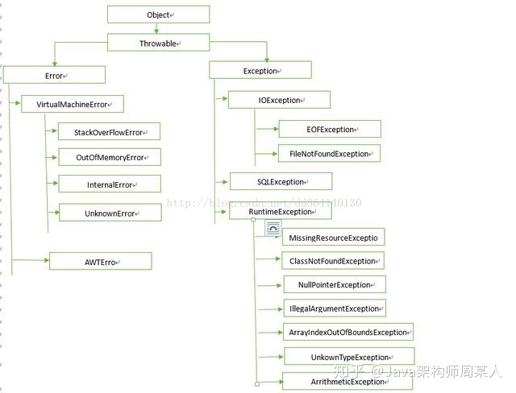
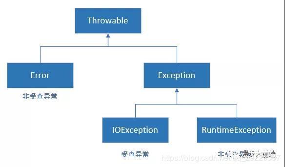

# Java中的异常(Error与Exception)

整理自网络：CSDN+知乎

## 一、 异常机制的概述

​      异常机制是指当程序出现错误后，程序如何处理。具体来说，异常机制提供了程序退出的安全通道。当出现错误后，程序执行的流程发生改变，程序的控制权转移到异常处理器。

程序错误分为三种：1.编译错误；2.运行时错误；3.逻辑错误。
  （1）编译错误是因为程序没有遵循语法规则，编译程序能够自己发现并且提示我们错误的原因和位置，这个也是大家在刚接触编程语言最常遇到的问题。
  （2）运行时错误是因为程序在执行时，运行环境发现了不能执行的操作。
  （3）逻辑错误是因为程序没有按照预期的逻辑顺序执行。异常也就是指程序运行时发生错误，而异常处理就是对这些错误进行处理和控制。

## 二、 异常的结构    

​       在 Java 中，所有的异常都有一个共同的祖先 Throwable（可抛出）。Throwable 指定代码中可用异常传播机制通过 Java 应用程序传输的任何问题的共性。（抛出错误与异常）

  

##  

  

### 2.1 Throwable： 

   Throwable： 有两个重要的子类：Exception（异常）和 Error（错误），二者都是 Java 异常处理的重要子类，各自都包含大量子类。异常和错误的区别是：异常能被程序本身可以处理，错误是无法处理。
  Trowable类中常用方法如下：

```java
返回异常发生时的详细信息
public string getMessage();

返回异常发生时的简要描述
public string toString();

返回异常对象的本地化信息。使用Throwable的子类覆盖这个方法，可以声称本地化信息。如果子类没有覆盖该方法，则该方法返回的信息与getMessage（）返回的结果相同
public string getLocalizedMessage();

发生异常时，跟踪堆栈信息并输出。
public void printStackTrace();
```

### 2.2   Error（错误）

 **Error（错误）**:**是程序无法处理的错误**，表示运行应用程序中较严重问题。大多数错误与代码编写者执行的操作无关，而**表示代码运行时 JVM（Java 虚拟机）**出现的问题。

例如，**Java虚拟机运行错误**（**Virtual MachineError**）；

当 **JVM 不再有继续执行操作所需的内存资源**时，将出现 **OutOfMemoryError**.

此类错误发生时，Java虚拟机（JVM) 将终止线程。这些错误是不可查的，非代码性错误。因此，当此类错误发生时，应用不应该去处理此类错误。 

这些错误表示故障发生于虚拟机自身、或者发生在虚拟机试图执行应用时，如Java虚拟机运行错误（Virtual MachineError）、类定义错误（NoClassDefFoundError）等。

###  2.3 Exception（异常）

Exception（异常）:是程序本身可以处理的异常。Exception 类有一个重要的子类 RuntimeException。RuntimeException 类及其子类表示“JVM 常用操作”引发的错误。

Exception（异常）分两大类：**运行时异常**和**非运行时异常(编译异常)**。 是程序本身**可以捕获**并且**可以处理的异常**。 

1.  **运行时异常RuntimeException**：都是RuntimeException类及其子类异常，如NullPointerException(空指针异常)、IndexOutOfBoundsException(下标越界异常)等；这些异常是不检查异常，程序中可以选择捕获处理，也可以不处理。这些异常一般是由程序逻辑错误引起的，**程序应该从逻辑角度尽可能避免这类异常的发生**。运行时异常的特点是**Java编译器不会检查它**，也就是说，当程序中可能出现这类异常，即**使没有用try-catch语句捕获它，也没有用throws子句声明抛出它，也会编译通过。**
2. **非运行时异常 （编译异常）**：是RuntimeException以外的异常，类型上都属于Exception类及其子类。**从程序语法角度**讲是必须进行处理的异常，如果不处理，程序就不能编译通过。如IOException、SQLException等以及用户自定义的Exception异常，一般情况下不自定义检查异常。


通常，Java的异常（Throwable）分为**可查的异常（checked exceptions）**和**不可查的异常（unchecked exceptions**）。

  

 1. **可查异常**（编译器要求必须处置的异常）： 编译器要求必须处理的异常。正确的程序在运行过程中，经常容易出现的、符合预期的异常情况。一旦发生此类异常，就必须采用某种方式进行处理。 

    ​      除了Exception中的**RuntimeException**及**RuntimeException的子类**以外，其他的Exception类及其子类(例如：IOException和ClassNotFoundException)都属于可查异常。这种异常的特点是，当编译器检查到程序中可能出现这类异常，要么用try-catch语句捕获它，要么用throws子句声明抛出它，否则编译不会通过。

  2. **不可查异常**(编译器不要求强制处置的异常):包括**运行时异常（RuntimeException与其子类**）和**错误（Error**）。RuntimeException表示编译器不会检查程序是否对RuntimeException作了处理，在程序中不必捕获RuntimException类型的异常，也不必在方法体声明抛出RuntimeException类。

     ​     RuntimeException发生的时候，表示程序中出现了编程错误，所以应该找出错误修改程序，而不是去捕获RuntimeException。

## 三、 异常处理的机制

在 Java 应用程序中，异常处理机制为：抛出异常，捕捉异常。

   1. 抛出异常：当一个方法出现错误引发异常时，方法创建异常对象并交付运行时系统，异常对象中包含了异常类型和异常出现时的程序状态等异常信息。运行时系统负责寻找处置异常的代码并执行。详细信息请查看《简述throw-throws异常抛出》。

         

   2.  捕获异常：在方法抛出异常之后，运行时系统将转为寻找合适的异常处理器（exception handler）。潜在的异常处理器是异常发生时依次存留在调用栈中的方法的集合。当异常处理器所能处理的异常类型与方法抛出的异常类型相符时，即为合适 的异常处理器。运行时系统从发生异常的方法开始，依次回查调用栈中的方法，直至找到含有合适异常处理器的方法并执行。当运行时系统遍历调用栈而未找到合适 的异常处理器，则运行时系统终止。同时，意味着Java程序的终止。详细信息请查看《Java：简述try-catch-finally异常捕获》。


 ## 四、Java常见异常

###   4. 1 RuntimeException子类:    

序号	异常名称	异常描述
1	java.lang.ArrayIndexOutOfBoundsException	数组索引越界异常。当对数组的索引值为负数或大于等于数组大小时抛出。
2	java.lang.ArithmeticException 	算术条件异常。譬如：整数除零等。
3	java.lang.SecurityException 	安全性异常
4	java.lang.IllegalArgumentException	非法参数异常
5	java.lang.ArrayStoreException 	数组中包含不兼容的值抛出的异常 
6	java.lang.NegativeArraySizeException	数组长度为负异常 
7	java.lang.NullPointerException	空指针异常。当应用试图在要求使用对象的地方使用了null时，抛出该异常。譬如：调用null对象的实例方法、访问null对象的属性、计算null对象的长度、使用throw语句抛出null等等。

###  4.2   IOException

序号	异常名称	异常描述
1	IOException	操作输入流和输出流时可能出现的异常
2	EOFException	文件已结束异常
3	FileNotFoundException	文件未找到异常

### 4.3 其他   

序号	异常名称	异常描述
1	ClassCastException	类型转换异常类
2	ArrayStoreException	数组中包含不兼容的值抛出的异常
3	SQLException	操作数据库异常类
4	NoSuchFieldException	字段未找到异常
5	NoSuchMethodException	方法未找到抛出的异常
6	NumberFormatException	字符串转换为数字抛出的异常
7	StringIndexOutOfBoundsException	字符串索引超出范围抛出的异常
8	IllegalAccessException	不允许访问某类异常
9	InstantiationException	当应用程序试图使用Class类中的newInstance()方法创建 一个类的实例，而指定的类对象无法被实例化时，抛出该异常

10	java.lang.ClassNotFoundException	找不到类异常。当应用试图根据字符串形式的类名构造类，而在遍历CLASSPAH之后找不到对应名称的class文件时，抛出该异常。

## 五、相关的问题

> 1.为什么要创建自己的异常？
> 答：当Java内置的异常都不能明确的说明异常情况的时候，需要创建自己的异常
>
> 2.应该在声明方法抛出异常，还是在方法中捕获异常？
> 答：捕捉并处理知道如何处理的异常，而抛出不知道如何处理的异常。(star):+1:


