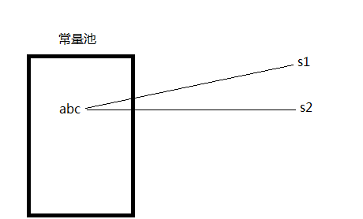
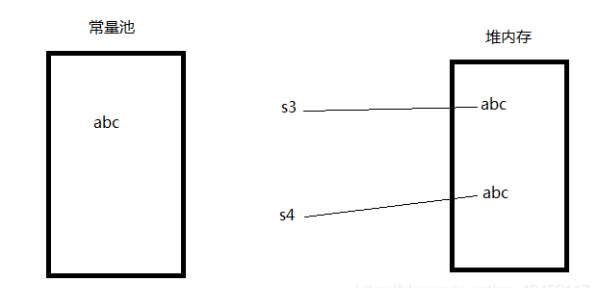
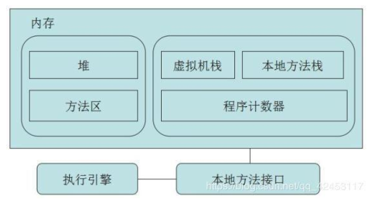
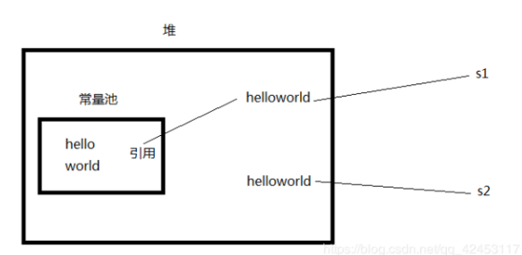
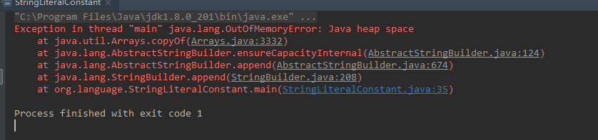

# Java 源码中的字符串常量的理解

资料整理自CSDN:

## java中String类的实现：

```java
/*The value is used for character storage. */
private final char value[];
```

## 字符串在内存中保存：

在内存中有一个区域叫做常量池，而当我们以这样的方式去创建字符串：

```java
String s1 = "abc";
String s2 = "abc";
```

这个字符串就一定会被保存到常量池中。而Java虚拟机如果发现常量池中已经存在需要创建的字符串中，它就不会重复创建，而是指向那个字符串即可。



### 执行以下代码：

```java
String s1 = "abc";
String s2 = "abc";
System.out.println(s1 == s2);
//执行结果一定是true
```

### 如果使用new创建：

```java
String s3 = new String("abc");
String s4 = new String("abc");
System.out.println(s3 == s4);
//执行结果一定是false
```

### 执行过程

 首先将abc保存在常量池中，此时并没有引用 ；

 然后new关键字会去创建一个字符串对象，就会在堆内存中创建abc，然后s3变量指向abc。 

 当执行第二句声明时，因为常量池中已经存在abc，所以不会重复创建，而new关键字又会去堆内存开辟空间存放abc，然后s4变量指向abc。 



字符串驻留：

当相同的字符串常量被多次创建时，注意是使用双引号(" ")显式声明时，字符串常量对象会被保存在常量池中，且只会创建一个对象，这就是字符串驻留，这个名词的产生就是为了提升性能。 

###  intern() 方法（不好用理解，注意下）

 该方法会去常量池中寻找当前调用该方法的字符串常量，若找到，则直接返回该字符串对象，若没有，则将当前字符串放入常量池并返回，总之该方法一定会返回字符串。 

```java
String s3 = new String("abc");
String s4 = new String("abc");
System.out.println(s3.intern()==s4.intern());
//执行结果一定是true，因为字符串驻留只允许常量池中一个相同字符串的存在。
```


Java内存结构：

 JVM分为堆、栈、方法区，栈又分为本地方法栈和Java栈。 




 在Java7之前常量池就放在方法区里，而从Java7开始，常量池被移到了堆。 

```java
String s1 = new String("hello") + new String("world");
String s2 = "helloworld";
System.out.println(s1 == s2);
//上述程序段的执行结果一定是false。因为s1变量在堆中，而s2变量在常量池中，两者肯定不相同。
```

 那么看下面这段代码，猜猜看结果是什么？ 

```java
String s1 = new String("hello") + new String("world");
System.out.println(s1.intern() == s1);
//true
```

按照刚才的分析，intern()返回的一定是常量池里的字符串，而s1变量在堆中，它们肯定是不一样的，但运行结果竟然是true。那是不是就能解释常量池在堆中，所以它们指向的是同一个对象呢？

其实还不完全是，我们可以继续看一段代码。 

```java
String s1 = new String("hello") + new String("world");
System.out.println(s1.intern() == s1);
String s2 = new String("hello") + new String("world");
System.out.println(s2.intern() == s2);
//true
//false
```



### 过程解释

通过这个图来理解一下，首先第一行代码会在常量池中创建hello和world两个字符串，接着在堆中开辟了一个空间存放组合后的字符串helloworld，然后变量s1指向它。 

 我们说intern()会返回常量池中的字符串，那么在常量池中没有helloworld的情况下intern()方法会怎样处理呢？其实它会将对堆中helloworld的引用放入常量池中，此时s1.intern()和s1都指向的是同一个对象，它们是相等的。 

 但是s2在创建的过程中也会在堆中开辟一个空间存放helloworld，使变量s2指向它，而s2.intern()方法在执行的时候发现，helloworld的引用已经存在，所以直接返回，但此时返回的其实是s1变量的引用，那么s2.intern()与s2不相等相信大家能够理解了 

```java
String s1 = new String("hello") + new String("world");
System.out.println(s1.intern() == s1);
String s2 = new String("hello") + new String("world");
System.out.println(s2.intern() == s1);
// true true
```


### 常量池位置判断（现在堆，以前方法区）：

```java
List list = new ArrayList();
	String str = "boom";
	for(int i = 0; i < Integer.MAX_VALUE; i++) {
		String temp = str + i;
		str = temp;
		list.add(temp.intern());
	}
}
```

 通过编写这一段程序能够让JVM去不停地将字符串变量存入常量池从而使其内存溢出，内存溢出后控制台信息如下（java8）： 



这可以看到堆内存溢出，可以看到 常量池位置在堆内：

java 7之前版本： java.lang.OutOfMemoryError: PermGenspace 

PermGen space其实就是方法区， 那么其实在JVM中的堆，一般分为三大部分：新生代、老年代、永久代：这个PermGen space就是永久代，也就是方法区，叫法不同而已。 

###  **其它问题** （比如：字符串+起来）

```java
String s1 = "hello" + "world";
String s2 = "helloworld";
System.out.println(s1 == s2);
String temp = "hello";
String s3 = temp + "world";
String s4 = "helloworld";
System.out.println(s3 == s4);
// 输出结果是：false true
```

s1与s2都是指向常量池的”helloworld“,因此是一样的；

s3与s4就不一样了，原因是添加了一个中间变量；原因是什么呢？ 

通过使用反编译工具:jd-gui反编译上述的程序；

反编译之后的结果为：

```java
public static void main(String[] args)
{
    String s1 = "helloworld";
    String s2 = "helloworld";
    System.out.println(s1 == s2);
    String temp = "hello";
    String s3 = temp + "world"; //有的人反编译是String s3 = String.valueOf(temp)+"world";
    String s4 = "helloworld";
    System.out.println(s3 == s4);
}
```

 我们可以观察到s1与s2创建的过程完全是一样的：

原因：JVM为了优化速度，当它确定是两个字符串常量进行拼接时，它会在编译器就完成拼接，而并不会去创建对象处理 ；

 但是s3的创建要经过temp变量，因为JVM无法在编译期就推测出temp，所以它要通过String对象来进行处理，将temp放入堆内存。 