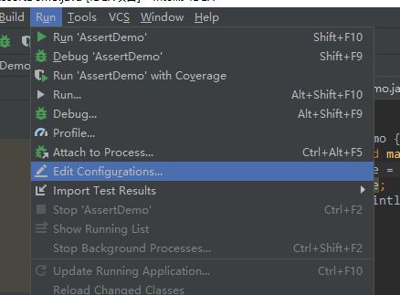
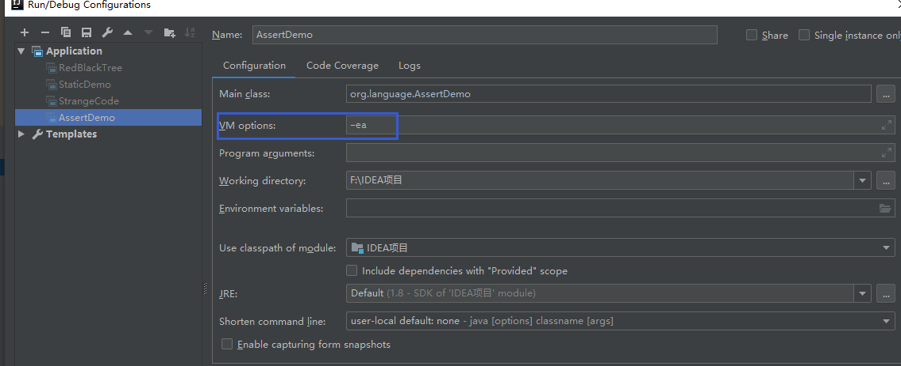

# 关键字Assert

## assert使用方法总结：

### 1.assert  <boolean表达式>

若表达式为true,则程序继续执行。

若表达式为false,则程序抛出AssertionError，并且终止运行。


### 2.assert  <boolean表达式>：<错误信息表达式>

若<boolean表达式>为true，不会执行‘:’后边的表达式, 则继续运行剩余业务代码。

若<boolean表达式>为false时，则会执行‘:’后边的表达式，并将结果放置在AssertionError异常中，并抛出。


## assert的有效性问题

> JVM在默认的情况下，是没有开启断言的。


以下代码运行在IDEA中：

```java
public class AssertDemo {
    public static void main(String[] args) {
        boolean isSafe = false;
        assert  isSafe;
        System.out.println("断言通过！");
    }
}
//1 开启断言之前
//执行结果
//断言通过！

//开启断言之后：
//Exception in thread "main" java.lang.AssertionError
//	at org.language.AssertDemo.main(AssertDemo.java:6)
```


```java
public class AssertDemo {
    public static void main(String[] args) {
        boolean isSafe = true;
        assert  isSafe;
        System.out.println("断言通过！ isSafe == true");

        assert 1 != 1 : "Wrong";
        System.out.println("断言通过： 1!=1  !");
    }
}

//断言通过！ isSafe == true
//		 Exception in thread "main" java.lang.AssertionError: Wrong
//        at org.language.AssertDemo.main(AssertDemo.java:9)
```


## 开启断言：

需要      开关`-enableassertions`或`-ea`来开启：



添加JVM参数：

