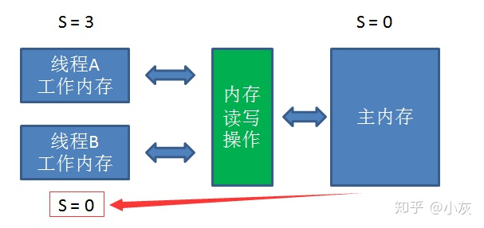

**01 面试官: Java并发这块了解的怎么样？说说你对volatile关键字的理解**
就我理解的而言，被volatile修饰的共享变量，就具有了以下两点特性：
① 保证了不同线程对该变量操作的内存可见性
② 禁止指令重排序

首先是JMM内存模型：

工作内存 ， 主内存，内存读写操作；

首先voletile关键词**不是Java首创的**，早在C语言 和C++就有了；

线程A：通过一系列内存读写的操作指令（JVM内存模型共定义了8种内存操作指令），线程A把静态变量 s=0 从主内存读到工作内存，再把 s=3 的更新结果同步到主内存当中。

这时候我们引入线程B，执行如下代码：

System.out.println("s=" + s);

因为**工作内存所更新的变量并不会立即同步到主内存**，所以虽然线程A在工作内存当中已经把变量s的值更新成3，但是线程B从主内存得到的变量s的值仍然是0，从而输出 s=0。

volitile可以保证变量的可见性，不能保证变量原子性；

作者：小灰
链接：https://zhuanlan.zhihu.com/p/56191979
来源：知乎
著作权归作者所有。商业转载请联系作者获得授权，非商业转载请注明出处。

有趣有内涵的文章第一时间送达！

**—————  第二天  —————**

————————————

Java内存模型简称**JMM**（Java Memory Model），是Java虚拟机所定义的一种抽象规范，用来屏蔽不同硬件和操作系统的内存访问差异，让java程序在各种平台下都能达到一致的内存访问效果。

Java内存模型长成什么样子呢？就是下图的样子：

这里需要解释几个概念：

**1.主内存（Main Memory）**

主内存可以简单理解为计算机当中的内存，但又不完全等同。主内存被所有的线程所共享，对于一个共享变量（比如静态变量，或是堆内存中的实例）来说，主内存当中存储了它的“本尊”。

**2.工作内存（Working Memory）**

工作内存可以简单理解为计算机当中的CPU高速缓存，但又不完全等同。每一个线程拥有自己的工作内存，对于一个共享变量来说，工作内存当中存储了它的“副本”。

线程对共享变量的所有操作都必须在工作内存进行，不能直接读写主内存中的变量。不同线程之间也无法访问彼此的工作内存，变量值的传递只能通过主内存来进行。

以上说的这些可能有点抽象，大家来看看下面这个例子：

对于一个静态变量 

static int s = 0；

线程A执行如下代码：

s = 3；

那么，JMM的工作流程如下图所示：

通过一系列内存读写的操作指令（JVM内存模型共定义了8种内存操作指令，以后会细讲），线程A把静态变量 s=0 从主内存读到工作内存，再把 s=3 的更新结果同步到主内存当中。从单线程的角度来看，这个过程没有任何问题。

这时候我们引入线程B，执行如下代码：

System.out.println("s=" + s);

引入线程B以后，当线程A首先执行，更大的可能是出现下面情况：

此时线程B从主内存得到的s值是3，理所当然输出 s=3，这种情况不难理解。但是，有较小的几率出现另一种情况：

因为工作内存所更新的变量并不会立即同步到主内存，所以虽然线程A在工作内存当中已经把变量s的值更新成3，但是线程B从主内存得到的变量s的值仍然是0，从而输出 s=0。

volatile关键字具有许多特性，其中最重要的特性就是保证了用volatile修饰的变量对所有线程的**可见性**。

这里的可见性是什么意思呢？当一个线程修改了变量的值，新的值会立刻同步到主内存当中。而其他线程读取这个变量的时候，也会从主内存中拉取最新的变量值。

为什么volatile关键字可以有这样的特性？这得益于java语言的**先行发生原则**（happens-before）。先行发生原则在维基百科上的定义如下：

In computer science, the happened-before relation is a relation between the result of two events, such that if one event should happen before another event, the result must reflect that, even if those events are in reality executed out of order (usually to optimize program flow). 

翻译结果如下：

在计算机科学中，先行发生原则是两个事件的结果之间的关系，如果一个事件发生在另一个事件之前，结果必须反映，即使这些事件实际上是乱序执行的（通常是优化程序流程）。

这里所谓的事件，实际上就是各种指令操作，比如读操作、写操作、初始化操作、锁操作等等。

先行发生原则作用于很多场景下，包括同步锁、线程启动、线程终止、volatile。我们这里只列举出volatile相关的规则：

对于一个volatile变量的写操作先行发生于后面对这个变量的读操作。

回到上述的代码例子，如果在静态变量s之前加上volatile修饰符：

volatile static int s = 0；

线程A执行如下代码：

s = 3；

这时候我们引入线程B，执行如下代码：

System.out.println("s=" + s);

当线程A先执行的时候，把s = 3写入主内存的事件必定会先于读取s的事件。所以线程B的输出一定是s = 3。

## volatile不能保证原子性案例解析

这段代码是什么意思呢？很简单，开启10个线程，每个线程当中让静态变量count自增100次。执行之后会发现，最终count的结果值未必是1000，有可能**小于1000**。

使用volatile修饰的变量，为什么并发自增的时候会出现这样的问题呢？这是因为count++这一行代码本身并不是原子性操作，在字节码层面可以拆分成如下指令：

getstatic        //读取静态变量（count）

iconst_1        //定义常量1

iadd               //count增加1

putstatic        //把count结果同步到主内存

​          虽然每一次执行 getstatic 的时候，获取到的都是主内存的最新变量值，但是进行iadd的时候，由于并不是原子性操作，**其他线程在这过程中很可能让count自增了很多次**。这样一来本线程所计算更新的是一个陈旧的count值，自然无法做到线程安全：

## 因此，什么时候适合用volatile呢？

**1.运行结果并不依赖变量的当前值，或者能够确保只有单一的线程修改变量的值。**

**2.变量不需要与其他的状态变量共同参与不变约束。**

第一条很好理解，就是上面的代码例子。第二条是什么意思呢？可以看看下面这个场景：

volatile static int start = 3;

volatile static int end = 6;

线程A执行如下代码：

while (start < end){

  //do something

}

线程B执行如下代码：

start+=3;

end+=3;

这种情况下，一旦在线程A的循环中执行了线程B，start有可能先更新成6，造成了一瞬间 start == end，从而跳出while循环的可能性。

## 什么是指令重排？

指令重排是指JVM在编译Java代码的时候，或者CPU在执行JVM字节码的时候，对现有的指令顺序进行重新排序。

指令重排的目的是为了在不改变程序执行结果的前提下，优化程序的运行效率。需要注意的是，这里所说的不改变执行结果，指的是不改变单线程下的程序执行结果。

然而，指令重排是一把双刃剑，虽然优化了程序的执行效率，但是在某些情况下，会影响到多线程的执行结果。我们来看

## 指令重排看下面的例子：

指令重新排序之前：

boolean contextReady = false;

在线程A中执行:

context = **loadContext();**

contextReady = true;

在线程B中执行:

while( ! contextReady ){ 

   sleep(200);

}

doAfterContextReady (context);

以上程序看似没有问题。线程B循环等待上下文context的加载，一旦context加载完成，contextReady == true的时候，才执行doAfterContextReady 方法。

但是，如果线程A执行的代码发生了指令重排，初始化和contextReady的赋值交换了顺序：

boolean contextReady = false;

### 指令重新排序之后：

在线程A中执行:

**contextReady = true;**

**context = loadContext();**

在线程B中执行:

while( ! contextReady ){ 

   sleep(200);

}

doAfterContextReady (context);

这个时候，很可能context对象还没有加载完成，变量contextReady 已经为true，线程B直接跳出了循环等待，开始执行doAfterContextReady 方法，结果自然会出现错误。

需要注意的是，这里java代码的重排只是为了简单示意，**真正的指令重排是在字节码指令的层面**。

## **什么是内存屏障？**

内存屏障（Memory Barrier）是一种CPU指令，维基百科给出了如下定义：

A memory barrier, also known as a membar, memory fence or fence instruction, is a type of barrier instruction that causes a CPU or compiler to enforce an ordering constraint on memory operations issued before and after the barrier instruction. This typically means that operations issued prior to the barrier are guaranteed to be performed before operations issued after the barrier.

翻译结果如下：

内存屏障也称为内存栅栏或栅栏指令，是一种屏障指令，它使CPU或编译器对屏障指令之前和之后发出的内存操作执行一个排序约束。 这通常意味着在屏障之前发布的操作被保证在屏障之后发布的操作之前执行。

内存屏障共分为四种类型：

**LoadLoad屏障**：

抽象场景：Load1; LoadLoad; Load2

Load1 和 Load2 代表两条读取指令。在Load2要读取的数据被访问前，保证Load1要读取的数据被读取完毕。

**StoreStore屏障：**

抽象场景：Store1; StoreStore; Store2

Store1 和 Store2代表两条写入指令。在Store2写入执行前，保证Store1的写入操作对其它处理器可见

**LoadStore屏障：**

抽象场景：Load1; LoadStore; Store2

在Store2被写入前，保证Load1要读取的数据被读取完毕。

**StoreLoad屏障：**

抽象场景：Store1; StoreLoad; Load2

在Load2读取操作执行前，保证Store1的写入对所有处理器可见。StoreLoad屏障的开销是四种屏障中最大的。

**volatile做了什么？**

在一个变量被volatile修饰后，JVM会为我们做两件事：

1.在每个volatile写操作前插入**StoreStore**屏障，在写操作后插入**StoreLoad**屏障。

2.在每个volatile读操作前插入**LoadLoad**屏障，在读操作后插入**LoadStore**屏障。

或许这样说有些抽象，我们看一看刚才线程A代码的例子：

boolean contextReady = false;

在线程A中执行:

context = loadContext();

contextReady = true;

我们给contextReady 增加volatile修饰符，会带来什么效果呢？

由于加入了StoreStore屏障，屏障上方的普通写入语句 context = loadContext()  和屏障下方的volatile写入语句 contextReady = true 无法交换顺序，从而成功阻止了指令重排序。

**volatile特性之一：**

保证变量在线程之间的可见性。可见性的保证是基于CPU的内存屏障指令，被JSR-133抽象为happens-before原则。

**volatile特性之二：**

阻止编译时和运行时的指令重排。编译时JVM编译器遵循内存屏障的约束，运行时依靠CPU屏障指令来阻止重排。

**几点补充：**

\1. 关于volatile的介绍，本文很多内容来自《深入理解Java虚拟机》这本书。有兴趣的同学可以去看看。

\2. 在使用volatile引入内存屏障的时候，普通读、普通写、volatile读、volatile写会排列组合出许多不同的场景。我们这里只简单列出了其中一种，有兴趣的同学可以查资料进一步学习其他阻止指令重排的场景。

3.volatile除了保证可见性和阻止指令重排，还解决了long类型和double类型数据的**8字节赋值问题**。这个特性相对简单，本文就不详细描述了。

4.**本漫画纯属娱乐，还请大家尽量珍惜当下的工作，切勿模仿小灰的行为哦。**