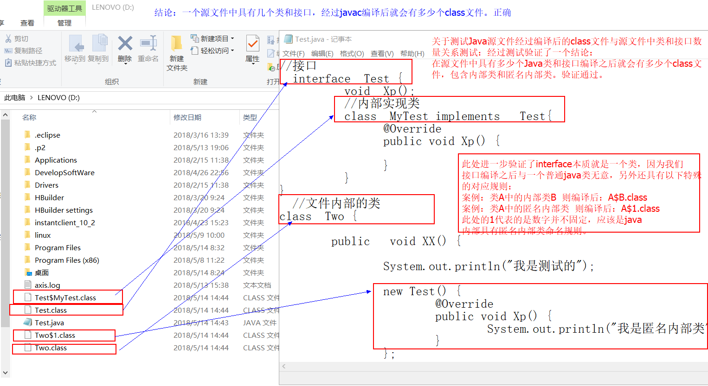
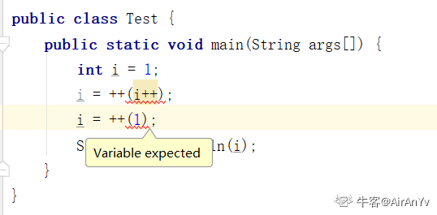
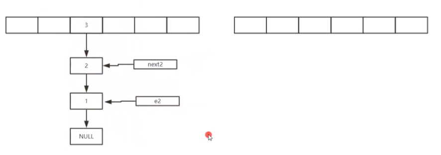
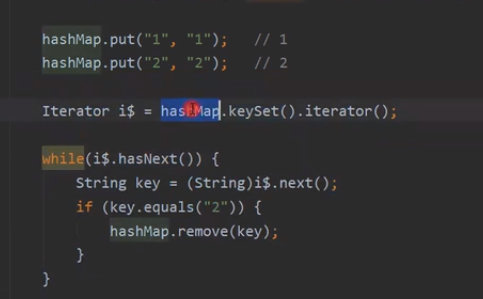

java是跨平台的语言，这个主要是由于针对不同的平台的JVM，而且JVM可以无差别的执行字节码，（.class文件）；平台无关，不意味着版本无关，对于高版本编译器编写的Java程序，可能无法在低版本的java平台中运行。

Synchroized 修饰非静态方法，是对调用该方法的对象上锁。

Synchroized 修饰的静态方法，是对类加速。

首先垃圾回收优先级相当低，既是垃圾回收工作，但是finalize()方法也不一定得到执行，由于程序中其他线程优先级，远远高于执行finalize()函数优先级；如果是等待清理队列中如果又被调用，则不会执行finalize()方法；

所有错误与异常父类是java.lang.Throwable.


 一个源文件中有几个类和接口，经过javac编译后就会有多少个class文件。 


```java
int i=42;
double d=42.0000;
long l=42;
float f=42.0f;
float f2=42.00f;
System.out.println(d==i); // int :  double
System.out.println(d==l); // double : long
System.out.println(f==i); // float :int
System.out.println(f==f2);// float:float
System.out.println(l==i); // long :int 
System.out.println(d==f); // double :float
```

```scout
true
true
true
true
true
true
```

java核心卷I中43页有如下表述：两个数值进行二元操作时，会有如下的转换操作：

如果两个操作数其中有一个是double类型，另一个操作就会转换为double类型。

否则，如果其中一个操作数是float类型，另一个将会转换为float类型。

否则，如果其中一个操作数是long类型，另一个会转换为long类型。

否则，两个操作数都转换为int类型。


1.先执行括号中的i++ 在执行i++的时候 Java会将i先存放到一个临时变量中去 并返回该临时变量的值（假设为temp）

2.所以 这句可以拆成 temp = i （值为-5） 并返回temp的值 然后 i自加1 此时 i 的值为-4 但是之后 执行就会出现问题 由于返回了temp的值 继续执行的表达式为 i = ++(-5); 单目运算符无法后跟一个字面量 所以在IDEA编辑器中提示Variable expected（此处应为变量）

`i++` 和 `i`一样返回的是：都是

  

JDK1.7中：

Hahsmap是线程不安全的：

假设有两个线程对同一个Hashmap对象，进行调用put方法：

两个线程可能出现会同时判断出来了hashmap对象需要进行扩容，同时进行扩容，调用resize()方法：

两个线程可能同时生成两个扩容之后的数组；

从一个old table 中 转移数据到 两个new table过程   过程中，

当第二个线程执行完成  将第二个线程中new的 table赋值给old table后：可能会使得 单链表 变成循环链表；

导致get方法和put方法出现死循环；

可能会出现很多情况出现：其中一种情况就是



可以看到 e2和next2 顺序位置反了，造成的原因是，扩容的过程使用单链表头插法，导致数据出现的顺序反了；

多线程死锁：

Hashmap在多线的时候回出现问题的：





## Java集合22题

- ArrayList 和 Vector 的区别。
- 说说 ArrayList,Vector, LinkedList 的存储性能和特性。
- 快速失败 (fail-fast) 和安全失败 (fail-safe) 的区别是什么？
- hashmap 的数据结构。
- HashMap 的工作原理是什么?
- Hashmap 什么时候进行扩容呢？
- List、Map、Set 三个接口，存取元素时，各有什么特点？
- Set 里的元素是不能重复的，那么用什么方法来区分重复与否呢? 是用 == 还是 equals()? 它们有何区别?
- 两个对象值相同 (x.equals(y) == true)，但却可有不同的 hash code，这句话对不对?
- heap 和 stack 有什么区别。
- Java 集合类框架的基本接口有哪些？
- HashSet 和 TreeSet 有什么区别？
- HashSet 的底层实现是什么?
- LinkedHashMap 的实现原理?
- 为什么集合类没有实现 Cloneable 和 Serializable 接口？
- 什么是迭代器 (Iterator)？
- Iterator 和 ListIterator 的区别是什么？
- 数组 (Array) 和列表 (ArrayList) 有什么区别？什么时候应该使用 Array 而不是 ArrayList？
- Java 集合类框架的最佳实践有哪些？
- Set 里的元素是不能重复的，那么用什么方法来区分重复与否呢？是用 == 还是 equals()？它们有何区别？
- Comparable 和 Comparator 接口是干什么的？列出它们的区别
- Collection 和 Collections 的区别。

## JVM与调优21题

- Java 类加载过程？
- 描述一下 JVM 加载 Class 文件的原理机制?
- Java 内存分配。
- GC 是什么? 为什么要有 GC？
- 简述 Java 垃圾回收机制
- 如何判断一个对象是否存活？（或者 GC 对象的判定方法）
- 垃圾回收的优点和原理。并考虑 2 种回收机制
- 垃圾回收器的基本原理是什么？垃圾回收器可以马上回收内存吗？有什么办法主动通知虚拟机进行垃圾回收？
- Java 中会存在内存泄漏吗，请简单描述
- 深拷贝和浅拷贝。
- System.gc() 和 Runtime.gc() 会做什么事情？
- finalize() 方法什么时候被调用？析构函数 (finalization) 的目的是什么？
- 如果对象的引用被置为 null，垃圾收集器是否会立即释放对象占用的内存？
- 什么是分布式垃圾回收（DGC）？它是如何工作的？
- 串行（serial）收集器和吞吐量（throughput）收集器的区别是什么？
- 在 Java 中，对象什么时候可以被垃圾回收？
- 简述 Java 内存分配与回收策率以及 Minor GC 和 Major GC。
- JVM 的永久代中会发生垃圾回收么？
- Java 中垃圾收集的方法有哪些？
- 什么是类加载器，类加载器有哪些？
- 类加载器双亲委派模型机制？

## 并发编程28题

- Synchronized 用过吗，其原理是什么？
- 你刚才提到获取对象的锁，这个“锁”到底是什么？如何确定对象的锁？
- 什么是可重入性，为什么说 Synchronized 是可重入锁？
- JVM 对 Java 的原生锁做了哪些优化？
- 为什么说 Synchronized 是非公平锁？
- 什么是锁消除和锁粗化？
- 为什么说 Synchronized 是一个悲观锁？乐观锁的实现原理又是什么？什么是 CAS，它有什么特性？
- 乐观锁一定就是好的吗？
- 跟 Synchronized 相比，可重入锁 ReentrantLock 其实现原理有什么不同？
- 那么请谈谈 AQS 框架是怎么回事儿？
- 请尽可能详尽地对比下 Synchronized 和 ReentrantLock 的异同。
- ReentrantLock 是如何实现可重入性的？
- 除了 ReetrantLock，你还接触过 JUC 中的哪些并发工具？
- 请谈谈 ReadWriteLock 和 StampedLock。
- 如何让 Java 的线程彼此同步？你了解过哪些同步器？请分别介绍下。
- CyclicBarrier 和 CountDownLatch 看起来很相似，请对比下呢？
- Java 线程池相关问题
- Java 中的线程池是如何实现的？
- 创建线程池的几个核心构造参数？
- 线程池中的线程是怎么创建的？是一开始就随着线程池的启动创建好的吗？
- 既然提到可以通过配置不同参数创建出不同的线程池，那么 Java 中默认实现好的线程池又有哪些呢？请比较它们的异同
- 如何在 Java 线程池中提交线程？
- 什么是 Java 的内存模型，Java 中各个线程是怎么彼此看到对方的变量的？
- 请谈谈 volatile 有什么特点，为什么它能保证变量对所有线程的可见性？
- 既然 volatile 能够保证线程间的变量可见性，是不是就意味着基于 volatile 变量的运算就是并发安全的？
- 请对比下 volatile 对比 Synchronized 的异同。
- 请谈谈 ThreadLocal 是怎么解决并发安全的？
- 很多人都说要慎用 ThreadLocal，谈谈你的理解，使用 ThreadLocal 需要注意些什么？

## spring 25题

- 什么是 Spring 框架？Spring 框架有哪些主要模块？
- 使用 Spring 框架能带来哪些好处？
- 什么是控制反转(IOC)？什么是依赖注入？
- 请解释下 Spring 框架中的 IoC？
- BeanFactory 和 ApplicationContext 有什么区别？
- Spring 有几种配置方式？
- 如何用基于 XML 配置的方式配置 Spring？
- 如何用基于 Java 配置的方式配置 Spring？
- 怎样用注解的方式配置 Spring？
- 请解释 Spring Bean 的生命周期？
- Spring Bean 的作用域之间有什么区别？
- 什么是 Spring inner beans？
- Spring 框架中的单例 Beans 是线程安全的么？
- 请举例说明如何在 Spring 中注入一个 Java Collection？
- 如何向 Spring Bean 中注入一个 Java.util.Properties？
- 请解释 Spring Bean 的自动装配？
- 请解释自动装配模式的区别？
- 如何开启基于注解的自动装配？
- 请举例解释@Required 注解？
- 请举例解释@Autowired 注解？
- 请举例说明@Qualifier 注解？
- 构造方法注入和设值注入有什么区别？
- Spring 框架中有哪些不同类型的事件？
- FileSystemResource 和 ClassPathResource 有何区别？
- Spring 框架中都用到了哪些设计模式？

## 设计模式 10题

- 请列举出在 JDK 中几个常用的设计模式？
- 什么是设计模式？你是否在你的代码里面使用过任何设计模式？
- Java 中什么叫单例设计模式？请用 Java 写出线程安全的单例模式
- 在 Java 中，什么叫观察者设计模式（observer design pattern）？
- 使用工厂模式最主要的好处是什么？在哪里使用？
- 举一个用 Java 实现的装饰模式(decorator design pattern)？它是作用于对象层次还是类层次？
- 在 Java 中，为什么不允许从静态方法中访问非静态变量？
- 设计一个 ATM 机，请说出你的设计思路？
- 在 Java 中，什么时候用重载，什么时候用重写？
- 举例说明什么情况下会更倾向于使用抽象类而不是接口


设计模式可以参考：[设计模式内容聚合](https://link.zhihu.com/?target=http%3A//mp.weixin.qq.com/s%3F__biz%3DMzI4Njc5NjM1NQ%3D%3D%26mid%3D2247488811%26idx%3D4%26sn%3Dec20f59a5b67a59d98d221bd20d78448%26chksm%3Debd62a07dca1a31188dafea0e6984b4883fa972a32ff31da2df6f52fcc73b56c6c9454751d73%26scene%3D21%23wechat_redirect)

## springboot 22题

- 什么是 Spring Boot？
- Spring Boot 有哪些优点？
- 什么是 JavaConfig？
- 如何重新加载 Spring Boot 上的更改，而无需重新启动服务器？
- Spring Boot 中的监视器是什么？
- 如何在 Spring Boot 中禁用 Actuator 端点安全性？
- 如何在自定义端口上运行 Spring Boot 应用程序？
- 什么是 YAML？
- 如何实现 Spring Boot 应用程序的安全性？
- 如何集成 Spring Boot 和 ActiveMQ？
- 如何使用 Spring Boot 实现分页和排序？
- 什么是 Swagger？你用 Spring Boot 实现了它吗？
- 什么是 Spring Profiles？
- 什么是 Spring Batch？
- 什么是 FreeMarker 模板？
- 如何使用 Spring Boot 实现异常处理？
- 您使用了哪些 starter maven 依赖项？
- 什么是 CSRF 攻击？
- 什么是 WebSockets？
- 什么是 AOP？
- 什么是 Apache Kafka？
- 我们如何监视所有 Spring Boot 微服务？


springboot可以参考：[SpringBoot内容聚合](https://link.zhihu.com/?target=http%3A//mp.weixin.qq.com/s%3F__biz%3DMzI4Njc5NjM1NQ%3D%3D%26mid%3D2247488811%26idx%3D2%26sn%3D0d054027651bef114ae6bec5a8f62359%26chksm%3Debd62a07dca1a3111269692dd9b0a5ab8af7d2038b8ec6600a057573364e76db1332adc5fd46%26scene%3D21%23wechat_redirect)

## Netty10题

- BIO、NIO和AIO的区别？
- NIO的组成？
- Netty的特点？
- Netty的线程模型？
- TCP 粘包/拆包的原因及解决方法？
- 了解哪几种序列化协议？
- 如何选择序列化协议？
- Netty的零拷贝实现？
- Netty的高性能表现在哪些方面？
- NIOEventLoopGroup源码？

## Redis 16题

- 什么是redis?
- Reids的特点
- Redis支持的数据类型
- Redis是单进程单线程的
- 虚拟内存
- Redis锁
- 读写分离模型
- 数据分片模型
- Redis的回收策略
- 使用Redis有哪些好处？
- redis相比memcached有哪些优势？
- redis常见性能问题和解决方案
- MySQL里有2000w数据，redis中只存20w的数据，如何保证redis中的数据都是热点数据
- Memcache与Redis的区别都有哪些？
- Redis 常见的性能问题都有哪些？如何解决？
- Redis 最适合的场景