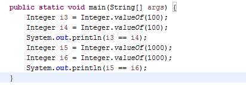
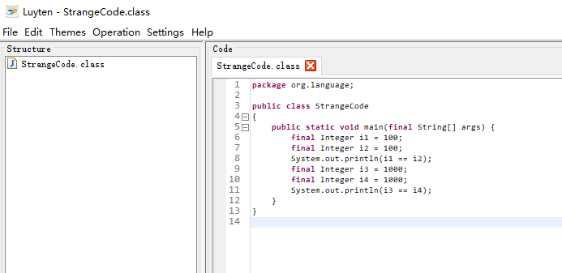

问题来源：知乎专栏：Java哪些事儿 

 https://zhuanlan.zhihu.com/p/27562748 

## 解释一下代码运行结果？

```Java
package org.language;

public class StrangeCode {
    public static void main(String[] args) {
        Integer i1 = 100;
        Integer i2 = 100;
        System.out.println(i1==i2);
        Integer i3 = 1000;
        Integer i4 = 1000;
        System.out.println(i3 == i4);
    }
//    结果：
//    true
//    false
}
```

.java文件通过编译器 编译成.class文件，jvm将会加载class文件。通过反编译,  编译器会自动帮助我们优化代码,看一下代码：

  

（图片：来自原知乎专栏）:sweat:   :(  但是自己使用luyten-0.5.4.jar这个工具，反编译后的代码和原来一样。




## 公有静态方法：Integer.valueOf()的代码实现：

```java
    /**
     * Returns an {@code Integer} instance representing the specified
     * {@code int} value.  If a new {@code Integer} instance is not
     * required, this method should generally be used in preference to
     * the constructor {@link #Integer(int)}, as this method is likely
     * to yield significantly better space and time performance by
     * caching frequently requested values.
     *
     * This method will always cache values in the range -128 to 127,
     * inclusive, and may cache other values outside of this range.
     *
     * @param  i an {@code int} value.
     * @return an {@code Integer} instance representing {@code i}.
     * @since  1.5
     */
    public static Integer valueOf(int i) {
        if (i >= IntegerCache.low && i <= IntegerCache.high)  //查看创建的对象是否在缓存中存在
            return IntegerCache.cache[i + (-IntegerCache.low)]; //存在则直接返回
        return new Integer(i);								//在缓存的范围之外就，new一个对象。
    }
```

Integer作者在创建这个类的时候，为了避免创建对象，对一定范围内的数据进行缓存。如果在这个范围内直接返回缓存数据，如果不在这个范围内则new一个对象。

## 私有静态内部类：IntegerCache 

```java
/**
     * Cache to support the object identity semantics of autoboxing for values between
     * -128 and 127 (inclusive) as required by JLS.
     *
     * The cache is initialized on first usage.  The size of the cache
     * may be controlled by the {@code -XX:AutoBoxCacheMax=<size>} option.
     * During VM initialization, java.lang.Integer.IntegerCache.high property
     * may be set and saved in the private system properties in the
     * sun.misc.VM class.
     */

    private static class IntegerCache {
        static final int low = -128;
        static final int high;
        static final Integer cache[];

        static {
            // high value may be configured by property
            int h = 127;
            String integerCacheHighPropValue =
                sun.misc.VM.getSavedProperty("java.lang.Integer.IntegerCache.high");
            if (integerCacheHighPropValue != null) {
                try {
                    int i = parseInt(integerCacheHighPropValue);
                    i = Math.max(i, 127);
                    // Maximum array size is Integer.MAX_VALUE
                    h = Math.min(i, Integer.MAX_VALUE - (-low) -1);
                } catch( NumberFormatException nfe) {
                    // If the property cannot be parsed into an int, ignore it.
                }
            }
            high = h;

            cache = new Integer[(high - low) + 1];
            int j = low;
            for(int k = 0; k < cache.length; k++)
                cache[k] = new Integer(j++);

            // range [-128, 127] must be interned (JLS7 5.1.7)
            assert IntegerCache.high >= 127;
        }

        private IntegerCache() {}
    }
```

从虚拟机中读取是否有配置的属性，如果没有配置属性，那么high默认属性为127 low默认属性为-128

 这是一个内部静态类，该类只能在Integer这个类的内部访问，这个类在初始化的时候，会去加载JVM的配置，如果有值，就用配置的值初始化缓存数组，否则就缓存-128到127之间的值。 


## 分析原来得代码：

```Java
package org.language;

public class StrangeCode {
    public static void main(String[] args) {
        Integer i1 = 100;      //在i1 默认的范围内，直接返回缓存中的对象。
        Integer i2 = 100;       //在默认的范围内，直接返回缓存中的对象。
        System.out.println(i1==i2);   // 指的是同一对象
        Integer i3 = 1000;   //i3 不在默认范围之内，因此创建新对象。
        Integer i4 = 1000;   //i4 不在默认范围之内，因此创建新对象。
        System.out.println(i3 == i4);   //两个不同的对象， 地址自然不一样。
    }
}
//    结果：
//    true
//    false
```

## 作者的结论：

 **结论：我们在比较两个Integer对象的值时，无论是怎么声明的，都一定要使用equals去比较，不能用==，在Java中没有重载操作符这一说，特别是从其它语言转到Java的童鞋们要注意。** 