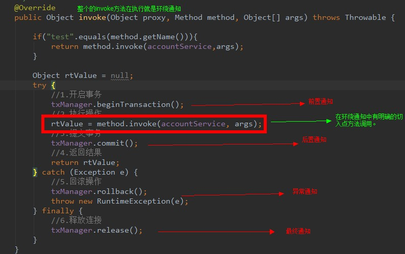

# AOP相关概念  与  Spring中的AOP

## 什么是AOP？

## AOP作用与效果
- 减少重复代码
- 提高开发效率
- 维护方便

## AOP实现方式
通过使用动态代理技术

## 两种方式实现动态代理

## Spring中的AOP：
连接点（jointpointer）：业务层接口所有的方法
切入点（pontercut）：被增强的方法。

Advice 通知增强。

Target目标对象：代理的目标对象

Proxy代理：

Aspect切面：切入点和通知的结合。

切入点：哪些方法被增强过，这些方法就是切入点。

通知：就是提供了公共代码的类。

在配置过程中我们需要关注的点：
- 我们需要一个事务管理对象：TransManager。（通知类）
- TransManager里面要有四个方法beginTransaction, commit , release, rollback：	 
-  需要有一些业务方法，并且这些方法需要事务；Serive接口，并且里面提供一些方法
 通过配置将这件事情说明白，
	- 使得beginTransaction在Service的某些方法之前执行。
	- 使得commit在某些方法执行之后执行。
	- 使得rollback在某些方法产生异常之后执行。
	- 使得release在不管这些service的方法正常执行，都会最终执行。

## 学习Spring  中AOP 要明确的
（1）我们要做哪些？

（2）框架为我们做了哪些？运行阶段：

​	Spring框架监控切入点方法的执行。一旦监控到切入点方法被运行，使用代理机制，动态创建目标对象的代理对象，根据通知类别，在代理对象的对应位置，将通知对应的功能织入，完成完整的代码逻辑运行。

## 总结AOP

重复代码：

试想一下：

- 如果我需要记录日志；
- 我需要判断用户是否登录。
- 统计执行效率
- 是否有权限执行

我们以前的解决方式，是抽取公共代码，然后调用。

将重复的代码在方法执行时，加进去，这就是动态代理。

> 术语先大概理解，随着后续的学习慢慢深入理解。

## AOP是一个怎么样的过程

- 创建代理对象。

作业：day03_eesy_01account中的代码换成Spring AOP实现一次。