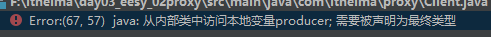

# 动态代理笔记

## 1 动态代理的分析：


很久之前，消费者 买 产品都要 向厂家直接购买，售后阿一系列问题都要联系厂家。

```java
 //找一个生产厂商。
  final Producer producer =new Producer();
  //给它10000块钱，厂商给我一台电脑
  producer.saleProduct(10000f);
```

后来，人民看到了商机，开始做代理商，经销商。 消费者买的时候找到经销商买，经销商向生产厂家拿货。售后服务中，的小问题都交给经销商来解决，大问题才返回给生产厂商。

## 2 动态代理

动态代理：

- 特点：字节码，随用随创建，随用随加载
- 作用：不修改源码的基础上，对对方增强。
- 分类：
  - 基于接口的动态代理。
  - 基于子类的动态代理。

##  3 基于接口的动态代理：

### 现实接口的类：

```java
/**
 * 一个生产者
 */
public class Producer implements  IProducer {
    /**
     * 销售
     * @param money
     */
    public void saleProduct(float money){
        System.out.println("销售商品，并且拿到钱："+money);
    }

    /**
     * 售后
     * @param money
     */
    public void afterService(float money){
        System.out.println("提供售后服务，并拿到钱"+money);
    }
}
```

### 代理具体实现

```java
public class Client {
    public static void main(String[] args) {
        //找一个生产厂商。
        final Producer producer =new Producer();
/*
        *  基于接口的动态代理:
        *      涉及的类：Proxy
        *      提供者JDK官方。
        *  如何创建代理对象：
        *      使用Proxy类中的newProxyInstance方法。
        *  创建代理对象的要求:
        *      被代理类最少实现一个接口，如果没有则不能使用。
        *  newProxyInstance方法的参数:
        *           ClassLoader:类加载器
        *               它是用于加载代理对象字节码的，和被代理的对象使用相同的类加载器。(固定写法)
        *           Class[]：字节码数组
        *               它是用于让代理对象和被代理的对象有相同的方法。
        *           InvocationHandler: 用于提供增强的代码:
        *               它是让我们写如何代理，我们一般是些一个接口的实现类，通常情况下都是匿名内部类，但是不是必须的。
        *               此接口的实现类都是谁写。
        *
        *  基于接口的动态代理的缺陷:  代理对象一定要继承一个接口
        * */
        //设置代理（经销商）
        IProducer proxyProducer = (IProducer) Proxy.newProxyInstance(producer.getClass().getClassLoader(),
                producer.getClass().getInterfaces(),
                new InvocationHandler() {
                    /**
                     *作用：执行被代理对象的任何接口方法都会经过该方法。
                     * 方法参数的含义：
                     * @param proxy  代理对象的引用
                     * @param method 当前执行的方法
                     * @param args   当前执行方法所需的参数
                     * @return       和被代理对象方法有相同的返回值。
                     * @throws Throwable
                     */
                    public Object invoke(Object proxy, Method method, Object[] args) throws Throwable {
                        //提供增强的代码
                        Object returnValue = null;
                        //1.获取方法执行的参数。
                        
                        Float money = (Float)args[0];
                        //2.判断当前方法是不是销售。
                        if("saleProduct".equals(method.getName())){
                            returnValue = method.invoke(producer,money*0.8f);
                        }
                        return returnValue;
                    }
                });
        
        //给它10000块钱，厂商给我一台电脑
        //proxyProducer.saleProduct(10000f);
    }
}
```

### 出现的问题：

被代理的对象要被设置为最终对象，当前被代理的对象是producer对象。否则会出现错误。



备注：代码还有点看不懂，后期我们再不愁一下细节。

##  4 基于子类的动态代理：

### 有的 子类实现

```java
public class Producer {
    /**
     * 销售
     * @param money
     */
    public void saleProduct(float money){
        System.out.println("销售商品，并且拿到钱："+money);
    }
    
    /**
     * 售后
     * @param money
     */
    public void afterService(float money){
        System.out.println("提供售后服务，并拿到钱"+money);
    }
}
```

代理类具体实现：

```java
/*
* 模拟一个消费者
 */
public class Client {
    public static void main(String[] args) {
        //找一个生产厂商。
        final Producer producer =new Producer();
      /**
        *  基于接口的动态代理:
        *      涉及的类：Enhancer
        *      提供者: 第三方Cglib库
        *  如何创建代理对象：
        *      使用Enhancer类中的create方法。
        *  创建代理对象的要求:
        *      被代理类不能是最终类、
        *  create方法的参数:
        *           Class:被代理对象的字节码
        *               它是用于加载代理对象字节码的，和被代理的对象使用相同的类加载器。(固定写法)
        *
        *           Callback: 用于提供增强的代码:
        *               它是让我们写如何代理，我们一般是些一个接口的实现类，通常情况下都是匿名内部类，但是不是必须的。
        *               此接口的实现类都是谁写。
        *               我们一般写的都是该接口的子接口实现类，MethodInterceptor方法拦截
        *
        *  基于接口的动态代理的缺陷:  代理对象一定要继承一个接口
        *
        *
        *  基于子类的动态代理:
        *
        * */

        Producer  cglibProducer= (Producer) Enhancer.create(producer.getClass(), new MethodInterceptor() {
            /**
             * 执行被代理对象的任何方法都会经过该方法，
             * @param proxy
             * @param method
             * @param args
             *      以上三个参数和基于接口的动态代理中invoke方法参数是一样的。
             * @param methodProxy
             * @return
             * @throws Throwable
             */
            @Override
            public Object intercept(Object proxy, Method method, Object[] args, MethodProxy methodProxy) throws Throwable {
                //提供增强的代码
                Object returnValue = null;

                //1.获取方法执行的参数。
                Float money = (Float) args[0];
                //2.判断当前方法是不是销售。
                if ("saleProduct".equals(method.getName())) {
                    returnValue = method.invoke(producer, money * 0.8f);
                }
                return returnValue;
            }
        });

        cglibProducer.saleProduct(1200);
    }
}
```


### 实战记录1：

动态代理帮我们实现了方法的增强，减少了重复代码量。

#### BeanFactory 

是 生成 ServiceAccountImpl的 代理对象 的 bean工厂。

成功增强了方法

```java

/*
* 用于创建service的代理对象的工厂
*
* */
public class BeanFactory {
    //通过spring注入
    private  IAccountService accountService;

    private TransactionManager txManager; //使用Spring依赖注入进来

    public final void setTxManager(TransactionManager txManager) {
        this.txManager = txManager;
    }
    public void setAccountService(IAccountService accountService) {
        this.accountService = accountService;
    }
    /**
     * 获取Service代理对象
     * @return
     */
    public IAccountService getAccountService(){
        Proxy.newProxyInstance(accountService.getClass().getClassLoader(),
                accountService.getClass().getInterfaces(),
                new InvocationHandler() {

                    //添加事务的支持。
                    @Override
                    public Object invoke(Object proxy, Method method, Object[] args) throws Throwable {
                        Object rtVlaue = null;

                        try {
                            //1.开启事务
                            txManager.beginTransaction();
                            //2.执行操作
                           rtVlaue =  method.invoke(accountService,args);
                            //3.执行事务
                            txManager.commit();
                            //4.返回结果
                        } catch (Exception e){
                            //5.回滚操作
                            txManager.rollback();
                        } finally {
                            //6.释放资源
                            txManager.release();
                        }
                        return rtVlaue;
                    }
                });
        return accountService;
    }
}
```

```xml
    <!--配置beanFactory-->
    <bean id="beanFactory" class="com.itheima.factory.BeanFactory">
        <!--注入accountService-->
        <property name="accountService" ref="accountService"></property>
        <!--注入TransactionManger-->
        <property name="txManager" ref="txManager"></property>
    </bean>

    <!--配置代理的Service对象-->
    <bean id="proxyAccountService" factory-bean="beanFactory" factory-method="getAccountService"></bean>

```

