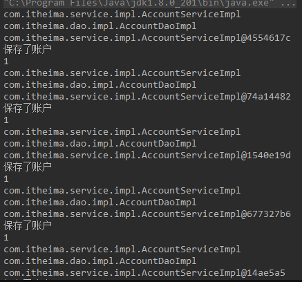
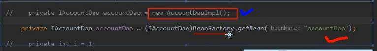

## 单例与多例

对象多例：对象被多次创建；执行效率没有单例这么快。

单例：对象只会创建一次，类中的成员只会初始化一次。

```java
public class AccountServiceImpl implements IAccountService {

    //private IAccountDao accountDao = new AccountDaoImpl();
    private IAccountDao accountDao = (IAccountDao) BeanFactory.getBean("accountDao");
    private int i=1;

    public void saveAccount() {
        //业务层 调用持久层
        accountDao.saveAccount();
        System.out.println(i++);
    }
}
```

```java
/*
*  模拟一个表现层，用于调用业务层
* */
public class Client {
    public static void main(String[] args) {
        //IAccountService as = new AccountServiceImpl();
//        IAccountService as = (IAccountService) BeanFactory.getBean("accountService");
//        as.saveAccount();

        for(int i=0; i<5; i++){
            IAccountService as = (IAccountService) BeanFactory.getBean("accountService");
            System.out.println(as);
            as.saveAccount();
        }

    }
}
```

上述代码执行结果：



每个对象由于一个独立的实例，

场景：类成员能够在方法中进行改变的时候。在Service和Dao中没有这样的场景。基本都是定义在方法中。

```java
/*
*  一个创建 Bean对象的工厂
*
*  Bean: 在计算机英语中，有可重用组件的含义。
*  JavaBean : 使用Java语言编写的重用组件
*       javabean > 实体类
*   它就是创建我们的service 和dao 对象
*   第一个就是需要配置文件，就是需要一个配置文件来配置我们的service 和 dao
*        配置的内容：唯一标识==全限定类名（key=value）
*   第二个：通过读取配置文件中配置内容，反射创建对象。
*
*   我的配置文件：可以选择xml 也可以properties
*
* */
public class BeanFactory {
    // 定义一个properties 对象
    private static Properties props;

    // 使用静态代码块为props赋值
    static{
        try {
            // 实例化对象
            props = new Properties();  // 我们是降低耦合，不是消除耦合，不可能一个new都没有

            InputStream in = BeanFactory.class.getClassLoader().getResourceAsStream("bean.properties");
            props.load(in);
        } catch (Exception e) {
            throw new ExceptionInInitializerError("初始化properties失败！");
        }
    }

    /**
     * 根据bean的名称获取bean对象
     * @param beanName
     * @return
     */
    public static Object getBean(String beanName){
        Object bean = null;
        try {
            String beanPath = props.getProperty(beanName);
            System.out.println(beanPath);
            bean = Class.forName(beanPath).newInstance();
        } catch (Exception e){
            e.printStackTrace();
        }
        return bean;
    }
}
```

` Class.forName(beanPath).newInstance();` newInstance方法表明：每次都会调用默认构造函数创建对象。

### 单例工厂模式

```java
public class BeanFactory {
    // 定义一个properties 对象
    private static Properties props;

    //定义一个Map 用于存放我们创建的对象，我们把它称之为容器。
    private static Map<String , Object> beans;

    // 使用静态代码块为props赋值
    static{
        try {
            // 实例化对象
            props = new Properties();  // 我们是降低耦合，不是消除耦合，不可能一个new都没有

            InputStream in = BeanFactory.class.getClassLoader().getResourceAsStream("bean.properties");
            props.load(in);

            //实例化容器
            beans = new HashMap<String, Object>();
            //取出配置文件中所有的key
            Enumeration keys = props.keys();
            //遍历枚举
            while(keys.hasMoreElements()){
                // 取出key
                String key = keys.nextElement().toString();
                //根据 key 获取value
                String beanPath = props.getProperty(key);
                //反射创建对象。
                Object value = Class.forName(beanPath).newInstance();
                beans.put(key,value);

            }

        } catch (Exception e) {
            throw new ExceptionInInitializerError("初始化properties失败！");
        }
    }
    /**
     * 根据bean的名称获取对象。
     * @param beanName
     * @return
     */
    public static Object getBean(String beanName){
       return beans.get(beanName);
    }
}
```


### 控制反转：Inversion Of Control

问题1：为什么叫控制反转，不是叫降低依赖呢？



第一个方法new方法：有独立自主控制，创建某些对象。（想要谁，就有谁）

第二种方法：通过工厂方法，使用固定名称获取bean对象，这个bean对象是不是能用的，我们无法得知了。控制完全取决于配置文件。

削减了计算机程序之间的依赖关系，耦合。


因此我们将这段内容，完全交给了Spring