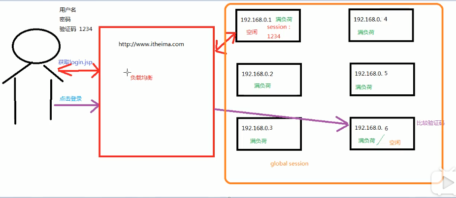

# 使用Spring的IOC解决程序耦合

Maven 添加依赖：

```xml
    <dependencies>
        <dependency>
            <groupId>org.springframework</groupId>
            <artifactId>spring-context</artifactId>
            <version>5.2.3.RELEASE</version>
        </dependency>
    </dependencies>
```


### ApplicationContext 的三个常用的实现类： 

- `ClassPathXmlApplicationContext`: 它可以加载类路径下的配置文件，要求配置文件必须在类路径下。不在的话加载不了。(常用）

- `FileSystemXmlApplicationContext`:它可以加载磁盘任意路径下的配置文件（必须要有访问权限）
- `AnnotationConfigApplicationContext`: 它是用于读取注解来创建容器的，是明后天内容。

#### 核心容器的两个接口引发的问题：

- ` ApplicationContext`:    单例对象适用 ；容器一创建，对象也跟着创建。   （常用，采用此接口）

  它在构建核心容器时，创建对象采取的策略是采用立即加载的方式。     也就说，只要一读取完配置文件马上就创建配置文件中配置的对象。     

-  BeanFactory:  多例对象适用   ；假设我们在容器创建的时候，创建了对象、但是在查找对象的时候，又要重新创建对象，那么不如什么时候用，就什么时候创建对象好了。

 它在创建核心容器时，创建对象采取的策略是延迟加载的。也就是说，什么时候根据id获取对象了，什么时候


### ApplicationContext与BeanFactory的分别使用

```java
public class Client {
    /**
     * ApplicationContext 的三个常用的实现类：
     *      ClassPathXmlApplicationContext: 它可以加载类路径下的配置文件，要求配置文件必须在类路径下。不在的话加载不了。(常用）
     *      FileSystemXmlApplicationContext:它可以加载磁盘任意路径下的配置文件（必须要有访问权限）
     *      AnnotationConfigApplicationContext: 它是用于读取注解来创建容器的，是明后天内容。
     *
     * 核心容器的两个接口引发的问题：
     *  ApplicationContext:
     *      它在构建核心容器时，创建对象采取的策略是采用立即加载的方式。
     *      也就说，只要一读取完配置文件马上就创建配置文件中配置的对象。
     *      //
     *
     *  BeanFactory:
     *      它在创建核心容器时，创建对象采取的策略是延迟加载的。也就是说，什么时候根据id获取对象了，什么时候
     *
     * 获取spring 的ioc核心容器，并根据id获取对象
     * @param args
     */

    public static void main(String[] args) {
        /*
        //1. 获取核心容器对象
        ApplicationContext ac = new ClassPathXmlApplicationContext("bean.xml");
        //ApplicationContext ac = new FileSystemXmlApplicationContext("F:\\itheima\\day01_eesy_03spring\\src\\main\\resources\\bean.xml");

        //2.根据id获取bean对象
        IAccountService as = (IAccountService) ac.getBean("accountService");
        IAccountDao adao = ac.getBean("accountDao",IAccountDao.class);

        System.out.println(as);
        System.out.println(adao);

        as.saveAccount();
    */

        // --------------beanfactory
        Resource resource = new ClassPathResource("bean.xml");
        BeanFactory beanFactory=new XmlBeanFactory(resource);

        IAccountService as = (IAccountService) beanFactory.getBean("accountService");
        IAccountDao adao = beanFactory.getBean("accountDao",IAccountDao.class);

        System.out.println(as);
        System.out.println(adao);
    }
}
```

​	Spring 是一个非常强大的容器，可以根据我们的配置，来修改创建的方式。


### Spring中 创建Bean的三种方式

#### (2)使用工厂方法创建bean对象

```java
public class InstanceFactory {
    public IAccountService getAccountService(){
        return new AccountServiceImpl();
    }
}
```

#### （3）使用静态工厂方法创建bean对象

```java
public class StaticFactory {
    public static IAccountService getAccountService(){
        return new AccountServiceImpl();
    }
}
```

```xml
<?xml version="1.0" encoding="UTF-8"?>
<beans xmlns="http://www.springframework.org/schema/beans"
       xmlns:xsi="http://www.w3.org/2001/XMLSchema-instance"
       xsi:schemaLocation="http://www.springframework.org/schema/beans
        https://www.springframework.org/schema/beans/spring-beans.xsd">
    <!--把对象的创建交给spring来管 -->

    <!--spring 对象的管理细节-->
    <!--
            1.创建bean的三种方式
            2.bean对象的作用范围
            3.bean对象的生命周期
    -->
    <!--创建bean对象的三种方式 -->
    <!--    第一种方式：使用默认构造函数创建。
            在spring的配置文件中使用bean标签，配以id和class属性之后，且没有其他属性标签时。
            采用的就是默认构造函数创建bean对象，此时如果类中没有默认构造函数，对象无法创建。
     -->
    <!--<bean id="accountService" class="com.itheima.service.impl.AccountServiceImpl"></bean>-->

    <!--
        第二种方式： 使用普通工厂中的方法创建对象（使用某个类中的方法创建对象，并且存入spring容器）
    -->
    <!--<bean id="instanceFactory" class="com.itheima.factory.InstanceFactory" ></bean>-->
    <!--<bean id="accountService" factory-bean="instanceFactory" factory-method="getAccountService"></bean>-->

    <!-- 第三种方法：使用工厂方法中的静态方法创建对象（使用某个类中的静态方法创建对象，存入spring容器）

    -->
    <bean id="accountService" class="com.itheima.factory.StaticFactory" factory-method="getAccountService"></bean>

</beans>
```

### 存在的问题

方法2和方法3所使用的工厂方法，静态工厂方法，其中都有使用new来创建对象。

> 对于这种情况：我们可以假设这些类是jar包中的类，jar包中的类都是class文件。


Spring中bean的作用范围：

bean 作用范围和生命周期
bean标签的scope属性
作用：用于指定bean的作用范围
取值： 常用的就是（单例）的和（多例的）

- singleton: 单例的（也是默认值）
- propotype: 多例模式
- request: 作用于web应用的请求范围
- session: 作用于web应用的会话范围
- global-session: 作用于集群环境的会话范围（全局会话范围），当不是集群环境时它就是session.

针对global-session： 




### bean的生命周期

bean对象生命周期
- 单例对象

  - 出生：当容器创建时，对象出生。

  - 活着：只要容器还在，对象一直活着。

  - 死亡：容器销毁，对象消亡。

    总结：单例对象 的生命周期和容器相同。
  
- 多例对象
  
  - 出生：
  
  - 活着：
  
  - 死亡：


```java
public class Client {
    public static void main(String[] args) {
        //1. 获取核心容器对象
        //ApplicationContext ac = new ClassPathXmlApplicationContext("bean.xml");
        ClassPathXmlApplicationContext ac = new ClassPathXmlApplicationContext("bean.xml");
        //2.根据id获取bean对象
        IAccountService as1 = (IAccountService) ac.getBean("accountService");
        IAccountService as2 = (IAccountService) ac.getBean("accountService");
        System.out.println(as1);
        System.out.println(as2);
        as1.saveAccount();
        as2.saveAccount();
        //手动是否
        ac.close();
    }
}

```

```xml
    <bean id="accountService" class="com.itheima.service.impl.AccountServiceImpl"
        scope="singleton" init-method="init" destroy-method="destroy">
    </bean>
```

单例模式的执行:singl


多例模式的执行：prototype


### spring 中依赖注入

- 依赖注入：
               Dependency Injction
           
-  IOC的作用：
              降低程序间的耦合（依赖关系）：注意是降低，不是消除。
              表现层 ==> service ==> 持久层
          
- 依赖关系的管理：
              以后都交给spring开维护.
          在当前需要用到其他类的对象，由spring为我们提供，我们只需要在配置文件中说明。
          
-  依赖关系的维护：
              就称之为依赖注入。
          
-  依赖注入：
              能注入的数据：有三类
                  基本数据类型 和 String
                  其他bean类型（在配置文件中或者注解配置过的bean）
                  复杂类型/ 集合类型

-  注入方式：有三种方式
                第一种：使用构造函数提供。
                第二种：使用set方法提供。
                第三种：使用注解提供。

#### 第一种:  构造函数注入

```xml
    <!--方式1-->
    <!-- 构造函数注入-->
    <!--
        使用的标签：construct-arg
        标签出现的位置：bean标签的内部
        标签中的属性：
        - type: 用于指定要注入的数据的数据类型，该数据类型也是构造函数中某个或者某些参数的类型(问题：多个同类型)
		- index：用于指定要注入数据给构造函数中指定索引位置的参数赋值。索引的位置是0开始
        - name: 用于指定给构造函数中指定名称的参数赋值             （常用）
        ==================以上三个用于指定给构造函数中哪个参数赋值================================
        - value： 用于提供 基本类型和String类型
        - ref： 用于指定其它Bean类型数据。它指的就是在Spring的Ioc核心容器中出现过的对象。
    -->
    <!-- 构造函数的特点和弊端：
        特点或者说是优势：
            在获取bean对象时，注入数据是必须的操作，否则对象无法创建成功。
        弊端：
            改变了bean对象的实例化方式，使我们在创建对象是，如果用不到这些数据，也必须提供。

    -->
    <bean id="accountService" class="com.itheima.service.impl.AccountServiceImpl">
        <constructor-arg name="name" value ="泰斯特"></constructor-arg>
        <constructor-arg name="age" value ="18"></constructor-arg>
        <constructor-arg name="birthday" ref="now"></constructor-arg>
    </bean>


    <!--配置一个日期对象-->
    <bean id="now" class="java.util.Date"></bean>
```

```java
public class AccountServiceImpl implements IAccountService {

    //如果是经常变化的数据，并不适用于注入的方式
    // 一下的数据，我们只关注数据类型。
    private String name;  //姓名
    private Integer age; //基本类型包装类
    private Date birthday; // 生日

    public AccountServiceImpl(String name,Integer age , Date birthday){
        this.name = name;
        this.age = age;
        this.birthday = birthday;
    }
    public AccountServiceImpl(){
        System.out.println("AccountService 创建了");
    }

    public void saveAccount() {
        System.out.println("service中的saveAccount方法执行了...");
        System.out.println(name+" "+age+" "+birthday);
    }
}
```

#### 第二种：set方法注入

```java
public class AccountServiceImpl2 implements IAccountService {

    //如果是经常变化的数据，并不适用于注入的方式
    // 一下的数据，我们只关注数据类型。
    private String name;  //姓名
    private Integer age; //基本类型包装类
    private Date birthday; // 生日
    
    // 用于注入方法
    public void setName(String name) {
        this.name = name;
    }
    public void setAge(Integer age) {
        this.age = age;
    }
    public void setBirthday(Date birthday) {
        this.birthday = birthday;
    }
    public AccountServiceImpl2(){
        System.out.println("AccountService 创建了");
    }
    public void saveAccount() {
        System.out.println("service中的saveAccount方法执行了...");
        System.out.println(name+" "+age+" "+birthday);
    }
}
```


```xml
	<!--方式2-->
    <!--set方法注入   （更常用的方式）
        设计标签：property
        出现位置：bean标签内部。
        标签属性：
        - name: 用于指定给构造函数中指定名称的参数赋值  只关心set方法名称，取消set后单词改成小写。
        - value： 用于提供 基本类型和String类型
        - ref： 用于指定其它Bean类型数据。它指的就是在Spring的Ioc核心容器中出现过的对象。

        优势和弊端
        优势：创建对象时没有明确的限制，可以直接使用默认构造函数
        弊端：如果有某个成员必须有值，则获取对象是有可能set方法没有执行。
    -->
    <bean id="accountService2" class="com.itheima.service.impl.AccountServiceImpl2">
        <property name="name" value="泰斯特2"></property>
        <property name="age" value="21"></property>
        <property name="birthday" ref="now"></property>
    </bean>


    <!--复杂类型的注入/集合类型注入
        用于给list结构集合注入的标签：
            list array set
        用于map结构集合注入标签：
            map props
        总结：结构相同，结构可以互换。
    -->
    <bean id="accountService3" class="com.itheima.service.impl.AccountServiceImpl3">
        <property name="myStrs">
            <array>
                <value>AAA</value>
                <value>BBB</value>
                <value>CCC</value>
            </array>
        </property>

        <property name="myList">
            <list>
                <value>AAA2</value>
                <value>BBB2</value>
                <value>CCC2</value>
            </list>
        </property>

        <!--<property name="mySet">-->
            <!--<set>-->
                <!--<value>AAA3</value>-->
                <!--<value>BBB3</value>-->
                <!--<value>CCC3</value>-->
            <!--</set>-->
        <!--</property>-->
        <property name="mySet">
            <array>
                <value>AAA3</value>
                <value>BBB3</value>
                <value>CCC3</value>
            </array>
        </property>

        <property name="myMap">
            <map>
                <entry key="a" value="AAA"></entry>
                <entry key="b" >
                    <value>BBB</value>
                </entry>
            </map>
        </property>

        <property name="myProps">
            <props>
                <prop key="prop1"></prop>
                <prop key="prop2"></prop>
                <prop key="prop3"></prop>
            </props>
        </property>
    </bean>

</beans>
```

第三种：

