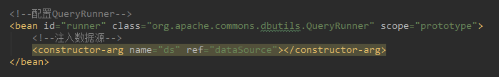

## 1 基于XML的IOC配置案例

### 业务层实现类

```java
/*账户业务层实现类*/
public class AccountServiceImpl implements IAccountService {

    private IAccountDao accountDao;

    public void setAccountDao(IAccountDao accountDao) {
        this.accountDao = accountDao;
    }

    @Override
    public List<Account> findAllAcount() {
        return accountDao.findAllAcount();
    }
    @Override
    public Account findAccountById(Integer accountId) {
        return accountDao.findAccountById(accountId);
    }
    @Override
    public void saveAccount(Account account) {
        accountDao.saveAccount(account);
    }
    @Override
    public void updateAccount(Account account) {
        accountDao.updateAccount(account);
    }
    @Override
    public void deleteAccount(Integer accountId) {
        accountDao.deleteAccount(accountId);
    }
}

```


### 持久层实现类

```java
/*账户持久层Dao*/
public class AccountDaoImpl implements IAccountDao {
    //核心对象
    private QueryRunner runner;
	//使用<
    public void setRunner(QueryRunner runner) {
        this.runner = runner;
    }

    @Override
    public List<Account> findAllAcount() {
        try{
            return runner.query("select * from account",new BeanListHandler<Account>(Account.class));
        }catch (Exception e){
            throw new RuntimeException(e);
        }
    }

    @Override
    public Account findAccountById(Integer accountId) {
        try{
            return runner.query("select * from account where id=?",new BeanHandler<Account>(Account.class) ,accountId);
        }catch (Exception e){
            throw new RuntimeException(e);
        }
    }

    @Override
    public void saveAccount(Account account) {
        try{
            runner.update("insert into account(name,money) values(?,?)" ,account.getName(),account.getMoney());
        }catch (Exception e){
            throw new RuntimeException(e);
        }
    }

    @Override
    public void updateAccount(Account account) {
        try{
            runner.update("update account set name=?,money=? where id=?",account.getName(),account.getMoney(),account.getId());
        }catch (Exception e){
            throw new RuntimeException(e);
        }
    }

    @Override
    public void deleteAccount(Integer accountId) {
        try{
            runner.update("delete from account where id=?" ,accountId);
        }catch (Exception e){
            throw new RuntimeException(e);
        }
    }
}
```


### 配置文件bean.xml


```xml
<?xml version="1.0" encoding="UTF-8"?>
<beans xmlns="http://www.springframework.org/schema/beans"
       xmlns:xsi="http://www.w3.org/2001/XMLSchema-instance"
       xsi:schemaLocation="http://www.springframework.org/schema/beans
        https://www.springframework.org/schema/beans/spring-beans.xsd">
    <!-- 配置业务层对象service-->
    <bean id="accountService" class="com.itheima.service.impl.AccountServiceImpl">
        <!--注入dao对象-->
        <property name="accountDao" ref="accountDao"></property>
    </bean>

    <!--配置Dao对象-->
    <bean id="accountDao" class="com.itheima.dao.impl.AccountDaoImpl">
        <!--注入QueryRunner对象-->
        <property name="runner" ref="runner"></property>

    </bean>


    <!--注意：你有没有注意到QueryRunner如果是单例对象，多个dao使用时，可能会产生线程安全问题。 -->

    <!--配置QueryRunner对象-->
    <bean id="runner" class="org.apache.commons.dbutils.QueryRunner" scope="prototype">
        <!--注入Q-->
        <constructor-arg name="ds" ref="dataSource"></constructor-arg>
    </bean>

    <!--配置数据源-->
    <bean id="dataSource" class="com.mchange.v2.c3p0.ComboPooledDataSource">
        <!--注入连接数据库的必备信息-->
        <property name="driverClass" value="com.mysql.jdbc.Driver"></property>
        <property name="jdbcUrl" value="jdbc:mysql://localhost:3306/eesy?serverTimezone=UTC"></property>
        <property name="user" value="root"></property>
        <property name="password" value="wangxiaoding"></property>
    </bean>
</beans>
```


###  需要注意的点：

> 注意：你有没有注意到QueryRunner如果是单例对象，多个dao使用时，可能会产生线程安全问题。

## 2 基于注释的IOC配置

### 业务层实现类

```java
/*账户业务层实现类*/
@Service(value="accountService")
public class AccountServiceImpl implements IAccountService {

    @Autowired
    private IAccountDao accountDao;

//    public void setAccountDao(IAccountDao accountDao) {
//        this.accountDao = accountDao;
//    }

    @Override
    public List<Account> findAllAcount() {
        return accountDao.findAllAcount();
    }
    @Override
    public Account findAccountById(Integer accountId) {
        return accountDao.findAccountById(accountId);
    }
    @Override
    public void saveAccount(Account account) {
        accountDao.saveAccount(account);
    }
    @Override
    public void updateAccount(Account account) {
        accountDao.updateAccount(account);
    }
    @Override
    public void deleteAccount(Integer accountId) {
        accountDao.deleteAccount(accountId);
    }
}
```
### 持久层实现类
```java
@Repository(value="accountDao")
public class AccountDaoImpl implements IAccountDao {


    //核心对象
    @Autowired  //同一类型唯一，在Spring容器中，使用注解方法的话，set方法也不是必须的了
    private QueryRunner runner;

//    public void setRunner(QueryRunner runner) {
//        this.runner = runner;
//    }

    @Override
    public List<Account> findAllAcount() {
        try{
            return runner.query("select * from account",new BeanListHandler<Account>(Account.class));
        }catch (Exception e){
            throw new RuntimeException(e);
        }
    }

    @Override
    public Account findAccountById(Integer accountId) {
        try{
            return runner.query("select * from account where id=?",new BeanHandler<Account>(Account.class) ,accountId);
        }catch (Exception e){
            throw new RuntimeException(e);
        }
    }

    @Override
    public void saveAccount(Account account) {
        try{
            runner.update("insert into account(name,money) values(?,?)" ,account.getName(),account.getMoney());
        }catch (Exception e){
            throw new RuntimeException(e);
        }
    }

    @Override
    public void updateAccount(Account account) {
        try{
            runner.update("update account set name=?,money=? where id=?",account.getName(),account.getMoney(),account.getId());
        }catch (Exception e){
            throw new RuntimeException(e);
        }
    }

    @Override
    public void deleteAccount(Integer accountId) {
        try{
            runner.update("delete from account where id=?" ,accountId);
        }catch (Exception e){
            throw new RuntimeException(e);
        }
    }

```


### 配置文件bean.xml

```xml
<?xml version="1.0" encoding="UTF-8"?>
<beans xmlns="http://www.springframework.org/schema/beans"
       xmlns:xsi="http://www.w3.org/2001/XMLSchema-instance"
       xmlns:context="http://www.springframework.org/schema/context"
       xsi:schemaLocation="http://www.springframework.org/schema/beans
        http://www.springframework.org/schema/beans/spring-beans.xsd http://www.springframework.org/schema/context https://www.springframework.org/schema/context/spring-context.xsd">

    <!--告知Spring 创建容器时要扫描的包-->
    <context:component-scan base-package="com.itheima"></context:component-scan>

    <!--配置QueryRunner-->
    <bean id="runner" class="org.apache.commons.dbutils.QueryRunner" scope="prototype">
        <!--注入数据源-->
        <constructor-arg name="ds" ref="dataSource"></constructor-arg>
    </bean>

    <!-- 配置数据源 -->
    <bean id="dataSource" class="com.mchange.v2.c3p0.ComboPooledDataSource">
        <!--连接数据库的必备信息-->
        <property name="driverClass" value="com.mysql.jdbc.Driver"></property>
        <property name="jdbcUrl" value="jdbc:mysql://localhost:3306/eesy?serverTimezone=UTC"></property>
        <property name="user" value="root"></property>
        <property name="password" value="wangxiaoding"></property>
    </bean>
</beans>
```
> 使用注解的时候，需要在bean.xml中开启扫描，扫描的约束在context里面。
> 当然，数据源dataSource 与 runner类都还是需要 在配置文件中进行依赖注入的。

## 3 测试代码

```java
public class AccountServiceTest {
    @Test
    public void testFindAll() {
        // 1.获取容器
        ApplicationContext ac = new ClassPathXmlApplicationContext("bean.xml");
        // 2.得到业务层对象
        IAccountService as = (IAccountService) ac.getBean("accountService");
        //3.执行方法
        List<Account> accounts = as.findAllAcount();
        for(Account account:accounts){
            System.out.println(account);
        }

    }

    @Test
    public void testFindOne() {
        // 1.获取容器
        ApplicationContext ac = new ClassPathXmlApplicationContext("bean.xml");
        // 2.得到业务层对象
        IAccountService as = (IAccountService) ac.getBean("accountService");
        //3.执行方法
        Account account= as.findAccountById(1);
        System.out.println(account);
    }

    @Test
    public void testAdd() {
        // 1.获取容器
        ApplicationContext ac = new ClassPathXmlApplicationContext("bean.xml");
        // 2.得到业务层对象
        IAccountService as = (IAccountService) ac.getBean("accountService");
        //3.执行方法
        Account account = new Account();
        account.setId(3);
        account.setName("cccc");
        account.setMoney(2000.0f);
        as.saveAccount(account);
        System.out.println(account);
    }

    @Test
    public void testUpdate() {
        // 1.获取容器
        ApplicationContext ac = new ClassPathXmlApplicationContext("bean.xml");
        // 2.得到业务层对象
        IAccountService as = (IAccountService) ac.getBean("accountService");
        //3.执行方法
        Account account= as.findAccountById(3);
        account.setName("ccc");
        as.updateAccount(account);
        System.out.println(account);
    }
    @Test
    public void testDelete() {
        // 1.获取容器
        ApplicationContext ac = new ClassPathXmlApplicationContext("bean.xml");
        // 2.得到业务层对象
        IAccountService as = (IAccountService) ac.getBean("accountService");
        //3.执行方法
        Account account= as.findAccountById(1);

        as.deleteAccount(4);
    }

}
​```xml

```

## 3 当前案例的pom文件

```xml
<?xml version="1.0" encoding="UTF-8"?>
<project xmlns="http://maven.apache.org/POM/4.0.0"
         xmlns:xsi="http://www.w3.org/2001/XMLSchema-instance"
         xsi:schemaLocation="http://maven.apache.org/POM/4.0.0 http://maven.apache.org/xsd/maven-4.0.0.xsd">
    <modelVersion>4.0.0</modelVersion>
    <groupId>com.itheima</groupId>
    <artifactId>day02_eesy_02account_annoioc</artifactId>
    <version>1.0-SNAPSHOT</version>
    <build>
        <plugins>
            <plugin>
                <groupId>org.apache.maven.plugins</groupId>
                <artifactId>maven-compiler-plugin</artifactId>
                <configuration>
                    <source>6</source>
                    <target>6</target>
                </configuration>
            </plugin>
        </plugins>
    </build>
    <packaging>jar</packaging>
    <dependencies>
        <dependency>
            <groupId>org.springframework</groupId>
            <artifactId>spring-context</artifactId>
            <version>5.2.3.RELEASE</version>
        </dependency>
        <dependency>
            <groupId>commons-dbutils</groupId>
            <artifactId>commons-dbutils</artifactId>
            <version>1.7</version>
        </dependency>
        <dependency>
            <groupId>mysql</groupId>
            <artifactId>mysql-connector-java</artifactId>
            <version>8.0.15</version>
        </dependency>
        <dependency>
            <groupId>com.mchange</groupId>
            <artifactId>c3p0</artifactId>
            <version>0.9.5.5</version>
        </dependency>
        <dependency>
            <groupId>junit</groupId>
            <artifactId>junit</artifactId>
            <version>4.12</version>
            <scope>test</scope>
        </dependency>
    </dependencies>
</project>
```

## 上面第二种模式存在的问题；

问题1： 使用注解进行IOC当中，还有需要使用xml配置文件的地方。


需要进行开启注解扫描。

需要创建容器中的部分对象。

问题2：测试代码中，存在太多重复代码了。

```java
// 1.获取容器
ApplicationContext ac = new ClassPathXmlApplicationContext("bean.xml");
 // 2.得到业务层对象
IAccountService as = (IAccountService) ac.getBean("accountService");
```

### 解决两个问题：

解决问题1：拿掉xml配置、

定义一个配置类，通过注解指定其为配置类，同时指定spring在创建容器时要扫描的包。

```java
/*
* 该类是一个配置类，他的作用和bean.xml是一样的
* spring中的新注解：
*   Configuration
*       作用： 指定当前类是一个配置类
*   ComponentScan/ComponentScan
*       作用： 用于通过注解，指定Spring在创建容器时要扫描的包
*       属性：
*           value: 它和beanPackage的作用是一样的，都是用于指定创建容器时要扫描的包。
*                   我们使用此注解就等于在xml中配置了
*                       <!--告知Spring 创建容器时要扫描的包-->
*                       <context:component-scan base-package="com.itheima"></context:component-scan>
*
*
*
* */
@Configuration
@ComponentScan(basePackages = {"com.itheima"})
//@ComponentScan("com.itheima")
public class SpringConfiguration {
}
```





什么时候使用注解合适，什么时候使用xml配置合适？
- 纯xml配置有的时候还是有些繁琐的。
- 纯注解方式其实也不是方便。
> 所以在选择上：
> 如果容器需要创建的对象在jar包中，直接使用xml配置要方便一些。
> 如果对象是我们自己写的，那么使用注解要方便一些。
> 其实哪个方便就使用哪种配置就好了。


解决问题2：junit单元测试代码很多重复、
junit单元测试代码很多重复原因分析：

- 1.应用程序的入口： main方法、
- 2.junit单元测试中： 没有main方法也能执行。
      junit集成了main方法。
      该方法就会判断当前测试类中哪些方法有@Test注解
      junit就会让有@Test注解的方法执行。（无非就是method.inovke调用一些当前方法）
- 3.junit不会管我们是否采用了spring框架 
      在执行测试方法时，junit根本不知道，我们是不是使用了Spring框架。
      所以也就不会为我们读取配置文件、配置类，创建Spring核心容器
- 4.由以上三点可知
      当测试方法执行时，没有Ioc容器，就算写了Autowired注解，也无法实现注入。

####  解决方法：
SpringConfiguration.java

```java

/*
* 该类是一个配置类，他的作用和bean.xml是一样的
* spring中的新注解：
*   Configuration
*       作用： 指定当前类是一个配置类
*       细节：当配置类作为AnnotaionConfigApplicationContext创建的参数时，注解可以不写。
*
*
*   ComponentScan/ComponentScan
*       作用： 用于通过注解，指定Spring在创建容器时要扫描的包
*       属性：
*           value: 它和beanPackage的作用是一样的，都是用于指定创建容器时要扫描的包。
*                   我们使用此注解就等于在xml中配置了
*                       <!--告知Spring 创建容器时要扫描的包-->
*                       <context:component-scan base-package="com.itheima"></context:component-scan>
*
*   Bean注解：
*        作用：用于将挡墙方法的返回值，存入Spring 的IOC容器中。（存入Spring容器中的对象要有id）
*        属性:
*            name:用于指定bean的id （当不写时，默认值是当前方法的名称）。
*        细节：
*           当我们使用注解配置方法时，如果方法有参数，spring框架回去容器中查找有没有可用的bean对象。
*           查找的方式和Autowired注解是一样的。
*   import注解:
*       作用：用于导入其它配置类
*       属性：
*           value: 用于指定其它配置类字节码。
*                  当我们使用import的注解之后，有Import注解的父类就是父配置类，导入的就是子配置类。（Spring创建容器父子关系多的配置比较合理也比较清晰一些。）
*
*    PropertySource:
*       作用：用于指定properties文件的位置
*       属性：
*           value:指定文件的名称与路径。
*                  关键字：classpath表示类路径下。
* */
//@Configuration
//@ComponentScan(basePackages = {"com.itheima","config"})
@ComponentScan("com.itheima")
@Import(JdbcConfig.class)
@PropertySource(value="classpath:jdbcConfig.properties") //运行部署之后，部署到class的类路径下。
public class SpringConfiguration {

}
```

JdbcConfiguration.java
使用了Configuration注解
SpEL表达式
@Value 成员函数自动依赖注入填充。
@Bean(name="runner") 使用方法返回值，作为容器内创建对象。
 @Scope(value="prototype")   // 使用多例模式
```java

/*
* 和Spring连接数据相关的配置类
* */
//@Configuration
public class JdbcConfig {
    @Value("${jdbc.driver}")
    private String driver;
    @Value("${jdbc.url}")
    private String url;
    @Value("${jdbc.username}")
    private String username;
    @Value("${jdbc.password}")
    private String password;
    /**
     * 方法：用于创建QueryRunner对象。
     * @param dataSource
     * @return QueryRunner
     */
    @Bean(name="runner")
    @Scope(value="prototype")   // 使用多例模式
    public QueryRunner createQueryRunner(DataSource dataSource){
        return new QueryRunner(dataSource);
    }

    /**
     * 方法创建数据源对象。
     * @return
     */
    @Bean(name="dataSource")
    public DataSource createDataSource(){
        ComboPooledDataSource ds= null ;
        try {
            ds =new ComboPooledDataSource();
            ds.setDriverClass(driver);
            ds.setJdbcUrl(url);
            ds.setUser(username);
            ds.setPassword(password);
        } catch (PropertyVetoException e) {
            e.printStackTrace();
        }
        return ds;
    }

}
```
jdbcConfig.properties
使用配置文件就不用在代码中写死了。方便修改。

```properties
jdbc.driver=com.mysql.jdbc.Driver
jdbc.url=jdbc:mysql://localhost:3306/eesy?serverTimezone=UTC
jdbc.username=root
jdbc.password = wangxiaoding
```
### Junit与Spring集成

```java
/*
* 使用junit单元，测试
*
* Spring 整合Junit的配置：
*   1.导入Sring整合Junit的jar包
*   2.使用junit提供的注解，把原有的main方法替换掉，替换成spring提供的
*       @Runwih
*   3.告知spring运行期，spring和ioc的创建时基于xml还是基于注解的，并且说明位置。
*       @ContextConfiguration
*           locations:指定xml文件的位置，加上classpath关键字，表示在类路劲下。
*           classes:指定注解所在的位置。
*   细节：当我们使用Spring 5.x版本的时候，要求junit的版本在4.1.2以及以上的版本。
* */
* 
```
AccountServiceTest具体实现类如下。
```java
@RunWith(SpringJUnit4ClassRunner.class)
@ContextConfiguration(classes = SpringConfiguration.class)
public class AccountServiceTest {
    @Autowired
    private  ApplicationContext ac=null;
    // 2.得到业务层对象
    @Autowired
    private  IAccountService as =null; //accountService

    //作为一个测试工程师，他们可能不熟悉Spring框架，可能无法写出一下代码
    @Before
    public void init(){
        ac=new AnnotationConfigApplicationContext(SpringConfiguration.class);
        // 2.得到业务层对象
        as = (IAccountService) ac.getBean("accountService"); //accountService
    }
    @Test
    public void testFindAll() {

        //3.执行方法
        List<Account> accounts = as.findAllAcount();
        for(Account account:accounts){
            System.out.println(account);
        }

    }
    @Test
    public void testFindOne() {

        //3.执行方法
        Account account= as.findAccountById(1);
        System.out.println(account);
    }
    @Test
    public void testAdd() {

        //3.执行方法
        Account account = new Account();
        account.setId(3);
        account.setName("cccc");
        account.setMoney(2000.0f);
        as.saveAccount(account);
        System.out.println(account);
    }

    @Test
    public void testUpdate() {

        //3.执行方法
        Account account= as.findAccountById(3);
        account.setName("ccc");
        as.updateAccount(account);
        System.out.println(account);
    }
    @Test
    public void testDelete() {
        //3.执行方法
        Account account= as.findAccountById(1);

        as.deleteAccount(4);
    }

}
```

