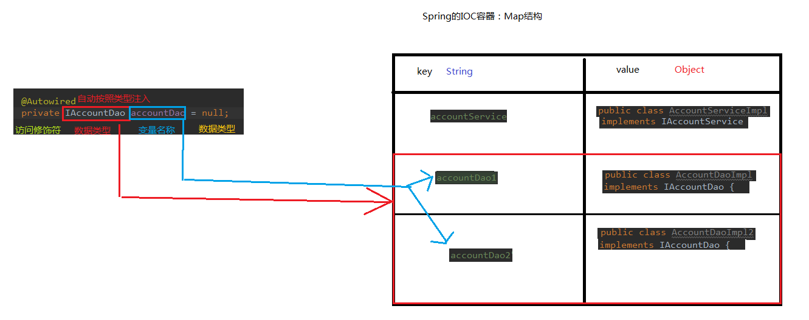

# 基于注解的IOC配置


```java
/*
* 账户的业务层实现类
*
* 曾经的XML配置：
*  <bean id="accountService" class="com.itheima.service.impl.AccountServiceImpl"
*  scope="" init-method="" destroy-method="" >
*       <property name="" value="" ref="" ></property>
*  </bean>
*
*  用于创建对象的 ：
*           他们的作用就和在XML配置文件中编写一个<bean>标签实现的功能是一样的。
*           @Component:
*               作用：用于把当前类对象存入spring容器中。
*               属性：
*                   value：用于指定bean的id. 当我们不写时，它的默认值是当前类名，且首字母改小写。
*               如果只有一个属性的时候，默认是value,value可以不用写，如果两个value.
*           Controller: 一般在表现层、
*           Service:  一般在业务层
*           Repository: 一般是在持久层
*           以上三个注解他们的作用和属性与Component是一模一样的。
*           它们三个是spring框架为我们提供明确的三层使用的注解，使我们的三层对象更加清晰。
*           后3者类似前者子集。
*
*
*  用于注入数据的 ： 他们的作用就和在xml配置文件中的bean标签中写一个<property>标签的作用是一样的。
*             Autowired:
*                   作用：自动按照类型注入。只要容器中有唯一的一个bean对象类型 和 要注入的变量类型匹配，就可以注入成功。
*                   出现位置：可以变量上，也可以使方法上。
*                       如果ioc容器中没有任何bean类型和要注入的变量类型匹配，否则报错。
*                   细节：
*                       在使用注解注入的时候，set方法就不是必须的了
*                       理解：spring 容器可以理解为一个map结构：Map<String,Object>
*
*             Qualifier: (依托于Autowired)
*             作用：在按照类中注入的基础之上再按照名称注入。它在给类成员注入时不能给单独使用。但是在给的方法参数注入时可以，
*             属性：
*                   value:用于指定注入bean id。
*
*             Resource:
*               作用：直接按照bean的id注入。它可以独立使用
*               属性：
*                   name:用于指定bean的id
*
*             以上三个注入，都只能注入其它Bean类型数据，而基本类型和String类型无法使用上诉注解实现。
*             另外，集合类型的注入只能通过xml来实现。
*
*             Value:
*               作用：用于注入基本类型和String类型的数据。
*               属性：
*                   value: 用于指定数据的值。它可以使用spring中的SpEL(也就是spring 的EL表达式){类似于}
*                           SpEL的写法：${表达式}
*             EL表达式是那个框架的，在什么文件中就是什么的表达式，在jsp中就是jsp的EL，在spring.xml配置文件中就是SpEL;同理、
*
*  用于改变作用范围的：他们的作用就和在bean标签中使用scope属性实现的功能一样的
*           Scope:
*               作用：用于指定Bean的作用范围；
*               属性：
*               value:指定范围的取值。取值常用：singleton prototype
*
*  和生命抽泣相关的：他们的作用就和在bean标签中使用init-method 和 destroy-method的作用是一样的。
*           PreDestroy:
*               作用：用于指定销毁之前执行方法。
*           PostConstruct:
*               作用：用于指定初始化之后执行的方法。
* */
@Service(value="accountServiceImpl")
//@Scope(value="prototype")
public class AccountServiceImpl implements IAccountService {
//    @Autowired
//    @Qualifier(value="accountDao1")
    @Resource(name="accountDao1")
    private IAccountDao accountDao ;

    //private IAccountDao accountDao = (IAccountDao) BeanFactory.getBean("accountDao");
    //private int i=1;

    public AccountServiceImpl(){
        System.out.println("AccountService 创建了");
    }

    public void saveAccount() {
        int i=1;
        //业务层 调用持久层
        accountDao.saveAccount();
        System.out.println(i++);
    }

    @PostConstruct
    public void init(){
        System.out.println("初始化方法执行。");
    }
    @PreDestroy
    public  void destroy(){
        System.out.println("销毁方法执行了。");
    }
}

```


## 1 用于创建对象：

相当于：<bean id="" class="">

### @Component

- 作用： 把资源让spring来管理。相当于在xml中配置一个bean。
-  属性： value：指定bean的id。如果不指定value属性，默认bean的id是当前类的类名。首字母小写。

### @Controller @Service @Repository

他们三个注解都是针对一个的衍生注解，他们的作用及属性都是一模一样的。 他们只不过是提供了更加明确的语义化。 @Controller：一般用于表现层的注解。 @Service：一般用于业务层的注解。 @Repository：一般用于持久层的注解。 细节：如果注解中有且只有一个属性要赋值时，且名称是value，value在赋值是可以不写。

## 2 用于数据注入

相当于：
```xml
<property name="" ref="">
<property name="" value="">
```
### @Autowired自动装配

- 作用：自动按照类型注入。当使用注解注入属性时，set方法可以省略。它只能注入其他bean类型。当有多个类型匹配时，使用要注入的对象变量名称作为bean的id，在spring容器查找，找到了也可以注入成功。找不到就报错。

Spring容器中，自动查找原理如下：




### @Qualifier

- 作用： 在自动按照类型注入的基础之上，再按照Bean的id注入。它在给字段注入时不能独立使用，必须和@Autowire一起使用；但是给方法参数注入时，可以独立使用。 

- 属性： value：指定bean的id。

### @Resource

- 作用： 直接按照Bean的id注入。它也只能注入其他bean类型。 
- 属性： name：指定bean的id。

### @Value

- 作用： 注入基本数据类型和String类型数据的 -
-  属性： value：用于指定值

## 3 改变作用范围

相当于：
```xml
<bean id="" class="" scope="">
```

### @Scope

作用： 指定bean的作用范围。 属性： value：指定范围的值。

取值：singleton prototype request session globalsession

## 和生命周期相关的：(了解)

相当于：<bean id="" class="" init-method="" destroy-method="" />

####  @PostConstruct

- 作用： 用于指定初始化方法。

#### @PreDestroy

- 作用： 用于指定销毁方法。

> 问题记录： 