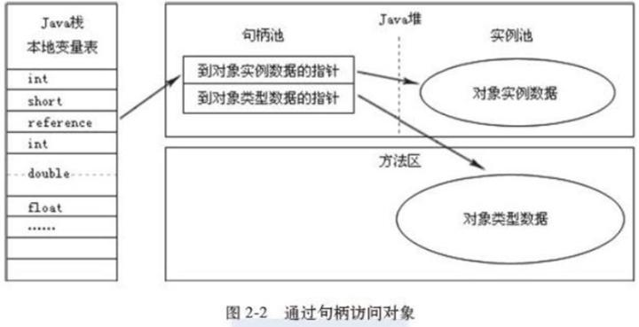
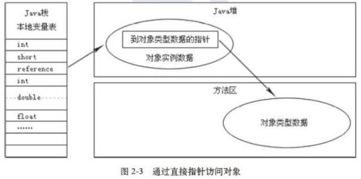

### 对象访问定位

　　介绍完Java虚拟机的运行时数据区之后，我们就可以来探讨一个问题：在Java语言中，对象访问是如何进行的？对象访问在Java语言中无处不在，是最普通的程序行为，但即使是最简单的访问，也会却涉及**Java栈、Java堆、方法区**这三个最重要内存区域之间的关联关系，如下面的这句代码：

**Object obj = new Object();**

假设这句代码出现在方法体中，

- 那"Object obj"这部分的语义将会反映到Java栈的本地变量表中，作为一个reference类型数据出现。

- "new Object()"这部分的语义将会反映到Java堆中，形成一块存储了Object类型所有实例数据值（Instance Data，对象中各个实例字段的数据）的结构化内存，根据具体类型以及虚拟机实现的对象内存布局（Object Memory Layout）的不同，这块内存的长度是不固定的。

- 另外，在Java堆中还必须包含能查找到此对象类型数据（如对象类型、父类、实现的接口、方法等）的地址信息，这些类型数据则存储在方法区中。

>  但是关于reference类型在Java虚拟机规范里面只规定了一个指向对象的引用，并没有定义这个引用应该通过哪种方式去定位，以及访问到Java堆中的对象的具体位置，因此不同虚拟机实现的对象访问方式会有所不同。

主流的访问方式有两种：

- 使用句柄访问
- 直接指针。

#### 使用句柄访问方式 

如果使用句柄访问方式，Java堆中将会划分出一块内存来作为**句柄池**，reference中存储的就是对象的**句柄地址**，而句柄中包含了对象实例数据和类型数据各自的具体地址信息，如下图所示：

#### 直接指针访问方式

如果使用的是直接指针访问方式，Java 堆对象的布局中就必须考虑如何放置访问类型数据的相关信息，reference中直接存储的就是对象地址，如下图所示：

这两种对象的访问方式各有优势;

**使用句柄访问方式的最大好处**就是reference中存储的是稳定的句柄地址，在对象被移动（垃圾收集时移动对象是非常普遍的行为）时只会改变句柄中的实例数据指针，而reference本身不需要被修改。

**使用直接指针访问方式的最大好处**就是速度更快，它节省了一次指针定位的时间开销，由于对象的访问在Java中非常频繁，因此这类开销积少成多后也是一项非常可观的执行成本。

>  就本书讨论的主要虚拟机Sun HotSpot而言，它是使用第二种方式进行对象访问的，但从整个软件开发的范围来看，各种语言和框架使用句柄来访问的情况也十分常见。

