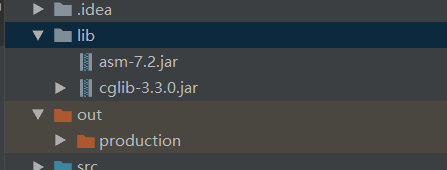

# 实战OutOfMemoryError异常

除了程序计数器之外，虚拟机内存的其它几个区域都会发生OOM异常的可能；


## 1  Java 堆溢出

```java
package com.jvmlearning;

import java.util.ArrayList;
import java.util.List;

public class HeapOOM {
    /**
     * VM args: -Xms20m -Xmx20m -XX:+HeapDumpOnOutOfMemoryError
     */

    static class OOMObject{
    }

    public static void main(String[] args) {
        List<OOMObject> list = new ArrayList<>();
        while(true) {
            list.add(new OOMObject());
        }
    }
}
```


### 处理异常

通过内存映像分析工具

比如Eclipse Memory Analyzer 对Dump 出来的快照继续分析进行分析：

重点分析堆里面的对象是否是必要的，也就是分清楚是：

- 内存泄漏 Memory Leak
- 内存溢出 Memory Overflow


（1）如果是内存泄漏 可以查看GC Roots的引用链：

 于是就能看到泄漏的对象是通过怎样的路径与GC Root相关联，导致垃圾收集器无法自动回收它们的。

掌握了泄漏对象的类型信息 和GC Root的引用链信息，就可以比较准确的定位泄漏代码的位置；


（2）如果不存在泄漏，则检查并且调整 VM堆参数 

```shell
-Xmx
-Xms
```


## 2 虚拟机栈和本地方法栈溢出：

HotSpot虚拟机中 不区分 **虚拟机栈** 和**本地方法栈**

```shell
-Xoss 无效
-Xss 设定栈容量
```

Java 虚拟机规定了两种异常：

- 如果线程请求栈深度 大于 虚拟机所允许的最大深度， 将抛出OutOfMemoryError异常；

- 如果虚拟机在拓展栈时无法申请到足够的内存空间，则抛出OutOfMemoryError异常；


```java
package com.jvmlearning;

public class JavaVMStackSOF {
    /**
     * -Xss128k
     */
    public  int stackLength = -1;
    public void stackLeak(){
        stackLength ++;
        stackLeak();
    }

    public static void main(String[] args) {
        JavaVMStackSOF oom = new JavaVMStackSOF();
        try {
            oom.stackLeak();
        }catch (Throwable e){
            System.out.println("stack length:" + oom.stackLength);
            throw e;
        }
    }
}
```


操作系统为每个进程的内存是有限制的，比如32位 windows的限制为2GB。 

虚拟机提供参数来控制Java堆和方法区两个部分内存的最大值，

那么剩余内存容量为：2GB - Xmx(最大堆容量) - MaxPermSize(最大方法区容量)；

程序计数器内存消耗很小，可以忽略；虚拟机进程本身消耗的内存不计算在内。

剩余内存就是   虚拟机栈，和本地方法区；

每个线程分配到栈容量越大，可建的线程数目自然就越少了；


## 3 方法区和运行时常量池溢出


JDK 1.7 以后，开始逐步"去永久代"。


String.intern()是一个native方法，其作用是：

- 如果字符串常量池中已经包含了一个等于此String对象的字符串，则返回代表池(字符串常量池中的对象)中这个字符串的String对象；

- 否则，此String对象包含的字符串添加到常量池中，并且返回此String对象(字符串常量池中的对象)的引用；

> 这边不理解可以结合之前的字符串常量池的学习笔记：比较仔细

下面的设置了参数，限制了方法区的大小：

```java
package com.jvmlearning;

import java.util.ArrayList;
import java.util.List;

public class RuntimeConstantPoolOOM {
    /**
     *  -XX:PermSize=10M -XX:MaxPermSize=10M
     * @param args
     */
    public static void main(String[] args) {
        //使用List来保持常量池的引用， 避免Full GC回收常量的行为
        List<String> list = new ArrayList<>();
        //10MB的 PermSize 在Integer 范围内已经足够产生OOM
        int i = 0;
        while(true) {
            list.add(String.valueOf(i++).intern());
        }

    }
}

```

在JDK1.6的版本好像会出现OutOfMemroyError异常：


但是我的电脑的JDK版本是1.8 就没有出现异常：


```shell
 -Xmx (最大堆容量) 
 -MaxPermSize (最大方法区容量)
 -Xms 
 -Xss(设定栈容量)
```


```java
package com.jvmlearning;

public class RuntimeConstantPoolOOM1 {
    public static void main(String[] args) {
        String str1 = new StringBuilder("计算机").append("软件").toString();
        System.out.println(str1.intern() == str1);
        String str2 = new StringBuilder("ja").append("va").toString();
        System.out.println(str2.intern() == str2);

    }
}
true
false
```


解析如下：


>  但是这边还是不了解: 为什么java关键字在默认就在常量池里面；    ??????????????


在1.6版本的JDK: 会得到两个False 因为内存地址比如不一样，一个是在方法区，一个是在java堆区。

inern（）方法会把首次遇到的字符串，复制到永久代，并且返回的也是永久代里面的字符串实例的引用；


**通过CGLib动态生成类：**

```java
package com.jvmlearning;

import net.sf.cglib.proxy.Enhancer;
import net.sf.cglib.proxy.MethodInterceptor;
import net.sf.cglib.proxy.MethodProxy;

import java.lang.reflect.Method;

public class JavaMethodAreaOOM {
    // -XX:PermSize=10M -XX:MaxPermSize=10M
    public static void main(String[] args) {
        while(true) {
            Enhancer enhancer = new Enhancer();
            enhancer.setSuperclass(OOMObject.class);
            enhancer.setUseCache(false);
            enhancer.setCallback(new MethodInterceptor() {
                @Override
                public Object intercept(Object o, Method method, Object[] objects, MethodProxy methodProxy)
                        throws Throwable {
                    return methodProxy.invokeSuper(o, args);
                }
            });
            enhancer.create();
        }
    }
    static class OOMObject{}
}
```

**注意额外导入两个Jar包，不然会报错的**




## 4 本机直接内存溢出

使用unsafe类

代码越过了 DirectByteBuffer类，通过反射获取了Unsafe实例进行内存分配；

DirectByteBuffer分配内存也会导致内存溢出溢出OOM, 这个是通过计算的出来的，并没有真正的通过向操作系统申请分配内存；

unsafe.allocateMemory()  真正向操作系统申请内存分配，手动抛出异常；

```JAVA
package com.jvmlearning;

import sun.misc.Unsafe;

import java.lang.reflect.Field;

/**
 * -Xmx20M -XX: MaxDirectMemorySize=10M
 */
public class DirectMemoryOOM {

    public static void main(String[] args) throws IllegalAccessException {
        Field unsafeField = Unsafe.class.getDeclaredFields()[0];
        unsafeField.setAccessible(true);
        Unsafe unsafe = (Unsafe) unsafeField.get(null);
        while(true) {
            unsafe.allocateMemory(10000);
        }
    }
}
```


DirectMemory导致的溢出，有个明显特征就是Heap Dump文件中，不会看到明显的异常；

如果发现OOM之后，Dump文件很小，而程序中又直接或者间接使用了NIO，可以考虑这个原因；