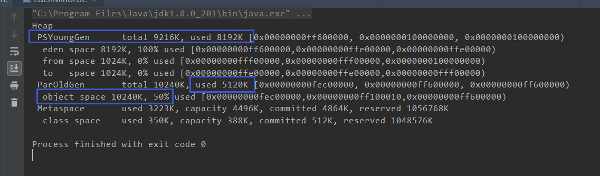
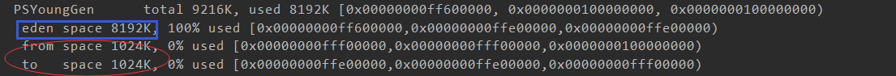
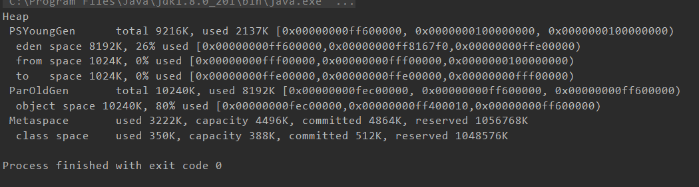
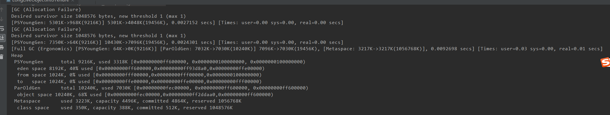

# 垃圾回收器与内存分配策略


## 1 引用计数法 Reference Counting


判断对象是否存活算法： 

- 给每个对象增加一个引用计数，每当一个地方引用它，计数器值加 1 ；

- 对象引用失效时，计数器的值就减 1 。
- 任何时刻计数器为 0 的对象就是不可能被使用了。


客观角度来说，引用计数法是一种不错的算法，判定效率也很高，大部分时间是一个不错的算法；有不少著名的案例；比如 巨硬的Component Object Model技术； Python语言；

但是Java虚拟机没有选用引用计数算法来管理内存，主要的原因就是难以解决对象之间循环应用的问题；


```java
public class ReferenceCountingGC {
    public Object instance = null;
    private static final int _1MB = 1024 * 1024;

    private byte[] bigSize = new byte[2 * _1MB];

    public static  void testGC(){
        ReferenceCountingGC objA =new ReferenceCountingGC();
        ReferenceCountingGC objB = new ReferenceCountingGC();
        objA.instance = objB;
        objB.instance = objA;
        objA =null;
        objB =null;
        System.gc();
    }

    public static void main(String[] args) {
        ReferenceCountingGC.testGC();
    }
}
```

这个代码没有任何问题：足够说明了Java虚拟机中使用的内存管理算法，不是引用计数算法；


## 2 可达性分析算法

主流的商用编程语言（Java , C# , 古老的Lisp）的主流实现都是通过可达性分析（Reachability Analysis）来判断对象是否存活。

算法的思路：就是通过一系列的被称为“GC Roots”对象作为起点，从这些节点开始向下搜索，搜索走过的路径（称为引用链），当一个对象到达GC Roots没有任何引用链相连的时候，证明这个对象是不可用的；


Java语言中，可以作为GC Roots对象包括下面几种，

- **虚拟机栈**（栈帧中本地变量表）中引用的对象。
- **方法区**中类静态属性引用的对象。
- 方法区中常量引用对象
- 本地方法栈中JNI(一般说的Native方法)引用的对象。


### 对象在缓刑区

宣告一个对象死亡，至少需要经过两次标记过程。

如果对象执行可达性分析之后，发现没有与GC Roots相连接的引用链，那么它将会第一次被标记，并且进行一次筛选；筛选的条件是，此对象是否有必要执行finalize()方法。 

当对象没有覆盖finalize方法 或 finalize() 方法已经被虚拟机调用过了之后，虚拟机将是视这两种情况为 “没有必要执行”；

如果一个对象被判断为由必要执行finalize()方法，那么这个对象将会被放置到F-Queue队列中，并且在稍后由虚拟机自动建立，一个低优先级的Finalizer线程去执行它。

**虚拟机承诺会触发这个方法，但是不会承诺等待它允许结束。**

> 如果一个对象在finalize()方法中执行缓慢，或者发生死循环，会导致F-Queue队列中其它对象永久处于等待状态，甚至导致整个垃圾回收系统奔溃。


也就是说finalize（）方法是对象逃脱死亡的最后一次机会；

后续，GC将会对F-Queue中对象进行二次小规模标记，如果对象在finalize()方法中成功拯救自己，那么第二次标记时，就会它将被移出"即将回收的集合"。 如果这时候对象还没有逃离，那么基本上就是被回收了。

>  finalize()方法中成功拯救自己的方法 ： 把自己（this关键字），赋值给某个类变量，或者某个对象的成员变量；


### finalize()方法测试

```java
package GarbageCollection;

public class FinalizeEscapeGC {
    public static FinalizeEscapeGC SAVE_HOOK = null;
    public void isAlive(){
        System.out.println("yes iam still alive:)");
    }

    @Override
    protected void finalize() throws Throwable {
        super.finalize();
        System.out.println("finalize method executed.");
        FinalizeEscapeGC.SAVE_HOOK = this;
    }

    public static void main(String[] args) throws InterruptedException {
        SAVE_HOOK = new FinalizeEscapeGC();
        //对象第一次成功拯救自己
        SAVE_HOOK = null;
        System.gc();
        //因为finalizer 方法优先级和很低，因此暂停0.5秒主线程
        Thread.sleep(500);
        if(SAVE_HOOK != null) {
            SAVE_HOOK.isAlive();
        } else {
            System.out.println("no, i am dead:(");
        }

        SAVE_HOOK = null;
        System.gc();
        //因为finalizer 方法优先级和很低，因此暂停0.5秒主线程
        Thread.sleep(500);
        if(SAVE_HOOK != null) {
            SAVE_HOOK.isAlive();
        } else {
            System.out.println("no, i am dead:(");
        }
    }
}
```


## 3 回收方法区


## 6 内存分配与回收策略

Java技术体系所说内存管理主要归纳为两类：

- 给对象分配内存
- 回收分配给对象的内存

最普遍的几条内存分配的规则如下


### 6.1 对象优先分配在Eden分配

对象优先分配在新生代Eden区域中，Eden区域没有足够的内存空间的时候，会发起Minor GC

使用以下命令收集日志参数：

```shell
-XX:+PrintGGDetails
```

告诉虚拟机发生在垃圾收集行为时打印回收日志，并且在进程退出的时候，输出当前的内存各区域分配情况。


```java
package GarbageCollection;

/**
 * -verbose:gc -Xms20M -Xmx20M -Xmn10M -XX:+PrintGCDetails -XX:SurvivorRatio=8
 */
public class EdenMinorGC {

    public static void main(String[] args) {
        EdenMinorGC.testAllocation();
    }

    private static  final int _1MB = 1024 * 1024;

    public static void testAllocation(){
        byte[] allocation1,allocation2, allocation3, allocation4;
        allocation1 = new byte[2 * _1MB];
        allocation2 = new byte[2 * _1MB];
        allocation3 = new byte[2 * _1MB];
        allocation4 = new byte[5 * _1MB]; //出现第一次Minor GC
    }
}
```

jdk1.8的结果如下所示：




我们通过设置了-Xms20M -Xmx20M -Xmn10M 三个参数，限制了java堆大小为20M且不可拓展；

其中10M分配给了新生代，10M分配给了老年代。

-XX:SurvivorRatio=8 设定了新生代中Eden 区 和一个Survivor区空间比例是8 : 1 

新生代的总共可用空间是9216K（一个Survivor + 一个Eden区）




在执行 ` allocation4 = new byte[5 * _1MB]; //出现第一次Minor GC`语句时候，会发生一次MinorGC;

> 虚拟机发现3个2MB大小的对象无法全部放入Survivor区，所以只能通过分配担保机制提前转移到了老年代区域；（书上这么写，但是jdk8中好像结果不是这样的）

如上图，jdk1.8中的结果是直接将allocate4分配到了老年代去了；


如果改成allocation4 = 3 MB就会正常了

```output
[GC (Allocation Failure) [PSYoungGen: 8117K->776K(9216K)] 8117K->6928K(19456K), 0.0039964 secs] [Times: user=0.00 sys=0.00, real=0.00 secs] 
[Full GC (Ergonomics) [PSYoungGen: 776K->0K(9216K)] [ParOldGen: 6152K->6780K(10240K)] 6928K->6780K(19456K), [Metaspace: 3216K->3216K(1056768K)], 0.0080858 secs] [Times: user=0.03 sys=0.00, real=0.02 secs] 
Heap
 PSYoungGen      total 9216K, used 3154K [0x00000000ff600000, 0x0000000100000000, 0x0000000100000000)
  eden space 8192K, 38% used [0x00000000ff600000,0x00000000ff914930,0x00000000ffe00000)
  from space 1024K, 0% used [0x00000000ffe00000,0x00000000ffe00000,0x00000000fff00000)
  to   space 1024K, 0% used [0x00000000fff00000,0x00000000fff00000,0x0000000100000000)
 ParOldGen       total 10240K, used 6780K [0x00000000fec00000, 0x00000000ff600000, 0x00000000ff600000)
  object space 10240K, 66% used [0x00000000fec00000,0x00000000ff29f158,0x00000000ff600000)
 Metaspace       used 3222K, capacity 4496K, committed 4864K, reserved 1056768K
  class space    used 350K, capacity 388K, committed 512K, reserved 1048576K
```

这个就满足了书里面的要求， 将3个2MB的对象全部移动到了老年代tenuring；


### 6.2 大对象直接进入老年代

通过设置参数,另使得大于这个值的对象在老年代中分配；

```shell
-XX:PretenureSizeThreshold=3145728
```


```java
package GarbageCollection;

/*
    -verbose:gc -Xms20M -Xmx20M -Xmn10M -XX:+PrintGCDetails -XX:SurvivorRatio=8 -XX:PretenureSizeThreshold=3145728
 */
public class BigObjectTenuring {
    public static void main(String[] args) {
        BigObjectTenuring.testPretenureSizeThreshold();
    }

    private  static final int _1MB = 1024 * 1024;

    public static  void testPretenureSizeThreshold(){
        byte[] allocation;
        allocation = new byte[8 * _1MB]; //直接分配内存到老年代
    }
}
```





### 6.3 长期存活的对象将进入老年代

虚拟机采用了分代收集的思想来管理内存。内存回收的时候，就必须能够识别哪些对象放在了新生代，哪些对象在老年代。

为了做到这一点，虚拟机给每个对象定义了一个对象年龄（Age）计数器。

如果对象在Eden出生，并且经过第一次MinorGC之后，任然存活，并且能够被Survivor区容纳的话，就会被移动到Survivor区当中，并且对象年龄设置为1。

对象每熬过一次MinorGC ， 年龄就会增加1岁，年龄增加到一定程度默认就是（15岁），就会晋升到老年代中。

晋升到老年代的阈值可以通过 `-XX:+PrintTenuringDistribution` 进行设置；


```java
package GarbageCollection;
/*
    -verbose:gc -Xms20M -Xmx20M -Xmn10M -XX:+PrintGCDetails -XX:SurvivorRatio=8 -XX:MaxTenuringThreshold=1
      -XX:+PrintTenuringDistribution
 */
public class LongLiveObjectIntoTenure {
    private  static final int _1MB = 1024 * 1024;

    public static  void testPretenureSizeThreshold(){
        byte[] allocation1 , allocation2, allocation3,allocation5;
        allocation1 = new byte[_1MB / 4]; //256KB
        allocation2 = new byte[_1MB * 3]; //3MB
        allocation3 = new byte[_1MB * 3]; //3MB
        allocation5 = new byte[_1MB * 3]; //3MB
        allocation3 = null;
        allocation3 = new byte[_1MB * 3];
    }

    public static void main(String[] args) {
        LongLiveObjectIntoTenure.testPretenureSizeThreshold();
    }
}

```

```out
[GC (Allocation Failure) 
Desired survivor size 1048576 bytes, new threshold 1 (max 1)
[PSYoungGen: 5301K->968K(9216K)] 5301K->4048K(19456K), 0.0027152 secs] [Times: user=0.00 sys=0.00, real=0.00 secs] 
[GC (Allocation Failure) 
Desired survivor size 1048576 bytes, new threshold 1 (max 1)
[PSYoungGen: 7350K->64K(9216K)] 10430K->7096K(19456K), 0.0024301 secs] [Times: user=0.00 sys=0.00, real=0.00 secs] 
[Full GC (Ergonomics) [PSYoungGen: 64K->0K(9216K)] [ParOldGen: 7032K->7030K(10240K)] 7096K->7030K(19456K), [Metaspace: 3217K->3217K(1056768K)], 0.0092698 secs] [Times: user=0.03 sys=0.00, real=0.01 secs] 
Heap
 PSYoungGen      total 9216K, used 3318K [0x00000000ff600000, 0x0000000100000000, 0x0000000100000000)
  eden space 8192K, 40% used [0x00000000ff600000,0x00000000ff93d8a0,0x00000000ffe00000)
  from space 1024K, 0% used [0x00000000fff00000,0x00000000fff00000,0x0000000100000000)
  to   space 1024K, 0% used [0x00000000ffe00000,0x00000000ffe00000,0x00000000fff00000)
 ParOldGen       total 10240K, used 7030K [0x00000000fec00000, 0x00000000ff600000, 0x00000000ff600000)
  object space 10240K, 68% used [0x00000000fec00000,0x00000000ff2ddaa0,0x00000000ff600000)
 Metaspace       used 3223K, capacity 4496K, committed 4864K, reserved 1056768K
  class space    used 350K, capacity 388K, committed 512K, reserved 1048576K
```


设置晋升老年代的年龄阈值为1：

则在执行 allocation3 = new byte[_1MB * 3];时，由于剩余内存不够触发MinorGC。设置阈值为1，




这边这个还有点问题：先放一下，代码结果好像和想的不一样啊


### 6.4 动态对象年龄判断

为了更好适应不同程序的内存状况，虚拟机并不是永远按照要求对象的年龄必须达到了MaxTenuringThreshold才能晋升老年代，如果survivor空间中，相同年龄所有对象的大小，总和达到了survivor空间一半，年龄大于或者等于该年龄的对象就可以直接进入老年代，无需等到MaxTenuringThreshold。要求的年龄；


这边代码运行不出这个想要的效果很尴尬


### 6.5 空间分配担保

流程：


在发生Minor GC之前，虚拟机会检查**老年代最大可用连续空间**，是否大于**新生代所有对象总空间**。

如果这个条件成立，那么，那么Minor GC确定是安全的。

如果**不成立**，则虚拟机会查看HandlePromotionFailure 设置值是否允许担保失败；

​		如果允许，则会检查**老年代最大可用连续空间**是否大于**历次晋升到老年代对象的平均水平大小**；

​						如果大于，则尝试进行一次Minor GC,  尽管这次Minor GC是有风险的；

​						如果小于，则改为进行一次Full GC；

​      HandlePromotionFailure设置为不允许冒险，则改为进行一次Full GC；


"冒险"是冒了怎么样的风险：新生代使用了复制收集算法，为了提高内存利用率，只使用其中一个Survivor空间来作为轮换备份，因此，当大量对象在Minor GC之后，任然存活的情况下，（最极端的情况就是，内存回收后新生代中所有的对象都存活），需要老年代进行分配担保，把Survivor无法容纳的对象直接进入老年代。（与生活中的贷款场景类似，老年代需要进行这样的担保，前提是老年代本身还有足够的空间容纳这些对象，但是一共有多少对象存活下来，其实是在实际内存回收之前无法知道的，只好取之前每一次晋升到老年代对象容量的平均大小作为经验值，与老年代剩余的空间进行比较，决定是否进行Full GC来让老年代腾出更大的空间；

取平均值进行比较，是一种动态概率的手段，也就是说如果某次Minor GC存活的对象数目激增，远远高于平均值，依然会导致担保失败（Handle Promotion Failture）。如果出现Handle Promotion Failure之后，只好从新发起一次Full GC。

虽然担保会失败，失败之后，绕了一个圈子，进行了无效的Minor GC，绕的圈子比较大，但是大部分情况下，还是会将HandlePromotionFailture开关打开，避免Full GC 过于频繁。


```shell
-XX:-HandlePromotionFailure
```


115


## 英文单词学习

Eden   英[ˈiːdn]美[ˈiːdn]

伊甸园(人类始祖背叛上帝前居住的乐园);

tenure	英[ˈtenjə(r)]    美[ˈtenjər]
n.	(尤指重要政治职务的) 任期，任职; (尤指大学教师的) 终身职位，长期聘用; (房地产的) 保有权，保有期;


minor	英[ˈmaɪnə(r)]   美[ˈmaɪnər]
adj.	较小的; 次要的; 轻微的; 小调的; 小音阶的;
n.	未成年人; 辅修科目; 辅修课程;
v.	辅修;


major	英[ˈmeɪdʒə(r)]   美[ˈmeɪdʒər]
adj.	主要的; 重要的; 大的; 严重; 大调的;
n.	少校; 主修课程; 专业课; 主修学生; 主修生;
v.	主修，专攻;

