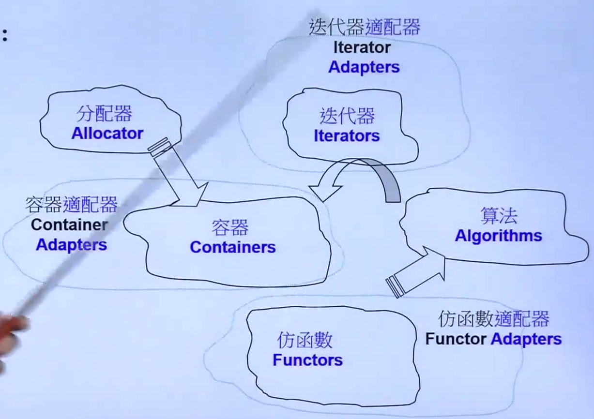
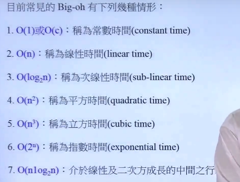
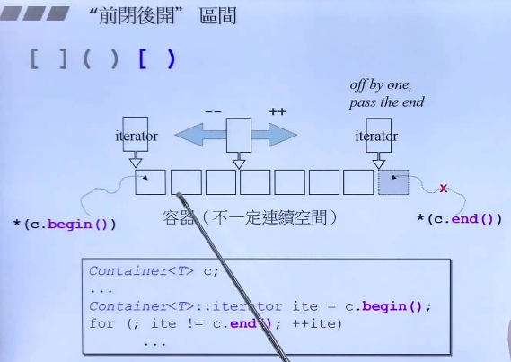

# STL源码学习

## 概述

by 侯捷 

>  使用一个东西，却不明白它的原理并不高明。—— 林语堂 

`level1 `学习的目标：心中自有丘壑。

需要清除它在内存里是长什么样子，它是怎么拓展的， 当你放一百万个元素的时候，它长得是什么样子的图。

才能够决定或者判断，使用哪种容器，哪一种算法，会能够达到最好的效果。

`level2`学习目标： 良好的使用C++标准库。

两个名词解析：

C++ Standard Library `==>`C++ 标准库

Standard Template Library `==>` STL 标准模板库

```C++
#include <iostream>
#include <vector>
```

所有的新式的组件封装于namespace std;    比如vector的全名是std::vector 使用方法：

```
using namespace std;
using std::cout;
```

## 重要的网站和网页：

[www.cplusplus.com](www.cplusplus.com)

[en.cppreference.com](en.cppreference.com)

[gcc.gnu.org](gcc.gnu.org)


## STL 六大组件（Components）:

- 容器（Containers）
- 分配器（Allocators）
- 算法（Algorithm）
- 迭代器（Iterators）
- 适配器（Adapaters）
- 仿函数（Functors）




```C++
int main(){
    int ia[ 6 ] ={27, 210,12,47,109,83};
    vector<int allocator<int>> vi(ia,ia+6);
    cout << count_if(vi.begin(),vi.end(),
                    notl(bind2nd(less<int>(),40)));
	return 0;
}
//begin ,end 迭代器
//count_if 算法
//notl 不小于         function adapter适配器 negator
//bind2nd           function adapter适配器 binder    //网友说14弃用了？没有验证。
//less<int>()       function  Objec仿函数
//40               predicate 
```

## 常见的复杂度Complexity Big-oh：



时间复杂度从低到高一次是：

- O(1)  O(c）常数时间
- O(log2 n) 对数时间
- O(n)    线性时间
- O(n*log2 n)   次线性时间复杂  线性对数时间
- O(n^2)   平方时间
- O(n^3)  立方时间
- O(2^n)  指数时间
- O(n!) 阶层时间 

> 复杂度要成立，只有工业级的数量才能成立。

## Range前闭后开的区间。



> 容器不一定是连续空间。
>
> 可能是一个链表，一棵树，一个hashtable

不管是什么容器，

c.end() 返回一个泛化的指正iterator；

## 泛华的指针iterator。

```c++
Container<T> c;
//...
Container<t>::iterator ite = c.begin();
for(;c!=c.end(); c++)
	//....;
```

iterator是一个泛化的指针，指针能够进行的操作，iterator都能进行。比如指针++，-- ，解引用操作

### 遍历容器::C++11

range-based for statement.(since C++11) 基于范围的语句

```C++
//for loop语法
for(declare:collection){
    statement;
}
for(int i:{2,3,4,5,6,7}){
	cout<< i<<endl;
}
for(auto elem : vec){
    cout << elem << "\n";
}
for(auto& elem :vec){
    elem *= 3;
}
```

auto变量：自动变量推断，是由编译器帮我们自动推断遍历的类型。

```C++
list<string> c;
auto ite = find(c.begin(),c.end(),target);
```

```c++
list<string> c;
list<string>::iterator ite;
ite = find(c.begin(),c.end(),target);
```


Generic Programming (GP,泛型编程) 

就是使用template(模板)来。

## 关联容器

```c++
multiset
unorder_multiset
multimap 
unorder_multimap
```

RB-tree

