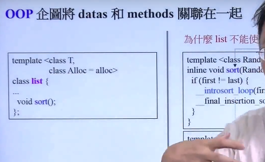
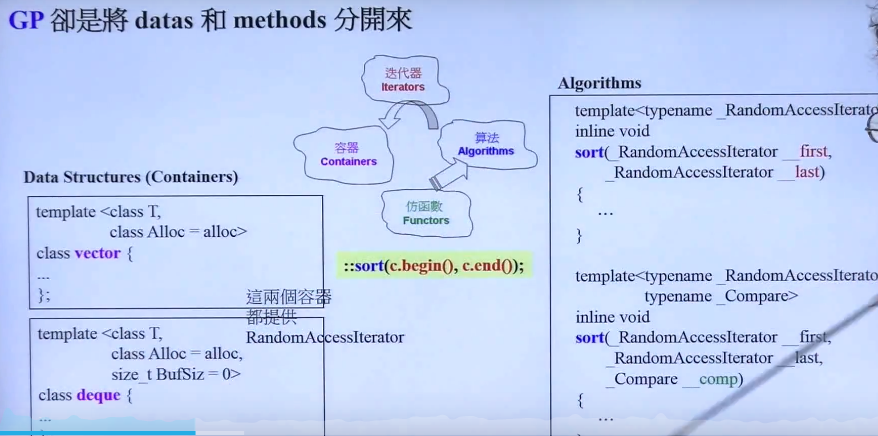
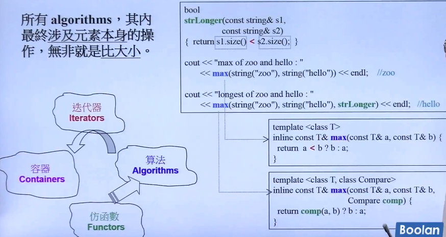

## OOP企图将data与method方法分开来：

标准库内置的sort内置函数：使用的条件迭代器是随机访问指针(迭代器)。

list里面的迭代器，不能满足这个要求。

## Data Structures(Containers)

vector和deque都没有内置的排序函数。方法。

方法放置在独立的算法模块。

#### 采用GP：

Container和Algorithms团队可以各自闭门造车，期间以迭代器沟通就行了、
Algorithms通过Iterators确定操作范围，并且通过Iterators取用Container元素。

比如字符串默认比较方式，是字典序比较；我们为了方便使用可以定义自己的比较器；算法其实涉及到元素本身的操作其实就是比较大小。（常见的操作有倒置）