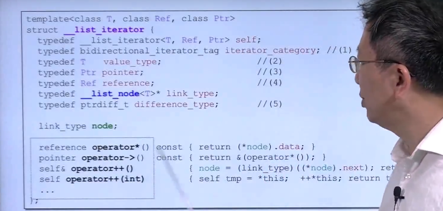
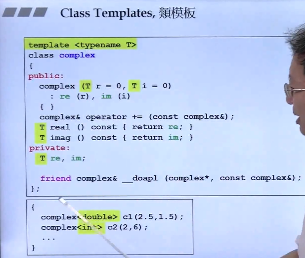
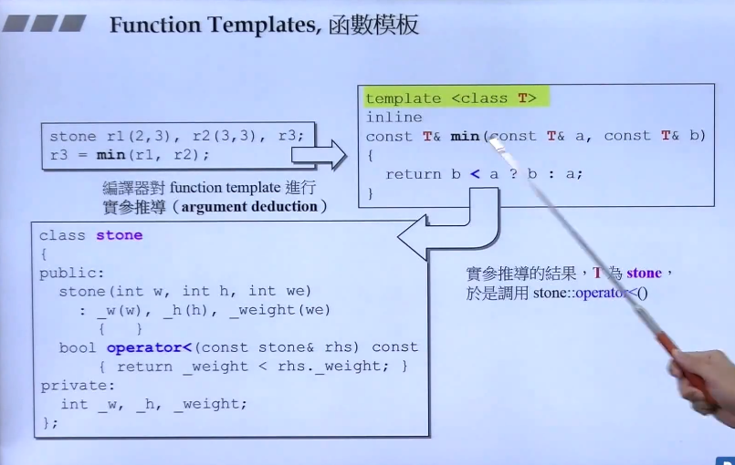
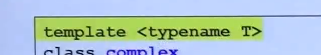
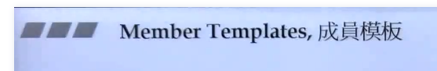
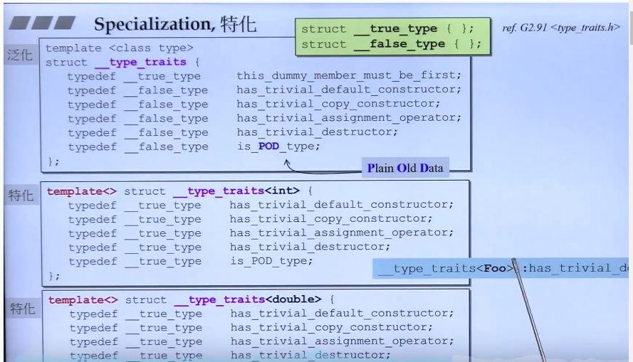
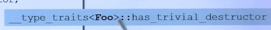
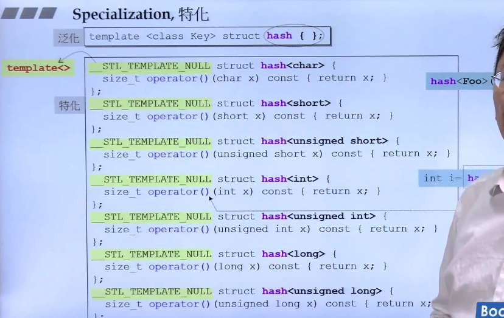
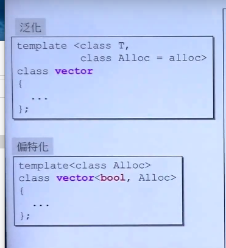
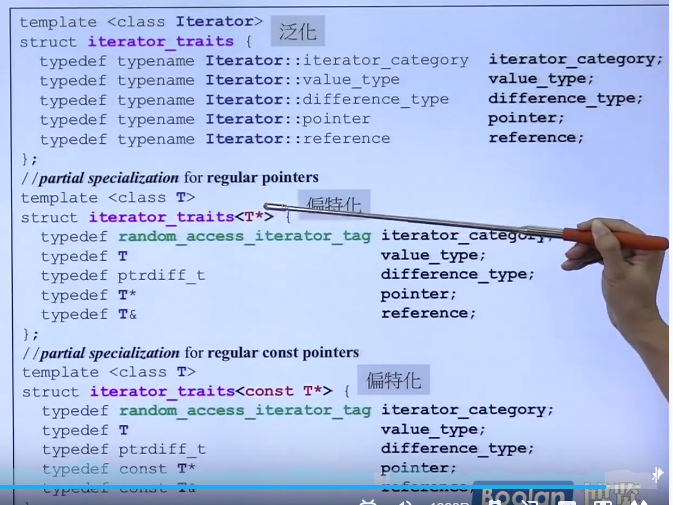

操作符重载使用什么方法。

模板Class Templates 

### 模板类

### 函数模板：

编译器会做是实际参数的推导，因此在比较大小的时候，T为stone那么就会去调用stone::operator<()

操作。	

### 成员模板

## Specialization 特化，

侯捷老师拒了个例子，关于计算机图形学中绘制一条直线的案例。

我们学校过一条直线的数学方程式，两个点之间的连线上的所有点，是实数。

但是计算机屏幕上实际上是一个又一个的像素点，在表示成坐标的时候都是整数。

因此某位大佬就提出了同一种特例算法，这些算法引用到绘制图形的时候非常快。

比如：下面这行调用，匹配泛华，不能匹配特例，因此直接使用泛华方法。

这是hash散列表的一部分

Partial Specialization偏特化

·

如果T是bool类型，那么可以使用更加精简的方式对其进行存储。对这种类型进行特例化、

泛化传进来的参数如果是一个指针，在进行偏偏特化、