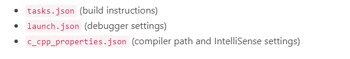
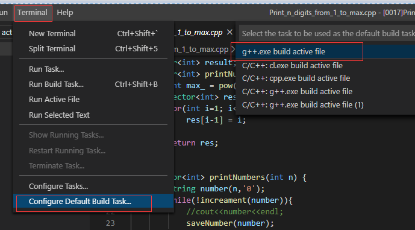
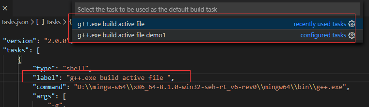
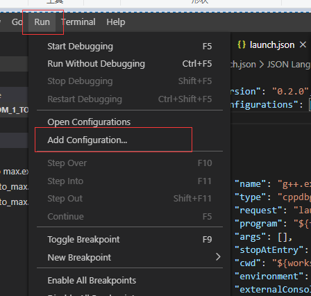
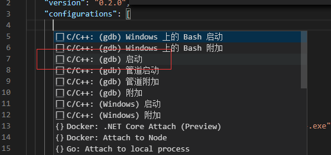
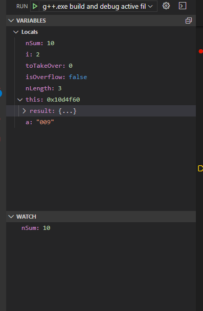
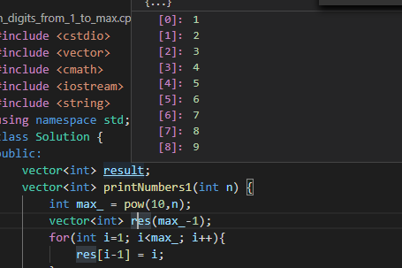

# 使用VSCode 

## 1 编译调试C++程序


### 1.1 需要安装mingw

https://sourceforge.net/projects/mingw-w64/files/Toolchains%20targetting%20Win32/Personal%20Builds/mingw-builds/installer/mingw-w64-install.exe/download

### 1.2 配置环境

Path

检查安装是否完成：

```shell
g++ --version
gdb --version
```

构建说明：




### 1.3 添加任务配置task.json  文

该文件会告诉VS Code如何编译 源码：




### 1.4 task.json文件内容分析：

```json
{
  "version": "2.0.0",
  "tasks": [
    {
      "type": "shell",
      "label": "g++.exe build active file",
      "command": "C:\\mingw-w64\\i686-8.1.0-posix-dwarf-rt_v6-rev0\\mingw32\\bin\\g++.exe",
      "args": ["-g", "${file}", "-o", "${fileDirname}\\${fileBasenameNoExtension}.exe"],
      "options": {
        "cwd": "C:\\mingw-w64\\i686-8.1.0-posix-dwarf-rt_v6-rev0\\mingw32\\bin"
      },
      "problemMatcher": ["$gcc"],
      "group": {
        "kind": "build",
        "isDefault": true
      }
    }
  ]
}
```

- `command ` 使用哪个程序编译，当前任务是使用`g++`；

- `args ` 内容是一个数组，内容是传递给g++ 的命令行参数（命令参数需要有一定顺序）；
- `${file}`告诉 g++需要编译的文件名
- `${fileDirname}` 当前目录名称
- `${fileBasenameNoExtension}.exe` 表示活跃文件同名，但是带有`.exe`后缀
- `${fileDirname}\\${fileBasenameNoExtension}.exe`   可以修改成自己需要的硬编码：`${fileDirname}\\a.exe`

- ` label `标签 会修改显示在任务列表中的显示。

  

- `group`中的`isDefault：true`  表示： 按下`Ctrl+Shift+B` 这个任务将会执行，这个属性只是为了方便，如果这个属性被设置为false，需要通过`Terminal + Run build Task`执行当前任务。

- 可以使用` ${workspaceFolder}\\*.cpp ` 替换`${file}` 对当前工作空间下的所有`.cpp`文件进行构建

## 2 如何进行调试Debug

### 2.1 添加配置文件launch.json 然后按 `F5 `进行调试



 选择**C++ (GDB/LLDB)**. 



### 2.2  launch.json配置文件详情

```json
{
    "version": "0.2.0",
    "configurations": [
      {
        "name": "g++.exe build and debug active file",
        "type": "cppdbg",
        "request": "launch",
        "program": "${fileDirname}\\${fileBasenameNoExtension}.exe",
        "args": [],
        "stopAtEntry": false,
        "cwd": "${workspaceFolder}",
        "environment": [],
        "externalConsole": false,
        "MIMode": "gdb",
        "miDebuggerPath": "D:\\mingw-w64\\x86_64-8.1.0-win32-seh-rt_v6-rev0\\mingw64\\bin\\gdb.exe",
        //D:\mingw-w64\x86_64-8.1.0-win32-seh-rt_v6-rev0\mingw64
        "setupCommands": [
          {
            "description": "Enable pretty-printing for gdb",
            "text": "-enable-pretty-printing",
            "ignoreFailures": true
          }
        ],
        "preLaunchTask": "g++.exe build active file"
      }
    ]
  }
```

- `program `  指明你需要调试的程序名称，这边因为之前task.json默认配置产生的就是这名字，调试的时候也默认使用这个名字。
-  `stopAtEntry` 默认设定为`false` ， 设置为`true` 将会在`main` 函数前面停下来；（ Entry 入口）


## 3 调试细节

### 3.1 调试选项

- step into：单步执行，遇到子函数就进入并且继续单步执行（简而言之，进入子函数）；
- step over：在单步执行时，在函数内遇到子函数时不会进入子函数内单步执行，而是将子函数整个执行完再停止，也就是把子函数整个作为一步。有一点,经过我们简单的调试,在不存在子函数的情况下是和step into效果一样的（简而言之，越过子函数，但子函数会执行）。
- step out：当单步执行到子函数内时，用step out就可以执行完子函数余下部分，并返回到上一层函数。
- continue：继续执行到下一个断点。

### 3.2、 右侧直接观察变量 

 


### 3.3 鼠标停在变量上直接显示；

 

