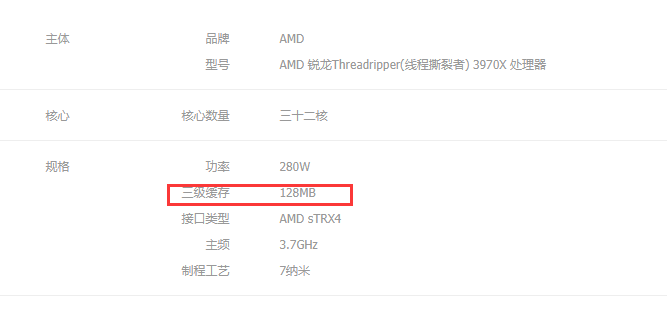

## 3970x

 [如何评价*AMD* 3950X具有64M L3 *Cache*，而Intel 10980XE 仅有24M？](https://www.zhihu.com/question/350485742/answer/858073470) 

如果拿AMD Ryzen 3000的L3去吹，就是典型的丧事喜办了。

为什么AMD的L3 那么大？ 是因为AMD Zen2的 CPU 核心和 IO核心是分离的，并不是和Intel一样是集成在一个核心里的。 按照当年AMD自己的说法，这就是典型的胶水多核。

CPU核心要访问内存，比起Intel的方案，要首先请求IO核心，再由IO核心访问内存，必然带来延迟提升，必然比直接访问慢，而延迟对于CPU却非常重要。 那能怎么办呢？ 那就只能尽可能减少CPU访问内存了，尽可能的让缓存命中，而要提升缓存命中怎么做呢？ 加L3啊。 

所以到最后AMD的Zen2的一个CPU芯片上有32M的超大L3，就是为了解决AMD这种设计弊端。

另外AMD不只是L3超大，AMD虽然没说，但是AMD那个IO核心上应该还有一个超大的L4，这个L4的容量疑似是32M*2/8（桌面级最高连接2个CPU芯片/EPYC8个），为了解决核心之间的数据交换和缓存。

    