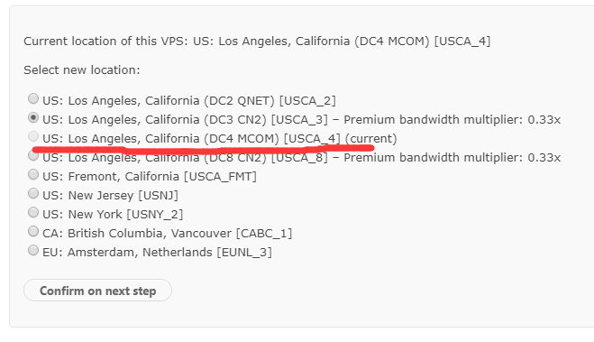
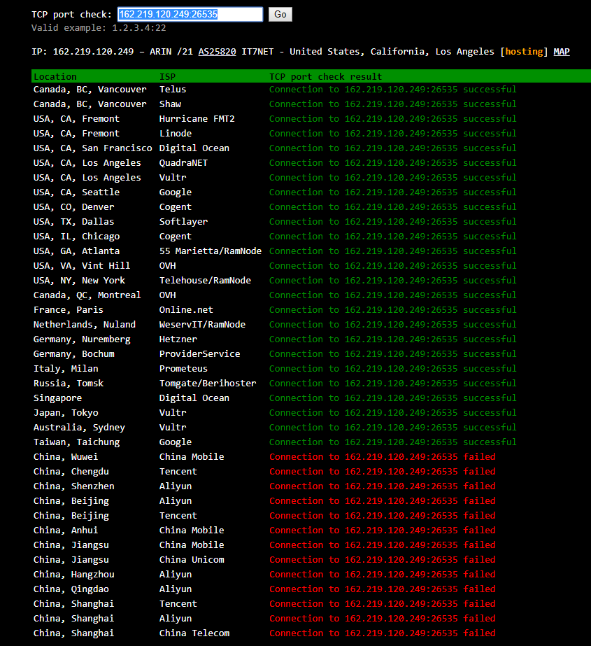

# 常用的vps

## 我所接触过的vps

- bandwagonHost
-  anynode
-  Vultr

Bandwagon节点 $19.9的选项包括以下几个：

-  US - Los Angeles DC2 QNET (USCA_2)  洛杉矶节点
- US - Fremont (USCA_FMT)  弗里蒙特节点
- US - New Jersey (USNJ)  新泽西节点
- NL - Amsterdam (EUNL_3)  荷兰的阿姆斯特丹
- Canada - Vancouver (CABC_1) 加拿大 温哥华节点

## 虚拟化技术分析

OVZ：即 OpenVZ 主机虚拟化技术。把一台服务器上面划分出多个虚拟主机使用。支持 IPv6 地址。缺点是可以超售，也就是超出母鸡承受能力的那种，主机商能够多卖钱。

KVM：也是主机虚拟化技术，和 OVZ 一样在母鸡上划分出多台小鸡来。不支持 IPv6 地址。性能分配比 OVZ 更均衡，也很难超售。

##  线路分析

CN2：线路名称，走的是中国电信网络，目前包括搬瓦工 DC3 机房（QNET 机房）和 DC8 机房（C3 机房）。CN2 连接速度和稳定性普通网络要好，搬瓦工推荐选择 CN2 机房。

QNET 和 MCOM：都是机房的名字，目前都是搬瓦工比较好的线路。了解更多点击[搬瓦工洛杉矶 DC1 **QNET** 和 DC2 MCOM 简介](https://www.vpsss.net/1873.html)，[搬瓦工洛杉矶 **QNET** 机房与洛杉矶 MCOM 机房选那个好？](https://www.vpsss.net/954.html)

最后总结一下，对于搬瓦工 VPS 来说，最合适的选择是优先考虑 KVM，然后选择可迁移机房 CN2 线路，这样是最好的。

## VPS供应商Bandwagonhost

搬瓦工vps信息

- US: Los Angeles, California (DC2 QNET) [USCA_2] 
- US: Los Angeles, California (DC3 CN2) [USCA_3] (current) – Premium bandwidth multiplier: 0.33x
- US: Los Angeles, California (DC4 MCOM) [USCA_4] 
- US: Los Angeles, California (DC8 CN2) [USCA_8] – Premium bandwidth multiplier: 0.33x
- US: Fremont, California [USCA_FMT] 
- US: New Jersey [USNJ] 
- US: New York [USNY_2] 
- CA: British Columbia, Vancouver [CABC_1] 
- EU: Amsterdam, Netherlands [EUNL_3] 

## This feature allows you to physically move your VPS to another location.

During the migration, all data on your VPS is preserved, and the total downtime will be only a few seconds to few minutes. However, the **IP address of your VPS will change**. 
If you host websites or other services utilizing DNS on this VPS, you would have to also update DNS records of all websites.

If services running on your VPS bind to static IP addresses instead of wildcard IP (0.0.0.0) or localhost (127.0.0.1), then you would have to also update configuration files of such services to use the new IP.

Note that migrations count towards your monthly bandwidth usage.

Please make sure you have a backup of your VPS before you proceed (just in case).

此功能允许您将VP物理移动到其他位置。

在迁移过程中，您的VPS上的所有数据都将被保留，总的停机时间将仅为几秒到几分钟。但是，您的VPS的**IP地址将更改**。

如果您在此VPS上使用DNS托管网站或其他服务，则还必须更新所有网站的DNS记录。

如果在您的VPS上运行的服务绑定到静态IP地址，而不是通配符IP（0.0.0.0）或localhost（127.0.0.1），那么您还必须更新这些服务的配置文件才能使用新的IP。

请注意，迁移将计入您每月的带宽使用情况。

在继续之前，请确保您有一个VPS备份（以防万一）。

## Migrate to another datacenter

The entire migration process may take anywhere from a minute to a few hours, depending on the number of files in your VPS and their size. 
However, your VPS will be operational while migration is performed. It will be shut down for a few seconds to few minutes during the last stage of the process.

Once migration completes, you will receive an e-mail notification.

### 方法一

端口扫描网站：

国内测试 ：   `<http://tool.chinaz.com/port/>`

国外测试网站: `<https://www.yougetsignal.com/tools/open-ports/>`

- **R1 = 开放，R2 无所谓，此时 IP 一切正常；**
- **R1 = 关闭，R2 = open，此时你的 IP 被封了；**
- **R1 = 关闭，R2 = closed，此时你的 VPS 可能是没有正常开机，先检查一下 VPS 本身的问题，之后再重新进行检测。**

### 方法二

换IP ===>要收费$8.79 USD

## 搬瓦工的回复

> Hello,
>
> Looks like the IP is blocked by GFW. While the IP is on any other major block list (Spamhaus, Barracuda, GFW etc), the VPS stays fully operational. However you will not be able to migrate the VPS to a different datacenter until the block is removed.
>
> Here is how to manually verify if your VPS IP is being blocked by the Great Firewall of China:
>
> 1. Navigate to http://port.ping.pe
> 2. Enter your VPS IP and SSH port in the top field, like this: 1.2.3.4:22222
> 3. Click 'Go'
>
> The service will attempt to connect to your SSH port from multiple countries and in case of a banned IP will show that the port is closed when attempting from China (but not other countries).
>
> *** Possible solutions ***
>
> We found that generally GFW automatically removes the ban when it can no longer detect the 'prohibited' service for a few days to few weeks. The best solution in the case of a ban would be the complete removal of all service(s) that could trigger the ban and waiting for some time for the ban to be lifted.
>
> Having said that, please do keep in mind that we do not have any control over GFW, and we do not know much about how it works. It is our responsibility to make sure our hardware and network stay fully operational, and GFW-related issues are out of scope of our competence.
>
> If you need to replace a banned IP with a clean IP, we offer this service at the following link:
>
> https://bandwagonhost.com/ipchange.php
>
> mirror:
>
> https://bwh88.net/ipchange.php
>
> This is an automatic reply. If your request was not properly addressed, please reply in this ticket and one of our engineers will take a look.
>
> ****************************************************************************
>
> Our friends at https://justmysocks.net/ built a Shadowsocks solution 
> which addresses most common issues related to Shadowsocks: 
>
> * Ready to use Shadowsocks servers tweaked for best security and privacy
> * You get 5 different IPs to connect to at any time
> * Unlimited IP replacement at no additional cost
> * 10 Gbps CN2 GIA network
>
> ****************************************************************************

里面的主要意思是：

> 你好，
>
> 看起来IP被GFW阻止了。虽然IP在任何其他主要阻止列表（Spamhaus，Barracuda，GFW等）上，但VPS仍然可以完全运行。但是，在删除块之前，您将无法将VPS迁移到其他数据中心。
>
> 以下是如何手动验证您的VPS IP是否被中国防火墙阻止：
>
> 1.导航到http://port.ping.pe
> 2.在顶部字段中输入您的VPS IP和SSH端口，如下所示：1.2.3.4：22222
> 3.点击“开始”
>
> 该服务将尝试从多个国家/地区连接到您的SSH端口，如果被禁止的IP将在从中国（但不是其他国家/地区）尝试时显示该端口已关闭。
>
> *** 可能的解决方案 ***
>
> 我们发现，一般情况下，GFW会在几天到几周内无法再检测到“禁止”服务时自动删除禁令。在禁令的情况下，最好的解决方案是彻底清除所有可能触发禁令的服务，并等待一段时间取消禁令。
>
> 话虽如此，请记住我们对GFW没有任何控制权，而且我们对它的工作方式知之甚少。我们有责任确保我们的硬件和网络保持全面运营，GFW相关问题超出了我们的能力范围。
>
> 如果您需要用干净的IP替换禁止的IP，我们通过以下链接提供此服务：
>
> https://bandwagonhost.com/ipchange.php
>
> 镜子：
>
> https://bwh88.net/ipchange.php
>
> 这是一个自动回复。如果您的请求没有得到妥善解决，请回复此票，我们的工程师将会看一看。
>
> ************************************************** **************************
>
> 我们的朋友在https://justmysocks.net/上构建了一个Shadowsocks解决方案
> 它解决了与Shadowsocks相关的最常见问题：
>
> *准备好使用Shadowsocks服务器进行调整，以获得最佳安全性和隐私性
> *您可以随时获得5种不同的IP连接
> *无限制的IP更换，无需额外费用
>
> * 10 Gbps CN2 GIA网络
>
> ************************************************** **************************

当前位置：

## Ping工具网站（世界各地ping 你的主机）

http://port.ping.pe

被墙状态：

