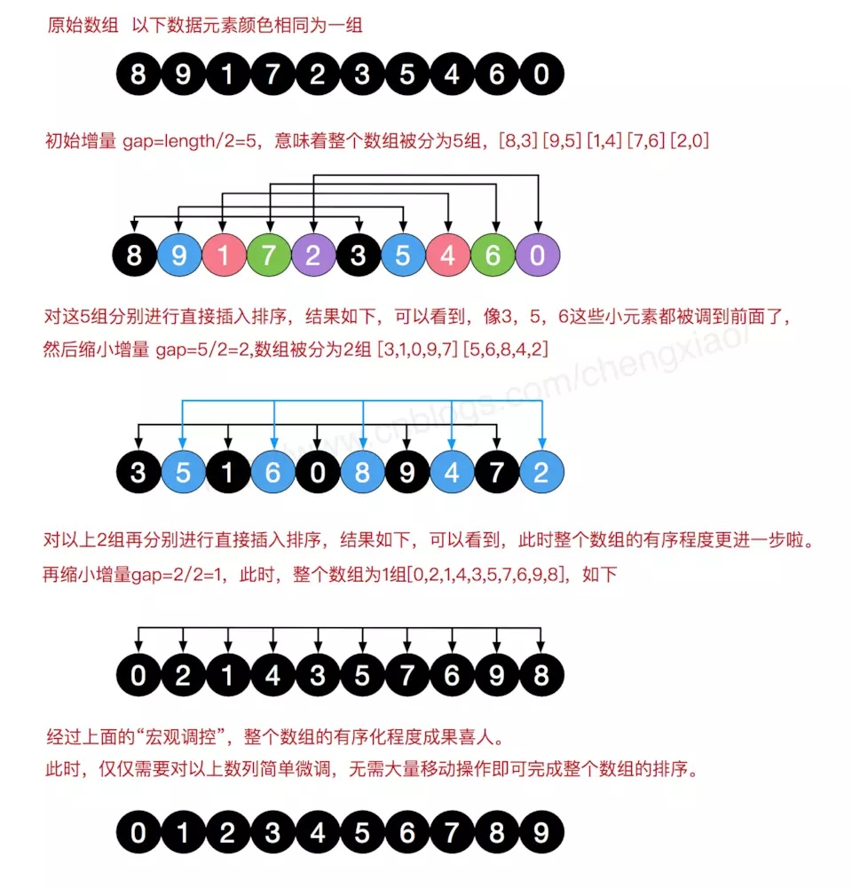

# 排序算法

## 1.排序的基本概念： 

### 1.1  算法的稳定性

待排序的列表中有两个元素  $R_i$ , $R_j$ ，其对应的关键字相等 $key_i==key_j$  ,且 排序 前   $R_i$ 在 $R_j$ 前面，使用某一排序算法之后，   $R_i$ 仍然 在 $R_j$ 前面。这种排序算法是稳定的；

意思是就是说：

#### 算法稳定性的意义：

如果我们只对一串数字排序，那么稳定与否确实不重要，因为一串数字的属性是单一的，就是数字值的大小。但是排序的元素往往不只有一个属性，例如我们对一群人按年龄排序，但是人除了年龄属性还有身高体重属性，在年龄相同时如果不想破坏原先身高体重的次序，就必须用稳定排序算法，不知道我这么解释你懂不懂


作者：独行侠
链接：https://www.zhihu.com/question/46809714/answer/281361290
来源：知乎

### 1.2 算法的时间&空间复杂度

时间复杂度主要取决于：元素比较与移动的次数；


### 1.3 内部排序与外部排序

排序过程中，根据数据元素是否完全在内存中，可以将排序算法分为两类：

- 内部排序：
- 外部排序：

## 2.插入排序

是一种比较直观的排序方法，基本思想是：每次将一个记录 ，按其关键字的大小 插入到前面已经排序好的子序列里面；

#### 2.1 直接插入排序：

1) 查找出$L(i)$  在$L[0···n-1]$ 中插入位置$k$

2) 将$L[k···i-1]$ 个元素全部后移一位；

3）将 $L(i)$ 复制到插入位置$k$

```c++
#include <cstdio>
#include <iostream>

using namespace std;


void insertSort(int a[], int low, int high){
    int i,j,tmp;
    for(i = low+1; i < high; i++ ){                     //从第2个元素开始进行插入
        if(a[i] < a[i-1]){                              //判断是否需要插入
            tmp = a[i];                                 // 暂时存储
            for(j = i-1; j >= low && a[j] > tmp  ; j--) // 将比所有a[i]大的元素往后移动一位
                a[j+1] = a[j];
            a[j+1] = tmp;                               // 将tmp拷贝到原先最左一个比a[i]大的位置;    
        }
    }
}
void insertSort2(int a[],int len){
    int i,j, tmp;
    for(i = 1; i < len; ++i) {
        if(a[i] < a[i-1]) {
            tmp = a[i];
            for(j = i - 1; j >= 0 && a[j] > tmp; --j)
                a[j + 1] = a[j];
            a[j+1] = tmp;      
        }
    }
}

int main(){
    int a[8] ={53,17,78,9,45,65,87,32};
    int len  = 8;
    //insertSort(a,0,len);
    insertSort2(a,len);
    for(int i=0; i < len; i++)
        printf("%d ",a[i]);
    printf("\n");
    

    return 0;
}
```

性能分析：


| 空间复杂度： |              使用常数个辅助单元       $O_{(1)}$              |
| :----------: | :----------------------------------------------------------: |
| 时间复杂度： |                         $O_{(n^2)}$                          |
| 最好的情况： | 最好的情况是原来的已经是有序的了，比较次数是n-1次<br /> $O_{(n^2)}$ |
| 最坏的情况： |             元素的顺序恰好是排序的结果完全相反：             |
|   稳定性：   | 稳定的<br />由于每次插入元素，总是从后往前先比较，再移动<br />不会出现相同元素，相对位置发生变化的情况 |
|   适用性：   |             适用于顺序存储 和链式存储的线性表；              |


#### 2.2 折半查找插入排序：

由于是对  有序的子序列   进行查询`a[i]`的元素插入位置；

因此 当存储为顺序表的时候，可以直接使用折半查找的方式 ；可以减少比较元素的次数，移动元素的次数没有变；

使用了二分搜索中前开后闭的方式：$[low,high)$ 查找第一个 不小于 target的位置；

```c++
void insertSort3(int a[],int len){
    int i,j,tmp,low,high,mid;
    for(i = 1; i < len; ++i) {
        if(a[i] < a[i-1]) {
            tmp = a[i];
            low = 0; high = i; //前开后闭
            while(low<high) {
                mid = low + (high -low)/2;
                if(a[mid] < tmp)
                    low = mid+1;
                else
                    high = mid;
            }
            for(j = i - 1; j >= low; --j)
                a[j+1] = a[j];
            a[low] = tmp;
        }
    }
}
```

#### 2.3 希尔排序 ShellSort



$dk$ 后续的元素需要在各自的 子数组中进行 插入排序；

```c++
#include <cstdio>
#include <iostream>

using namespace std;


void ShellSort(int a[], int len){
    int dk,i,j,tmp;
    for(dk = len / 2; dk >= 1; dk/=2) {   //步长从n/2->1
        for(i = dk; i < len; ++i ) {    //第[0，dk+0 是第一个子表中的第二个元素；dk+1是第二个子表中第二个元素；以此；类推，需要进行各自字表中进行插入排序
            if(a[i] < a[i-dk] ) {
                tmp = a[i];
                for(j = i - dk; j >= 0 && a[j]>tmp; j -= dk)
                    a[j+dk] = a[j];
                a[j+dk] = tmp;
            }
        }
    }
}


int main(){
    int a[8] ={53,17,78,9,45,65,87,32};
    //int a[8] ={87, 78, 65, 53, 45, 32, 17, 9};
    int len  = 8;
    //insertSort(a,0,len);
    ShellSort(a,len);
    for(int i=0; i < len; i++)
        printf("%d ",a[i]);
    printf("\n");

    // for(int i=len-1; i >= 0; --i)
    //     printf("%d ",a[i]);
    // printf("\n");

    return 0;
}
```


| 空间复杂度： |              使用常数个辅助单元       $O_{(1)}$              |
| :----------: | :----------------------------------------------------------: |
| 时间复杂度： |                       $O_{(n^{1.3})}$                        |
| 最好的情况： | 最好的情况是原来的已经是有序的了，比较次数是n-1次<br /> $O_{(n^2)}$ |
| 最坏的情况： |             元素的顺序恰好是排序的结果完全相反：             |
|   稳定性：   | 不稳定：<br />相同的元素分到不同的子数组中，可能改变相对顺序；<br />比如$[3,1,4,2_{(1)},2_{(2)}]$  <br />步长为dk=2,第一次排序后：$[2_{(2)}1,3,2_{(1)},4]$<br />步长为dk=1,第二次插入排序后：$[1, 2_{(2)}1,2_{(1)},3,4]$ |
|   适用性：   |                    适用于顺序存储 线性表                     |


## 3.交换排序

交换排序：根据序列中两个元素的比较结果，来对换这两个记录在序列中的位置；


### 3.1 冒泡排序

冒泡排序的基本思想：假设待排序的序列长度为 n, 从后往前 或者（从前往后）两两比较相邻的两个元素，若为逆序，则交换两个元素，这个过程称为一趟冒泡；将最小的元素，交换到开头位置，或者较大元素交换到末尾位置；每一趟冒泡，前一趟参与的确定的最大（或者最小元素）不再参与；每趟将最小值（最大值）放到序列的最终位置；

```c++
#include <cstdio>
#include <iostream>

using namespace std;


//小的 往前冒泡（超级好记忆）
void BobbleSort(int a[], int len){
    for(int i = 0 ; i < len -1; ++i){       // 冒泡趟数，以及每一趟需要确定的元素位置为i；
        bool flag = false;
        for(int j = len-1; j>i; --j) {      // 每趟冒泡参与冒泡的元素个数：len - i个：既是 [i ··· n-1] 参与冒泡
            if(a[j-1] > a[j] ){             // 若为逆序
                flag = true;                
                swap(a[j-1],a[j]);          //交换
            }
        }
        if(!flag)                           // 本趟遍历完成没有发生元素交换，则说明已经有序了
            break;
    }
}


//大的 前往后冒泡
void BobbleSort2(int a[], int len){
    for(int i = 0 ; i < len -1; ++i){
        bool flag = false;
        for(int j = 1; j < len-i; j++){
            if(a[j-1] > a[j] ){
                flag = true;
                swap(a[j-1],a[j]);
            }
        }
        if(!flag)
            break;
    }
}


int main(){
    int a[8] ={53,17,78,9,45,65,87,32};
    //int a[8] ={87, 78, 65, 53, 45, 32, 17, 9};
    int len  = 8;
   
    BobbleSort(a,len);
    for(int i=0; i < len; i++)
        printf("%d ",a[i]);
    printf("\n");
    
    return 0;
}
```


复杂度分析：

| 空间复杂度： |              使用常数个辅助单元       $O_{(1)}$              |
| :----------: | :----------------------------------------------------------: |
| 时间复杂度： |                        $O_{(n^{2})}$                         |
| 最好的情况： | 最好的情况是原来的已经是有序的了，比较次数是n-1次,交换次数为0 |
| 最坏的情况： | 元素的顺序恰好是排序的结果完全相反：比较次数为${n(n-1)}/2$，<br />移动次数$3*n(n-1)/2$，注意交换元素需要3次移动元素来实现； |
|   稳定性：   |                  不是逆序不会交换；是稳定的                  |
|   适用性：   |                    适用于顺序存储 线性表                     |

### 3.2 快速排序

快速排序是对冒泡排序的改进，基本的思想是分治法；

基本思想是：在待排序表中任意选取一个元素作为pivot作为基准，通过一趟排序将待排序的表分成两部分L[1···k-1] 和L[k+1···n] ，使得L[1···k-1]中所有元素小于pivot , L[k+1···n]所有元素 大于或者等于pivot；

pivot最后放置到最终位置L[k]上，这个过程被称为一趟快速排序；

递归对两个子表调用上述过程，直至每个部分只有一个元素或者为空，即所有元素在其最终位置上； 


#### 3.2.0 快速排序的常见实现方式与区别

 挖坑法 和 左右指针交换法；

主要的区别是 移动元素的方式不太一样；如果问这个快速排序第几趟，一般是挖坑法；


#### 3.2.1 写法：（挖坑法）左右填坑法

快速排序的一种经典实现方案：（金典数据结构书中就是这么实现的）：


概括： 就是头元素作为基准元素 pivot , 设置左右指针从两侧开始遍历。将右侧小于基准的元素，移动到左侧坑位；

左侧大于基准的元素移动到右侧坑位；每次填补之后，从另外一侧遍历；


**==左右填坑法的步骤：==**

1.选定数列头元素为基准元素`pivot`，并记住这个位置 (此时为left) ，这个位置相当于一个"坑"。

2.设置两个指针`left`和`right`，分别指向数列的最左和最右两个元素。

3.接下来从`right`指针开始，把指针所指向的元素和基准元素做比较，如果比`pivot`大(大于或者等于)，则`right`指针向左移动；如果比`pivot` 小，则把该元素放入  坑位（`left`指针对应的位置)。

4.将(`right`)，变成一个新的"坑"。

5.接下来切换到`left`指针，把指针所指向的元素和基准元素做比较，如果`left`当前指向的元素小于(小于或者等于)`pivot`，则`left`指针向右移动；如果元素大于`pivot`，则把所指向的元素放入  坑位（`right`指针对应的位置)。

6.将(`left`)，变成一个新的"坑"。

7.重复步骤` 3，4，5，6 ` 直到`left`等于`right`时，将`pivot`放入`left`和`right`重合的位置，此时数列中比`pivot`小的元素都在`pivot`左边，比`pivot`大的都在`pivot`元素位置的右边。

8.获取`pivot`的位置`pivotPos`，分而制之，将`pivotPos`左侧和右侧的子数列分别重复上述步骤1～7，直到不能拆分子数列为止，整个数列就是一个从头开始递增的数列。

参考了：


思考问题1 ： 为什么是  `low < high ` 因为`[low,high]`  当且仅当 序列元素超过 2个才进行排序；`size <=1`  的表是有序的；

思考问题2：为什么是  在移动`left` 与`right`指针过程中，左右两侧 都使用等于，也就是：左侧使用`<=`，右侧使用`>=`；而不是使用`>=`，一边`<`； 可能因为是与 `pivot` 相等的元素不需要移动，从左边移动到右边，与右边移动到左边没什么意义；（可以减少移动元素次数）；

思考问题3：左右填坑的过程，其实就是从右侧找到不满足的放到左侧坑位（使得左侧坑位满足），然后从左侧找到不满足的放到右侧坑位（使得右侧坑位满足）；交替进行；

 `[ B1<= a[low] ] , [ a[low] <=  A  <= a[high] ]  , [ a[high] <= B2]`

因为首先初始化  坑 在左侧，相当于 

从右侧往左移动`right`扩大`B2` 区间，停止在`right`不满足的位置(但是满足左侧)。用该元素，填左侧的坑；此时`right` 变成新坑，原理`left`位置坑已经满足。

然后从上一个坑`left`位置右移`left` 指针，停在大于 pivot位置；

终止情况1 ：左指针移动碰撞右指针，    right先停止小于pivot位置（值用于填左侧坑），left指针移动与 right重合在同一位置；left左侧小于等于pivot， right右侧大于等于pivot; 因此当前位置就是pivotPosition; 将基准填入该位置；

终止情况2：右指针移动碰撞左指针，  上一轮left指针指向的元素用于填右侧坑  ，right指针移动与left重合在同一位置；

left左侧小于等于pivot， right右侧大于等于pivot; 因此当前位置就是pivotPosition; 将基准填入该位置；

```c++
 void QuickSort1(int a[], int low,int high){
    if(low < high){ //两个元素以上才有必要排序
        int left = low, right = high; 
        int pivot = a[left];
        while(left<right) {
            while(left < right && a[right] >= pivot)
                right --;
            a[left] = a[right];
            while(left < right && a[left] <= pivot)
                left ++;
            a[right]  = a[left];    
        }
        a[left] = pivot;
        int pivotpos = left;
        printf("----------\n");
        for(int i=0; i < 8; i++)
            printf("%d ",a[i]);
        printf("\n");


        QuickSort1(a, low, pivotpos - 1);
        QuickSort1(a, pivotpos+1, high);
    }
}


int partition(int a[],int low,int high){
    int pivot = a[low] ;
    while(low < high){           //[low, high] 来确定以及移动，最终low左侧为<pivot元素, high右侧>= pivot,最后两个指针一定会指向同一位置，进而确定pivotpos = low = high
        while(low < high && a[high]>=pivot)
            high --;
        a[low] = a[high];           //比基准小的值，移动到左端；
        while(low < high & a[low]<=pivot)
            low ++;
        a[high] = a[low];           //比基准大的值移动到右端；
    }
    a[low] = pivot;
    return low;
} 

void QuickSort(int a[], int low,int high){
    if(low < high){ //两个元素以上才有必要排序
        int pivotpos = partition(a, low, high);
        QuickSort(a, low, pivotpos - 1);
        QuickSort(a, pivotpos+1, high);
    }
}
```

参考资料:

作者：Kevin Yan
链接：https://zhuanlan.zhihu.com/p/63502334
来源：知乎
著作权归作者所有。商业转载请联系作者获得授权，非商业转载请注明出处。

#### 3.2.2 写法：左右指针（前后）交换法；

这种写法不挖坑，pivot放在 low位置；

右侧找到一个小于pivot，左侧找到一个大于pivot的，进行交换；

终止情况1 ： 左侧指针碰撞右侧指针，右侧指针往左侧移动，找到一个小于pivot元素停止，左侧移动到与右侧指针重叠位置；此时，[low, left]里面的元素 <= pivot (其中pivot在low位置 )；[right+1, high]位置 >= pivot;

终止情况2：右侧指针碰撞左侧指针，左侧指针在上次交换完毕后，满足[low,left]<=pivot , 右侧移动到与左侧重叠位置；

[right+1,high]元素 >= pivot， [low,left]<=pivot (其中pivot在low位置 )  

pivotPosition 位置=left; 

对调a[low] 与 a[left]值；

```c++
#include <cstdio>
#include <iostream>

using namespace std;


void QuickSort2(int a[], int low, int high){
    if( low < high){
        int pivot = a[low] , left = low, right = high;
        while(left < right){
            printf("left=%d,right=%d\n",left,right);
            while(left < right && a[right] >= pivot)
                right --;
            while(left < right && a[left] <= pivot)
                left ++;
            if(left < right) {
                swap(a[left], a[right]);
            }
        }
        int pivotpos = left;
        //swap(a[low],a[left]);
        a[low] = a[left];
        a[left] = pivot;
        printf("----------\n");
        for(int i=0; i < 8; i++)
            printf("%d ",a[i]);
        printf("\n");

        QuickSort2(a,low,pivotpos-1);
        QuickSort2(a,pivotpos+1,high);
    }
}

int main(){
    int a[8] ={53,17,78,9,45,65,87,32};
    //int a[8] ={87, 78, 65, 53, 45, 32, 17, 9};
    int len  = 8;
    //insertSort(a,0,len);

    QuickSort1(a,0,len-1);

    for(int i=0; i < len; i++)
        printf("%d ",a[i]);
    printf("\n");

    // for(int i=len-1; i >= 0; --i)
    //     printf("%d ",a[i]);
    // printf("\n");

    return 0;
}
```


**复杂度分析：**

| 空间复杂度： | 快速排序是递归的，需要借助一个栈来保存没一层递归调用的必要信息，容量与递归调用最大深度一致；最坏的情况要进行n-1次调用，栈深度为$O(n)$,平均情况下$O(log_2(n))$ |
| :----------: | :----------------------------------------------------------: |
| 时间复杂度： |        时间复杂度与 快速排序过程中划分是否对称有关，         |
| 最好的情况： | 最好的情况是枢纽元素每次位于中间，两个子问题大小不超过`n/2`  $O(nlog_2（n))$ |
| 最坏的情况： | 枢纽元素始终是最小或者最大的元素，子问题只有一个`n-1` 时间复杂度为$O(n^2)$ |
|   稳定性：   | 不稳定算，比如存在两个相同的值，都比pivot元素小，且在序列末尾，交换之后相对位置就会发生变化；$3，2_1，2_2$ 经过一趟排序之后， $2_2,2_1,3$ |
|   适用性：   |                                                              |

如何提高快速排序的效率：

方法1：在递归过程中，划分到的子序列规模较小的时候，不再继续递归调用快些排序，可以使用直接插入排序；

方法2： 尽量选择一个可以将数据中分的轴枢元素；（1）在序列头尾，中间选取一个元素，再取一个三个元素的中间值；（2）随机在当前表中，选择轴枢 元素； 劲量让最好的情况不要发送；


## 4.选择排序

选择排序基本思想： 每一趟(例如第`i`趟)，在后面的`n-i+1个元素中选择一个最小值，作为有序子序列的第i个元素；直到n-1趟完成；待排序元素只剩下一个，就不用再排序了；

### 4.1 简单排序算法

算法思路： 第`i`趟排序，从`[i,n-1]`中选择最小值与第i个元素交换。 每一趟排序确定一个位置，进过`n-1`趟排序之后，就可以使整个排序表变得有序；

```c++
#include <cstdio>
#include <iostream>

using namespace std;

void EasySelectSort(int a[], int n){
    int minIndex;
    for(int i = 0; i < n - 1; i++ ){
        minIndex = i;
        for(int j = i + 1; j < n; j++){
            if(a[j] < a[minIndex])
                minIndex = j; 
        }
        if(minIndex != i)
            swap(a[minIndex], a[i]);
    }

}


int main(){
    //int a[8] ={53,17,78,9,45,65,87,32};
    int a[8] ={87, 78, 65, 53, 45, 32, 17, 9};
    int len  = 8;

    EasySelectSort(a,len);
    for(int i=0; i < len; i++)
        printf("%d ",a[i]);
    printf("\n");

    return 0;
}
```


复杂度分析：

| 空间复杂度：  |              使用常数个辅助单元       $O_{(1)}$              |
| :-----------: | :----------------------------------------------------------: |
| 时间复杂度：  | $O_{(n^{2})}$  选择排序的元素移动次数比较少，不超过`3（n-1）`次，比较次数与初始状态没有关系为`3（n-1）*n/2` |
| 最好的情况：  | 最好的情况是原来的已经是有序的了，比较次数为`3n(n-1)/2`次，移动次数为`0` |
| `最坏的情况： | 元素的顺序恰好是排序的结果完全相反：比较次数为${3n(n-1)}/2$，<br />移动次数$3(n-1)$，注意交换元素需要3次移动元素来实现； |
|   稳定性：    | 不稳定，第`i`趟找到最小值，与第`i`个元素交换；可能导致`i`元素与 相同关键的字的元素的相对位置发生变化；例如$2_1,2_2,1$   第一趟处理之后，$1,2_2,2_1$；相对位置发生变化； |
|   适用性：    |                    适用于顺序存储 线性表                     |

### 

### 4.2.堆排序 (是一种选择排序)

堆排序 是一种树型选择排序，特点是：在排序过程中，将`L[1···n]` 看成是一颗完全二叉树的顺序存储；利用完全二叉树中双亲节点 和孩子节点内在的关系。

堆排序的关键是 

#### 4.2.0 堆的存储

使用顺序存储，`c++`中可以使用`vector`或者`数组`

```c++
int arr[]={0,53,17,78,9,45,65,87,32};
int len = 8;
```


#### 4.2.1 堆基础操作：向下调整

作用：用于从数组序列中构建最大堆； 用于堆删除操作；

```c++
//向上调整
// 方案1 ： 非递归，使用循环的方式，交换不满足的堆子树;（思路比较清晰）
void adjustDown(int a[],int low,int high){
    //a[0] = a[low];
    int i = low, j = 2 * i;
    while(j <= high){
        if(j+1 <= high && a[j+1] > a[j])
            j++;
        if(a[i] >= a[j] ) break;
        else {
            swap(a[i], a[j]);
            i = j;
            j = 2 * i;
        }  
    } 
}
//写法2：非递归，充分利用空间，将swap交换优化为"类似插入排序";
//不要急着 swap，循环过程中 将大于根节点a[0]    
void adjustDown1(int a[],int low,int high){
    a[0] = a[low];                         // 将根节点元素暂时存储 到a[0];
    int i = low, j = 2 * i;
    while(j <= high){                      // 当前节点还有 子节点在堆范围内
        if(j+1 <= high && a[j+1] > a[j])   // 取左右孩子的最大值
            j++;
        if(a[0] >= a[j] ) break;           // 根值 >= 左右子树最大值  已满足 最大堆条件;   
        else {                             // 当前堆不满足，最大堆条件 
            a[i] = a[j];                   // 将a[j] 移动 到 父节点上; 
            i = j;                          
            j = 2 * i;
        }  
    }
    a[i] = a[0];                            // 最后判断的堆子树 根节点；
}

//写法3： 递归实现 （思路最清晰）
void adjustDown2(int a[],int low,int high){
    int i= low *2;
    if(i + 1 < high && a[i+1]>a[i])
        i++;
    if(a[i] > a[low]){
        swap(a[i],a[low]);
        adjustDown2(a,i,high);
    }
}
```


#### 4.2.2 堆基础操作：向上调整

```c++
/* 最后根节点1： 1/2==0 
   向上调整
*/
/*写法1: 
        判断父节点，是否满足最大堆属性，不满足则交换值; 
        交换之后，继续判断父节点的父节点是否满足；
        直到根节点或者当前的节点满足最大堆性质; 
  */
void adjustUp(int a[], int k){
    int i = k/2;
    while(i >= 1 && a[i]<a[k]){
        swap(a[i],a[k]);    
        k = i;
        i = k/2; 
    }

}

/* 写法2：优化写法一：  
    优化了swap，多次交换过程中，其实不是a[len]的最终位置；
    因此：先将a[len]占时存储到空闲位置a[0];
    然后将父节点中，所有比a[0]小的元素，后移一位；（类似于插入排序）
    最后循环结束：
        i指向 满足堆性质（a[i] > a[j]）位置，或者 指向指向堆之外0;
        j指向最后不满足堆性质的节点；
    循环结束：a[j] = a[0] ;    
*/
void adjustUp1(int a[], int k){
    a[0] = a[k];
    int i = k/2;
    while(i >= 1 && a[i]<a[0]){
        a[k] = a[i];                //下移  
        k = i;
        i = k/2; 
    }
    a[k] = a[0];
}

/*写法3 递归实现：*/
void adjustUp2(int a[], int k){
    int i = k/2;
    if(i>=1 && a[i] < a[k])
        adjustUp2(a,i);
}
```


#### 4.2.3 构造初始堆

`n`个节点的完全二叉树，最后一个节点是 `|n/2|` 个节点的孩子，对  `|n/2|` 个节点进行为根的子树进行筛选；

若==根节点关键字== `<` ==左右子女中关键字 较大者== ，则交换。使得该子树成为堆。

 然后依次对各节点`[n/2-1] 到 [1]`为根的子树进行筛选，看该节点是否大于左右子节点的值； 若不是，则将节点 与 左右子节点的较大值进行交换，交换以后可能破坏下一级堆，于是继续采用上述方法构造下一节的堆，直到以该节点为根的子树构成最大堆；（调用向下调整）

```c++
// 构建最大堆：就是从[n/2]->1 调用adjustDown()向下调整算法； 
void bulidMaxHeap(int a[],int len){
    for(int i = len / 2; i >= 1; i-- )
        adjustDown1(a,i,len);
}
```


#### 4.2.4 堆排序

堆排序的过程就是：

1.构造初始化堆；

2.循环删除栈顶元素，直到栈顶元素直到堆为空；删除元素的过程，就是将栈顶元素与堆末尾元素交换，然后`堆实际长度-1` ; 这样不断删除堆顶元素（最大值）之后，当时最大值都会出现在数组末尾；从而变成从小到大排序；

```c++
void HeapSort(int a[], int len){
    bulidMaxHeap(a,len);
    for(int i = len; i>=1; i--){
        swap(a[i],a[1]);
        adjustDown1(a,1,i-1);
    }
}
```


#### 4.2.5 堆插入新节点

1.将新节点放到堆末尾；

2.在对这个新节点调用向上调整操作；

```c++
//最大堆的插入操作：
//1.先将新节点放置都堆的末端，
//2.再对这个节点进行向上调整的操作
void MaxHeapInsert(int a[], int& len,int value){
    a[++len] = value;
    adjustUp(a, len); 
}
```


#### 4.2.6 堆删除堆顶元素

1.将堆顶元素与堆末尾元素交换；

2.由于此时 **根节点** 失去了**最大堆 的性质**，对根节点 进行向下调整；

```c++
//最大堆删除操作：
//1.删除堆顶元素的时候，先将堆的最后一个元素 与 堆顶元素进行交换;
//2.由于此时，最大堆的性质被破坏了，对此时根节点进行向下调整；
void MaxHeapDelete(int a[], int& len){
    swap(a[len],a[1]);
    len--;
    adjustDown1(a, 1, len);
}
```


#### 复杂度分析：


| 空间复杂度：  |              使用常数个辅助单元       $O_{(1)}$              |
| :-----------: | :----------------------------------------------------------: |
| 时间复杂度：  | 建堆的时间为：$O(n)$ ,  然后又`n-1`次向下调整操作，每次调整的时间为$O(h)$ ,所以堆排序平均的时间复杂度为$O(nlog_2(n))$ |
| 最好的情况：  | 最好的情况是原来的已经是有序的了，比较次数为`3n(n-1)/2`次，移动次数为`0` |
| `最坏的情况： | 元素的顺序恰好是排序的结果完全相反：比较次数为${3n(n-1)}/2$，<br />移动次数$3(n-1)$，注意交换元素需要3次移动元素来实现； |
|   稳定性：    | 不稳定，第`i`趟找到最小值，与第`i`个元素交换；可能导致`i`元素与 相同关键的字的元素的相对位置发生变化；例如$2_1,2_2,1$   第一趟处理之后，$1,2_2,2_1$；相对位置发生变化； |
|   适用性：    |                    适用于顺序存储 线性表                     |


### 5 归并排序

归并其实是将两个，以及两个以上的有序链表进行合并成一个新的有序链表；

对于一个长度为n的序列，可以看出n个长度为1 的有序字表，然后两两合并；直到合并成一长度为n 表为止；


**2-路并归排序的实现**

```c++
#include <cstdio>
#include <iostream>

using namespace std;


void Merge(int a[], int b[],int low ,int mid ,int high){
    int i = low,j = mid + 1,k=low;
    while(i <= mid && j <=high ) {
        if(a[i] <= a[j]) {
            b[k++ ] = a[i++];
        } else {
            b[k++] = a[j++];
        }
    }
    while(i <= mid)
        b[k++] = a[i++];
    while(j <= high)
        b[k++] = a[j++];
    
    for(i = low; i <= high; i++)
        a[i] = b[i];
}

void MergeSort(int a[],int b[], int low, int high){
    if(low < high) {
        int mid = low + (high - low)/2;
        MergeSort(a, b, low, mid);
        MergeSort(a, b, mid + 1, high);
        Merge(a, b, low, mid, high);
    }
}


int main(){
    int a[8] ={53,17,78,9,45, 59, 87,32};
    //int a[8] ={87, 78, 65, 53, 45, 52, 17, 9};
    int len  = 8;
    
    int b[8] ={0}; //merge过程中用到的空间
    
    MergeSort(a,b,0,len-1);
    for(int i=0; i < len; i++)
        printf("%d ",a[i]);
    printf("\n");
   
    return 0;
}
```

#### 复杂度分析：


| 空间复杂度： |             使用常数n个辅助单元       $O_{(n)}$              |
| :----------: | :----------------------------------------------------------: |
| 时间复杂度： | 每一趟归并的时间复杂度为`n`, 需要进行$log_2(n)$ 趟；所以算法的复杂度为$O(nlog_2(n))$ |
|   稳定性：   | `merge`操作不会改变关键字的次序，因此二路归并排序是稳定排序算法； `n`路也是一样的； |
|   适用性：   |                    适用于顺序存储 线性表                     |


### 基数排序

基数是一种比较特殊的排序方式，==不是基于比较排序的==，更多是基于关键字的思想（基于关键字各位的大小进行排序）；

主要借助了"分配" 和"收集" 两个操作对单逻辑关键字进行排序； 基数排序又分为了 高位优先（MSD） 和低位优先（LSD）排序；

每个结点的关键字 由d元组构成    $[k_j^{d-1},k_j^{d-2}···k_j^{0}]$  ;

每一次"分配" 与 “收集” 完成的就是一次稳定排序的过程；

- 建`r `个桶（队列）`{bucket1, bucket2, ···,  bucketn}`，r的个数` = ` 关键字中每个取值个数；
- 第`i`次 分配与收集 ，取每个数 第`i`维组成，放入相应的桶中；
- 然后从桶中收集，收集顺序为桶对应的`key`值 从小到大收集；

```C++
#include <cstdio>
#include <iostream>
#include <vector>
#include <cstring>
using namespace std;


// 基数排序,其中d表示基数1,一位，10表示两位，100表示3位
void radixSort(int a[], int n,int d){
    int  radix = 1 ,k ;

    int ** buckets = new int*[10];
    for(int i = 0; i < 10; i++)
        buckets[i] = new int[n];
    int *count = new int[10];   
    memset(count,0,sizeof(int)*10);

    while(d>=radix) {
        memset(count,0,sizeof(int)*10);

        for(int i = 0; i < n; i++ ) {
            k = (a[i] /radix ) % 10;
            buckets[k][count[k]] = a[i];
            count[k] ++; 
        }
        k = 0;
        for(int i = 0; i < 10; i++ ){
            for(int j = 0; j< count[i]; j++){
                a[k++] = buckets[i][j];
            }
        }

        radix *= 10;
    }
    for(int i = 0; i < 10; i++){
        delete[] buckets[i];
        buckets[i] = NULL;
    }
    delete[] buckets;
    delete[] count;
    buckets = NULL;
    count =NULL;
}   


int main(){
    int a[8] ={53,17,78,9,45,65,87,32};
    //int a[8] ={87, 78, 65, 53, 45, 32, 17, 9};
    int len  = 8;
    radixSort(a,len,10);

    for(int i=0; i < len; i++)
        printf("%d ",a[i]);
    printf("\n");
    return 0;
}
```


复杂度分析：

| 空间复杂度： |          使用常数(r+1)*n个辅助单元       $O_{(rn)}$          |
| :----------: | :----------------------------------------------------------: |
| 时间复杂度： | 进行d次“分配”与“收集”，其中每次：分配时间复杂度为 $O_{(n)}$， 收集的时间复杂度为$O_{(r)}$ ；总的时间复杂度为$O_{(d(r+n))}$ |
|   稳定性：   |         分配和收集过程中不会改变相同大小值得出顺序；         |
|   适用性：   |                                                              |


### 计数排序 

技术排序三方，不是基于比较的排序算法；


```c++
#include <cstdio>
#include <iostream>
#include <cstring>
const int MAXN = 10000;
 

using namespace std;
void CountSort(int a[], int len){
    int minV = a[0],maxV = a[0];
    // 获取数组中值得取值范围
    for(int i = 1; i < len; i++){
        if(a[i] < minV ) minV = a[i];
        if(a[i] > maxV)  maxV = a[i];
    }
    
    int range = maxV - minV + 1;   //值范围
    int *count = new int[range];  
    int *ranked = new int[len];   //暂时缓存，保存结果     
    memset(count, 0, sizeof(int) * range); //设置为0；注意头文件
    
    //统计各个值个数
    for(int i = 0; i < len; i++)
        count[a[i]-minV] ++;
    //对统计数组进行变形（保留排序稳定性）
    // 同过累加各个值得个数，
    //获取各个值存在于排序后数组中右边第一次出现位置；
    //排序后能出现多次，最后一次出现位置；
    for(int i = 1; i < range; i++)
        count[i]+=count[i-1];
    // 根据排序后的位置；
    //从原始数据中，从后往前遍历；（保证排序的稳定性）
    //正确放置该元素后，该count值减1；
    //排序后的值放入临时数组
    for(int i = len - 1; i >= 0; i--)
        ranked[--count[a[i]-minV]] = a[i];
    // 移动到原始数组
    for(int i = 0; i < len; i++)
        a[i] = ranked[i];
    delete[] count;
    delete[] ranked;
}

int main(){
    int a[8] ={53,17,78,9,45, 59, 87,32};
    int len  = 8;
    int b[8] ={0};
    CountSort(a,len);
    
    for(int i=0; i < len; i++)
        printf("%d ",a[i]);
    printf("\n");

    return 0;
}
```


时间复杂度：

- 获取数组取值范围    $O(n)$   ；

-  遍历数组获取 值得取值范围：  $O(n)$ ；

- 累加统计数组count 获取值在排序后数组中的最终位置（最后一次出现位置） ： $O(m)$ ；

  时间复杂度为$O(3 n+m)$   

获取最终结果：  $O(n)$ ，


空间复杂度：统计数组 + 临时存储数组   $O(n+m)$


适用性质： 取值范围不是很大的排序：

**1.当数列最大最小值差距过大时，并不适用计数排序。**

比如给定20个随机整数，范围在0到1亿之间，这时候如果使用计数排序，需要创建长度1亿的数组。不但严重浪费空间，而且时间复杂度也随之升高。

**2.当数列元素不是整数，并不适用计数排序。**

如果数列中的元素都是小数，比如25.213，或是0.00000001这样子，则无法创建对应的统计数组。这样显然无法进行计数排序。
  

### 桶排序