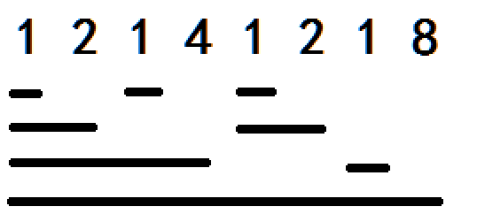
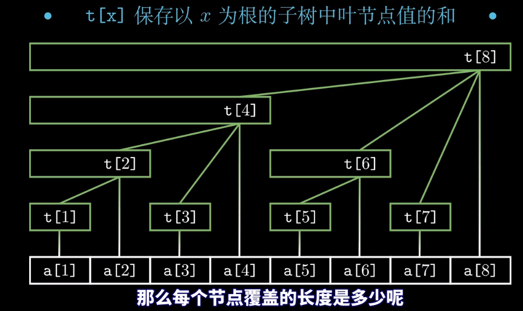
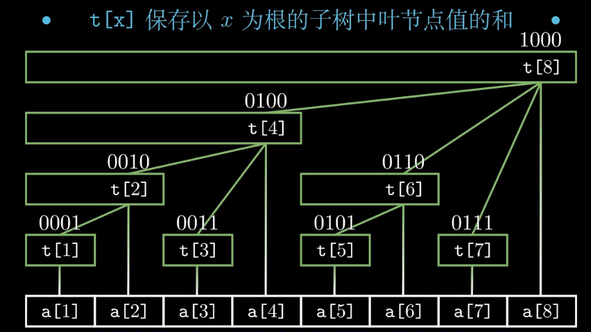
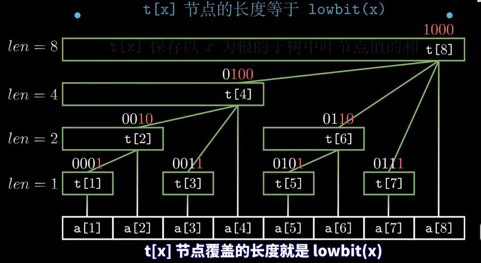
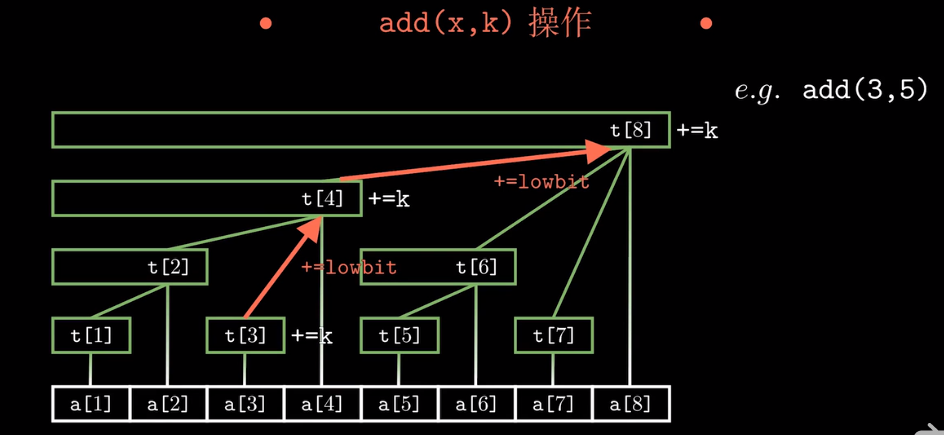
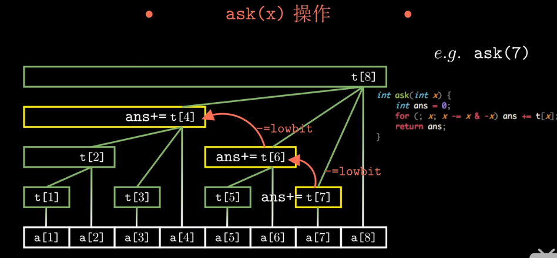

# 树状数组 Binary Indexed Tree

——解决：动态前缀和问题的数据结构。

作者：orangebird（知乎大佬）

## 三个问题：问题背景引入

有一天，小明给了我三个问题(其实是我自己出的啦~)

#### 问题1

**(1)**有一个机器，支持两种操作，在区间[1,10000]上进行。

操作A:把位置x的值+k

操作B:询问区间[l,r]所有数字之和

区间的初始值全部为0

现在你要充当这个机器，操作A和操作B会被穿插着安排给你，

要求对于所有操作B，给出正确的答案。

怎样做才能最节省精力？

#### 问题2

 **(2)**有一个机器，支持两种操作，在区间[1,10000]上进行。 

操作A:把区间[l,r]的值全都+x

操作B:询问x位置的值。

区间的初始值全部为0

现在你要充当这个机器，操作A和操作B会被穿插着安排给你，

要求对于所有操作B，给出正确的答案。

怎样做才能最节省精力？

#### 问题3

 **(3)**有一个机器，支持两种操作，在区间[1,10000]上进行。 

操作A:把区间[l,r]的值全都+x

操作B:询问区间[l,r]所有数字之和

区间的初始值全部为0

现在你要充当这个机器，操作A和操作B会被穿插着安排给你，

要求对于所有操作B，给出正确的答案。

怎样做才能最节省精力？


### 假设背景：

你可以动用的工具有:无限墨水的笔，一张足够大的纸，你的大脑(没多大内存的~)。

注意:

1.举个例子，进行这种类似的操作:

从一行任意打乱的数字中找一个数字

不能认为一瞬间就可以找到，在这里所花费的精力和数字的总数具有线性关系。

2.我们认为将数据转换为二进制不需要任何时间。


### 问题1暴力情况下：

对于问题1，如果我们每种操作都暴力进行，

那么显然总的时间复杂度为O(mA+n*mB),n表示区间长度，

mA表示操作A执行的次数，mB表示操作B执行的次数。

### 问题1解决办法：引入【树状数组】数据结构

那么有没有一种更加轻松的办法呢？

我们将引入一种数据结构，叫做<树状数组>。


## 前置知识-lowbit函数

介绍一个非常神奇的函数，它叫做lowbit。 

 lowbit(x)=x&((~x)+1) (为了少引入补码的概念，我们这里稍微麻烦了一下，其实x&-x就行) 

非负数n在二进制表示下，最低位1及后面的0构成的数值。

```output
lowbit(44)=lowbit((101100)2进制) = (100)2进制 = 4
将原来的数据按位取返+1 =>  101100
取反+1              =>  010100
将两个数按位&		    =>  100           =4;
```

返回的是数的二进制末尾1以及后续的0组成的值。

```
// x & ((~x)+1) == x&(-x); 
lowbit(int x){
	return x&(-x);
}
```

## 作用&帮助

—— 这种运算对我们的算法有什么帮助呢？ 

首先我们来解决一下 问题1。

### 1~32的lowbit

先列举出从1~32的lowbit

`1 2 1 4 1 2 1 8 1 2 1 4 1 2 1 16 1 2 1 4 1 2 1 8 1 2 1 4 1 2 1 32`

我们让第  i 个位置管理 `  [i-lowbit(i)+1,i]   `这一段区间，示意图如下：

怎么看每个数字管理多少？

只要顺着数字往下画竖线，碰到的第一根横线所覆盖的范围就是它能管理的范围。

  

### 执行a[x]+k修改时——如何更新

我们每次执行操作`A`（把位置`x`的值`+k`），只需要把  "能管理到`x`的所有位置"  都`+ k` 就行。

那么怎样快速找到哪些位置能管理到x呢？

答案还是：`lowbit(x)`, 表示当前位置管辖的数组长度；


 我们先更新`x`位置的值，然后更新`x`位置，`x = x+lowbit(x)`，那么新值依然可以管理到`x`，这样依次类推直到  `x>10000 `即可。

(1).比如  对于位置  `x = 2` ,那么首先更新`x`位置原始数组的值 `arr[x] += k`:  

更新 x 位置树状数组的值`tree[x] + = k` （==这不用说==）。

(2).然后   更新`x`的位置(更新到下一个能够管辖到位置`x`的位置)，`x=x+lowbit(x)=2+lowbit(2)=4`,更新到位置 ` x = 4`;

对着上面的示意图看看，会发现4确实能管理到2，那么把4的位置+k

(3).然后再来一遍,`x=4+lowbit(4)=8`，发现8还是能管理到2，继续给8这个位置+k;

就这样依次类推下去。 直到x=16384时，超过10000了，操作完成。


这样操作之后，树状数组里每一位当前存的值可能并不是该位置的实际值，为了方便区分，在下文中我们把实际值叫做"原数组的值"，当前值就叫做"树状数组的值"。

 

可以证明，对于任意一个x属于[1,10000]我们最多进行log(2,10000)次操作，就可以完成操作A 


**问题：  那么把操作A变复杂(从O(1)变到O(logn))能换来什么好处？**

答案就是，可以把操作B的时间复杂度降低成log级别的

### 求区间和

询问区间[L,R]的和sum(L,R)。我们只需要求出sum(1,R)和sum(1,L-1)

然后sum(1,R)-sum(1,L-1)就是sum(L,R)了

```C++
sum(1,R) = sum(1,R)-sum(1,L-1)
```

## 求前缀和

那么对于任意的x，sum(1,x)怎么求呢？

我们把最终得到的答案存在ans变量中，执行下面的操作:

（1）ans初始化为0

（2）ans加上x位置的值

（3）给x赋予新值 x-lowbit(x)

（4）如果x>0则跳回操作(2)，否则结束算法。  

### 举例具体说明：

给原数组第x位置的数增加k  => 能管理到x的所有位置"都增加了k

树状数组里的值  = 它能管理到的所有位置上，原数组的值之和

举个例子介绍一下:

一开始我们还是停留在树状数组第x位置上(比如x=6吧),答案一开始为0。

还记得吗，我们在进行"  给原数组第x位置的数增加k"  这个操作时，把"能管理到x的所有位置"都增加了k。

那么，对于任意一个位置，树状数组里的值就是"它能管理到的所有位置上，原数组的值之和"。

因此我们给答案加上树状数组第x位置的值，这里就得到了sum(5,6)，因为6能管理[5,6]

然后给x减去lowbit(x)，得到4。再加上x位置的值，也就是sum(1,4)，因为4能管理[1,4]

再让x=x-lowbit(x),得到0，由于不再大于0，算法终止，得到答案。

这时答案恰好是sum(1,6)，哈哈~

依然可以证明，最多只需要进行log级别次数的查询。

这样我们进行操作B的时间复杂度也是log级别了。


至此，树状数组就说完了，问题1也成功得到解决，时间复杂度O((mA+mB)*logn)。

在10000这个数量级下明显比之前的O(mA+(mB*n))小得多。

而且，位运算的常数非常小，因此整个算法执行速度会很快。

作者：orangebird

## 问题2解决：

问题2怎么办？用差分的方法，区间[l,r]所有值+k改成"位置l加上k，位置r+1减去k

查询的时候直接查询sum(1,x)就行，不理解的话可以自己构造一组数据尝试一下。

## 问题3解决

 问题3怎么办？稍微复杂一点 

用两个树状数组，分别叫做d和s

进行A操作时,d维护差分，s维护x*d[x]。

update(d,l,x);update(d,r+1,-x);

update(s,l,x*l);update(s,r+1,-x*(r+1));

进行B操作时

sum(L,R)=sum(1,R)-sum(1,L-1)

sum(1,L-1)=L*query(d,L-1)-query(s,L-1)

sum(1,R)=(R+1)*query(d,R)-query(s,R)


此方法是从博客看到的，感谢作者，并附上链接:


## 代码实现：

————文章作者

最后附上我自己封装的c++树状数组模板~

首先是简洁版，适合比赛现场手写，非常简短

```C++
int tree[100010],n=100000;
// 原始数组某个值+num; 更新所有管辖到x位置的数组数组的值；
void add(int x,int num)
{
	for(;x<=n;x+=x&-x)
		tree[x]+=num;
} 
// 计算(1~x)区间的值
int sum(int x)
{
	int answer =0;
	for(;x>0;x-=x&-x)
		answer+=tree[x];
	return answer;
} 
```

然后是一个功能较全的模板类，可以在项目里使用(好像并没有项目用得到2333)

(模板当前版本号为V1.2)

```c++
/**
* 树状数组模板使用说明
* 以下将树状数组维护的区间称为原数组
* 操作             说明               时间复杂度     支持范围
* size()     返回树状数组的大小		 O(1)          ~
* resize(x)  重新指定树状数组的大小为x	 O(1)         x>=0
* add(i,v)   将原数组第i位增加v	         O(logn)    0<=i<size
* sum(i)     返回原数组下标从0到i的和	 O(logn)    0<=i<size
* sum(l,r)   返回原数组下标从l到r的和	 O(logn)    0<=l<=r<size
* a[i]       返回原数组下标从0到i的和      O(logn)    0<=i<size
* a[i]+=v    将原数组第i位增加v	         O(logn)    0<=i<size
* a[i]-=v    将原数组第i位减去v		 O(logn)    0<=i<size
* 警告:超出操作支持的范围，产生的结果无法预料。
* 版权所有，非商业用途可以无限制使用，复制。禁止作为商业用途使用。
**/
#include<vector>
namespace OrangeOI
{
	template<typename Type>
	class BinaryIndexTree
	{
	private:
		size_t mSize;
		std::vector<Type> mArray;
		struct BinaryIndexTree_Node
		{
			BinaryIndexTree_Node(BinaryIndexTree& bit, size_t pos) :
				mBIT(bit), mPos(pos) {}
			const BinaryIndexTree_Node operator +=(Type value)
			{
				mBIT.add(mPos, value);
				return *this;
			}
			const BinaryIndexTree_Node operator -=(Type value)
			{
				mBIT.add(mPos, -value);
				return *this;
			}
			operator Type()
			{
				return mBIT.sum(mPos);
			}
		private:
			BinaryIndexTree& mBIT;
			size_t mPos;
		};
		int lowbit(int num)
		{
			return num&(~num + 1);
		}
	public:
		BinaryIndexTree() {}
		BinaryIndexTree(size_t size) :
			mSize(size)
		{
			mArray.resize(mSize);
		}
		virtual ~BinaryIndexTree() {}
		const size_t size()
		{
			return mSize;
		}
		void resize(size_t size)
		{
			mSize = size;
			mArray.resize(size);
		}
		void add(int index, Type value)
		{
			for (; index<mSize; index += lowbit(index + 1))
				mArray[index] += value;
		}
		Type sum(int index)
		{
			Type answer = Type();
			for (; index >= 0; index -= lowbit(index + 1))
				answer += mArray[index];
			return answer;
		}
		Type sum(int left, int right)
		{
			return sum(right) - sum(left - 1);
		}
		BinaryIndexTree_Node operator[](size_t pos)
		{
			return BinaryIndexTree_Node(*this, pos);
		}
	};
}
```


## 图片说明：



t[x]保存以x为根节点，所有叶子节点的和。

每个节点覆盖的长度是多少呢？

将每个节点 t[x]的x转化为x的二进制后，t[x]的长度等于lowbit（x）的长度。



t[x]的长度等于lowbit（x）的长度。



由观察可以得知：t[x]的父节点是t[x+lowbit(x)];

树的深度为：log(n+1)

## 进行的操作修改元素增加 k ：add(x,k) 






如果要求区间和可以求出前缀，并相减。