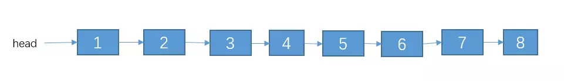
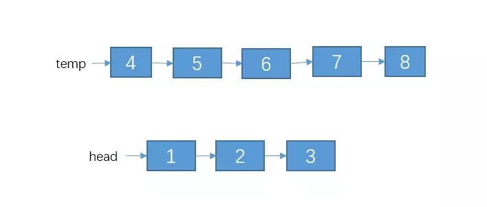
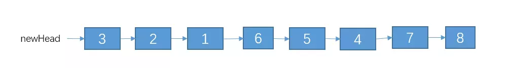
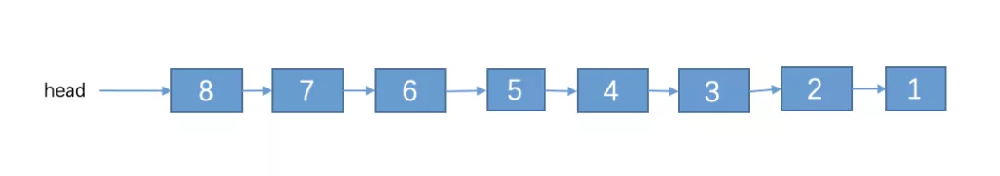
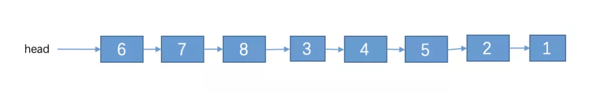
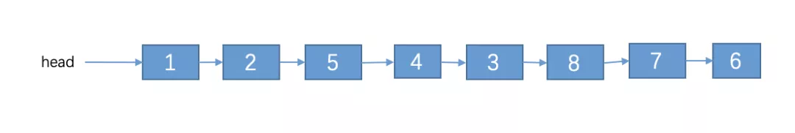
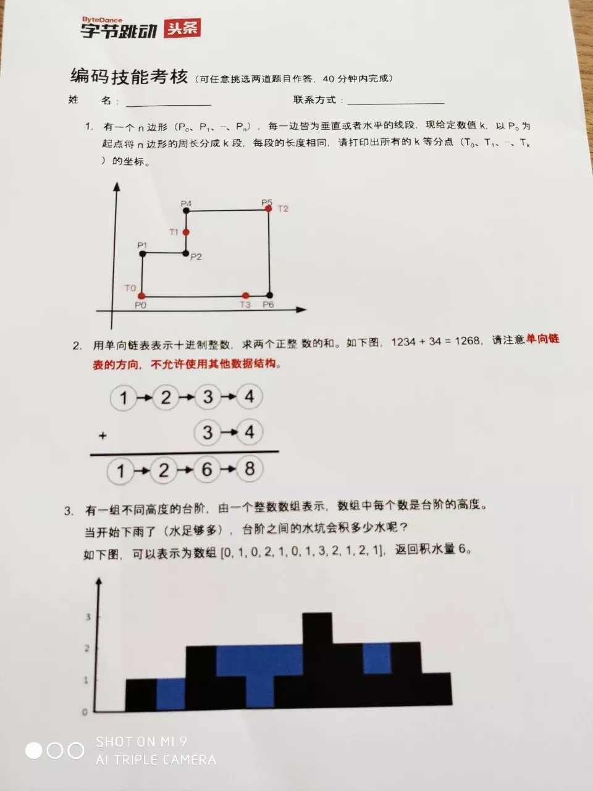

### 题目

这其实是一道变形的链表反转题，大致描述如下

给定一个单链表的头节点 head,实现一个调整单链表的函数，使得每K个节点之间为一组进行逆序，并且从链表的尾部开始组起，头部剩余节点数量不够一组的不需要逆序。（不能使用队列或者栈作为辅助）

例如：
链表:1->2->3->4->5->6->7->8->null, K = 3。那么 6->7->8，3->4->5，1->2各位一组。调整后：1->2->5->4->3->8->7->6->null。其中 1，2不调整，因为不够一组。

### 解答

这道题的难点在于，是从链表的尾部开始组起的，而不是从链表的**头部**，如果是头部的话，那我们还是比较容易做的，因为你可以遍历链表，每遍历 k 个就拆分为一组来逆序。但是从尾部的话就不一样了，因为是单链表，不能往后遍历组起。不过这道题肯定是用递归比较好做。

### 先做一道类似的反转题

在做这道题之前，我们不仿先来看看**如果从头部开始组起的话**，应该怎么做呢？例如：链表:1->2->3->4->5->6->7->8->null, K = 3。调整后：3->2->1->6->5->4->7->8->null。其中 7，8不调整，因为不够一组。

这道题我们可以用递归来实现，假设方法reverseKNode()的功能是将单链表的每K个节点之间逆序(从**头部**开始组起的哦);reverse()方法的功能是将一个单链表逆序。

那么对于下面的这个单链表，其中 K = 3。




我们把前K个节点与后面的节点分割出来：





> temp指向的剩余的链表，可以说是原问题的一个子问题。
>
> 我们可以调用reverseKNode()方法将temp指向的链表每K个节点之间进行逆序。:+1:
>
> 再调用reverse()方法把head指向的那3个节点进行逆序，结果如下：


> 再次声明，如果对这个递归看不大懂的，建议看下我那篇递归的文章

接着，我们只需要把这两部分给连接起来就可以了。最后的结果如下：



### 回到本题

这两道题可以说是及其相似的了，只是一道从头部开始组起，这道从头部开始组起的，也是 leetcode 的第 25 题。而面试的时候，经常会进行变形，例如这道字节跳动的题，它变成从**尾部**开始组起，可能你一时之间就不知道该怎么弄了。当然，可能有人一下子就反应出来，把他秒杀了。

其实这道题很好做滴，你只需要先把单链表进行一次**逆序**，逆序之后就能转化为**从头部开始组起**了，然后按照我上面的解法，处理完之后，把结果**再次逆序**即搞定。两次逆序相当于没逆序。

例如对于链表（其中 K = 3）


我们把它从尾部开始组起，每 K 个节点为一组进行逆序。

步骤如下

1、先进行逆序



逆序之后就可以把问题转化为从**头部**开始组起，每 K 个节点为一组进行逆序。

2、处理后的结果如下



3、接着在把结果**逆序**一次，结果如下




实现的代码如下：

```C++
#include <cstdio>
struct Node{
    Node* next;
    int value;
    Node(Node * p,int v):next(p),value(v){}
};

void insertList(Node * &head,int n){
    Node *newNode=new Node(NULL,n);
    if(head==NULL){
        head=newNode;
    } 
    else{
         Node * p= head;
         while(p->next!=NULL){
             p=p->next;
         }
         p->next=newNode;   
    }
}
void makeList(Node * &head,int a[],int n){
  for(int i = 0; i < n; i++ ){
      insertList(head,a[i]);
  }
}

void displayList(Node * &head){
    Node *p=head;
    while(p!=NULL){
        printf("%d ",p->value);
        p=p->next;
    }
    printf("\n");
}
void reserveOrder(Node * &head){
    Node *p=head,*r=NULL;
    head=NULL;
    while(p!=NULL){
        Node * t=p->next;
        p->next=r;
        r=p;
        p=t;
    }
    head=r;
}
//递归写法，有点想法的
Node* reserveKGroup(Node *head,int k){
    Node * h=head,*p=head;
    for(int i=1; p!=NULL && i<k; i++){
        p=p->next;
    }
    if(p==NULL){
        return head;
    }
    Node * t=p->next;
    p->next=NULL;
    reserveOrder(head);
    displayList(head);
    Node* ptr=head;
    for(int i=1; i<k; i++)
        ptr=ptr->next;
    ptr->next=reserveKGroup(t,k);
    return head;
}
//使用非递归的方式实现。


int main(){
    Node* head = NULL;
    int a[]={1,2,3,4,5,6,7,8};
    makeList(head,a,8);
    if(head == NULL)
        printf("NULL\n");
    displayList(head);
    reserveOrder(head);
    displayList(head);
    head=reserveKGroup(head,3);
    displayList(head);

    return 0;
}
```


类似于这种需要先进行逆序的还要两个链表相加，这道题字节跳动的笔试题也有出过，如下图的第二题



这道题就需要先把两个链表逆序，再节点间相加，最后在合并了。