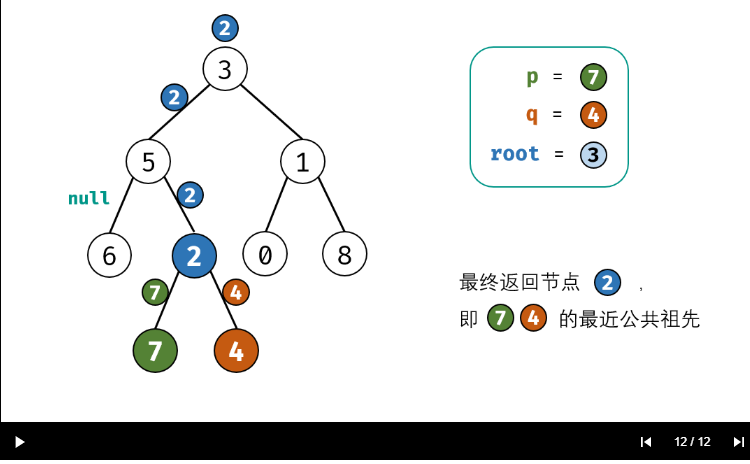

# 面试题68 - II. 二叉树的最近公共祖先

#### [面试题68 - II. 二叉树的最近公共祖先](https://leetcode-cn.com/problems/er-cha-shu-de-zui-jin-gong-gong-zu-xian-lcof/)

难度简单48收藏分享切换为英文关注反馈

给定一个二叉树, 找到该树中两个指定节点的最近公共祖先。

[百度百科](https://baike.baidu.com/item/最近公共祖先/8918834?fr=aladdin)中最近公共祖先的定义为：“对于有根树 T 的两个结点 p、q，最近公共祖先表示为一个结点 x，满足 x 是 p、q 的祖先且 x 的深度尽可能大（**一个节点也可以是它自己的祖先**）。”

例如，给定如下二叉树: root = [3,5,1,6,2,0,8,null,null,7,4]


```output
示例 1:

输入: root = [3,5,1,6,2,0,8,null,null,7,4], p = 5, q = 1
输出: 3
解释: 节点 5 和节点 1 的最近公共祖先是节点 3。
```

```output
示例 2:

输入: root = [3,5,1,6,2,0,8,null,null,7,4], p = 5, q = 4
输出: 5
解释: 节点 5 和节点 4 的最近公共祖先是节点 5。因为根据定义最近公共祖先节点可以为节点本身。
```

说明:

所有节点的值都是唯一的。
p、q 为不同节点且均存在于给定的二叉树中。
注意：本题与主站 236 题相同

来源：力扣（LeetCode）
链接：https://leetcode-cn.com/problems/er-cha-shu-de-zui-jin-gong-gong-zu-xian-lcof
著作权归领扣网络所有。商业转载请联系官方授权，非商业转载请注明出处。


## 解题思路：


根据以上定义，若 `root` 是 `p,q` 的 最近公共祖先 ，则只可能为以下情况之一：

- `p` 和` q`在 `root` 的子树中，且分列 `root` 的 异侧（即分别在左、右子树中）；
- `p=root` ，且 `q` 在 `root` 的左或右子树中；
- `q=root` ，且 `p` 在`root` 的左或右子树中；


##### 递归解析：

1. 终止条件：

   1. 当越过叶节点，则直接返回` null`；

   2. 当 `root` 等于 `p, q`，则直接返回 `root`；

      > 特别注意： 若循环到某个 二叉树 根节点 == 查询的两个节点之一，不用在往下遍历，直接返回`root`节点；返回值root，一直向上传递；知道遇到   其祖先节点 的左右子树，如果返回值 还有另一个非`null` 节点，然后向上传递当前祖先节点。
      >
      > 传递到 整个二叉树的 根节点的时候，这些个祖先节点都没有 左右子树返回同时返回 非`null`的情况；
      >
      > 因为题目定义`q,p`两个节点一定存在于二叉树中，则`p,q` 其中一个必然存在于  返回上来的节点子树中；

      

      

**递推工作：**

1. 开启递归左子节点，返回值记为` left`；
2. 开启递归右子节点，返回值记为 `right` ；

**返回值：**据 `left`和 `right` ，可展开为四种情况；

1. 当 `left` 和 `right` 同时为空 ：说明 `root` 的左 / 右子树中都不包含 `p,q` ，返回 null ；

2. 当 `left` 和 `right` 同时不为空 ：说明 `p,q` 分列在 `root `的 异侧 （分别在 左 / 右子树），因此` root` 为最近公共祖先，返回`root` ；

3. 当 `left`为空 ， `right` 不为空 ：说明 `p,q` 都在 `root` 的 右子树 中，且此时的 `right` 指向最近公共祖先节点，因此直接返回 `right` ；

4. 当 `left` 不为空 ， `right` 为空 ：说明 `p,q`都在` root` 的 左子树 中，且此时的 `left` 指向最近公共祖先节点，因此直接返回 `left` ；

   





## 代码

```c++
/**
 * Definition for a binary tree node.
 * struct TreeNode {
 *     int val;
 *     TreeNode *left;
 *     TreeNode *right;
 *     TreeNode(int x) : val(x), left(NULL), right(NULL) {}
 * };
 */
class Solution {
public:
    //vector<bool> exist(2,false);
    //TreeNode * lowestAncestor;
    // 节点值都是唯一的；

    TreeNode* lowestCommonAncestor(TreeNode* root, TreeNode* p, TreeNode* q) {
        if(root == nullptr || root == p || root ==q )
            return root;
        TreeNode * left = lowestCommonAncestor(root->left,p,q);
        TreeNode * right = lowestCommonAncestor(root->right,p,q);
        //left = right  =nullptr;
        if(left!=nullptr && right!=nullptr)
            return root;
        return left == nullptr ? right:left;
        //return nullptr;
    }

};
```


### 附赠: 递归查找子（虽然查找）

```c++
    TreeNode* find(TreeNode* root, TreeNode* p) {
        if(root == nullptr || root == p )
            return root;
        TreeNode * left = find(root->left,p);
        TreeNode * right = find(root->right,p);
        //left = right  =nullptr;
        return left ==nullptr ? right:left; 
        if(left!=nullptr && right!=nullptr)
            return root;
    }
```


参考资料：

作者：jyd
链接：https://leetcode-cn.com/problems/er-cha-shu-de-zui-jin-gong-gong-zu-xian-lcof/solution/mian-shi-ti-68-ii-er-cha-shu-de-zui-jin-gong-gon-7/
来源：力扣（LeetCode）
著作权归作者所有。商业转载请联系作者获得授权，非商业转载请注明出处。