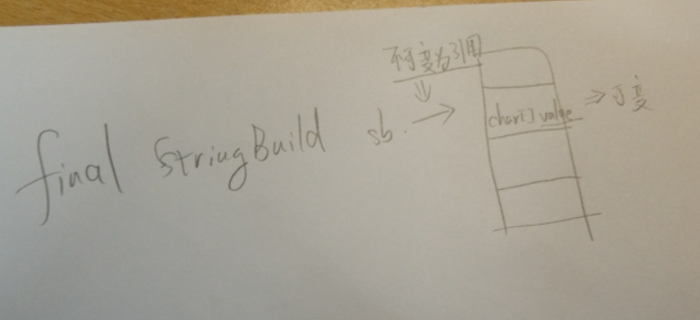

作者：歪歪歪？
链接：https://www.nowcoder.com/discuss/183739
来源：牛客网

360面试题问得很深：

final修饰的String不可继承，final修饰的StringBuilder还可以append吗，我忘了final修饰的引用地址不可变

复习 `final`关键词的作用： 

- final修饰的类，不可继承；

- final修饰方法，不能重写
- final修饰的变量，其引用不能变，相当于是常数指针；（在类内部只能赋值一次）；

因此是可以调用apend()方法的；  =>    成员函数

​	八大基础变量我忘了两个。。。。。他们分别的包装类

​	java回收算法，我说复制算法，标记整理，标记清楚，他说不对

​	java包装类的结构，大小，读过源代码吗，装箱拆箱原理。。。。

​	java内存模型，我说jvm内存结构，他说不对。

​	hashmap深入讲解内部原理，put过程等，头插法，尾插法优缺点，这个也打出来了

​	他说线程实现方式，我终于说出来了，他又问怎么同步公共变量，我说用sychronized，他说不行要用更好的办法

​	线程间怎们处理错误的线程？？？？？？？？？？？没懂意思

​	sql语句group by的用法

​	算法一个有序的数组，取和为n的数组组合（比如和为9，{{2，3，4}，{4，5}}这样的），我之前leetcode刷过，我忘了。。。。

​	这次面试问得我很尴尬，感觉自己啥也没学一样，确实需要继续进步

​	

​	.........................................................

​	对还忘了问红黑树，他问我了解红黑树的增删吗，我说我只知道增有三种情况，删有四种情况，他说不行，你要深入了解啊。。。。。。

来源：

————————————————
版权声明：本文为CSDN博主「敖 丙」的原创文章，遵循CC 4.0 BY-SA版权协议，转载请附上原文出处链接及本声明。
原文链接：https://blog.csdn.net/qq_35190492/java/article/details/105186952

计科大三学生，无实习无项目经历成绩普通

一面3.9：40min
HashMap和ConcurrentHashMap的区别

vector，list

C++多态，虚函数机制

进程通信

进程线程差异

TCP三次握手四次挥手细节

算法题：最长不重复字串（HashTable，O(N)）

面试官人非常好，有一些遗漏的知识点会给你指出来并且讲解，也很耐心。

二面3.15：1h
Java多态（看程序说结果，比较复杂，还考察了override和overwrite）

二叉搜索树

B树b+树

红黑树删除算法

用互斥锁实现读写锁，写者优先

算法题：有100个方格，每个上面有毒蘑菇和体力蘑菇，毒蘑菇减体力体力蘑菇加体力，当前体力是能跳到的最远距离，求是否能跳到最远方格，如果可以，求落在第100格上的最大剩余体力

二面面试官挺严肃的，回答问题不会肯定或者否定你，听完你的回答就会直接继续下一个知识点，节奏非常紧凑。面完我一度以为凉了，结果十分钟后hr打电话通知三面，而且三面面试官说前面的两次面试官评价挺高。所以小伙伴碰到比较严肃的面试官也不要灰心，平常心回答就好

三面3.17： 1h
服务方法调用

RPC/Netty

序列化/反序列化

10亿找Top10000，需要考虑分片，如果用最小堆需要考虑高效合并

要考虑等待时间且带有优先权的打印机，设计数据结构使打印任务高效

二十四点牌

在三面开始的时候面试官问了能够实习的时间和想要实习的地点，猜测可能是leader直接面试（最后也正好去了这个面试官在的城市），人很和善，不过问题都不是我准备过的基础题型，碰到的时候还是有一点束手无策。

3.27收到offer啦！等了快两周终于拿到心心念念的offer哈哈！
其实准备字节跳动的面试还是需要着重准备基础部分（数据结构、算法、操作系统、计算机网络），另外对做算法题的要求很高，如果在看到题目的时候能直接给出这个题目的最优时空复杂度解法，面试官对你的评价会很高。

如果基础知识比较扎实了，可以看看网络上的面试经验，找找自己不会的知识点，查漏补缺。

也祝大家都能拿到心仪的offer！

絮叨
首先恭喜一下读者，让敖丙我去，我是肯定面不过，这些好多都没准备过，我之前说校招比社招难，真的没框你们，所以仔们，真的得好好准备呀。

说一下最近我的事情吧，最近小忙，文章输出频率不比以前了，而且最近熬夜熬多了好像头发少了，我后面还是控制下熬夜的事情。

最后发个意见征集吧，不知道写啥了，我在写一个分布式锁的，下周发出来，其他就不知道了，你们留言看看你们想看啥，我看到感兴趣的我就写了。
