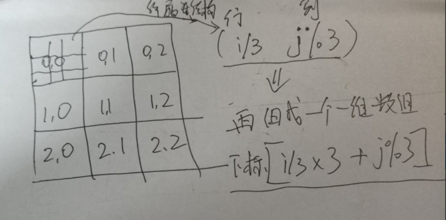

#### [37. 解数独](https://leetcode-cn.com/problems/sudoku-solver/)

难度困难476收藏分享切换为英文关注反馈

编写一个程序，通过已填充的空格来解决数独问题。

一个数独的解法需**遵循如下规则**：

1. 数字 `1-9` 在每一行只能出现一次。
2. 数字 `1-9` 在每一列只能出现一次。
3. 数字 `1-9` 在每一个以粗实线分隔的 `3x3` 宫内只能出现一次。

空白格用 `'.'` 表示。


一个数独。


答案被标成红色。

**Note:**

- 给定的数独序列只包含数字 `1-9` 和字符 `'.'` 。
- 你可以假设给定的数独只有唯一解。
- 给定数独永远是 `9x9` 形式的。


解题思路：

`sudo`的特点是: 每一行，没一列，每一个3 * 3的数组每个数字只能出现一次。

对矩阵内部小矩阵进行编号：



每行，列用一个数组存储： 是否包含有了数字n；（列同理）

更具上面的结构：每个3*3的box同理;

## 回溯法 : 

这边的思路就是穷举，每一种可能的情况了；

遇到`.` 进行穷举，穷举所有可能， 当前点满足情况之后，继续穷举下一个`.`点；

回溯三个步骤： 

- 1.做选择
- 2.继续穷举
- 3.撤销选择

```java
// 对 board[i][j] 进行穷举尝试
void backtrack(char[][] board, int i, int j) {
    int m = 9, n = 9;
    for (char ch = '1'; ch <= '9'; ch++) {
        // 做选择
        board[i][j] = ch;
        // 继续穷举下一个
        backtrack(board, i, j + 1);
        // 撤销选择
        board[i][j] = '.';
    }
}
```


我们需要一直往下回溯81个点`[0:81)`， 枚举到81时，说明已经找到了一个正确的答案；

## 回溯 遍历所有的可能，不管是不是有答案了；

```java
class Solution {
    boolean[][] rows;
    boolean[][] cols;
    boolean[][] boxes;
    char[][] board ;
    char[][] ans;
    public void solveSudoku(char[][] board) {
        this.board = board;
        ans = new char[9][9];
        rows= new boolean[9][9];
        boxes = new boolean[9][9];
        cols = new boolean[9][9];
        //存储初始化状态
        for(int i = 0; i <9; i++) {
            for(int j = 0; j < 9; j++) {
                if(board[i][j] == '.') continue;
                int index = board[i][j] - '1'; // 0 - 8
                rows[i][index] = true;
                cols[j][index] = true;
                boxes[(i/3) * 3 + j/3][index] = true;
            }
        }
        // 深度优先搜索
        dfs(0);
        for(int i = 0; i<9; i++)
            System.arraycopy(ans[i], 0, board[i], 0 ,9);
        //System.out.println(Arrays.deepToString(board));


    }
    //判断能否到达终点;
    public void dfs(int p) {

        while(p < 81 && board[p/9][p%9] != '.')
            p++;
        //到达终点;
        if(p >= 81) {
            //if(p >= 81) {
            //System.arraycopy(board, 0, ans, 0 ,81);
            //System.out.println(Arrays.deepToString(board));
            for(int i = 0; i<9; i++){
                System.arraycopy(board[i], 0, ans[i], 0 ,9);
            }

            return;
        }
        //没到达终点;
        int i = p / 9 , j = p % 9;
        for(int n = 0; n < 9; n ++) {
            if(rows[i][n]!=true && cols[j][n]!=true && boxes[i/3*3+j/3][n]!=true){
                //System.out.println("i = "+i+"  j = "+j +" :"+(n+1));
                rows[i][n] = true;
                cols[j][n] = true;
                boxes[i/3*3+j/3][n] = true;
                board[i][j] = (char)(n + '1');
                // if(dfs(p))
                //     return true;
                dfs(p);
                // 回溯。
                rows[i][n] = false;
                cols[j][n] = false;
                boxes[i/3*3+j/3][n] = false;
                board[i][j] = '.';
            }
        }
        //return false;
    }
}
```


