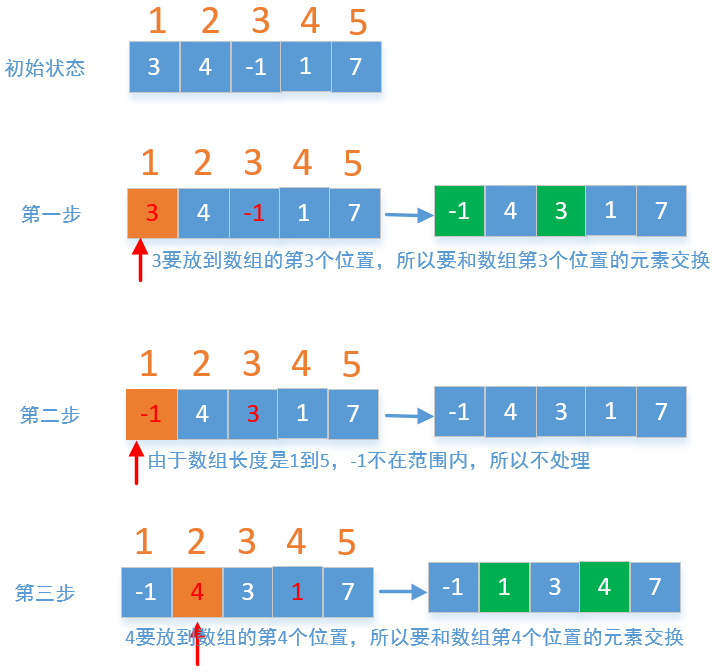

#### [41. 缺失的第一个正数](https://leetcode-cn.com/problems/first-missing-positive/)

难度困难682

给你一个未排序的整数数组，请你找出其中没有出现的最小的正整数。

 

**示例 1:**

```
输入: [1,2,0]
输出: 3
```

**示例 2:**

```
输入: [3,4,-1,1]
输出: 2
```

**示例 3:**

```
输入: [7,8,9,11,12]
输出: 1
```

 

**提示：**

你的算法的时间复杂度应为O(*n*)，并且只能使用常数级别的额外空间。


## 基础思路

1.比如使用一个集合，然后判断从 1 -n 开始判断是不是存在于集合中；

设不同元素个数为m, 长度为n; 

复杂度：空间复杂度O(m)，  时间复杂度为： O（m*logn）

2.直接判断1- n是不是在数组中； 空间复杂度O(1),    时间复杂度O(m*n)


## 4，存放对应的位置：将数组中元素，存放到对应位置；

我们还可以把每个元素存放到对应的位置，比如1存放到数组的第一个位置，3存放到数组的第3个位置，
如果是非正数或者大于数组的长度的值，我们不做处理，最后在遍历一遍数组，如果位置不正确，说明这个位置没有这个数，我们就直接返回，我们画个图看一下




作者：sdwwld
链接：https://leetcode-cn.com/problems/first-missing-positive/solution/javade-6chong-jie-fa-de-tu-wen-xiang-jie-wei-yun-s/
来源：力扣（LeetCode）
著作权归作者所有。商业转载请联系作者获得授权，非商业转载请注明出处。


```java
class Solution {
    public int firstMissingPositive(int[] nums) {
        int len = nums.length;
        for(int i = 0; i < len; i++) {
            while(nums[i] != i+1 && nums[i] <= len 
                  && nums[i] > 0 && nums[i]!=nums[nums[i] - 1]) {
                  int tmp = nums[nums[i]-1];
                  nums[nums[i]-1]  = nums[i];
                  nums[i] = tmp;
                  //i --;
            }
        }
        //System.out.println(Arrays.toString(nums));
        for(int i = 0; i < len; i++) {
          if(i+1 != nums[i])
              return i+1;
        }
        return len+1;

    }
}
```


## 


