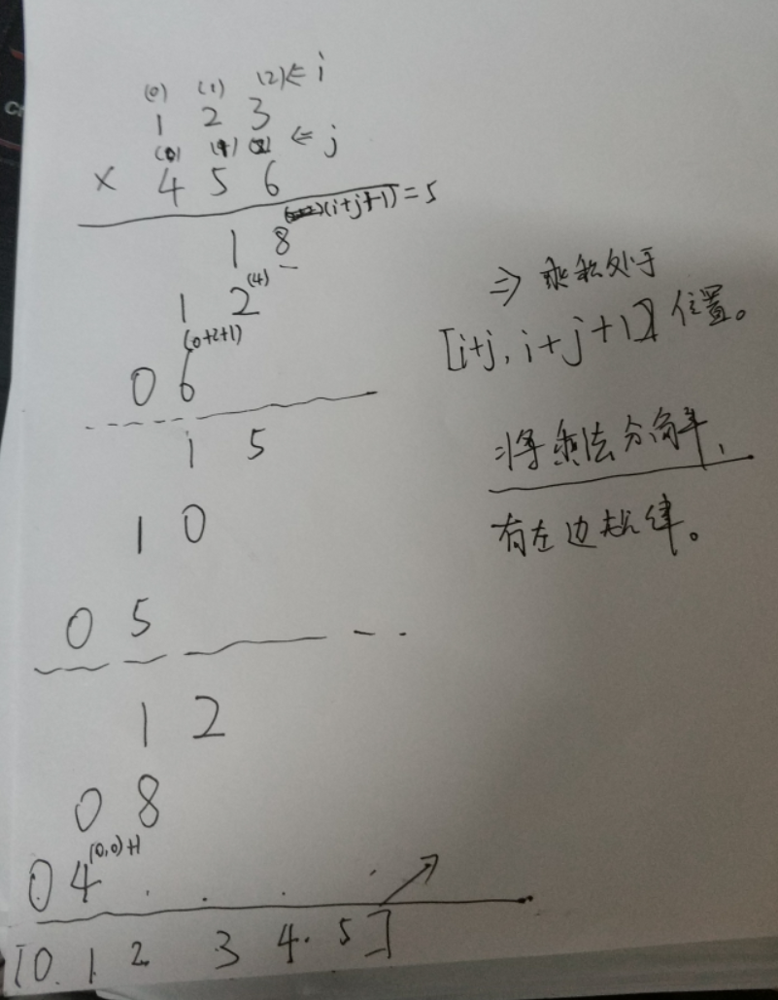

#### [43. 字符串相乘](https://leetcode-cn.com/problems/multiply-strings/)

难度中等390

给定两个以字符串形式表示的非负整数 `num1` 和 `num2`，返回 `num1` 和 `num2` 的乘积，它们的乘积也表示为字符串形式。

**示例 1:**

```
输入: num1 = "2", num2 = "3"
输出: "6"
```

**示例 2:**

```
输入: num1 = "123", num2 = "456"
输出: "56088"
```

**说明：**

1. `num1` 和 `num2` 的长度小于110。
2. `num1` 和 `num2` 只包含数字 `0-9`。
3. `num1` 和 `num2` 均不以零开头，除非是数字 0 本身。
4. **不能使用任何标准库的大数类型（比如 BigInteger）**或**直接将输入转换为整数来处理**


## Leetcode大佬的优化解法

将乘法分解为各个位置的乘法：





```java
class Solution {
    public String multiply(String num1, String num2) {
        int len1 = num1.length(), len2 = num2.length();
        if("0".equals(num1) || "0".equals(num2))
            return "0";
        int[] ans = new int[len1 + len2];
        for(int j = len2 -1 ; j >= 0; j--) {
            for(int i = len1 - 1; i >= 0; i--) {
                int v = (num1.charAt(i) -'0') * (num2.charAt(j) - '0');
                v += ans[i + j + 1];
                ans[i+j+1] = v % 10;  //乘积个位为当前当前该位置结果
                ans[i+j] += v / 10;  //进位加到 前一位去
                //System.out.println(Arrays.toString( ans));
             }
        }
        StringBuilder sb = new StringBuilder();
        int i = 0;
        while(i < ans.length && ans[i]== 0)
           i ++;
        while(i < ans.length){
          sb.append(ans[i]);  
          i++;
        }
        return sb.toString();
    }
}
```


## 比较基础思路：

将两个数字乘法：转变成 第二个字符串 每个元素* 第一个字符串所有元素，然后在错位一下；

将两个乘法结果 加起来；  

```java
class Solution {
    public String multiply(String num1, String num2) {
        //int len1 = , int len2 = num2.length;
        if("0".equals(num1) || "0".equals(num2))
            return "0";
        
        int i = num1.length() -1, j = num2.length() -1;
        int up = 0;
        String ans  = "0";
        /*
          123  i
          456  j
        */
        while(j >= 0) {
            StringBuilder sb = new StringBuilder();
            up = 0;
            i = num1.length() -1;
            for(int k = 0; k < num2.length() - j-1; k++)
                sb.append('0');
            while(i>=0) {
                int  a = (num1.charAt(i) - '0') * (num2.charAt(j) - '0') + up;
                sb.append(  (char)(a % 10 +'0'));
                up = a/10;
                i--;
            }
            if(up > 0)
              sb.append((char)(up+'0'));
            ans = add(sb.reverse().toString(), ans);
            j--;
        }
        return ans;
    }


     public String add(String num1, String num2) {
        //System.out.println(num1 +" + " + num2 );
        //int len1 = , int len2 = num2.length;
        int i = num1.length() -1, j = num2.length() -1;
        StringBuilder ans = new StringBuilder();
        int up = 0;
        while(i >= 0 && j >= 0) {
        
            int a =  (num1.charAt(i) - '0')  + (num2.charAt(j) -'0' ) + up;
            ans.append((char)('0' + a%10));
            up = a/10;
            i--;
            j--;
        }
        while(i>=0) {
           int a  = num1.charAt(i) -'0' + up;
           ans.append((char)('0' + a%10));
           up = a/ 10;
           i--;
        }
        while(j >= 0) {
            int a  = num2.charAt(j) -'0' + up;
            ans.append((char)('0' + a%10));
            up = a/ 10;
            j--;
        }
        if(up > 0)
          ans.append((char)('0'+up));
        //System.out.println("->"+ ans.reverse().toString());
        return ans.reverse().toString();
    } 
}
```

