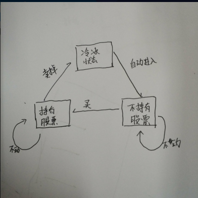
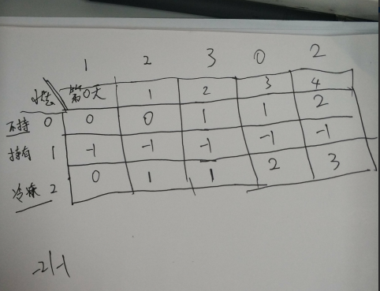

对于力扣平台上的股票类型的题目：

121. 买卖股票的最佳时机

122. 买卖股票的最佳时机 II

123. 买卖股票的最佳时机 III

188. 买卖股票的最佳时机 IV

（本题）309. 最佳买卖股票时机含冷冻期

714. 买卖股票的最佳时机含手续费

剑指 Offer 63. 股票的最大利润

作者：LeetCode-Solution
链接：https://leetcode-cn.com/problems/best-time-to-buy-and-sell-stock-with-cooldown/solution/zui-jia-mai-mai-gu-piao-shi-ji-han-leng-dong-qi-4/
来源：力扣（LeetCode）
著作权归作者所有。商业转载请联系作者获得授权，非商业转载请注明出处。


#### [309. 最佳买卖股票时机含冷冻期](https://leetcode-cn.com/problems/best-time-to-buy-and-sell-stock-with-cooldown/)

难度 中等416

给定一个整数数组，其中第 *i* 个元素代表了第 *i* 天的股票价格 。

设计一个算法计算出最大利润。在满足以下约束条件下，你可以尽可能地完成更多的交易（多次买卖一支股票）:

- 你不能同时参与多笔交易（你必须在再次购买前出售掉之前的股票）。
- 卖出股票后，你无法在第二天买入股票 (即冷冻期为 1 天)。

**示例:**

```
输入: [1,2,3,0,2]
输出: 3 
解释: 对应的交易状态为: [买入, 卖出, 冷冻期, 买入, 卖出]
```

通过次数38,493     提交次数69,220


## 辅助理解

有限*自动机*（Finite Automata Machine）




## 动态规划处理

定义子问题：

定义: 买入股票为负收益，卖出股票为正收益；

`profit[i]` 表示第 `i` 天结束之后，最大利益；  

根据题目描述，我们只能持有 一支股票，卖出股票之后，还有一天冷冻期；因此，就有

三种不同状态:

- 目前持有一只股票， `profit[i][1]`

- 目前不持有股票，处于冷冻期：`profit[i][2]`

- 目前没有股票，并且不再冷冻期 `profit[i][0]`


状态转移方程：

【有股票状态】`profit[i][1]` 表示第`i` 天持有股票，

- 可以是从`i-1`天就持有的，今天没买也没买，0收益，转移为`profit[i-1][1]`
- 可以是今天买入的, 今日产生负收益，那么`i`，转移为`profit[i-1][0] - prices[i]`

【没股票状态】`profit[i][0]` 表示第`i`天结束后，【没有股票，也不是冰冻期】：

- 可以`i-1`前一天是冰冻期，今日0 收益，转移为 `profit[i-1][2]` 
- 可以`i-1`前一天是【没有股票，也不是冰冻期】, 今日0 收益， `profit[i][0]`

【冰冻期】`profit[i][2]` 表示第`i`天结束之后，处于【冰冻状态】，

- 是今天卖掉了股票，前一天就必须含有股票，今日收益` prices[i]`，转移为`profit[i-1][1] +prices[i] `


边界条件：将第一天作为动态规划边界条件：

`profit[0][1] =-prices[0]`  表示在第0天买入股票，收益此时为`prices[0]`;

`profit[0][0]=0` 表示第0天结束没有持有股票，则收益为0

`profit[0][2]= 0 ` 表示第0结束为冰冻状态，但是第一天是冰冻状态是不存在的。


结果的判断：

最后一天，的最大收益：

当最后一天手上还持有股票的，收益应该不会太高的；

因此，0只需要比较`profit[n-1][0] profit[n-1][2]`

```java
class Solution {
    public int maxProfit(int[] prices) {
        if(prices == null || prices.length == 0)
            return 0;
        int len = prices.length;
        int[][] profit = new int[len][];
        for(int i = 0; i < len; i++)
            profit[i] = new int[3];
        //初始化：
        profit[0][1] = - prices[0];
        
        for(int i = 1; i < len; i++) {
            profit[i][0] = Math.max(profit[i-1][0],profit[i-1][2]);
            profit[i][1] = Math.max(profit[i-1][0] - prices[i], profit[i-1][1]);
            profit[i][2] = profit[i-1][1] + prices[i];
        }
        return Math.max(profit[len-1][0], profit[len-1][2]);
    }
}

```


