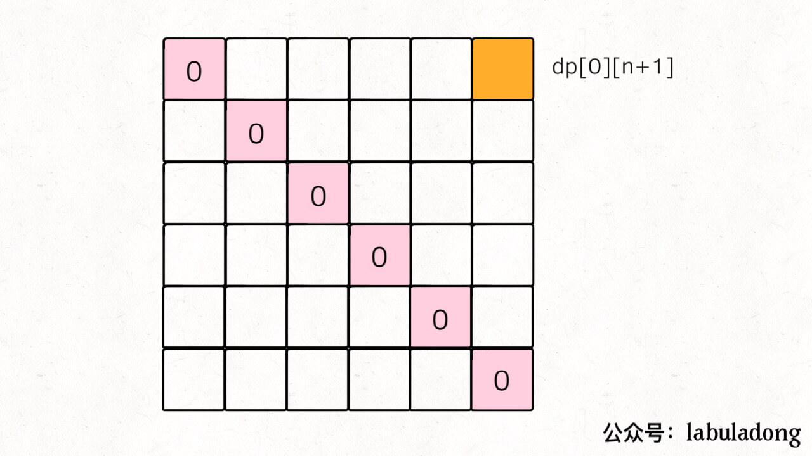
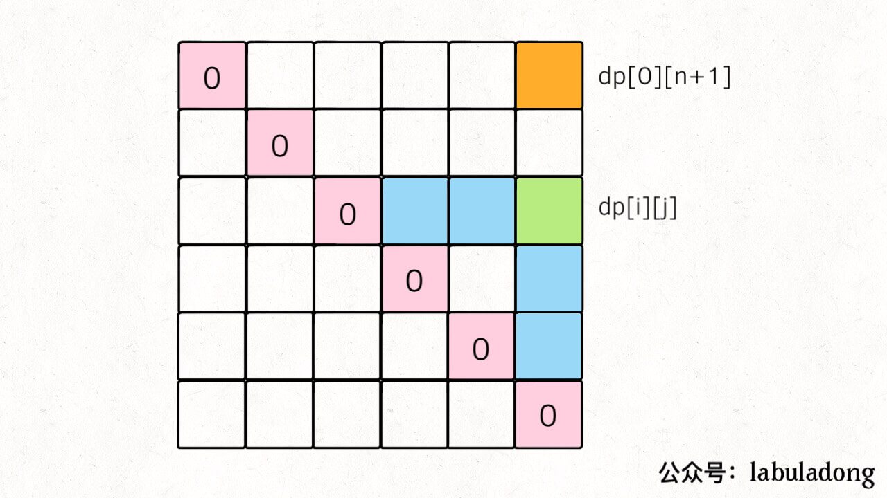

## 分治法

### 分析：

`[i ,i+1 ,i+2 ,i+3 ···k-1, k, k + 1 ···, j]`

如果划分成`[1,2,3,4····k-1]` 与 `[k+1,···,n]` 两个子问题

`count(i,j)= count(i,k-1) + count(k+1,j) + nums[k-1]*nums[k]*nums[k+1];` 

`count(i,k-1)` 与`count(k+1, j)` 两个会互相影响，无法独立；（`k-1`的邻居是 `k+1`） 这种划分子问题的方式不是很合适； 


我们通过观察后发现，戳破边界`i` 与`k-1` 的解，将会产生与其它问题的依赖关系。因此我们选择不戳破边界的气球；


**定义子问题为；**`count(i,j)`不戳破`i` 与`j`， 只戳破内部气球 能够获取的最大金币数目；

**那么状态转移方程**可以写为：`count(i,j) = count(i,k)+count(k,1)+nums[i][j][k] (i<k<j)`

`[i,x,x,x,···,k,x,x,x,···,j] => [i,k,j]`

其中`nums[i][j][k]`为戳破气球k的时候，我们能够得到的金币数目.

为了搜索所有的解空间，我们需要尝试所有的子问题划分方式，对于上述的状态转移方程来说，就是不同的`k`取值方式。

**真状态转移方程为：**`count(i,j) = max{ count(i,k)+count(k,j)+nums[i][j][k] } (i<k<j)`

这样我们便使用了子问题的解来表示原问题的解方式。

`count(i, i +2) =count(i,i+1)+count[i+1,i+2] + nums[i]*nums[i+1]*nums[i+2]   `

其中`count(i,i+1)=0`， `count(i+1, i+2) =0` 内部没有什么气球好戳破的，所有为0；

`count(i, i +2)`  表示不戳破`i`,`i+2`, 只戳破`i+1`, 则硬币数为`nums[i]*nums[i+1]*nums[i+2]`

边界条件：如上所示；

## 分治法代码实现

```java
class Solution {
    public int maxCoins(int[] nums) {
        if(nums==null || nums.length == 0)
            return 0;
        int length = nums.length;
        int[] nums2 = new int[length + 2];
        System.arraycopy(nums, 0, nums2, 1, length);
        nums2[0] = nums2[length + 1] = 1;
       	return maxCoinsHelp(nums2,0, nums2.length-1);
    }
    public int maxCoinsHelp(int[] nums, int left, int right){
        if(left == right-1)
            return 0;
        int maxValue = 0;
        for(int k = left +1; k < right; k++) {
            int tmp = maxCoinsHelp(nums, left, k) + maxCoinsHelp(nums, k, right) 
                + nums[left]*nums[k]*nums[right];
            maxValue = Math.max(tmp, maxValue) ;
        }
        return maxValue;
    }
}
```

## 加入记忆功能：

```java
class Solution {
    public int maxCoins(int[] nums) {
        if(nums==null || nums.length == 0)
            return 0;
        int length = nums.length;
        int[] nums2 = new int[length + 2];
        int[][] cache = new int[length +2][length +2];
        System.arraycopy(nums, 0, nums2, 1, length);
        nums2[0] = nums2[length + 1] = 1;
       	return maxCoinsHelp(nums2,0, nums2.length-1, cache);
    }
    public int maxCoinsHelp(int[] nums, int left, int right, int[][] cache){
        if(left == right-1)
            return 0;
        if(cache[left][right] != 0)
            return cache[left][right];
        int maxValue = 0;
        for(int k = left +1; k < right; k++) {
            int tmp = maxCoinsHelp(nums, left, k,cache) + maxCoinsHelp(nums, k, right,cache) 
                + nums[left]*nums[k]*nums[right];
            maxValue = Math.max(tmp, maxValue) ;
        }
        cache[left][right] = maxValue;
        return maxValue;
    }
}
```


## 动态规划

根据前面定义的结构，我们可以知道：

最重要的一点是状态转移之间的依赖关系：

`dp[2][5] = dp[2][3] dp[3][5] dp[2][4] dp[4][5]  `

因此需要保证计算机`dp[i][j]`的时候，`dp[i][k],dp[k][j]`都已经计算出来了。 


三、写出代码
关于「状态」的穷举，最重要的一点就是：状态转移所依赖的状态必须被提前计算出来。

拿这道题举例，dp[i][j] 所依赖的状态是 dp[i][k] 和 dp[k][j]，那么我们必须保证：在计算 dp[i][j] 时，dp[i][k] 和 dp[k][j] 已经被计算出来了（其中 i < k < j）。

那么应该如何安排 i 和 j 的遍历顺序，来提供上述的保证呢？我们前文 动态规划答疑篇 写过处理这种问题的一个鸡贼技巧：根据 base case 和最终状态进行推导。

PS：最终状态就是指题目要求的结果，对于这道题目也就是` dp[0][n+1]`。

我们先把 base case 和最终的状态在 DP table 上画出来：



对于任一 `dp[i][j]`，我们希望所有 `dp[i][k] `和` dp[k][j] `已经被计算，画在图上就是这种情况：



那么，为了达到这个要求，可以有两种遍历方法，要么斜着遍历，要么从下到上从左到右遍历：

无效的图片地址

斜着遍历有一点难写，所以一般我们就从下往上遍历，下面看完整代码：


```java
class Solution {
    public int maxCoins(int[] nums) {
        if(nums==null || nums.length == 0)
            return 0;
        int length = nums.length;
        int[] nums2 = new int[length+2];
        int[][] dp = new int[length+2][length+2];
        System.arraycopy(nums, 0, nums2, 1, length);

        nums2[0] = nums2[length + 1] = 1;
		//状态转移：从下往上，从左往右;
        for(int i = length; i >= 0; i --) {
           for(int j = i + 1;  j < length + 2; j++) {
             
             	int maxValue = 0;
              for(int k = i + 1; k < j; k++){
                  //System.out.println(i+" "+j+" "+k);
                  int tmp = dp[i][k]+ dp[k][j] + nums2[i]* nums2[k] *nums2[j];
                  maxValue = Math.max(tmp, maxValue);
              }
              dp[i][j] = maxValue;
              //System.out.println(i+","+j+ " "+ dp[i][j]);
           }
        }

        
        return dp[0][length + 1];
    }
}
```


链接：https://leetcode-cn.com/problems/burst-balloons/solution/dong-tai-gui-hua-tao-lu-jie-jue-chuo-qi-qiu-wen-ti/