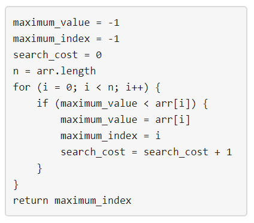

# 1420 生成数组 （动态规划）（难）

解题思路：三维动态规划

#### [1420. 生成数组](https://leetcode-cn.com/problems/build-array-where-you-can-find-the-maximum-exactly-k-comparisons/)

难度困难23

给你三个整数 `n`、`m` 和 `k` 。下图描述的算法用于找出正整数数组中最大的元素。



请你生成一个具有下述属性的数组 `arr` ：

- `arr` 中有 `n` 个整数。
- `1 <= arr[i] <= m` 其中 `(0 <= i < n)` 。
- 将上面提到的算法应用于 `arr` ，`search_cost` 的值等于 `k` 。

返回上述条件下生成数组 `arr` 的 **方法数** ，由于答案可能会很大，所以 **必须** 对 `10^9 + 7` 取余。

**示例 1：**

```
输入：n = 2, m = 3, k = 1
输出：6
解释：可能的数组分别为 [1, 1], [2, 1], [2, 2], [3, 1], [3, 2] [3, 3]
```

**示例 2：**

```
输入：n = 5, m = 2, k = 3
输出：0
解释：没有数组可以满足上述条件
```

**示例 3：**

```
输入：n = 9, m = 1, k = 1
输出：1
解释：可能的数组只有 [1, 1, 1, 1, 1, 1, 1, 1, 1]
```

**示例 4：**

```
输入：n = 50, m = 100, k = 25
输出：34549172
解释：不要忘了对 1000000007 取余
```

**示例 5：**

```
输入：n = 37, m = 17, k = 7
输出：418930126
```

 

**提示：**

- `1 <= n <= 50`
- `1 <= m <= 100`
- `0 <= k <= n`


## 代码实现

```C++
const long long MOD = 1e9+7;
class Solution {
public:
    int numOfArrays(int n, int m, int k) {
        long long dp[n+1][m+1][k+1]; 
        //dp[i][j][p]; 与 dp[i-1][j-1][...] dp[i-1][j][p];关系
        memset(dp,0,sizeof(dp));
        for(int i = 1; i <= m; i++)
            dp[1][i][1] = 1;

        for(int i = 1; i <= n; i++){
            for(int j = 1; j <= m; j++){
                for(int cost = 1; cost <= k; cost++){
                    //代价不变
                    dp[i][j][cost] += dp[i-1][j][cost] * j;
                    dp[i][j][cost] %= MOD;
                    //代价-1
                    for(int q =1; q <= j-1; q ++){
                        dp[i][j][cost] += dp[i-1][q][cost-1]; 
                        dp[i][j][cost] %= MOD;
                    }
                }
            }
        }
        long long ans = 0;
        for(int j=1; j<=m; j++){
            ans +=dp[n][j][k];
            ans %=MOD;
        }
        return ans;
    }
    // c（m,k）

};
```

## 思路归纳总结如下；

### 定义子问题：

****


### 状态转移


### 案例举例


